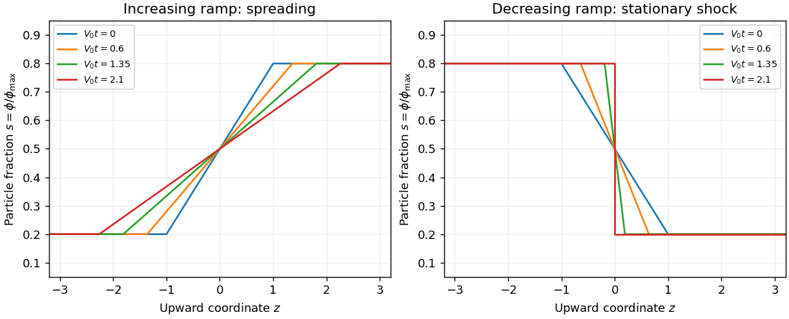

<h1 id="1/b/solution">Solution</h1>

↑ **Parent:** [B](../b.md)

For $\alpha=1$, $f=V_0(s^2-s)$, so the [characteristic speed](../../../../../../characteristic-speed.md) is $a=V_0(2s-1)$ and the [conservation law flux](../../../../../../conservation-law-flux.md) is strictly convex. Let $\tau=V_0t$ and let $\xi$ be the initial vertical position of a [characteristic curve](../../../../../../characteristic-curve.md).

For the increasing ramp, the [characteristic curves](../../../../../../characteristic-curve.md) within its sloping part satisfy $z=\xi(1+0.6\tau)$. They spread apart and never cross. The outer plateau [characteristic speeds](../../../../../../characteristic-speed.md) are $-0.6V_0$ and $0.6V_0$, so the complete [entropy solution](../../../../../../entropy-solution.md) is

$$
\boxed{s(z,t)=\begin{cases}
0.2,&z<-1-0.6\tau,\\
\displaystyle\frac12+\frac{0.3z}{1+0.6\tau},&|z|\leq1+0.6\tau,\\
0.8,&z>1+0.6\tau.
\end{cases}}
$$

The transition widens linearly and its gradient decreases. At large time it approaches a [rarefaction wave](../../../../../../rarefaction-wave.md), with $s\simeq(1+z/\tau)/2$ inside its expanding transition.

For the decreasing ramp, $z=\xi(1-0.6\tau)$ and the [characteristic curves](../../../../../../characteristic-curve.md) converge. Before they meet,

$$
s(z,t)=\begin{cases}
0.8,&z<-1+0.6\tau,\\
\displaystyle\frac12-\frac{0.3z}{1-0.6\tau},&|z|\leq1-0.6\tau,\\
0.2,&z>1-0.6\tau.
\end{cases}
$$

All the ramp [characteristic curves](../../../../../../characteristic-curve.md) meet at $z=0$ at

$$
\boxed{t_*=\frac{5}{3V_0}.}
$$

Thereafter a stationary [sedimentation shock](../../../../../../sedimentation-shock.md) separates $s_L=0.8$ below from $s_R=0.2$ above. Indeed the [Rankine-Hugoniot condition](../../../../../../rankine-hugoniot-conditions.md) gives

$$
\dot z_s=\frac{f(0.2)-f(0.8)}{0.2-0.8}=0,
$$

and the incoming [characteristic speeds](../../../../../../characteristic-speed.md) satisfy $a(0.8)=0.6V_0>0>a(0.2)=-0.6V_0$, which makes it an admissible [entropy shock](../../../../../../entropy-shock.md). The discontinuity transports no net excess particle flux because both plateau fluxes equal $-0.16V_0$. These are local solutions before a finite container's boundaries affect the transition.

**[Figure 1](#1/b/image-spreading-and-shock-formation-for-quadratic-hindered-settling-flux). Spreading and shock formation for quadratic hindered-settling flux**.

The dependence on $\alpha$ is controlled by the [hindered-settling flux inflection](../../../../../../hindered-settling-flux-inflection.md):

$$
f''(s)=V_0\alpha(1-s)^{\alpha-2}\bigl[2-(\alpha+1)s\bigr].
$$

For any smooth initial profile, the [characteristic flow map](../../../../../../characteristic-flow-map.md) has [derivative](../../../../../../derivative.md)

$$
\frac{\partial z}{\partial\xi}=1+t f''(s_0(\xi))s'_0(\xi).
$$

This formula gives the first [characteristic crossing](../../../../../../characteristic-crossing.md): minimize the positive values of $-1/[f''(s_0)s'_0]$. At $\alpha=0$ neither ramp changes shape; both move down at $V_0$. For $0<\alpha\leq3/2$, the flux is convex throughout $0.2\leq s\leq0.8$: the increasing ramp spreads and the decreasing ramp steepens, although its entire ramp generally no longer focuses simultaneously. For $\alpha\geq9$, the flux is concave throughout that interval and these roles reverse. At the endpoint values the curvature vanishes at one plateau; it does not reverse sign inside the interval.

For $3/2<\alpha<9$, the inflection $s_i=2/(\alpha+1)$ lies between the plateau concentrations. Below $s_i$ the increasing ramp spreads, while above it that ramp compresses; the decreasing ramp has the opposite local behavior. After [characteristic crossing](../../../../../../characteristic-crossing.md), the [entropy solution](../../../../../../entropy-solution.md) can contain both a [shock wave](../../../../../../shock-wave.md) and a [rarefaction wave](../../../../../../rarefaction-wave.md). Quantitatively, an increasing step is selected by the lower convex envelope of $f$ on the interval between its states: curved portions supply [rarefaction waves](../../../../../../rarefaction-wave.md), and straight portions supply [shock waves](../../../../../../shock-wave.md). A decreasing step uses the upper concave envelope. A join between a fan and a [shock wave](../../../../../../shock-wave.md) at a state $s_*$ satisfies the tangent-chord relation $f'(s_*)=[f(s_b)-f(s_*)]/(s_b-s_*)$, where $s_b$ is the other shock state. Thus curvature, not simply the magnitude of $\alpha$, decides the wave pattern; the envelope may reduce to one shock if the tangent lies outside the state interval.

## ↑ Ancestors (12)

1. [B](../b.md)
2. [1](../../1.md)
3. [Section A](../../section-a.md)
4. [Paper 52](../../../paper-52-split.md)
5. [Iii](../../../split.md)
6. [2002](../../../../split.md)
7. [Past exam of the mathematics course of the University of Cambridge](../../../../../split.md)
8. [Mathematics course of the University of Cambridge](../../../../../../mathematics-course-of-the-university-of-cambridge.md)
9. [Course of the University of Cambridge](../../../../../../course-of-the-university-of-cambridge.md)
10. [University of Cambridge](../../../../../../university-of-cambridge-split.md)
11. [List of universities](../../../../../../list-of-universities.md)
12. [Codex Wiki](../../../../../../split.md)
