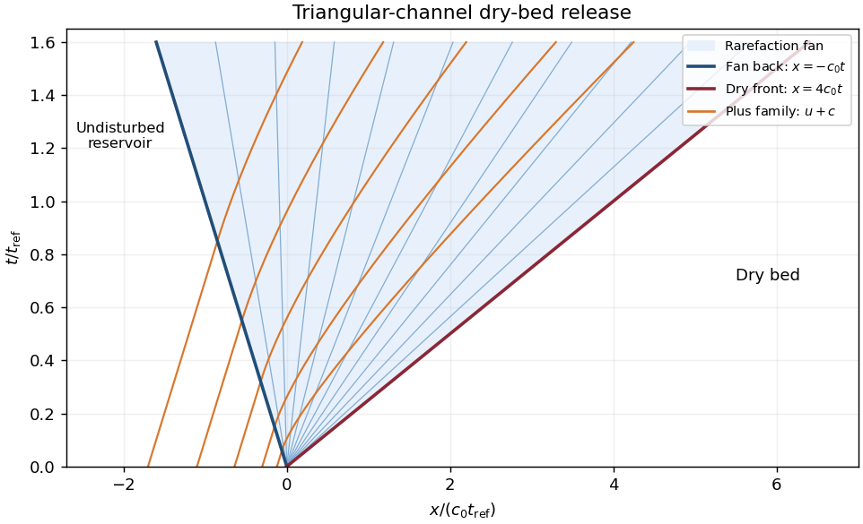

<h1 id="3/d/solution">Solution</h1>

↑ **Parent:** [D](../d.md)

Put $c_0=\sqrt{g'h_0/2}$. The undisturbed reservoir has $u=0$ and [Riemann invariants](../../../../../../riemann-invariant.md) $u\pm4c=\pm4c_0$. The right-going [characteristic curves](../../../../../../characteristic-curve.md) supply the invariant $u+4c=4c_0$ throughout the release. The spreading disturbance is the other family, whose speed is $u-c$. In its [rarefaction wave](../../../../../../rarefaction-wave.md) let $\xi=x/t=u-c$. Then

$$
c=\frac{4c_0-\xi}{5},\qquad u=\frac{4(c_0+\xi)}5.
$$

At the reservoir edge $u=0,c=c_0$, so the back of the [rarefaction wave](../../../../../../rarefaction-wave.md) travels at $-c_0$. At the dry edge $c=0$ the [Saint-Venant dry-front condition](../../../../../../saint-venant-dry-front-condition.md) gives

$$
\boxed{x_f(t)=4c_0t,\qquad u_f=4c_0=2\sqrt{2g'h_0}.}
$$

Thus the fan occupies $-c_0t\leq x\leq4c_0t$, while $x<-c_0t$ remains undisturbed. Its full length grows at $5c_0$; there is no finite-depth uniform shelf between the fan and the dry front. The optional interior depth is $h=h_0[(4c_0-x/t)/(5c_0)]^2$.

The fan's minus-family [characteristic curves](../../../../../../characteristic-curve.md) are rays $x=\xi t$. For the plus family in the fan, $dx/dt=u+c=(8c_0+3x/t)/5$; [integration](../../../../../../integral.md) gives $x=4c_0t+C t^{3/5}$, with constants selected at entry from the reservoir. These curved paths transport the constant plus [Riemann invariant](../../../../../../riemann-invariant.md).

**[Figure 2](#3/d/image-triangular-channel-dry-bed-release-with-its-rarefaction-rays-and-right-going-characteristics). Triangular-channel dry-bed release with its rarefaction rays and right-going characteristics**.

## ↑ Ancestors (12)

1. [D](../d.md)
2. [3](../../3.md)
3. [Section B](../../section-b.md)
4. [Paper 52](../../../paper-52-split.md)
5. [Iii](../../../split.md)
6. [2002](../../../../split.md)
7. [Past exam of the mathematics course of the University of Cambridge](../../../../../split.md)
8. [Mathematics course of the University of Cambridge](../../../../../../mathematics-course-of-the-university-of-cambridge.md)
9. [Course of the University of Cambridge](../../../../../../course-of-the-university-of-cambridge.md)
10. [University of Cambridge](../../../../../../university-of-cambridge-split.md)
11. [List of universities](../../../../../../list-of-universities.md)
12. [Codex Wiki](../../../../../../split.md)
