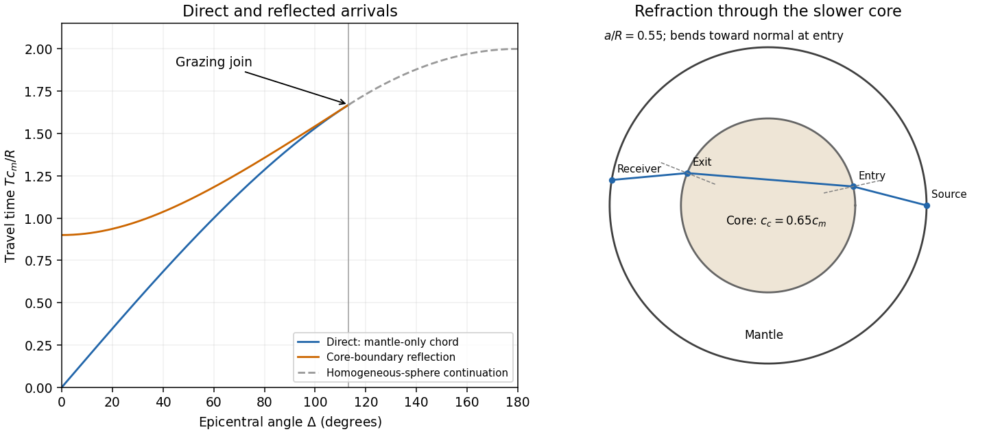

<h1 id="1/solution">Solution</h1>

↑ **Parent:** [1](../1.md)

Because $s$ is [arc length](../../../../../arc-length.md), $|d\mathbf x/ds|=1$. Thus $\mathbf y=\mathbf n/\alpha$, where $\mathbf n$ is the unit tangent to the [elastic ray](../../../../../elastic-ray.md). In an [isotropic](../../../../../isotropy.md) medium this is also the [wavefront](../../../../../wavefront.md) normal. Consequently **$\mathbf y$ is the vector [slowness](../../../../../slowness.md)**, of magnitude $1/\alpha$; locally $\mathbf y=\nabla T=\mathbf k/\omega$, with $T$ the [travel time](../../../../../travel-time.md) and $\mathbf k$ the [wavevector](../../../../../wavevector.md).

For depth-dependent [wave speed](../../../../../wave-speed.md) $\alpha(z)$, the ray equation gives $dy_x/ds=dy_y/ds=0$. The horizontal component of $d\mathbf x/ds$ therefore has a fixed direction, and the [elastic ray](../../../../../elastic-ray.md) lies in the vertical plane determined by that direction and its initial point. A vertical [elastic ray](../../../../../elastic-ray.md) is the limiting case. If $i$ is the angle to the vertical, its conserved horizontal [slowness](../../../../../slowness.md) gives

$$
\boxed{\frac{\sin i}{\alpha(z)}=p_{\mathrm{flat}}.}
$$

At a horizontal interface, matching the tangential [wavevector](../../../../../wavevector.md) at fixed [frequency](../../../../../frequency.md) gives the same invariant on both sides: this is [Snell's law](../../../../../snell-s-law.md).

For radial [wave speed](../../../../../wave-speed.md) $\alpha(r)$, take the [cross product](../../../../../cross-product.md) of position with [slowness](../../../../../slowness.md). The ray equations give

$$
\frac{d}{ds}(\mathbf x\times\mathbf y)
=\alpha\mathbf y\times\mathbf y+\mathbf x\times\nabla(1/\alpha)=0,
$$

since the second vector is radial. A nonzero constant $\mathbf L=\mathbf x\times\mathbf y$ is perpendicular to every position on the [elastic ray](../../../../../elastic-ray.md), so the ray lies in a fixed plane through the centre. Radial rays obey the same conclusion with a nonunique plane. The [spherical elastic ray invariant](../../../../../spherical-elastic-ray-invariant.md) is therefore

$$
\boxed{p=|\mathbf L|=\frac{r\sin i}{\alpha(r)},}
$$

where $i$ is measured from the radial direction. Across a spherical interface the radius is common and tangential [slowness](../../../../../slowness.md) is continuous, so this form of [Snell's law](../../../../../snell-s-law.md) survives an interface discontinuity.

In a homogeneous sphere a [P wave](../../../../../p-wave.md) follows the straight chord between the two surface points. If their principal angular separation is $0\leq\Delta\leq\pi$, its length is $2R\sin(\Delta/2)$. For constant [P wave](../../../../../p-wave.md) speed $c_P$,

$$
\boxed{T_D(\Delta)=\frac{2R}{c_P}\sin\frac\Delta2.}
$$

Now put $a=R'$ and denote the mantle and core [P wave](../../../../../p-wave.md) speeds by $c_m>c_c$. Equal incidence and reflection angles put the core-boundary reflection point on the angular bisector. Each mantle leg has length $L$ given by $L^2=R^2+a^2-2Ra\cos(\Delta/2)$. Hence the [core-reflected travel time](../../../../../core-reflected-travel-time.md) is

$$
\boxed{T_R(\Delta)=\frac{2}{c_m}\sqrt{R^2+a^2-2Ra\cos(\Delta/2)},\qquad
0\leq\Delta\leq\Delta_g=2\arccos(a/R).}
$$

The stated domain is essential. At the reflection point the incoming line approaches from the mantle only if $R\cos(\Delta/2)\geq a$. Otherwise it has already crossed the core boundary. The mantle-only direct chord also exists only for $\Delta\leq\Delta_g$, with $T_D=2R\sin(\Delta/2)/c_m$. In this interval,

$$
L^2-R^2\sin^2(\Delta/2)=[R\cos(\Delta/2)-a]^2\geq0,
$$

so the reflected arrival is later. Its intercept is $2(R-a)/c_m$, whereas the direct intercept is zero. At grazing incidence the branches meet at $T=2\sqrt{R^2-a^2}/c_m$, and both have slope $dT/d\Delta=a/c_m$. A continuation of the homogeneous-sphere direct formula beyond this endpoint is not a mantle-only arrival in the modified model.

The core-transmitted [elastic rays](../../../../../elastic-ray.md) consist of three straight legs. Their impact distances in mantle and core are $b_m=pc_m$ and $b_c=pc_c$, respectively. At core entry,

$$
\frac{\sin i_m}{c_m}=\frac{\sin i_c}{c_c}=\frac pa,
\qquad \sin i_R=\frac{pc_m}{R},\qquad 0\leq p\leq a/c_m.
$$

Since $c_c<c_m$, the [elastic ray](../../../../../elastic-ray.md) bends towards the normal on entry and away from it on exit. The mantle leg subtends $i_m-i_R$ at the centre, and the core chord subtends $\pi-2i_c$. Thus the total angular sweep along the transmitted path is $2(i_m-i_R)+\pi-2i_c$. This sweep need not equal the principal separation if it exceeds $\pi$; the diagram uses a path with sweep below $\pi$.

**[Figure 1](#1/image-direct-and-core-reflected-travel-time-branches-and-refraction-through-a-slower-spherical-core). Direct and core-reflected travel-time branches and refraction through a slower spherical core**.

## ↑ Ancestors (10)

1. [1](../1.md)
2. [Paper 54](../../paper-54-split.md)
3. [Iii](../../split.md)
4. [2002](../../../split.md)
5. [Past exam of the mathematics course of the University of Cambridge](../../../../split.md)
6. [Mathematics course of the University of Cambridge](../../../../../mathematics-course-of-the-university-of-cambridge.md)
7. [Course of the University of Cambridge](../../../../../course-of-the-university-of-cambridge.md)
8. [University of Cambridge](../../../../../university-of-cambridge-split.md)
9. [List of universities](../../../../../list-of-universities.md)
10. [Codex Wiki](../../../../../split.md)
