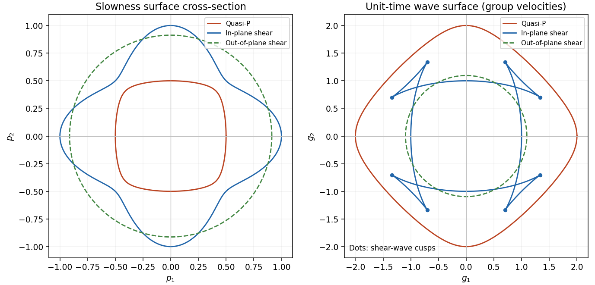

<h1 id="3/solution">Solution</h1>

↑ **Parent:** [3](../3.md)

For a homogeneous lossless elastic solid, insert the [plane wave](../../../../../plane-wave.md) $u_i=\operatorname{Re}\{U a_i e^{i(\mathbf k\cdot\mathbf x-\omega t)}\}$ into the equations of [linear elasticity](../../../../../linear-elasticity.md). Put $\mathbf k=\kappa\mathbf n$, $|\mathbf n|=1$, and $v=\omega/\kappa$. The resulting [eigenvalue](../../../../../eigenvalue.md) problem is

$$
\Gamma_{ik}(\mathbf n)a_k=\rho v^2 a_i,\qquad
\Gamma_{ik}=c_{ijkl}n_jn_l.
$$

The minor and major symmetries make this [acoustic tensor](../../../../../acoustic-tensor.md) a real [symmetric matrix](../../../../../symmetric-matrix.md). For a stable material it is [positive-definite](../../../../../positive-definite-bilinear-form.md), so its three positive [eigenvalues](../../../../../eigenvalue.md) give three real positive [phase velocities](../../../../../phase-velocity.md) and therefore **three [slownesses](../../../../../slowness.md) $s_a=1/v_a$**. Coincident [eigenvalues](../../../../../eigenvalue.md) are possible, so there need not be three distinct speeds. For distinct [eigenvalues](../../../../../eigenvalue.md) the displacement [polarization](../../../../../polarization-waves.md) are orthogonal; in an [anisotropic](../../../../../anisotropy.md) solid they are generally quasi-longitudinal and quasi-transverse rather than exactly longitudinal and transverse. Stability, or at least [strong ellipticity in elasticity](../../../../../strong-ellipticity-in-elasticity.md), is required for the assertion about positive real speeds.

The [elastic slowness surface](../../../../../elastic-slowness-surface.md) is the locus of the three vectors $\mathbf p=\mathbf n/v_a(\mathbf n)=\mathbf k/\omega$. Its equation is

$$
\det[c_{ijkl}p_jp_l-\rho\delta_{ik}]=0.
$$

For each [wavefront](../../../../../wavefront.md) normal there are three radial sheets, which may meet at degeneracies. To obtain the [energy flux](../../../../../energy-flux.md) directly, multiply the elastic equation by $\dot u_i$. For

$$
W=\tfrac12\rho\dot u_i\dot u_i+\tfrac12 c_{ijkl}e_{ij}e_{kl},
$$

the symmetry of [stress](../../../../../stress.md) gives $\partial_t W=\partial_j(\sigma_{ij}\dot u_i)$. Thus the instantaneous [elastic-wave energy flux](../../../../../elastic-wave-energy-flux.md) is $F_j=-\sigma_{ij}\dot u_i$. With a real branch [polarization](../../../../../polarization-waves.md) $\mathbf a$, harmonic averaging gives

$$
\langle F_j\rangle=\frac12\omega|U|^2c_{ijkl}k_l a_i a_k
=\frac12\omega^2|U|^2c_{ijkl}p_l a_i a_k.
$$

Now differentiate $c_{ijkl}p_jp_l a_k=\rho a_i$ along a regular [slowness surface](../../../../../elastic-slowness-surface.md) sheet and contract with $a_i$. The terms containing $d\mathbf a$ cancel by symmetry and the original [eigenvalue](../../../../../eigenvalue.md) equation, leaving

$$
2c_{ijkl}a_i a_k p_l\,dp_j=0.
$$

Every tangent $d\mathbf p$ is consequently perpendicular to $\langle\mathbf F\rangle$: **the [energy flux](../../../../../energy-flux.md) is normal to the [slowness surface](../../../../../elastic-slowness-surface.md)**. At a degenerate point this statement is made on the limiting branches, rather than assuming a unique normal.

For completeness, equality of the mean kinetic and [strain](../../../../../strain.md) energies gives $\langle W\rangle=\rho\omega^2|U|^2|\mathbf a|^2/2$. Differentiating the [acoustic tensor](../../../../../acoustic-tensor.md) equation in the [wavevector](../../../../../wavevector.md) variables similarly gives

$$
g_j=\frac{\partial\omega}{\partial k_j}
=\frac{c_{ijkl}k_l a_i a_k}{\rho\omega|\mathbf a|^2},\qquad
\boxed{\langle\mathbf F\rangle=\langle W\rangle\mathbf g.}
$$

Thus the [group velocity](../../../../../group-velocity.md) is the [elastic energy velocity](../../../../../elastic-energy-velocity.md). The homogeneous elastic [dispersion relation](../../../../../dispersion-relation.md) is degree one in $\mathbf k$, so differentiating $\omega(\lambda\mathbf k)=\lambda\omega(\mathbf k)$ at $\lambda=1$ gives $\mathbf p\cdot\mathbf g=1$.

The [elastic wave surface](../../../../../elastic-wave-surface.md) is the unit-time locus of these [group velocities](../../../../../group-velocity.md). From an impulsive point source, the propagating [wavefronts](../../../../../wavefront.md) at time $t$ are its sheets scaled to $\mathbf x=t\mathbf g$. A particular source may fail to excite a mode in some directions, and its amplitudes require the source [polarization](../../../../../polarization-waves.md) and geometrical spreading; the [wave surface](../../../../../elastic-wave-surface.md) determines the arrival geometry. It does not specify all near-field motion between the radiative fronts. Geometrically it is the envelope of the planes $\mathbf p\cdot\mathbf x=1$: tangent variation gives $d\mathbf p\cdot\mathbf x=0$, so $\mathbf x$ is the appropriately normalized normal to the [slowness surface](../../../../../elastic-slowness-surface.md).

In a symmetry-plane cross-section write $\mathbf p=r(\theta)\mathbf n$, $\mathbf n=(\cos\theta,\sin\theta)$ and $\mathbf t=(-\sin\theta,\cos\theta)$. The two envelope conditions give

$$
\mathbf g=\frac{\mathbf n}{r}-\frac{r'}{r^2}\mathbf t
=v\mathbf n+v'\mathbf t,\qquad
\mathbf g'=(v+v'')\mathbf t
=\frac{r^2+2r'^2-r r''}{r^3}\mathbf t.
$$

The numerator is the signed curvature numerator of the [slowness surface](../../../../../elastic-slowness-surface.md) cross-section. At a simple [inflection point](../../../../../inflection-point.md), $h=v+v''=0$ and $h'\ne0$. Then $\mathbf g''=h'\mathbf t$ and $\mathbf g'''=h''\mathbf t+2h'\mathbf t'$ are linearly independent. These are precisely the local conditions for an ordinary [cusp](../../../../../cusp-algebraic-geometry.md). The [slowness curvature and wave-surface cusps](../../../../../slowness-curvature-and-wave-surface-cusps.md) relation explains why a smooth nonconvex [slowness surface](../../../../../elastic-slowness-surface.md) can generate a cusped [wavefront](../../../../../wavefront.md) and multiple ray arrivals.

The example below uses a positive orthotropic stiffness in normalized units: $\rho=1$, $C_{11}=C_{22}=C_{33}=4$, $C_{44}=C_{55}=1.2$, $C_{66}=1$, and all normal off-diagonal stiffnesses zero. In the symmetry plane $n_3=0$, its two in-plane [acoustic tensor](../../../../../acoustic-tensor.md) [eigenvalues](../../../../../eigenvalue.md) are $v_\pm^2=(5\pm\sqrt{5+4\cos4\theta})/2$, and its out-of-plane shear speed is $\sqrt{1.2}$. The in-plane shear sheet is nonconvex and produces the marked [cusps](../../../../../cusp-algebraic-geometry.md); the construction uses an actual stable elastic tensor.

**[Figure 2](#3/image-slowness-and-group-velocity-wave-surfaces-of-a-stable-anisotropic-elastic-tensor-with-shear-wave-cusps). Slowness and group-velocity wave surfaces of a stable anisotropic elastic tensor, with shear-wave cusps**.

## ↑ Ancestors (10)

1. [3](../3.md)
2. [Paper 54](../../paper-54-split.md)
3. [Iii](../../split.md)
4. [2002](../../../split.md)
5. [Past exam of the mathematics course of the University of Cambridge](../../../../split.md)
6. [Mathematics course of the University of Cambridge](../../../../../mathematics-course-of-the-university-of-cambridge.md)
7. [Course of the University of Cambridge](../../../../../course-of-the-university-of-cambridge.md)
8. [University of Cambridge](../../../../../university-of-cambridge-split.md)
9. [List of universities](../../../../../list-of-universities.md)
10. [Codex Wiki](../../../../../split.md)
