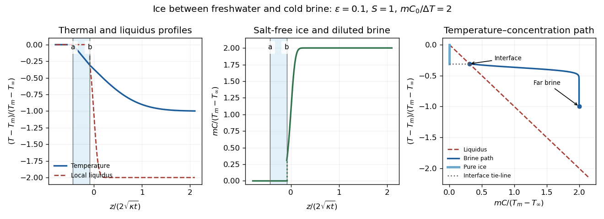

<h1 id="1/solution">Solution</h1>

↑ **Parent:** [1](../1.md)

Write $H=L/c_p$, $k=\rho c_p\kappa$ and $\epsilon=\sqrt{D/\kappa}$. The requested model neglects density differences and uses the same thermal transport coefficients in the interfacial balances. Let $C_b=C(b(t),t)$ and $T_b=T_m-mC_b$. With no imposed heat gradient in the fresh liquid, its [temperature](../../../../../temperature.md) remains $T_m$. The prescribed linear [temperature](../../../../../temperature.md) in the [ice](../../../../../ice.md) is

$$
T_i(z,t)=T_m+(T_b-T_m)\frac{z-a}{b-a}.
$$

The salt and [temperature](../../../../../temperature.md) fields in the lower liquid satisfy [diffusion equations](../../../../../diffusion-equation-split.md), $C_t=DC_{zz}$ and $T_t=\kappa T_{zz}$. For constant interfacial values and the proposed [similarity solution](../../../../../similarity-solution.md), their decaying solutions are

$$
\begin{aligned}
C(z,t)&=C_0+(C_b-C_0)
\frac{\operatorname{erfc}[z/(2\sqrt{Dt})]}{\operatorname{erfc}(\lambda_b)},\\
T_l(z,t)&=T_\infty+(T_b-T_\infty)
\frac{\operatorname{erfc}[z/(2\sqrt{\kappa t})]}{\operatorname{erfc}(\epsilon\lambda_b)}.
\end{aligned}
$$

These follow by substituting a variable $z/(2\sqrt{\chi t})$ into the [diffusion equation](../../../../../diffusion-equation-split.md), which gives $U''+2\eta U'=0$; integrating gives the [complementary error function](../../../../../complementary-error-function.md). Their values at $b$ and at infinity give the required boundary data.

For the upward-moving fresh-water/[ice](../../../../../ice.md) boundary, the [Stefan condition](../../../../../stefan-condition.md) is $\rho L\dot a=kT_{i,z}$: negative $\dot a$ means fresh water freezes. At the lower boundary the signed heat balance is

$$
\rho L\dot b=k[T_{i,z}-T_{l,z}]_{z=b}.
$$

Salt cannot enter the pure [ice](../../../../../ice.md). With no bulk liquid motion its interfacial conservation law is

$$
DC_z(b,t)=-C_b\dot b.
$$

The derivatives and interface velocities are

$$
\dot a=\lambda_a\sqrt{D/t},\quad\dot b=\lambda_b\sqrt{D/t},\quad
T_{i,z}=-\frac{T_m-T_b}{2(\lambda_b-\lambda_a)\sqrt{Dt}},
$$

$$
T_{l,z}(b)=-\frac{(T_b-T_\infty)e^{-(\epsilon\lambda_b)^2}}
{\sqrt{\pi\kappa t}\operatorname{erfc}(\epsilon\lambda_b)},\qquad
C_z(b)=-\frac{(C_b-C_0)e^{-\lambda_b^2}}
{\sqrt{\pi Dt}\operatorname{erfc}(\lambda_b)}.
$$

Define $F(x)=\sqrt\pi\,x e^{x^2}\operatorname{erfc}x$. Substitution into all three balances gives

$$
\boxed{2H\epsilon^2\lambda_a=-\frac{T_m-T_b}{\lambda_b-\lambda_a},}
$$

$$
\boxed{H=\frac{T_b-T_\infty}{F(\epsilon\lambda_b)}
-\frac{T_m-T_b}{2\epsilon^2\lambda_b(\lambda_b-\lambda_a)},\qquad
F(\lambda_b)=\frac{C_b-C_0}{C_b}.}
$$

Together with $T_b=T_m-mC_b$, these determine the interfacial constants. In particular $C_b=C_0/[1-F(\lambda_b)]$.

The physical branch has $\lambda_a<\lambda_b<0$. Since $F$ is negative at negative arguments, the salt relation gives $0<C_b<C_0$: lower-surface [melting](../../../../../melting.md) dilutes the brine. Combining the two heat balances eliminates the [ice](../../../../../ice.md) gradient and gives

$$
T_b-T_\infty=H\frac{\lambda_b-\lambda_a}{\lambda_b}F(\epsilon\lambda_b)>0.
$$

Thus $T_m>T_b>T_\infty>T_L(C_0)$. The interface is at local [liquidus](../../../../../liquidus.md) equilibrium with diluted brine, while the undiluted far-field brine remains above its own [liquidus](../../../../../liquidus.md). The similarity model describes a layer starting with zero thickness, or the long-time limit when an initial finite thickness no longer sets the dominant scale.

For the small-diffusivity-ratio limit, put $A=\epsilon\lambda_a$ and $\Delta=T_m-T_\infty$, keeping $S=H/\Delta$ and the imposed concentrations fixed. Seek $A=O(1)$ and $\lambda_b=O(1)$. Then $F(\epsilon\lambda_b)\sim\sqrt\pi\epsilon\lambda_b$ and $\lambda_b-\lambda_a\sim-\lambda_a$. The upper heat balance gives

$$
T_m-T_b\sim2HA^2.
$$

In the lower balance the two terms of order $\epsilon^{-1}$ must cancel, giving

$$
\frac{T_b-T_\infty}{\sqrt\pi}+\frac{T_m-T_b}{2A}=0.
$$

Consequently

$$
\boxed{T_b-T_\infty\sim\frac{\Delta}{1-2A/\sqrt\pi},}
$$

and $T_b-T_\infty\sim-\sqrt\pi HA$. Adding the two [temperature](../../../../../temperature.md) differences yields $2A^2-\sqrt\pi A=1/S$. The negative root is

$$
\boxed{4\epsilon\lambda_a\sim\sqrt\pi-\sqrt{\pi+8/S}.}
$$

The resulting $C_b=(T_m-T_b)/m$ lies strictly between zero and $C_0$. The salt relation therefore determines a finite negative $\lambda_b$, confirming its $O(1)$ scaling. The top interface travels on the thermal scale $\sqrt{\kappa t}$, whereas the lower [melting](../../../../../melting.md) interface travels on the shorter solutal scale $\sqrt{Dt}$. This is the [brine-ice sandwich with disparate diffusion scales](../../../../../brine-ice-sandwich-with-disparate-diffusion-scales.md); $S$ is the [latent-to-sensible heat ratio](../../../../../latent-to-sensible-heat-ratio.md), the reciprocal of the usual sensible-to-latent [Stefan number](../../../../../stefan-number.md) convention.

**[Figure 1](#1/image-similarity-temperature-and-concentration-profiles-local-liquidus-and-ice-brine-phase-diagram-path). Similarity temperature and concentration profiles, local liquidus and ice-brine phase-diagram path**.

The sketches show constant fresh-water [temperature](../../../../../temperature.md), a declining linear [ice](../../../../../ice.md) [temperature](../../../../../temperature.md), and a much broader thermal than solutal boundary layer in the brine. [Concentration](../../../../../concentration.md) is zero in freshwater and pure [ice](../../../../../ice.md), jumps to $C_b$ across the lower interface, and rises to $C_0$. Accordingly the local [liquidus](../../../../../liquidus.md) is $T_m$ on the salt-free side, jumps to $T_b$ and falls rapidly to $T_L(C_0)$. In the [phase diagram](../../../../../phase-diagram.md), the brine starts on the [liquidus](../../../../../liquidus.md) at $(C_b,T_b)$ and ends above it at $(C_0,T_\infty)$; the pure [ice](../../../../../ice.md) has [concentration](../../../../../concentration.md) zero, and the interface tie-line joins it to the diluted brine.

Physically, the cold saline liquid permits freshwater to freeze above, but salt lowers the [liquidus](../../../../../liquidus.md) and allows the existing [ice](../../../../../ice.md) to melt into brine below even though that brine is colder than $T_m$. Dilution raises the lower interfacial [freezing](../../../../../freezing.md) [temperature](../../../../../temperature.md). Heat released by upper [freezing](../../../../../freezing.md) supplies the lower [melting](../../../../../melting.md) and the conductive loss to the colder deep brine. With $|\lambda_a|\gg|\lambda_b|$, upper [freezing](../../../../../freezing.md) exceeds lower [melting](../../../../../melting.md) and the [ice](../../../../../ice.md) layer thickens as $b-a\propto\sqrt t$.

## ↑ Ancestors (10)

1. [1](../1.md)
2. [Paper 55](../../paper-55-split.md)
3. [Iii](../../split.md)
4. [2002](../../../split.md)
5. [Past exam of the mathematics course of the University of Cambridge](../../../../split.md)
6. [Mathematics course of the University of Cambridge](../../../../../mathematics-course-of-the-university-of-cambridge.md)
7. [Course of the University of Cambridge](../../../../../course-of-the-university-of-cambridge.md)
8. [University of Cambridge](../../../../../university-of-cambridge-split.md)
9. [List of universities](../../../../../list-of-universities.md)
10. [Codex Wiki](../../../../../split.md)
