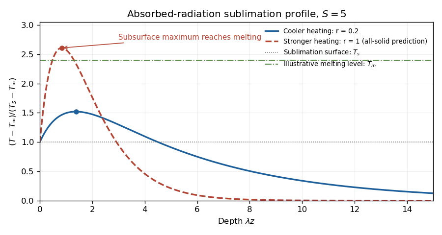

<h1 id="2/solution">Solution</h1>

↑ **Parent:** [2](../2.md)

Let the surface advance downwards at speed $V>0$. [Ice](../../../../../ice.md) is stationary in the laboratory, so in the surface frame its velocity is $-V$. The steady [heat equation](../../../../../heat-equation.md) with volumetric heating is therefore

$$
kT''+\rho c_pVT'+q_0e^{-\lambda z}=0,
\qquad T(0)=T_s,\quad T(\infty)=T_\infty.
$$

Take the atmospheric [heat flux](../../../../../heat-flux-density.md) to be negligible in the stated model. The upward conductive flux at the [ice](../../../../../ice.md) surface supplies the [latent heat](../../../../../latent-heat.md) of [sublimation](../../../../../sublimation.md), giving the [Stefan condition](../../../../../stefan-condition.md) $kT'(0)=\rho LV$.

Write $p=V/\kappa$ and $\Delta=T_s-T_\infty$. For $p\ne\lambda$, solve the constant-coefficient equation to obtain

$$
\boxed{T(z)=T_\infty+\Delta e^{-pz}
+\frac{q_0}{k\lambda(p-\lambda)}(e^{-\lambda z}-e^{-pz}).}
$$

For the resonant case $p=\lambda$, its continuous limit is

$$
\boxed{T(z)=T_\infty+
\left[\Delta+\frac{q_0z}{kp}\right]e^{-pz}.}
$$

An especially transparent way to find $V$ is to integrate the [heat equation](../../../../../heat-equation.md) over the half-space. Its far-field gradient vanishes, so

$$
-kT'(0)+\rho c_pV(T_\infty-T_s)+\frac{q_0}\lambda=0.
$$

Using the surface heat balance gives

$$
\boxed{V=\frac{q_0/\lambda}{\rho L+\rho c_p(T_s-T_\infty)}.}
$$

Absorbed radiation supplies both the [latent heat](../../../../../latent-heat.md) and the sensible heat needed to bring incoming cold [ice](../../../../../ice.md) to the surface [temperature](../../../../../temperature.md). This is the [radiatively heated sublimation profile](../../../../../radiatively-heated-sublimation-profile.md).

The surface gradient is

$$
G=T'(0)=\frac{\rho LV}k>0.
$$

Thus [temperature](../../../../../temperature.md) first rises into the solid, but ultimately falls to the colder far field: it has a subsurface maximum. For a useful dimensionless form, set $x=\lambda z$, $r=p/\lambda$ and $S=L/(c_p\Delta)$. Then

$$
\frac{T-T_\infty}{\Delta}
=\frac{r(S+1)e^{-x}-(rS+1)e^{-rx}}{r-1},
$$

with limit $[1+(S+1)x]e^{-x}$ when $r=1$. The maximum is at $x_*=[\log((rS+1)/(S+1))]/(r-1)$, or $S/(S+1)$ at $r=1$.

**[Figure 2](#2/image-subsurface-temperature-maxima-under-absorbed-radiation-and-the-criterion-for-internal-melting). Subsurface temperature maxima under absorbed radiation and the criterion for internal melting**.

**[Melting](../../../../../melting.md) begins below the surface if the interior maximum reaches $T_m$.** The surface remains constrained to the lower value $T_s<T_m$, and the remote [ice](../../../../../ice.md) is cold. Increasing absorbed heating can raise the interior maximum to the [melting](../../../../../melting.md) point, after which an all-solid steady solution is no longer valid and an internal melt region must be modeled. The maximum, rather than the far-field [temperature](../../../../../temperature.md) or surface [temperature](../../../../../temperature.md) alone, decides onset.

For the [linear stability analysis](../../../../../linear-stability.md), perturb the mean surface by $\eta=\hat\eta e^{\sigma t+i\alpha x}$, with [ice](../../../../../ice.md) on $z>\eta$. Approximate the base [temperature](../../../../../temperature.md) locally by $T_s+Gz$. The prescribed radiative source has no perturbation, so the perturbation [heat equation](../../../../../heat-equation.md) is homogeneous. Choose outward curvature $\mathcal K\simeq\eta_{xx}$, so the [Gibbs-Thomson effect](../../../../../gibbs-thomson-relation.md) gives local equilibrium [temperature](../../../../../temperature.md) $T_s-\Gamma\mathcal K$. If the perturbation [temperature](../../../../../temperature.md) is $\hat T(z)e^{\sigma t+i\alpha x}$, its surface condition is

$$
\hat T(0)+G\hat\eta=\Gamma\alpha^2\hat\eta.
$$

In the quasi-static thermal limit, $\hat T''-\alpha^2\hat T=0$, hence

$$
\hat T(z)=(\Gamma\alpha^2-G)\hat\eta e^{-\alpha z}.
$$

Linearizing the [Stefan condition](../../../../../stefan-condition.md), with the base gradient taken constant, gives $\rho L\sigma\hat\eta=k\hat T'(0)$. Therefore

$$
\boxed{\sigma\simeq\frac{k}{\rho L}\alpha(G-\Gamma\alpha^2).}
$$

Positive $G$ amplifies long-wave shape perturbations, while capillarity suppresses sufficiently short waves. The unstable band is $0<\alpha<\sqrt{G/\Gamma}$, and the approximate fastest mode is $\alpha_* =\sqrt{G/(3\Gamma)}$. This is the [sublimation-front capillary instability](../../../../../sublimation-front-capillary-instability.md).

The qualifications on wavelength matter. Retaining the perturbation's time dependence and mean recession gives

$$
\kappa\hat T''+V\hat T'-(\kappa\alpha^2+\sigma)\hat T=0,
$$

whose decay constant is $p_\alpha=[V+\sqrt{V^2+4\kappa(\kappa\alpha^2+\sigma)}]/(2\kappa)$. Replacing it by $\alpha$ requires

$$
\boxed{\frac V{\kappa\alpha}\ll1,\qquad
\frac{|\sigma|}{\kappa\alpha^2}\ll1.}
$$

Writing $H=L/c_p$, the second condition becomes $|G-\Gamma\alpha^2|\ll H\alpha$ under the approximate dispersion relation. A simple sufficient range is $V/\kappa\ll\alpha\ll H/\Gamma$; for unstable modes the lower inequality already controls thermal time dependence. Large $S$ alone does not justify arbitrarily small $\alpha$.

Finally the local linear background is appropriate only if the perturbation penetration depth is shorter than its curvature length: $\alpha\gg |T_0''(0)|/G$. From the steady equation this ratio is $V/\kappa+\lambda(1+1/S)$. Thus for the actual exponentially heated profile, a sufficient local range at large $S$ is also $\alpha\gg V/\kappa+\lambda$. Otherwise evaluation of the base gradient at the displaced surface contributes an omitted term $kT_0''(0)/(\rho L)$, and the simple quoted dispersion relation need not describe those long waves.

## ↑ Ancestors (10)

1. [2](../2.md)
2. [Paper 55](../../paper-55-split.md)
3. [Iii](../../split.md)
4. [2002](../../../split.md)
5. [Past exam of the mathematics course of the University of Cambridge](../../../../split.md)
6. [Mathematics course of the University of Cambridge](../../../../../mathematics-course-of-the-university-of-cambridge.md)
7. [Course of the University of Cambridge](../../../../../course-of-the-university-of-cambridge.md)
8. [University of Cambridge](../../../../../university-of-cambridge-split.md)
9. [List of universities](../../../../../list-of-universities.md)
10. [Codex Wiki](../../../../../split.md)
