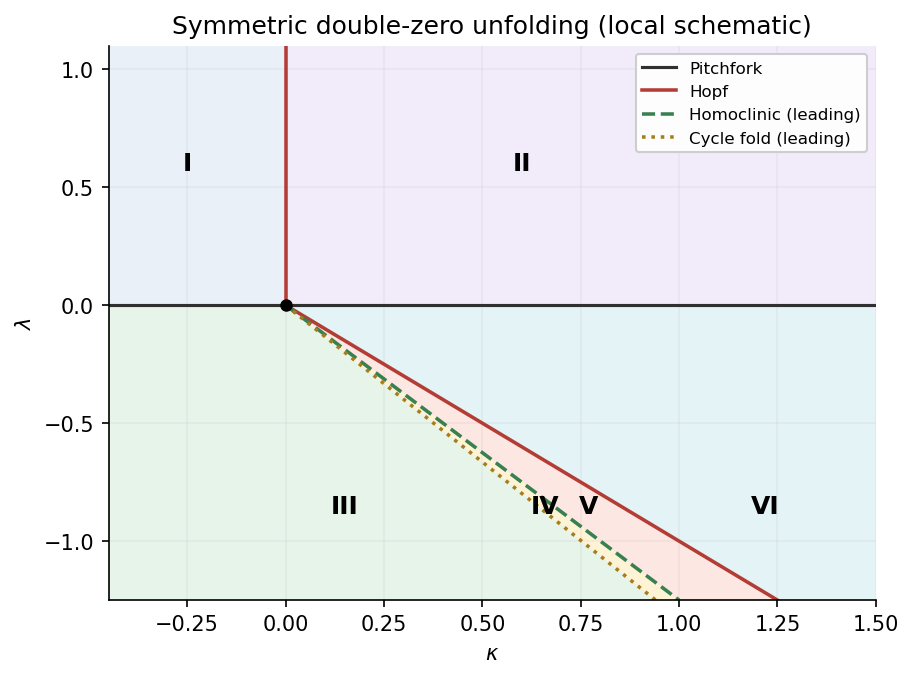
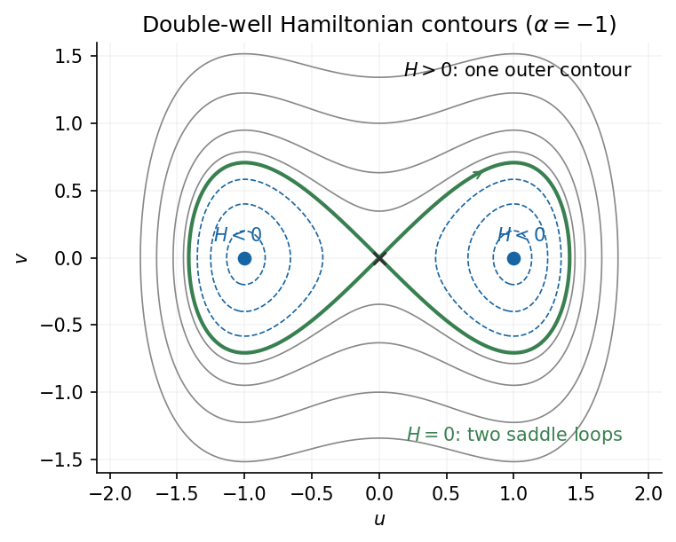
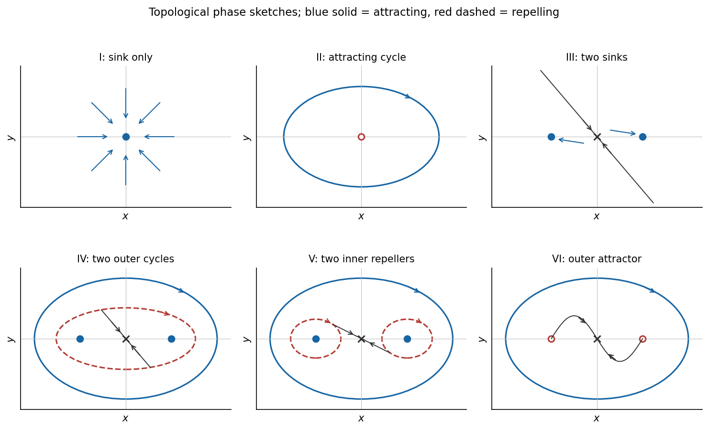
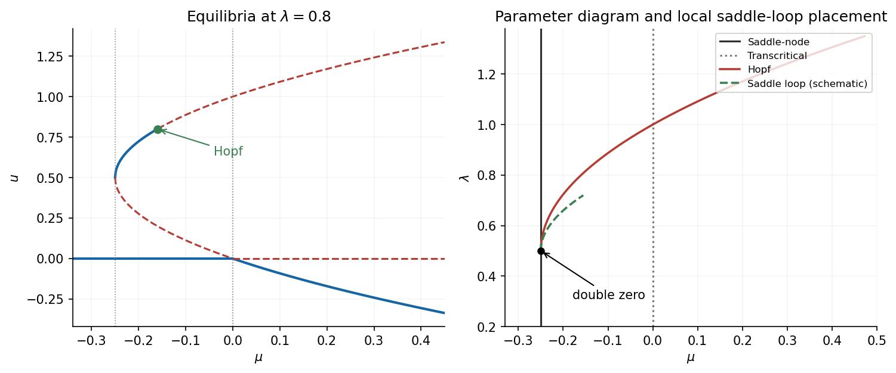
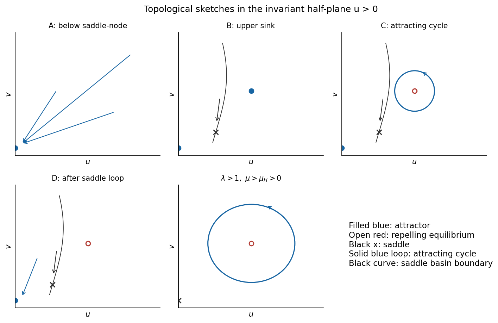

# Paper 56

↑ **Parent:** [Iii](../iii.md)

[https://www.maths.cam.ac.uk/postgrad/part-iii/files/pastpapers/2002/Paper56.pdf](https://www.maths.cam.ac.uk/postgrad/part-iii/files/pastpapers/2002/Paper56.pdf)

**Table of contents**

- [1](#1)
  - [a](#1/a)
    - [Solution](#1/a/solution)
  - [b](#1/b)
    - [Solution](#1/b/solution)
  - [c](#1/c)
    - [Solution](#1/c/solution)
  - [d](#1/d)
    - [Solution](#1/d/solution)
  - [e](#1/e)
    - [Solution](#1/e/solution)
- [2](#2)
  - [a](#2/a)
    - [Solution](#2/a/solution)
  - [b](#2/b)
    - [Solution](#2/b/solution)
  - [c](#2/c)
    - [Solution](#2/c/solution)
  - [d](#2/d)
    - [Solution](#2/d/solution)
  - [e](#2/e)
    - [Solution](#2/e/solution)
  - [f](#2/f)
    - [Solution](#2/f/solution)
  - [g](#2/g)
    - [Solution](#2/g/solution)
- [3](#3)
  - [a](#3/a)
    - [Solution](#3/a/solution)
  - [b](#3/b)
    - [Solution](#3/b/solution)
- [4](#4)
  - [a](#4/a)
    - [Solution](#4/a/solution)
  - [b](#4/b)
    - [Solution](#4/b/solution)
  - [c](#4/c)
    - [Solution](#4/c/solution)
  - [d](#4/d)
    - [Solution](#4/d/solution)

## 1

↑ **Parent:** [Paper 56](paper-56.md)

<h3 id="1/a">a</h3>

↑ **Parent:** [1](#1)

<h4 id="1/a/solution">Solution</h4>

↑ **Parent:** [A](#1/a)

The [equilibria](../../../dynamical-systems.md#equilibrium-point-of-a-dynamical-system) have $y=0$ and $x(\lambda+x^2)=0$. Thus

$$
\boxed{O=(0,0)\text{ for all parameters},\qquad P_\pm=(\pm\sqrt{-\lambda},0)\text{ for }\lambda<0.}
$$

At $O$, the [linearization](../../../algebra.md#linearization) has [trace](../../../linear-algebra.md#matrix-trace) $\kappa$ and [determinant](../../../linear-algebra.md#determinant) $\lambda$. Hence $O$ is a [saddle equilibrium](../../../dynamical-systems.md#saddle-equilibrium) when $\lambda<0$, a [sink equilibrium](../../../dynamical-systems.md#sink-equilibrium) when $\lambda>0,\kappa<0$, and a [source equilibrium](../../../dynamical-systems.md#source-equilibrium) when $\lambda>0,\kappa>0$. The [sink equilibrium](../../../dynamical-systems.md#sink-equilibrium)/[source equilibrium](../../../dynamical-systems.md#source-equilibrium) may be a [node equilibrium](../../../dynamical-systems.md#node-dynamical-systems) or a [focus equilibrium](../../../dynamical-systems.md#focus-dynamical-systems); the node-focus discriminant is not a [bifurcation](../../../dynamical-systems.md#bifurcation) curve. At $P_\pm$, the [trace](../../../linear-algebra.md#matrix-trace) and [determinant](../../../linear-algebra.md#determinant) are $\kappa+\lambda$ and $-2\lambda$. These points are [sink equilibria](../../../dynamical-systems.md#sink-equilibrium) for $\kappa<-\lambda$ and [source equilibria](../../../dynamical-systems.md#source-equilibrium) for $\kappa>-\lambda$.

The local [bifurcation](../../../dynamical-systems.md#bifurcation) curves are therefore

$$
\boxed{\lambda=0\quad\text{(pitchfork)},\qquad
\kappa=0,\ \lambda>0\quad\text{(Hopf at }O),\qquad
\kappa=-\lambda,\ \lambda<0\quad\text{(Hopf at }P_\pm).}
$$

For $\kappa\ne0$ on the pitchfork curve, a leading centre-manifold equation is $\dot x=(\lambda x+x^3)/\kappa+\cdots$. For $\kappa<0$, with unfolding parameter $-\lambda$, the pitchfork is supercritical and creates two [sink equilibria](../../../dynamical-systems.md#sink-equilibrium) from a [sink equilibrium](../../../dynamical-systems.md#sink-equilibrium) that becomes a [saddle equilibrium](../../../dynamical-systems.md#saddle-equilibrium). For $\kappa>0$ it is subcritical in the centre direction; the nonzero branches are unstable, and the transverse [eigenvalue](../../../linear-operator-theory.md#eigenvalue) is also positive. The origin of parameter space is a reflection-symmetric double-zero degeneration.

To determine Hopf criticality at the origin, use the [energy](../../../classical-mechanics.md#energy) $E=y^2/2+\lambda x^2/2+x^4/4$, whose [derivative](../../../calculus.md#derivative) is $(\kappa-x^2)y^2$. For a small nearly harmonic oscillation $x=R\cos(\sqrt\lambda\,t)$, averaging gives $\dot R=\kappa R/2-R^3/8+\cdots$. Thus this [Hopf bifurcation](../../../dynamical-systems.md#hopf-bifurcation) is supercritical and creates an attracting [periodic orbit](../../../dynamical-systems.md#periodic-orbit) for $\kappa>0$. By the supplied opposite-criticality fact, the simultaneous [Hopf bifurcations](../../../dynamical-systems.md#hopf-bifurcation) at the two nonzero [equilibria](../../../dynamical-systems.md#equilibrium-point-of-a-dynamical-system) are subcritical. A direct calculation confirms this: writing $x=\sqrt{-\lambda}+X$, $Y=-y/\sqrt{-2\lambda}$ puts the cubic radial coefficient at $1/4>0$, including the contribution from the quadratic terms.

The figure includes these local curves and the global curves derived below. All lines emerging from the double-zero point are local asymptotic sketches.

**[Figure 1](#1/a/image-local-and-global-curves-near-the-symmetric-double-zero-point). Local and global curves near the symmetric double-zero point**.

<h3 id="1/b">b</h3>

↑ **Parent:** [1](#1)

<h4 id="1/b/solution">Solution</h4>

↑ **Parent:** [B](#1/b)

With primes denoting differentiation in $\tau$, the weighted scaling gives

$$
\boxed{u'=v,\qquad v'=-\alpha u-u^3+\varepsilon(\beta-u^2)v.}
$$

Indeed $\dot x=\varepsilon^2u'$ and $\dot y=\varepsilon^3v'$, so the damping terms carry one extra power of $\varepsilon$. Consequently

$$
H=\frac12v^2+\frac{\alpha}{2}u^2+\frac14u^4,\qquad
H'=\varepsilon(\beta-u^2)v^2.
$$

At $\varepsilon=0$ this proves conservation of $H$ directly.

For $\alpha=-a_0^2<0$, the potential is a double well. Its minima are at $u=\pm a_0$, where $H=-a_0^4/4$; these are centre [equilibria](../../../dynamical-systems.md#equilibrium-point-of-a-dynamical-system). The origin is a [saddle equilibrium](../../../dynamical-systems.md#saddle-equilibrium) and has $H=0$. Energies $-a_0^4/4<H<0$ give two separate closed contours, one in each well. Energies $H>0$ give a single closed contour surrounding both wells. The intervening figure-eight consists of two homoclinic loops:

$$
\boxed{H_{\rm hom}=0,\qquad v^2=a_0^2u^2-\frac12u^4.}
$$

Their outer turning points are $u=\pm\sqrt2a_0$. The positive loop, for example, is parametrized by $u=\sqrt2a_0\operatorname{sech}(a_0\tau)$, $v=u'$.

**[Figure 2](#1/b/image-conserved-energy-contours-and-the-two-homoclinic-loops). Conserved-energy contours and the two homoclinic loops**.

<h3 id="1/c">c</h3>

↑ **Parent:** [1](#1)

<h4 id="1/c/solution">Solution</h4>

↑ **Parent:** [C](#1/c)

A returning orbit must have zero net change of the [energy](../../../classical-mechanics.md#energy). To first order, integrate the perturbation along either unperturbed homoclinic loop:

$$
0=\int_{-\infty}^{\infty}(\beta-u_h^2)v_h^2\,d\tau
=\beta I_0-I_2.
$$

For the positive loop, $v_h=\pm u_h\sqrt{a_0^2-u_h^2/2}$; the outward and inward halves contribute equally. Therefore

$$
I_0=2\int_0^{\sqrt2a_0}u\sqrt{a_0^2-u^2/2}\,du=\frac43a_0^3,
$$

and

$$
I_2=2\int_0^{\sqrt2a_0}u^3\sqrt{a_0^2-u^2/2}\,du=\frac{16}{15}a_0^5.
$$

The [integrals](../../../calculus.md#integral) follow by substituting $w=a_0^2-u^2/2$; for the second one use $u^2=2(a_0^2-w)$. Hence

$$
\boxed{\beta=\frac45a_0^2=-\frac45\alpha,\qquad
\kappa_{\rm hom}=-\frac45\lambda+o(|\lambda|),\quad\lambda<0.}
$$

The equality in rescaled parameters is the leading Melnikov balance, not an assertion that the entire finite-parameter [bifurcation](../../../dynamical-systems.md#bifurcation) curve is exactly straight. Reflection [symmetry](../../../physics.md#symmetry-physics) makes both [saddle equilibrium](../../../dynamical-systems.md#saddle-equilibrium) loops occur together. The global curve lies below the nonzero-equilibrium Hopf line $\kappa=-\lambda$, as shown in the parameter sketch.

<h3 id="1/d">d</h3>

↑ **Parent:** [1](#1)

<h4 id="1/d/solution">Solution</h4>

↑ **Parent:** [D](#1/d)

The relevant [saddle equilibrium](../../../dynamical-systems.md#saddle-equilibrium) is the origin, with [eigenvalues](../../../linear-operator-theory.md#eigenvalue)

$$
m_\pm=\frac{\kappa\pm\sqrt{\kappa^2-4\lambda}}2.
$$

For $\lambda<0$, they have opposite signs. Its [saddle index](../../../dynamical-systems.md#saddle-index) is

$$
\boxed{\delta=-\frac{m_-}{m_+}
=\frac{\sqrt{\kappa^2-4\lambda}-\kappa}{\sqrt{\kappa^2-4\lambda}+\kappa}<1}
$$

near the homoclinic curve, because that curve has $\kappa>0$. Along its leading asymptote, $\delta=1-\tfrac45\sqrt{-\lambda}+o(\sqrt{-\lambda})$.

A local passage near the [saddle equilibrium](../../../dynamical-systems.md#saddle-equilibrium) contributes a power $s^\delta$ to the [return map](../../../dynamical-systems.md#poincare-map). Because $\delta<1$, its [derivative](../../../calculus.md#derivative) becomes large as the orbit approaches the [separatrix](../../../dynamical-systems.md#separatrix). The [periodic orbits](../../../dynamical-systems.md#periodic-orbit) meeting the loops are therefore unstable, and their periods diverge logarithmically. On the side between the homoclinic and subcritical Hopf curves there are two unstable single-well [periodic orbits](../../../dynamical-systems.md#periodic-orbit), surrounding the two [sink equilibria](../../../dynamical-systems.md#sink-equilibrium). On crossing the double-loop curve downward, they join into one unstable outer [periodic orbit](../../../dynamical-systems.md#periodic-orbit) surrounding both wells. The attracting outer [periodic orbit](../../../dynamical-systems.md#periodic-orbit) is not the one that collides with the [saddle equilibrium](../../../dynamical-systems.md#saddle-equilibrium): it persists across this global event.

The unstable outer [periodic orbit](../../../dynamical-systems.md#periodic-orbit) must subsequently meet that attracting outer [periodic orbit](../../../dynamical-systems.md#periodic-orbit) in a fold of [periodic orbits](../../../dynamical-systems.md#periodic-orbit). This extra curve is required to obtain the six-region diagram. One can see its position from the same energy-balance calculation. After normalizing $a_0=1$, an outer Hamiltonian contour with $H>0$ selects

$$
\beta=B(H)=\frac{\int_0^{u_{\max}}u^2\sqrt{2H+u^2-u^4/2}\,du}
{\int_0^{u_{\max}}\sqrt{2H+u^2-u^4/2}\,du},
\qquad u_{\max}^2=1+\sqrt{1+4H}.
$$

At $H=0$, $B=4/5$. The [derivative](../../../calculus.md#derivative) of the denominator diverges positively there, while that of the numerator stays finite, so $B$ initially decreases. Rescaling at large $H$ gives $B(H)\propto\sqrt H$, so it eventually increases. At its minimum the stable and unstable selected [periodic orbits](../../../dynamical-systems.md#periodic-orbit) meet. Thus the [outer-cycle fold in a weakly perturbed double-well oscillator](../../../dynamical-systems.md#outer-cycle-fold-in-a-weakly-perturbed-double-well-oscillator) has $\kappa_{\rm fold}=c_f(-\lambda)+o(|\lambda|)$ with $0<c_f<4/5$; quadrature gives $c_f\simeq0.75226$. The decreasing portion of $B(H)$ selects the unstable [periodic orbit](../../../dynamical-systems.md#periodic-orbit), and the increasing portion selects the stable one, since the [energy](../../../classical-mechanics.md#energy) drift has sign $\beta-B(H)$.

<h3 id="1/e">e</h3>

↑ **Parent:** [1](#1)

<h4 id="1/e/solution">Solution</h4>

↑ **Parent:** [E](#1/e)

Write $F=\kappa_{\rm fold}(\lambda)$, $G=\kappa_{\rm hom}(\lambda)$ and $H=-\lambda$ for $\lambda<0$, so $0<F<G<H$ near the double-zero point. The six open regions are:

- I: $\lambda>0,\kappa<0$. The origin is the only [equilibrium](../../../dynamical-systems.md#equilibrium-point-of-a-dynamical-system) and is attracting; there is no [periodic orbit](../../../dynamical-systems.md#periodic-orbit).
- II: $\lambda>0,\kappa>0$. The origin is repelling and is surrounded by an attracting [periodic orbit](../../../dynamical-systems.md#periodic-orbit), born at its [supercritical Hopf bifurcation](../../../dynamical-systems.md#supercritical-hopf-bifurcation).
- III: $\lambda<0,\kappa<F$. The origin is a [saddle equilibrium](../../../dynamical-systems.md#saddle-equilibrium) and the two nonzero [equilibria](../../../dynamical-systems.md#equilibrium-point-of-a-dynamical-system) are [sink equilibria](../../../dynamical-systems.md#sink-equilibrium). Its [stable manifold](../../../dynamical-systems.md#stable-manifold) separates their basins; there is no [periodic orbit](../../../dynamical-systems.md#periodic-orbit).
- IV: $\lambda<0,F<\kappa<G$. There are two [sink equilibria](../../../dynamical-systems.md#sink-equilibrium) and the [saddle equilibrium](../../../dynamical-systems.md#saddle-equilibrium), an unstable [periodic orbit](../../../dynamical-systems.md#periodic-orbit) surrounding all three, and a larger attracting [periodic orbit](../../../dynamical-systems.md#periodic-orbit). Initial conditions inside the unstable [periodic orbit](../../../dynamical-systems.md#periodic-orbit) go to one of the [sink equilibria](../../../dynamical-systems.md#sink-equilibrium), according to the [saddle equilibrium](../../../dynamical-systems.md#saddle-equilibrium)'s basin boundary; those outside it approach the attracting [periodic orbit](../../../dynamical-systems.md#periodic-orbit).
- V: $\lambda<0,G<\kappa<H$. The [saddle equilibrium](../../../dynamical-systems.md#saddle-equilibrium) and two [sink equilibria](../../../dynamical-systems.md#sink-equilibrium) remain, but each [sink equilibrium](../../../dynamical-systems.md#sink-equilibrium) is surrounded by its own unstable [periodic orbit](../../../dynamical-systems.md#periodic-orbit). A larger attracting [periodic orbit](../../../dynamical-systems.md#periodic-orbit) surrounds the entire configuration. Each unstable inner [periodic orbit](../../../dynamical-systems.md#periodic-orbit) bounds its [sink equilibrium](../../../dynamical-systems.md#sink-equilibrium)'s basin.
- VI: $\lambda<0,\kappa>H$. The two nonzero [equilibria](../../../dynamical-systems.md#equilibrium-point-of-a-dynamical-system) are repelling. The [saddle equilibrium](../../../dynamical-systems.md#saddle-equilibrium)'s [stable manifold](../../../dynamical-systems.md#stable-manifold) still leads to the [saddle equilibrium](../../../dynamical-systems.md#saddle-equilibrium), while generic trajectories approach the attracting outer [periodic orbit](../../../dynamical-systems.md#periodic-orbit).

The changes III–IV, IV–V and V–VI are respectively a fold of [periodic orbits](../../../dynamical-systems.md#periodic-orbit), the double homoclinic event, and the two [subcritical Hopf bifurcations](../../../dynamical-systems.md#subcritical-hopf-bifurcation). Thus the unstable [periodic orbits](../../../dynamical-systems.md#periodic-orbit) from the [subcritical Hopf bifurcations](../../../dynamical-systems.md#subcritical-hopf-bifurcation), the expanding [saddle equilibrium](../../../dynamical-systems.md#saddle-equilibrium) passage, and the attracting [periodic orbit](../../../dynamical-systems.md#periodic-orbit) from the other [Hopf bifurcation](../../../dynamical-systems.md#hopf-bifurcation) fit into one consistent portrait.

**[Figure 3](#1/e/image-the-six-local-phase-portrait-types-solid-cycles-attract-and-dashed-cycles-repel). The six local phase-portrait types; solid cycles attract and dashed cycles repel**.

## 2

↑ **Parent:** [Paper 56](paper-56.md)

<h3 id="2/a">a</h3>

↑ **Parent:** [2](#2)

<h4 id="2/a/solution">Solution</h4>

↑ **Parent:** [A](#2/a)

The first equation factors as $\dot u=u(\mu+u-v)$ and the second gives $v=u^2$ at an [equilibrium](../../../dynamical-systems.md#equilibrium-point-of-a-dynamical-system). Hence

$$
\boxed{O=(0,0),\qquad P_\pm=(s_\pm,s_\pm^2),\qquad
s_\pm=\frac{1\pm\sqrt{1+4\mu}}2.}
$$

The two nonzero branches exist for $\mu\ge-1/4$, coincide at equality, and the lower branch coincides with the origin at $\mu=0$. For $-1/4<\mu<0$ both are in $u>0$; for $\mu>0$, $P_-$ has $u<0$ and $P_+$ has $u>0$.

At the origin, the [eigenvalues](../../../linear-operator-theory.md#eigenvalue) are $\mu,-\lambda$. At any nonzero [equilibrium](../../../dynamical-systems.md#equilibrium-point-of-a-dynamical-system) $(s,s^2)$, using $\mu=s^2-s$ gives

$$
J_s=\begin{pmatrix}s&-s\\2\lambda s&-\lambda\end{pmatrix},
\quad \operatorname{tr}J_s=s-\lambda,\quad \det J_s=\lambda s(2s-1).
$$

Thus $P_-$ is a [saddle equilibrium](../../../dynamical-systems.md#saddle-equilibrium) for $-1/4<\mu<0$, and a [sink equilibrium](../../../dynamical-systems.md#sink-equilibrium) for $\mu>0$ when it lies in the negative half-plane. The upper branch has positive [determinant](../../../linear-algebra.md#determinant) and is stable for $s_+<\lambda$, unstable for $s_+>\lambda$. These statements include the existence and stability information needed for the subsequent diagrams.

<h3 id="2/b">b</h3>

↑ **Parent:** [2](#2)

<h4 id="2/b/solution">Solution</h4>

↑ **Parent:** [B](#2/b)

At $\mu=-1/4$, the two branches meet at $(1/2,1/4)$. The [eigenvalues](../../../linear-operator-theory.md#eigenvalue) there are $0$ and $1/2-\lambda$. For $\lambda\ne1/2$, the nonzero quadratic term and transverse stability identify a [saddle-node bifurcation](../../../dynamical-systems.md#saddle-node-bifurcation). If $\lambda>1/2$, it creates a [sink equilibrium](../../../dynamical-systems.md#sink-equilibrium) and a [saddle equilibrium](../../../dynamical-systems.md#saddle-equilibrium) as $\mu$ increases; if $\lambda<1/2$, it creates a [source equilibrium](../../../dynamical-systems.md#source-equilibrium) and a [saddle equilibrium](../../../dynamical-systems.md#saddle-equilibrium). At $\lambda=1/2$, the zero [eigenvalue](../../../linear-operator-theory.md#eigenvalue) is double and the ordinary saddle-node description needs the two-parameter unfolding.

At $\mu=0$, the origin and lower branch cross. Since $s_-=-\mu+O(\mu^2)$, the branches cross transversely in the $(\mu,u)$ diagram. The origin changes from a [sink equilibrium](../../../dynamical-systems.md#sink-equilibrium) to a [saddle equilibrium](../../../dynamical-systems.md#saddle-equilibrium) as $\mu$ increases through zero; the lower branch changes from a positive-$u$ [saddle equilibrium](../../../dynamical-systems.md#saddle-equilibrium) to a negative-$u$ [sink equilibrium](../../../dynamical-systems.md#sink-equilibrium). This is a [transcritical bifurcation](../../../dynamical-systems.md#transcritical-bifurcation). A local centre-manifold calculation also gives $\dot u=\mu u+u^2+\cdots$, because $v=O(u^2)$ and the transverse [eigenvalue](../../../linear-operator-theory.md#eigenvalue) is $-\lambda<0$.

The figure uses a representative $\lambda>1/2$; the upper branch's additional Hopf change is indicated. For $\lambda<1/2$ the upper branch is unstable everywhere on its existence interval. The exact [trace](../../../linear-algebra.md#matrix-trace) criterion in part (a) specifies stability for every fixed positive $\lambda$.

**[Figure 4](#2/b/image-equilibrium-branches-and-the-two-parameter-diagram-of-the-quadratic-product-flow). Equilibrium branches and the two-parameter diagram of the quadratic-product flow**.

<h3 id="2/c">c</h3>

↑ **Parent:** [2](#2)

<h4 id="2/c/solution">Solution</h4>

↑ **Parent:** [C](#2/c)

Only the upper [equilibrium](../../../dynamical-systems.md#equilibrium-point-of-a-dynamical-system) can have zero [trace](../../../linear-algebra.md#matrix-trace) with positive [determinant](../../../linear-algebra.md#determinant). Setting $s_+=\lambda$ gives

$$
\boxed{\mu_H(\lambda)=\lambda(\lambda-1),\qquad \lambda>\frac12.}
$$

At this point the [determinant](../../../linear-algebra.md#determinant) is $\lambda^2(2\lambda-1)>0$, so the angular frequency is $\lambda\sqrt{2\lambda-1}$. Moreover $ds_+/d\mu=1/\sqrt{1+4\mu}>0$, so the [trace](../../../linear-algebra.md#matrix-trace) crosses zero transversely as $\mu$ increases. The stipulated [supercritical Hopf bifurcation](../../../dynamical-systems.md#supercritical-hopf-bifurcation) creates a stable [periodic orbit](../../../dynamical-systems.md#periodic-orbit) on the side $\mu>\mu_H$ where the upper [equilibrium](../../../dynamical-systems.md#equilibrium-point-of-a-dynamical-system) becomes unstable.

The steady-state curves are the vertical lines $\mu=-1/4$ and $\mu=0$ in the $(\mu,\lambda)$ [plane](../../../geometry-and-topology.md#plane). The Hopf parabola has its endpoint at

$$
\boxed{(\mu,\lambda)=(-1/4,1/2),\qquad (u,v)=(1/2,1/4).}
$$

There the Jacobian has [trace](../../../linear-algebra.md#matrix-trace) and [determinant](../../../linear-algebra.md#determinant) zero but is not the zero matrix: it has a nilpotent Jordan block. This is the codimension-two Takens-Bogdanov point. The intersection of the Hopf curve with $\mu=0$ at $\lambda=1$ concerns a different [equilibrium](../../../dynamical-systems.md#equilibrium-point-of-a-dynamical-system) from the transcritical crossing at the origin; it is not another double-zero [equilibrium](../../../dynamical-systems.md#equilibrium-point-of-a-dynamical-system).

<h3 id="2/d">d</h3>

↑ **Parent:** [2](#2)

<h4 id="2/d/solution">Solution</h4>

↑ **Parent:** [D](#2/d)

The global curve is a homoclinic connection to the lower positive [equilibrium](../../../dynamical-systems.md#equilibrium-point-of-a-dynamical-system), which is the [saddle equilibrium](../../../dynamical-systems.md#saddle-equilibrium) created at the [saddle-node bifurcation](../../../dynamical-systems.md#saddle-node-bifurcation). Near $\lambda=1/2$ on the side $\lambda>1/2$, place it at

$$
\boxed{\mu_G(\lambda)>\mu_H(\lambda)>-1/4,}
$$

tangent to $\mu=-1/4$ at the double-zero point. The stable [periodic orbit](../../../dynamical-systems.md#periodic-orbit) occupies the strip $\mu_H<\mu<\mu_G$ and approaches the [saddle equilibrium](../../../dynamical-systems.md#saddle-equilibrium) on the upper boundary. The dashed curve in the two-parameter figure indicates this local placement; its drawn numerical coefficient is schematic, not a computed global-bifurcation formula.

This placement is consistent with the supplied [normal form](../../../dynamical-systems.md#normal-form-dynamical-systems). Its [centre equilibrium](../../../dynamical-systems.md#center-equilibrium) has a [supercritical Hopf bifurcation](../../../dynamical-systems.md#supercritical-hopf-bifurcation), and its [saddle equilibrium](../../../dynamical-systems.md#saddle-equilibrium) has negative [trace](../../../linear-algebra.md#matrix-trace) on the relevant loop branch, allowing a stable [periodic orbit](../../../dynamical-systems.md#periodic-orbit) to disappear in the [saddle equilibrium](../../../dynamical-systems.md#saddle-equilibrium) loop. No global-curve calculation is required here.

<h3 id="2/e">e</h3>

↑ **Parent:** [2](#2)

<h4 id="2/e/solution">Solution</h4>

↑ **Parent:** [E](#2/e)

The four nearby portrait types in $u>0$ can be organized by increasing $\mu$ at fixed $\lambda>1/2$ close to $1/2$:

- A: $\mu<-1/4$. There is no interior [equilibrium](../../../dynamical-systems.md#equilibrium-point-of-a-dynamical-system); trajectories approach the stable boundary [equilibrium](../../../dynamical-systems.md#equilibrium-point-of-a-dynamical-system) at the origin.
- B: $-1/4<\mu<\mu_H$. The lower interior [equilibrium](../../../dynamical-systems.md#equilibrium-point-of-a-dynamical-system) is a [saddle equilibrium](../../../dynamical-systems.md#saddle-equilibrium) and the upper one a [sink equilibrium](../../../dynamical-systems.md#sink-equilibrium). The [saddle equilibrium](../../../dynamical-systems.md#saddle-equilibrium)'s [stable manifold](../../../dynamical-systems.md#stable-manifold) separates trajectories approaching the [sink equilibrium](../../../dynamical-systems.md#sink-equilibrium) from those approaching the origin.
- C: $\mu_H<\mu<\mu_G$. The upper [equilibrium](../../../dynamical-systems.md#equilibrium-point-of-a-dynamical-system) is repelling, enclosed by an attracting [periodic orbit](../../../dynamical-systems.md#periodic-orbit). The [saddle equilibrium](../../../dynamical-systems.md#saddle-equilibrium)'s [stable manifold](../../../dynamical-systems.md#stable-manifold) separates the [periodic orbit](../../../dynamical-systems.md#periodic-orbit)'s basin from the origin's basin.
- D: $\mu>\mu_G$, still in the local neighborhood with $\mu<0$. The [saddle equilibrium](../../../dynamical-systems.md#saddle-equilibrium) and repelling upper [equilibrium](../../../dynamical-systems.md#equilibrium-point-of-a-dynamical-system) remain, but the [periodic orbit](../../../dynamical-systems.md#periodic-orbit) has disappeared. Generic trajectories ultimately approach the origin.

The no-cycle region D continues around the double-zero point onto the $\lambda<1/2$ side. The sketches distinguish the boundary origin from the two interior [equilibria](../../../dynamical-systems.md#equilibrium-point-of-a-dynamical-system) and show the [periodic orbit](../../../dynamical-systems.md#periodic-orbit) only in region C.

**[Figure 5](#2/e/image-four-portraits-near-the-double-zero-point-and-the-positive-parameter-attracting-cycle-regime). Four portraits near the double-zero point and the positive-parameter attracting-cycle regime**.

<h3 id="2/f">f</h3>

↑ **Parent:** [2](#2)

<h4 id="2/f/solution">Solution</h4>

↑ **Parent:** [F](#2/f)

Here $\mu>\mu_H=\lambda(\lambda-1)>0$. The origin is a [saddle equilibrium](../../../dynamical-systems.md#saddle-equilibrium), $P_+$ is repelling, and $P_-$ lies in $u<0$. Thus **there is no [saddle equilibrium](../../../dynamical-systems.md#saddle-equilibrium) in the interior of $u>0$** to which this [periodic orbit](../../../dynamical-systems.md#periodic-orbit) could become homoclinic. The origin cannot supply the missing loop: the line $u=0$ is invariant and is precisely its local [stable manifold](../../../dynamical-systems.md#stable-manifold). An orbit in $u>0$ cannot lie on that [stable manifold](../../../dynamical-systems.md#stable-manifold), so the positive [periodic orbit](../../../dynamical-systems.md#periodic-orbit) cannot close into a [homoclinic orbit](../../../dynamical-systems.md#homoclinic-orbit) to the origin either.

The outgoing trajectories do not escape to infinity in this regime. To see the large-amplitude turning mechanism, put $w=v/u$ once $v\ge0$. Direct differentiation gives

$$
\dot w=u(w^2-w+\lambda)-(\lambda+\mu)w,\qquad
\dot u=u[\mu+(1-w)u].
$$

Since $\lambda>1$, the quadratic $w^2-w+\lambda$ is uniformly positive. At large $u$ while $0\le w\le1$, $\dot w$ is bounded below by a positive multiple of $u$, whereas $\dot u/u\le\mu+u$. Thus $w$ rises by a fixed amount per bounded increase in $\log u$: the trajectory reaches $w>1$ and then $w>1+\mu/u$, where $\dot u<0$, before $u$ can diverge. The same estimate bounds repeated outgoing excursions; large positive $v$ also decreases when $v>u^2$. Initially negative $v$ increases until it becomes nonnegative. These nullcline and ratio estimates give bounded forward excursions.

The repelling upper [equilibrium](../../../dynamical-systems.md#equilibrium-point-of-a-dynamical-system) is therefore surrounded by recurrent trajectories, and the Poincaré-Bendixson alternative supplies periodic motion rather than a [saddle equilibrium](../../../dynamical-systems.md#saddle-equilibrium) connection. The supercritical attracting [periodic orbit](../../../dynamical-systems.md#periodic-orbit) persists in the displayed regime, with trajectories spiralling away from the upper [equilibrium](../../../dynamical-systems.md#equilibrium-point-of-a-dynamical-system) and approaching it. The last panel of the portrait figure shows this behavior; the boundary [stable manifold](../../../dynamical-systems.md#stable-manifold) of the origin is kept separate.

<h3 id="2/g">g</h3>

↑ **Parent:** [2](#2)

<h4 id="2/g/solution">Solution</h4>

↑ **Parent:** [G](#2/g)

The change of time is $d\tau/dt=u$, which is positive in the half-plane under consideration. Dividing the two approximate equations by $u$ gives

$$
\frac{du}{d\tau}=\mu+u-v,\qquad \frac{dv}{d\tau}=\lambda u.
$$

Set $w=v-\mu$. The inhomogeneous system becomes $(u,w)'=(u-w,\lambda u)$, with [eigenvalues](../../../linear-operator-theory.md#eigenvalue) $(1\pm\sqrt{1-4\lambda})/2$. For $\lambda>1/4$, write $\omega=\sqrt{4\lambda-1}/2$. Integrating with the prescribed initial data gives

$$
\boxed{u(\tau)=e^{\tau/2}\left[h\cos(\omega\tau)+\frac{\mu+h/2-v_0}{\omega}\sin(\omega\tau)\right],}
$$

and

$$
\boxed{v(\tau)=\mu+e^{\tau/2}\left[(v_0-\mu)\cos(\omega\tau)+
\frac{\lambda h-(v_0-\mu)/2}{\omega}\sin(\omega\tau)\right].}
$$

These expressions also verify both initial values and their initial [derivatives](../../../calculus.md#derivative). For fixed $\mu>0$ and small $h,v_0$ on the outgoing branch, the sine coefficient in $u$ is positive and dominates the initial cosine term. The first return to small $u$ is near the first positive zero, $\omega\tau\simeq\pi$. Hence

$$
\boxed{\tau_{\rm excursion}\simeq\frac{\pi}{\omega}=\frac{2\pi}{\sqrt{4\lambda-1}}.}
$$

The factor is a half-turn of the growing spiral, not its full rotation period. After this excursion the approximate trajectory approaches the small-$u$, large-$v$ region. In the full system the term $-\lambda v$, omitted during the large excursion, allows the motion to descend along that region and return.

As $\lambda\downarrow1/4$, the rescaled excursion time diverges and the factor $e^{\tau/2}$ produces arbitrarily large excursions. At the critical value the matrix is a nontrivial Jordan block, and the limiting formula is

$$
u(\tau)=e^{\tau/2}[h+(\mu+h/2-v_0)\tau].
$$

For the small outgoing initial data this is positive and unbounded: the [unstable manifold](../../../dynamical-systems.md#unstable-manifold) no longer turns back. Below $1/4$ the two [eigenvalues](../../../linear-operator-theory.md#eigenvalue) are real and positive, so there is again no oscillatory return. This [quadratic escape desingularization](../../../dynamical-systems.md#quadratic-escape-desingularization) explains **loss of the [periodic orbit](../../../dynamical-systems.md#periodic-orbit) at infinity**, together with the unstable-manifold escape, as $\lambda$ decreases through $1/4$. It is not a finite homoclinic [bifurcation](../../../dynamical-systems.md#bifurcation) to the origin. The divergent $\tau$ travel time must not be identified with the physical period without integrating $dt=d\tau/u$; the time change becomes singular near $u=0$.

## 3

↑ **Parent:** [Paper 56](paper-56.md)

<h3 id="3/a">a</h3>

↑ **Parent:** [3](#3)

<h4 id="3/a/solution">Solution</h4>

↑ **Parent:** [A](#3/a)

A global [bifurcation](../../../dynamical-systems.md#bifurcation) joins two mechanisms: a long passage near a [hyperbolic equilibrium point](../../../dynamical-systems.md#hyperbolic-equilibrium-point) and a finite excursion returning the [unstable manifold](../../../dynamical-systems.md#unstable-manifold) to its neighborhood. [Eigenvalue](../../../linear-operator-theory.md#eigenvalue) ratios control the local passage, while the geometry of the global return decides reinjection, folding and trapping. In the real symmetric case there are two returning branches and a power-law cusp. In the [saddle-focus](../../../dynamical-systems.md#saddle-focus-equilibrium) case rotation adds infinitely many oscillations to that cusp. The following maps display both mechanisms explicitly.

For the Lorenz configuration, enter on $z=h$ at $(x,y,h)$ and leave on $x=s h$, where $s=\operatorname{sgn}(x)$. Solving the linear [flow](../../../graph-theory.md#flow) gives a flight time

$$
T=\frac1{\lambda_+}\log\frac h{|x|}.
$$

Put $\gamma=-\widehat\lambda/\lambda_+>\delta=-\lambda_-/\lambda_+$. The outgoing coordinates are

$$
x_{\rm out}=s h,\qquad
y_{\rm out}=y(|x|/h)^\gamma,\qquad
z_{\rm out}=h(|x|/h)^\delta.
$$

The smooth global map from each outgoing section to the incoming section has, to leading order,

$$
x_{\rm new}=s[-\mu+a z_{\rm out}]+O(y_{\rm out},z_{\rm out}^2),\qquad
y_{\rm new}=s\nu+O(z_{\rm out},y_{\rm out}),
$$

up to the choice of which unstable branch carries the sign of $\nu$. Reflection [symmetry](../../../physics.md#symmetry-physics) makes the offsets opposite and the leading coefficients equal. Since the stable transverse coordinate is multiplied by the higher power $|x|^\gamma$, it contributes only subleading terms to the leading scalar map. Absorbing powers of $h$ into a positive constant gives the [Lorenz power return map](../../../dynamical-systems.md#lorenz-power-return-map)

$$
\boxed{x_{\rm new}=f_L(x)=\operatorname{sgn}(x)(-\mu+A|x|^\delta).}
$$

The line $x=0$ lies on the [stable manifold](../../../dynamical-systems.md#stable-manifold) and has no finite return; the discontinuity is therefore a genuine missing return, not an arbitrary value to assign at zero.

If $\delta>1$, the [derivative](../../../calculus.md#derivative) $A\delta|x|^{\delta-1}$ tends to zero. For $\mu<0$, there are two attracting [fixed points](../../../function.md#fixed-point), $x=\pm s$ with $s=-\mu+As^\delta\simeq-\mu$. They describe two symmetry-related one-lobe attracting [flow](../../../graph-theory.md#flow) [periodic orbits](../../../dynamical-systems.md#periodic-orbit). For $\mu>0$, the orbit alternates between $s$ and $-s$, where $s=\mu-As^\delta\simeq\mu$; its multiplier is $(A\delta s^{\delta-1})^2<1$. This represents one attracting [flow](../../../graph-theory.md#flow) [periodic orbit](../../../dynamical-systems.md#periodic-orbit) traversing both lobes. At $\mu=0$ the two homoclinic loops meet: this is the contracting gluing scenario, with diverging [flow](../../../graph-theory.md#flow) period at the connection.

If $\delta<1$, the local [derivative](../../../calculus.md#derivative) is unbounded, and the small [periodic orbits](../../../dynamical-systems.md#periodic-orbit) are repelling in the expanding return direction. For $\mu>0$, the small positive [fixed point](../../../function.md#fixed-point) has $s\simeq(\mu/A)^{1/\delta}$, with a multiplier tending to infinity; there is a symmetry-related negative [fixed point](../../../function.md#fixed-point) as well. More complex motion follows from the two branches, not merely from a large [derivative](../../../calculus.md#derivative) at one [fixed point](../../../function.md#fixed-point). Choose $I=[-c\mu,c\mu]$ with $0<c<1$. The inverse branches are

$$
g_+(y)=((\mu+y)/A)^{1/\delta},\qquad
g_-(y)=-((\mu-y)/A)^{1/\delta}.
$$

For sufficiently small positive $\mu$, both lie inside $I$, their images are disjoint, and their [derivatives](../../../calculus.md#derivative) are $O(\mu^{1/\delta-1})\to0$. Nested inverse images for every infinite sign sequence therefore define a Cantor invariant set. Iterating the forward map shifts the sequence. This constructs periodic itineraries of every symbolic period and nonperiodic itineraries; transverse [contraction](../../../analysis.md#contraction-mapping) in the full return turns the expanding two-strip mechanism into a horseshoe.

This is the local chaotic Lorenz mechanism. A robust attracting Lorenz set additionally needs a global trapping region and the appropriate return properties. The scalar asymptote and $\delta<1$ alone do not prove that every nearby orbit is attracted to one chaotic set; periodic windows, escaping orbits and other global returns must be distinguished. [Symmetry](../../../physics.md#symmetry-physics) is crucial to obtaining the two homoclinic branches together in a single parameter variation.

<h3 id="3/b">b</h3>

↑ **Parent:** [3](#3)

<h4 id="3/b/solution">Solution</h4>

↑ **Parent:** [B](#3/b)

In [cylindrical coordinates](../../../calculus.md#cylindrical-coordinate-system) the [saddle-focus](../../../dynamical-systems.md#saddle-focus-equilibrium) [linearization](../../../algebra.md#linearization) is

$$
\dot r=\lambda_-r,\qquad \dot\theta=\omega,\qquad \dot z=\lambda_+z.
$$

Use a small incoming neighborhood of the stated section point $(\rho,0,-\mu)$. A nearby incoming cylinder $r=\rho$ is smoothly equivalent to that section for this calculation. Denote the positive unstable passage coordinate by $x=z_{\rm in}>0$ and leave at $z=h$. Then

$$
T=\lambda_+^{-1}\log(h/x),\qquad
r_{\rm out}=r_{\rm in}(x/h)^\delta,\qquad
\theta_{\rm out}=\theta_{\rm in}+\frac{\omega}{\lambda_+}\log(h/x).
$$

The global map is smooth in the outgoing Cartesian coordinates $r_{\rm out}\cos\theta_{\rm out}$ and $r_{\rm out}\sin\theta_{\rm out}$. Its returned unstable coordinate therefore has the leading form

$$
z_{\rm new}=-\mu+c_1r_{\rm out}\cos\theta_{\rm out}+c_2r_{\rm out}\sin\theta_{\rm out}+O(r_{\rm out}^2).
$$

Combining the two trigonometric terms, absorbing the fixed scales into the [amplitude](../../../physics.md#wave-amplitude) and phase, and using the evenness of cosine gives

$$
\boxed{x_{\rm new}=f_S(x)=-\mu+Ax^\delta\cos(q\log x+\Phi),\qquad q=\omega/\lambda_+.}
$$

The returned radial section coordinate is $\rho+O(x^\delta)$, supplying the thin transverse direction of the full two-dimensional return. In particular its [determinant](../../../linear-algebra.md#determinant) has order $x^{2\delta-1}$; the exponent is also obtained by integrating the [flow](../../../graph-theory.md#flow) divergence $\lambda_++2\lambda_-$ over the local flight. Thus $\delta>1/2$ is the volume-contracting range. Corrections from the returned radial deviation enter at order $x^{2\delta}$, smaller than the fixed-point term $x$ in this range. Only positive returned $x$ on the chosen branch belong to the scalar return domain.

For $\delta>1$,

$$
f'_S(x)=Ax^{\delta-1}[\delta\cos(q\log x+\Phi)-q\sin(q\log x+\Phi)]\longrightarrow0.
$$

For small $\mu<0$, there is one small attracting [fixed point](../../../function.md#fixed-point) $x=-\mu+O(|\mu|^\delta)$, representing a stable long-period [periodic orbit](../../../dynamical-systems.md#periodic-orbit). It ends in the homoclinic connection at $\mu=0$; for $\mu>0$ there is no sufficiently small positive [fixed point](../../../function.md#fixed-point). The oscillations alone do not create expanding chaos when their [derivative](../../../calculus.md#derivative) tends to zero.

For $1/2<\delta<1$, there is both net volume [contraction](../../../analysis.md#contraction-mapping) and a positive [saddle equilibrium](../../../dynamical-systems.md#saddle-equilibrium) value $\lambda_++\lambda_->0$. At the connection, [fixed points](../../../function.md#fixed-point) satisfy

$$
\cos(q\log x+\Phi)=\frac{x^{1-\delta}}A.
$$

The right side tends to zero, while the phase runs through infinitely many rotations. There are therefore infinitely many positive [fixed points](../../../function.md#fixed-point) accumulating at zero near successive cosine zeros. Their successive size ratios tend to $e^{-\pi/q}$ and their [derivative](../../../calculus.md#derivative) magnitudes diverge. In the full return they are [saddle equilibrium](../../../dynamical-systems.md#saddle-equilibrium) [periodic orbits](../../../dynamical-systems.md#periodic-orbit): one multiplier expands and the thin transverse direction contracts. Their [flow](../../../graph-theory.md#flow) periods grow as $\lambda_+^{-1}\log(h/x)$.

The oscillatory graph also supplies the complicated itineraries. Take a sufficiently small positive return interval. Near successive zero crossings, narrow monotone subintervals map across that interval with arbitrarily large slope. Two or more inverse branches contract into it, so repeated inverse choices give symbolic invariant sets just as in part (a); lifting the strips to the thin two-dimensional return gives horseshoes and infinitely many [periodic orbits](../../../dynamical-systems.md#periodic-orbit). This explains the Shilnikov chaotic mechanism rather than only naming it.

For nonzero splitting, the graph shifts vertically. Fixed-point tangencies with slope $+1$ create [saddle-node bifurcations](../../../dynamical-systems.md#saddle-node-bifurcation) of [periodic orbits](../../../dynamical-systems.md#periodic-orbit); crossings of slope $-1$ give period doubling. Near an oscillatory extremum the [derivative](../../../calculus.md#derivative) can be small, allowing stable periodic windows. Such thresholds accumulate geometrically toward the homoclinic parameter, interspersed with expanding returns. Hence the unfolding can contain complicated switching, arbitrarily long periods and chaos, rather than a single attracting periodic branch. This is [log-periodic accumulation of Shilnikov cycles](../../../dynamical-systems.md#log-periodic-accumulation-of-shilnikov-cycles). The conclusion concerns invariant sets and possible attractors allowed by the return geometry; it does not assert that a homoclinic connection alone makes all nearby trajectories chaotic.

## 4

↑ **Parent:** [Paper 56](paper-56.md)

<h3 id="4/a">a</h3>

↑ **Parent:** [4](#4)

<h4 id="4/a/solution">Solution</h4>

↑ **Parent:** [A](#4/a)

Write $\alpha=\pi/\sqrt3$ and $L=\alpha^2+\pi^2=4\pi^2/3$. The primary [streamfunction](../../../fluid-mechanics.md#stream-function) mode describes a single roll spanning the box, while the first magnetic mode describes the distortion of the vertical field by that roll. The second magnetic mode is independent of height and has twice the horizontal [wavenumber](../../../wave-equation.md#wavenumber), as generated by interaction of the first two modes. Take

$$
\psi=P(t)\sin(\alpha x)\sin(\pi z),\qquad
A=B(t)\sin(\alpha x)\cos(\pi z)+C(t)\sin(2\alpha x).
$$

These satisfy all the stated [boundary conditions](../../../differential-equation.md#boundary-condition): the sine factors vanish on the vertical walls, $\psi$ and its [Laplacian](../../../calculus.md#laplacian) vanish on every wall, and $A_z$ vanishes at the horizontal walls.

Let $J(f,g)=f_xg_z-f_zg_x$. Since $\nabla^4\psi=L^2\psi$, $J(\psi,\nabla^4\psi)=0$. The magnetic Jacobians are

$$
J(\psi,B\sin(\alpha x)\cos(\pi z))
=-\frac{\alpha\pi PB}{2}\sin(2\alpha x),
$$

and

$$
J(\psi,C\sin(2\alpha x))
=\alpha\pi PC[\sin(\alpha x)-\sin(3\alpha x)]\cos(\pi z).
$$

Projecting onto the three retained [Fourier modes](../../../fourier-analysis.md#fourier-mode) and discarding the generated third horizontal harmonic yields, in the original time,

$$
\dot P=-\sigma LP+\sigma R\frac{\alpha^2}{L^2}P-\sigma\zeta Q\pi B,
$$

$$
\dot B=\pi P-\zeta LB-\alpha\pi PC,\qquad
\dot C=-4\zeta\alpha^2 C+\frac{\alpha\pi}{2}PB.
$$

Here $4\alpha^2=L$, so the second magnetic mode has the same linear diffusion rate as the first.

Choose $\tau=Lt$ and normalize the [amplitudes](../../../physics.md#wave-amplitude) by

$$
P=4\sqrt2\,a,\qquad B=\frac{3\sqrt2}{\pi}b,\qquad C=\frac{\sqrt3}{\pi}c.
$$

For example the coefficient of $a$ in $b'$ is $(\pi/L)(4\sqrt2)/(3\sqrt2/\pi)=1$, and that of $ab$ in $c'$ is $3$. The linear momentum coefficients become $r=R\alpha^2/L^3=9R/(64\pi^4)$ and $q=Q\pi^2/L^2=9Q/(16\pi^2)$. Therefore

$$
\boxed{a'=\sigma(r-1)a-\sigma\zeta qb,\qquad
b'=a-\zeta b-ac,\qquad c'=-\zeta c+3ab.}
$$

This is [three-mode porous magnetoconvection](../../../astrophysical-fluid-dynamics.md#three-mode-porous-magnetoconvection). Because the nonlinear magnetic advection generates a discarded harmonic, it is a Galerkin approximation, not an exact three-dimensional invariant subspace of the [partial differential equations](../../../partial-differential-equation.md).

<h3 id="4/b">b</h3>

↑ **Parent:** [4](#4)

<h4 id="4/b/solution">Solution</h4>

↑ **Parent:** [B](#4/b)

At the no-convection [equilibrium](../../../dynamical-systems.md#equilibrium-point-of-a-dynamical-system) $(a,b,c)=(0,0,0)$, one [eigenvalue](../../../linear-operator-theory.md#eigenvalue) is $-\zeta$ and the other two come from

$$
J_{ab}=\begin{pmatrix}\sigma(r-1)&-\sigma\zeta q\\1&-\zeta\end{pmatrix}.
$$

Their [trace](../../../linear-algebra.md#matrix-trace) and [determinant](../../../linear-algebra.md#determinant) are

$$
T=\sigma(r-1)-\zeta,\qquad D=\sigma\zeta(1+q-r).
$$

A zero [eigenvalue](../../../linear-operator-theory.md#eigenvalue) occurs at $r=1+q$. If $q<\zeta/\sigma$, the other two [eigenvalues](../../../linear-operator-theory.md#eigenvalue) are negative, and the stationary [bifurcation](../../../dynamical-systems.md#bifurcation) is the pitchfork analyzed in part (c). For $q>\zeta/\sigma$ the transverse [eigenvalue](../../../linear-operator-theory.md#eigenvalue) is positive instead.

An imaginary pair occurs at $r=1+\zeta/\sigma$, provided $q>\zeta/\sigma$, because

$$
\omega_H^2=D=\sigma\zeta q-\zeta^2>0.
$$

The [trace](../../../linear-algebra.md#matrix-trace) crosses zero with [derivative](../../../calculus.md#derivative) $\sigma>0$. The cubic coupling is nondegenerate here: at criticality, putting $K=\sigma\zeta q$ reduces the oscillatory variables to

$$
a''+\omega_H^2a=Kac,\qquad
c'=-\zeta c+\frac3K(\zeta a^2-aa').
$$

For $a=R\cos(\omega_H\tau)$, the forced second harmonic of $c$ has sine coefficient $9R^2\zeta\omega_H/[2K(\zeta^2+4\omega_H^2)]$. Averaging the [derivative](../../../calculus.md#derivative) of $(a'^2+\omega_H^2a^2)/2$ consequently gives $-9\zeta\omega_H^2R^4/[8(\zeta^2+4\omega_H^2)]<0$. Thus the [Hopf bifurcation](../../../dynamical-systems.md#hopf-bifurcation) is nondegenerate and supercritical.

The two thresholds meet at

$$
\boxed{q=\frac\zeta\sigma,\qquad r=1+\frac\zeta\sigma.}
$$

Here the planar block is nonzero but has [trace](../../../linear-algebra.md#matrix-trace) and [determinant](../../../linear-algebra.md#determinant) zero, while the third [eigenvalue](../../../linear-operator-theory.md#eigenvalue) remains negative. It is a reflection-symmetric double-zero, codimension-two point; the ordinary simple-eigenvalue reduction of part (c) is not valid there.

<h3 id="4/c">c</h3>

↑ **Parent:** [4](#4)

<h4 id="4/c/solution">Solution</h4>

↑ **Parent:** [C](#4/c)

Fix $\mu=r-1-q$ and $0<q<\zeta/\sigma$. The noncritical [eigenvalues](../../../linear-operator-theory.md#eigenvalue) at $\mu=0$ are $-\zeta$ and $\sigma q-\zeta<0$. Include the constant parameter as an additional centre variable. [Symmetry](../../../physics.md#symmetry-physics) permits expansions

$$
b=\frac a\zeta+b_\mu\mu a+b_3a^3+\cdots,\qquad c=c_2a^2+\cdots,
$$

where the omitted terms in the reduced equation have order $\mu^2a,\mu a^3,a^5$. At $\mu=0$, $a'$ begins at cubic order, so $c'=c_a a'$ begins at fourth order. The $c$ equation therefore gives $c_2=3/\zeta^2$.

The invariance equation for $b$ must retain $b_a a'=a'/\zeta+\cdots$. From the first equation,

$$
a'=\sigma(1-\zeta q b_\mu)\mu a-\sigma\zeta q b_3a^3+\cdots.
$$

Equating coefficients in $b_a a'=a-\zeta b-ac$ gives

$$
\frac{\sigma}{\zeta}(1-\zeta q b_\mu)=-\zeta b_\mu,\qquad
-\sigma q b_3=-\zeta b_3-\frac3{\zeta^2}.
$$

Hence

$$
b_\mu=-\frac{\sigma}{\zeta(\zeta-\sigma q)},\qquad
b_3=-\frac3{\zeta^2(\zeta-\sigma q)},
$$

and the required reduced equation is

$$
\boxed{a'=C_1\mu a+C_2a^3+\cdots,\qquad
C_1=\frac{\sigma\zeta}{\zeta-\sigma q},\quad
C_2=\frac{3\sigma q}{\zeta(\zeta-\sigma q)}.}
$$

Both coefficients are positive. Thus the [bifurcation](../../../dynamical-systems.md#bifurcation) is a subcritical pitchfork: the no-convection state is stable for $\mu<0$ and unstable for $\mu>0$. The small nonzero branches lie on the stable-origin side,

$$
a_\pm^2=-\frac{C_1\mu}{C_2}=-\frac{\zeta^2\mu}{3q},
$$

and are unstable, since the [derivative](../../../calculus.md#derivative) of the reduced [vector field](../../../calculus.md#vector-field) there is $-2C_1\mu>0$. Their two transverse directions remain stable, making them [saddle equilibrium](../../../dynamical-systems.md#saddle-equilibrium) [equilibria](../../../dynamical-systems.md#equilibrium-point-of-a-dynamical-system) in the three-dimensional model. Setting $b'=c'=0$ without the invariance correction would incorrectly omit the common factor $(1-\sigma q/\zeta)^{-1}$. This is the [cubic centre-manifold reduction of porous magnetoconvection](../../../astrophysical-fluid-dynamics.md#cubic-centre-manifold-reduction-of-porous-magnetoconvection).

**[Figure 6](#4/c/image-subcritical-cubic-onset-and-an-example-of-bounded-asymmetric-quintic-saturation). Subcritical cubic onset and an example of bounded asymmetric quintic saturation**.

<h3 id="4/d">d</h3>

↑ **Parent:** [4](#4)

<h4 id="4/d/solution">Solution</h4>

↑ **Parent:** [D](#4/d)

For $\mu>0$, the cubic equation has the same sign as $a$ everywhere away from zero: small positive or negative disturbances grow without saturation, and the cubic truncation even predicts finite-time blow-up. An [amplitude](../../../physics.md#wave-amplitude) of convection cannot grow indefinitely under that local approximation. The conclusion is that additional nonlinear physics and higher-order terms are needed, not that the small-amplitude reduction is valid at arbitrarily large [amplitude](../../../physics.md#wave-amplitude).

For the modified equation put $\eta=C_1\mu$ and $C=C_2>0$. It can be written

$$
a'=a[\eta-a+Ca^2-a^4].
$$

The quintic term points inward for sufficiently large $|a|$, so all forward solutions are bounded and approach [equilibria](../../../dynamical-systems.md#equilibrium-point-of-a-dynamical-system) in this scalar problem. The quadratic term breaks $a\mapsto-a$ [symmetry](../../../physics.md#symmetry-physics). Besides $a=0$, the [equilibrium](../../../dynamical-systems.md#equilibrium-point-of-a-dynamical-system) diagram is

$$
\boxed{\eta=g(a)=a-Ca^2+a^4,\qquad
\text{a nonzero equilibrium is stable iff }ag'(a)>0.}
$$

This stability criterion follows from $f'(a)=-ag'(a)$ on the [equilibrium](../../../dynamical-systems.md#equilibrium-point-of-a-dynamical-system) curve, where $g'=1-2Ca+4a^3$. Near zero the new branch is $a=\eta+O(\eta^2)$, crossing the trivial branch transcritically. It is unstable for small negative $\eta$ and stable for small positive $\eta$; the trivial branch has the opposite stability.

The negative-amplitude part of $g$ has exactly one minimum. Above its negative fold value but below zero, a stable finite-amplitude negative state coexists with the stable origin, separated by an unstable negative [equilibrium](../../../dynamical-systems.md#equilibrium-point-of-a-dynamical-system). This gives [hysteresis](../../../critical-phenomenon.md#hysteresis) and finite-amplitude triggering of convection. For positive $\eta$ the origin is unstable and stable nonzero states provide saturation. Additional positive-amplitude folds depend on $C$: $g'$ has two positive roots for $C>3/2$, a double root at $C=3/2$ and none for $C<3/2$, so further multistability can occur. The right-hand figure illustrates $C=1$, without those extra positive folds; it does not assume that every possible $C_2$ gives that same detailed diagram. These are the qualitative changes in [quintic saturation of a symmetry-broken pitchfork](../../../dynamical-systems.md#quintic-saturation-of-a-symmetry-broken-pitchfork).

## ↑ Ancestors (8)

1. [Iii](../iii.md)
2. [2002](../../2002.md)
3. [Past exam of the mathematics course of the University of Cambridge](../../../past-exam-of-the-mathematics-course-of-the-university-of-cambridge.md)
4. [Mathematics course of the University of Cambridge](../../../university-of-cambridge.md#mathematics-course-of-the-university-of-cambridge)
5. [Course of the University of Cambridge](../../../university-of-cambridge.md#course-of-the-university-of-cambridge)
6. [University of Cambridge](../../../university-of-cambridge.md)
7. [List of universities](../../../README.md#list-of-universities)
8. [Codex Wiki](../../../README.md)
