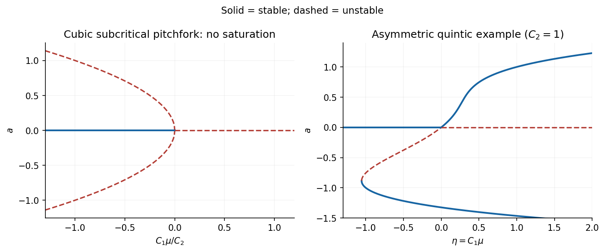

<h1 id="4/c/solution">Solution</h1>

↑ **Parent:** [C](../c.md)

Fix $\mu=r-1-q$ and $0<q<\zeta/\sigma$. The noncritical [eigenvalues](../../../../../../eigenvalue.md) at $\mu=0$ are $-\zeta$ and $\sigma q-\zeta<0$. Include the constant parameter as an additional centre variable. [Symmetry](../../../../../../symmetry-physics.md) permits expansions

$$
b=\frac a\zeta+b_\mu\mu a+b_3a^3+\cdots,\qquad c=c_2a^2+\cdots,
$$

where the omitted terms in the reduced equation have order $\mu^2a,\mu a^3,a^5$. At $\mu=0$, $a'$ begins at cubic order, so $c'=c_a a'$ begins at fourth order. The $c$ equation therefore gives $c_2=3/\zeta^2$.

The invariance equation for $b$ must retain $b_a a'=a'/\zeta+\cdots$. From the first equation,

$$
a'=\sigma(1-\zeta q b_\mu)\mu a-\sigma\zeta q b_3a^3+\cdots.
$$

Equating coefficients in $b_a a'=a-\zeta b-ac$ gives

$$
\frac{\sigma}{\zeta}(1-\zeta q b_\mu)=-\zeta b_\mu,\qquad
-\sigma q b_3=-\zeta b_3-\frac3{\zeta^2}.
$$

Hence

$$
b_\mu=-\frac{\sigma}{\zeta(\zeta-\sigma q)},\qquad
b_3=-\frac3{\zeta^2(\zeta-\sigma q)},
$$

and the required reduced equation is

$$
\boxed{a'=C_1\mu a+C_2a^3+\cdots,\qquad
C_1=\frac{\sigma\zeta}{\zeta-\sigma q},\quad
C_2=\frac{3\sigma q}{\zeta(\zeta-\sigma q)}.}
$$

Both coefficients are positive. Thus the [bifurcation](../../../../../../bifurcation.md) is a subcritical pitchfork: the no-convection state is stable for $\mu<0$ and unstable for $\mu>0$. The small nonzero branches lie on the stable-origin side,

$$
a_\pm^2=-\frac{C_1\mu}{C_2}=-\frac{\zeta^2\mu}{3q},
$$

and are unstable, since the [derivative](../../../../../../derivative.md) of the reduced [vector field](../../../../../../vector-field.md) there is $-2C_1\mu>0$. Their two transverse directions remain stable, making them [saddle equilibrium](../../../../../../saddle-equilibrium.md) [equilibria](../../../../../../equilibrium-point-of-a-dynamical-system.md) in the three-dimensional model. Setting $b'=c'=0$ without the invariance correction would incorrectly omit the common factor $(1-\sigma q/\zeta)^{-1}$. This is the [cubic centre-manifold reduction of porous magnetoconvection](../../../../../../cubic-centre-manifold-reduction-of-porous-magnetoconvection.md).

**[Figure 6](#4/c/image-subcritical-cubic-onset-and-an-example-of-bounded-asymmetric-quintic-saturation). Subcritical cubic onset and an example of bounded asymmetric quintic saturation**.

## ↑ Ancestors (11)

1. [C](../c.md)
2. [4](../../4.md)
3. [Paper 56](../../../paper-56-split.md)
4. [Iii](../../../split.md)
5. [2002](../../../../split.md)
6. [Past exam of the mathematics course of the University of Cambridge](../../../../../split.md)
7. [Mathematics course of the University of Cambridge](../../../../../../mathematics-course-of-the-university-of-cambridge.md)
8. [Course of the University of Cambridge](../../../../../../course-of-the-university-of-cambridge.md)
9. [University of Cambridge](../../../../../../university-of-cambridge-split.md)
10. [List of universities](../../../../../../list-of-universities.md)
11. [Codex Wiki](../../../../../../split.md)
