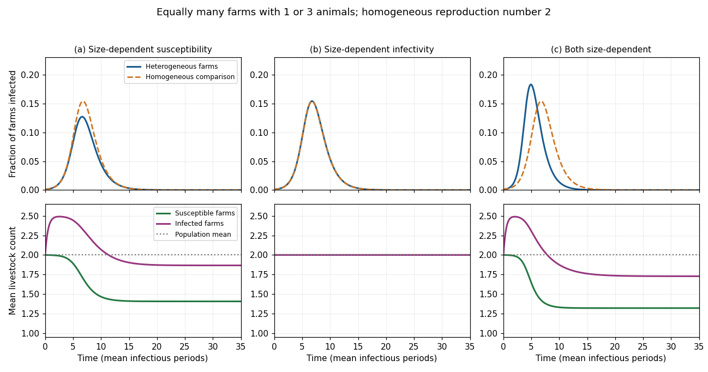

<h1 id="3/a/solution">Solution</h1>

↑ **Parent:** [A](../a.md)

Use fractions of all farms, so $S_n+I_n+R_n=P_n$ and $\sum_nP_n=1$. Assume farm size is fixed, contacts mix randomly, infectious periods have size-independent exponential [mean](../../../../../../expected-value.md) $1/\gamma$, and the farm-size distribution has finite moments $\mu=\sum_nnP_n$ and $\mu_2=\sum_nn^2P_n$. Write $I=\sum_nI_n$. The [farm-size stratified SIR model](../../../../../../farm-size-stratified-sir-model.md) with susceptibility proportional to size is

$$
\dot S_n=-\beta nS_nI,\qquad \dot I_n=\beta nS_nI-\gamma I_n,\qquad \dot R_n=\gamma I_n.
$$

Here $\beta$ includes the common contact-rate constant; using frequency-dependent mixing avoids introducing an extra total-farm factor. An infectious farm of any size generates $\beta nP_n/\gamma$ infections in initially susceptible size-$n$ farms. The next-generation [matrix](../../../../../../matrix.md) $K_{nm}=\beta nP_n/\gamma$ has rank one, giving the [basic reproduction number](../../../../../../basic-reproduction-number.md)

$$
\boxed{\mathcal R_0=\beta\mu/\gamma.}
$$

The comparison [SIR model](../../../../../../sir-model.md) replaces every size by $\mu$, so it has the same [basic reproduction number](../../../../../../basic-reproduction-number.md) and the same initial exponential growth rate $\beta\mu-\gamma$.

As the [epidemic](../../../../../../epidemic.md) develops, put $\Lambda(t)=\beta\int_0^tI(u)\,du$. For negligible initial infection, $S_n=P_ne^{-n\Lambda}$. Large farms leave the susceptible class faster. If $\mu_S=\sum_nnS_n/S$ with $S=\sum_nS_n$, differentiation gives

$$
\dot\mu_S=-\beta I\,\operatorname{Var}_S(n)\leq0.
$$

The [mean](../../../../../../expected-value.md) size of newly infected farms is $\mu_{\rm inc}=\sum_nn^2S_n/\sum_nnS_n$, larger than the susceptible [mean](../../../../../../expected-value.md) unless all sizes agree. If $\mu_I=\sum_nnI_n/I$, then

$$
\dot\mu_I=\frac{\beta I\sum_nnS_n}{I}(\mu_{\rm inc}-\mu_I).
$$

Recovery cancels from this equation because its rate is size-independent. Starting with representative infectives, $\mu_I$ initially rises toward the size-biased [mean](../../../../../../expected-value.md) $\mu_2/\mu$; later depletion of large susceptible farms lowers $\mu_{\rm inc}$ and usually lowers $\mu_I$. It is incorrect to assert that the [mean](../../../../../../expected-value.md) size of infectives must decrease from every possible initial condition. In the growing linearized mode, $I_n\propto nP_n$, so its [mean](../../../../../../expected-value.md) is already $\mu_2/\mu$.

The aggregate growth equation is $\dot I=I(\beta S\mu_S-\gamma)$. The falling susceptible [mean](../../../../../../expected-value.md) adds a depletion effect absent from the homogeneous [SIR model](../../../../../../sir-model.md). The [final size relation for an epidemic](../../../../../../final-size-relation-for-an-epidemic.md), with vanishing initial seed and attack fraction $A$, is

$$
A=1-\sum_nP_n e^{-(\beta/\gamma)nA}.
$$

By [Jensen's inequality](../../../../../../jensen-s-inequality.md), the right side is at most $1-e^{-\mathcal R_0A}$, so $A$ is no larger than the homogeneous attack fraction. For a common small representative seed the illustrated [epidemic](../../../../../../epidemic.md) is flatter and infects fewer farms; exact pointwise ordering of infected fractions for every time and arbitrary initial seed is not a consequence of equality of $\mathcal R_0$.

**[Figure 1](#3/a/image-farm-size-heterogeneity-epidemic-prevalence-and-mean-livestock-counts-for-the-three-transmission-assumptions). Farm-size heterogeneity: epidemic prevalence and mean livestock counts for the three transmission assumptions**.

The original sketch uses equally many farms of sizes 1 and 3, recovery rate $\gamma=1$, and a representative infected seed of $0.001$. Each homogeneous comparison has $\mathcal R_0=2$. The left, middle and right columns correspond to parts (a), (b) and (c). The top row shows infected farm fractions, and the bottom row distinguishes the [mean](../../../../../../expected-value.md) sizes of susceptible and infected farms. These are illustrative trajectories under the stated model, not universal empirical outbreak curves.

## ↑ Ancestors (11)

1. [A](../a.md)
2. [3](../../3.md)
3. [Paper 57](../../../paper-57-split.md)
4. [Iii](../../../split.md)
5. [2002](../../../../split.md)
6. [Past exam of the mathematics course of the University of Cambridge](../../../../../split.md)
7. [Mathematics course of the University of Cambridge](../../../../../../mathematics-course-of-the-university-of-cambridge.md)
8. [Course of the University of Cambridge](../../../../../../course-of-the-university-of-cambridge.md)
9. [University of Cambridge](../../../../../../university-of-cambridge-split.md)
10. [List of universities](../../../../../../list-of-universities.md)
11. [Codex Wiki](../../../../../../split.md)
