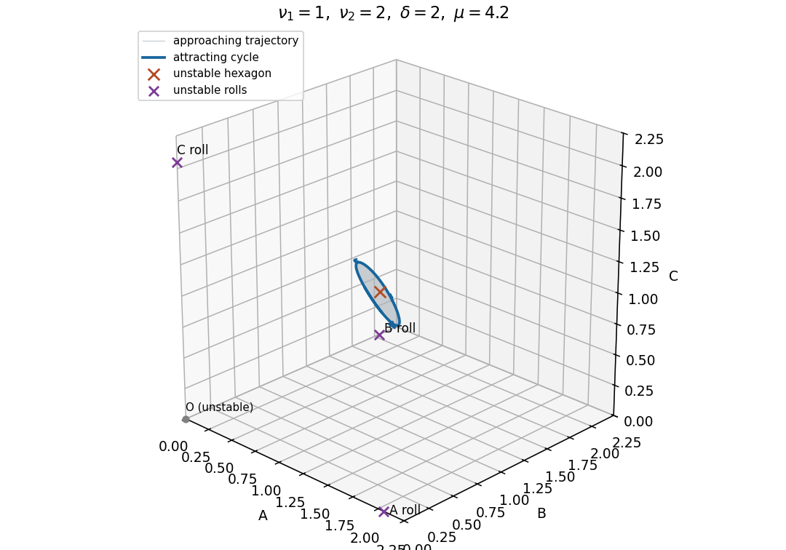

# Paper 58

↑ **Parent:** [Iii](../iii.md)

[https://www.maths.cam.ac.uk/postgrad/part-iii/files/pastpapers/2002/Paper58.pdf](https://www.maths.cam.ac.uk/postgrad/part-iii/files/pastpapers/2002/Paper58.pdf)

**Table of contents**

- [1](#1)
  - [i](#1/i)
    - [Solution](#1/i/solution)
  - [ii](#1/ii)
    - [Solution](#1/ii/solution)
  - [iii](#1/iii)
    - [Solution](#1/iii/solution)
- [2](#2)
  - [Solution](#2/solution)
- [3](#3)
  - [i](#3/i)
    - [Solution](#3/i/solution)
  - [ii](#3/ii)
    - [Solution](#3/ii/solution)
- [4](#4)
  - [Solution](#4/solution)

## 1

↑ **Parent:** [Paper 58](paper-58.md)

<h3 id="1/i">i</h3>

↑ **Parent:** [1](#1)

<h4 id="1/i/solution">Solution</h4>

↑ **Parent:** [I](#1/i)

The [linearization](../../../algebra.md#linearization) at the zero solution is the [self-adjoint differential operator](../../../analysis.md#self-adjoint-differential-operator) $L=\mu-(\partial_x^2+K)^2$, with domain satisfying both endpoint conditions. The [Dirichlet boundary condition](../../../differential-equation.md#dirichlet-boundary-condition) for $-\partial_x^2$ on $(-1,1)$ gives the orthogonal [eigenfunctions](../../../linear-operator-theory.md#eigenfunction) $\cos((n+\tfrac12)\pi x)$ and $\sin((n+1)\pi x)$. Their second derivatives are multiples of themselves, so the additional condition $\psi_{xx}(\pm1)=0$ is automatic. Completeness of the Dirichlet [eigenfunctions](../../../linear-operator-theory.md#eigenfunction) also shows that these exhaust the spectrum of the polynomial operator $L$. Set $q_j=(j+1)\pi/2$; each [eigenfunction](../../../linear-operator-theory.md#eigenfunction) has growth rate $\sigma_j=\mu-(K-q_j^2)^2$. Hence the stationary [bifurcation](../../../dynamical-systems.md#bifurcation) thresholds are

$$
\boxed{\mu_j(K)=\left(K-\frac{(j+1)^2\pi^2}{4}\right)^2.}
$$

Equality of the first two thresholds requires $K$ to be the midpoint of $\pi^2/4$ and $\pi^2$, since these numbers are distinct. Therefore

$$
\boxed{K^*=\frac{5\pi^2}{8},\qquad \mu^*=\frac{9\pi^4}{64}.}
$$

At this point the even and odd lowest [eigenfunctions](../../../linear-operator-theory.md#eigenfunction) become neutral simultaneously.

<h3 id="1/ii">ii</h3>

↑ **Parent:** [1](#1)

<h4 id="1/ii/solution">Solution</h4>

↑ **Parent:** [Ii](#1/ii)

At the double threshold, $L\psi_0=L\psi_1=0$. For $j\ge2$, $q_j^2\ge9\pi^2/4$, so $|K^*-q_j^2|\ge13\pi^2/8>3\pi^2/8$ and every remaining [eigenvalue](../../../linear-operator-theory.md#eigenvalue) is strictly negative. There is a [spectral gap](../../../linear-operator-theory.md#spectral-gap) separating this two-dimensional kernel from the stable modes. The [centre manifold theorem](../../../dynamical-systems.md#centre-manifold-theorem) therefore gives a two-dimensional state [centre manifold](../../../dynamical-systems.md#center-manifold), with

$$
\psi=A\psi_0+B\psi_1+h(A,B),\qquad h=O((|A|+|B|)^2),\qquad \langle h,\psi_j\rangle=0\quad(j=0,1).
$$

If the two detuning parameters are adjoined as variables with zero time derivatives, the extended [centre manifold](../../../dynamical-systems.md#center-manifold) has total dimension four; its state fibers still have dimension two.

The only nontrivial spatial [symmetry](../../../physics.md#symmetry-physics) of the bounded interval is the [reflection](../../../linear-algebra.md#reflection-mathematics) $x\mapsto-x$. Since $\psi_0$ is even and $\psi_1$ odd, its [group action](../../../group-theory.md#group-action) on the amplitudes is $(A,B)\mapsto(A,-B)$. Thus [equivariance](../../../group-theory.md#equivariant-map) requires $\dot A$ to be even and $\dot B$ odd in $B$. There is no sign symmetry $\psi\mapsto-\psi$, because the quadratic nonlinearity breaks it. The general smooth form is $\dot A=F(A,B^2)$, $\dot B=B G(A,B^2)$, with the zero solution preserved. The [quadratic even-odd mode interaction](../../../dynamical-systems.md#quadratic-even-odd-mode-interaction) follows on truncation:

$$
\dot A=\lambda_1A+a_1A^2+a_2B^2+O(3),\qquad
\dot B=\lambda_2B+a_3AB+O(3).
$$

Writing $m=\mu-\mu^*$ and $\kappa=K-K^*$, the exact linear growth rates are $m-3\pi^2\kappa/4-\kappa^2$ and $m+3\pi^2\kappa/4-\kappa^2$. To first order in detuning,

$$
\boxed{\lambda_1=m-\frac{3\pi^2}{4}\kappa,\qquad \lambda_2=m+\frac{3\pi^2}{4}\kappa.}
$$

The [orthogonal projection](../../../hilbert-space.md#orthogonal-projection) of the quadratic term onto the neutral [eigenfunctions](../../../linear-operator-theory.md#eigenfunction) determines the leading coefficients. Both [eigenfunctions](../../../linear-operator-theory.md#eigenfunction) have squared $L^2$ norm one, and parity kills the unwanted products. The quadratic correction $h$ contributes no term through $Lh$, since $L$ is [self-adjoint](../../../linear-operator-theory.md#self-adjoint-operator) and the projected modes lie in its kernel. Consequently

$$
a_1=\int_{-1}^1\psi_0^3\,dx,\qquad
a_2=\int_{-1}^1\psi_0\psi_1^2\,dx,\qquad
a_3=2\int_{-1}^1\psi_0\psi_1^2\,dx.
$$

These projections are also a concrete way of computing the [normal form](../../../dynamical-systems.md#normal-form-dynamical-systems). In this normalization they give $a_1=8/(3\pi)$, $a_2=32/(15\pi)$ and $a_3=64/(15\pi)$, consistent with the stated coefficient ratios.

<h3 id="1/iii">iii</h3>

↑ **Parent:** [1](#1)

<h4 id="1/iii/solution">Solution</h4>

↑ **Parent:** [Iii](#1/iii)

Put $a=a_1>0$, so $a_2=4a/5$ and $a_3=8a/5$. The second equilibrium equation factors as $B(\lambda_2+a_3A)=0$. The resulting [equilibria](../../../dynamical-systems.md#equilibrium-point-of-a-dynamical-system) are

$$
\boxed{O=(0,0),\qquad P=(-\lambda_1/a,0),\qquad M_\pm=\left(-\frac{5\lambda_2}{8a},\ \pm\sqrt{\frac{25\lambda_2(8\lambda_1-5\lambda_2)}{256a^2}}\right).}
$$

The mixed pair exists strictly when $\lambda_2(\lambda_1-5\lambda_2/8)>0$; equality describes its merger with an axial [equilibrium](../../../dynamical-systems.md#equilibrium-point-of-a-dynamical-system). At $O$ the [eigenvalues](../../../linear-operator-theory.md#eigenvalue) of the [Jacobian matrix](../../../calculus.md#jacobian-matrix) are $(\lambda_1,\lambda_2)$, and at $P$ they are $(-\lambda_1,\lambda_2-8\lambda_1/5)$. At a nonzero mixed [equilibrium](../../../dynamical-systems.md#equilibrium-point-of-a-dynamical-system),

$$
J_M=\begin{pmatrix}\lambda_1-5\lambda_2/4&2a_2B\\a_3B&0\end{pmatrix},\qquad
\det J_M=-2a_2a_3B^2<0.
$$

Thus both mixed [equilibria](../../../dynamical-systems.md#equilibrium-point-of-a-dynamical-system) are [saddle equilibria](../../../dynamical-systems.md#saddle-equilibrium). The axial [equilibria](../../../dynamical-systems.md#equilibrium-point-of-a-dynamical-system) are nodes when their two real [eigenvalues](../../../linear-operator-theory.md#eigenvalue) have the same sign and saddles when the signs differ. In particular,

$$
\boxed{O\text{ stable}:\ \lambda_1<0,\ \lambda_2<0;\qquad
P\text{ stable}:\ \lambda_1>0,\ \lambda_2<\frac85\lambda_1.}
$$

There are exactly three local [bifurcation](../../../dynamical-systems.md#bifurcation) lines away from their common codimension-two intersection. On $\lambda_1=0$, $O$ and $P$ meet in a [transcritical bifurcation](../../../dynamical-systems.md#transcritical-bifurcation), visible in $\dot A=\lambda_1A+aA^2$ on the invariant axis $B=0$. On $\lambda_2=0$, the mixed pair meets $O$ in a [pitchfork bifurcation](../../../dynamical-systems.md#pitchfork-bifurcation-normal-form). Eliminating $A$ near $O$, for fixed nonzero $\lambda_1$, gives $\dot B=\lambda_2B-(a_2a_3/\lambda_1)B^3+\cdots$: this pitchfork is supercritical for $\lambda_1>0$ and subcritical for $\lambda_1<0$. On $\lambda_2=8\lambda_1/5$, the mixed pair meets $P$. Writing $A=-\lambda_1/a+u$ and $\eta=\lambda_2-8\lambda_1/5$, elimination gives $\dot B=\eta B+(a_2a_3/\lambda_1)B^3+\cdots$. This pitchfork is subcritical for $\lambda_1>0$ and supercritical for $\lambda_1<0$. A supercritical pitchfork here need not produce a stable mixed state: its other [eigenvalue](../../../linear-operator-theory.md#eigenvalue) can already be positive. The negative mixed [Jacobian determinant](../../../calculus.md#jacobian-determinant) settles the full stability question. There is no [Hopf bifurcation](../../../dynamical-systems.md#hopf-bifurcation) in this quadratic truncation.

Along $\lambda_2=\lambda_1-\Delta$, the axial curves are $A=0$ and $A=-\lambda_1/a$. The mixed pair has the same plotted amplitude for its two signs of $B$:

$$
A_M=-\frac{5(\lambda_1-\Delta)}{8a},\qquad
B^2=\frac{25(\lambda_1-\Delta)(3\lambda_1+5\Delta)}{256a^2}.
$$

Consequently the mixed curves exist outside the interval whose endpoints are $\Delta$ and $-5\Delta/3$. The stable portions of the axial curves are

$$
\boxed{A=0:\ \lambda_1<\min(0,\Delta);\qquad
A=-\lambda_1/a:\ \lambda_1>\max(0,-5\Delta/3).}
$$

For $\Delta>0$, stability passes directly from $O$ to $P$ at the [transcritical bifurcation](../../../dynamical-systems.md#transcritical-bifurcation) $\lambda_1=0$; the two [pitchfork bifurcations](../../../dynamical-systems.md#pitchfork-bifurcation-normal-form) lie at $-5\Delta/3$ and $\Delta$. For $\Delta<0$, $O$ loses stability at $\lambda_1=\Delta$ and $P$ becomes stable only at $\lambda_1=-5\Delta/3$. Between these points none of the equilibria is stable. This local statement does not prescribe a bounded attractor of the quadratic truncation. All mixed portions are unstable.

**[Figure 1](#1/iii/image-even-odd-mode-bifurcations-and-amplitude-branches-solid-branches-are-stable-dashed-branches-unstable). Even-odd mode bifurcations and amplitude branches; solid branches are stable, dashed branches unstable**.

## 2

↑ **Parent:** [Paper 58](paper-58.md)

<h3 id="2/solution">Solution</h3>

↑ **Parent:** [2](#2)

Use a real physical field, so the three positive [wavevectors](../../../continuum-mechanics.md#wavevector) are accompanied by their complex-conjugate modes. Modulo lattice translations, the effective [symmetry group](../../../group-theory.md#symmetry-group) is $G=\mathbb T^2\rtimes C_6$. Its translation [group action](../../../group-theory.md#group-action) is

$$
T_{\theta_1,\theta_2}(A,B,C)=(e^{i\theta_1}A,e^{i\theta_2}B,e^{-i(\theta_1+\theta_2)}C).
$$

A $120^\circ$ rotation cyclically permutes the amplitudes; a half-turn $\kappa$ acts by simultaneous [complex conjugation](../../../complex-analysis.md#complex-conjugation). Together these generate the sixfold rotation group. These formulas specify the [group action](../../../group-theory.md#group-action) independently of the choice of orientation of the three [wavevectors](../../../continuum-mechanics.md#wavevector).

For a nonzero real hexagon $(h,h,h)$, its [stabilizer subgroup](../../../group-theory.md#stabilizer-subgroup) is the rotation group $C_6$. A translation fixes it only when all three phase factors equal one. Cyclic permutation forces a fixed vector to have equal components, and the half-turn forces those components to be real. Therefore $\operatorname{Fix}(C_6)=\{(a,a,a):a\in\mathbb R\}$. For a roll $(r,0,0)$ with nonzero real $r$, the [stabilizer subgroup](../../../group-theory.md#stabilizer-subgroup) consists of the translations $T_{0,\theta}$ and the half-turn, with $\kappa T_{0,\theta}\kappa=T_{0,-\theta}$. It is $S^1\rtimes C_2$, isomorphic to $O(2)$ as an abstract group even though spatial reflections are absent. The circle eliminates $B,C$ from its [fixed-point subspace of a group action](../../../representation-theory.md#fixed-point-subspace-of-a-group-action), and the half-turn makes $A$ real. Thus

$$
\boxed{\operatorname{Fix}(H_{\rm hex})=\mathbb R(1,1,1),\qquad
\operatorname{Fix}(H_{\rm roll})=\mathbb R(1,0,0).}
$$

If unreduced physical translations are used, the full lattice kernel is included in both [stabilizer subgroups](../../../group-theory.md#stabilizer-subgroup). The real representation on the six critical components is absolutely irreducible: translations distinguish the three Fourier pairs, rotations permute them, and the half-turn rules out a complex scalar in the commutant. The [equivariant branching lemma](../../../dynamical-systems.md#equivariant-branching-lemma) consequently supplies generic steady branches of both axial types at a transverse crossing of the common linear [eigenvalue](../../../linear-operator-theory.md#eigenvalue). It guarantees existence, not stability or exhaustiveness of the possible branches.

Translation equivariance severely restricts the monomials in $\dot A$. Through cubic order they are $A$, $\overline B\,\overline C$, $|A|^2A$, $|B|^2A$ and $|C|^2A$: each has the same translation weight as $A$, using $\mathbf k_1+\mathbf k_2+\mathbf k_3=0$. The half-turn forces their coefficients to be real; the $120^\circ$ rotation gives the two cyclic counterpart equations. A spatial reflection would interchange $B,C$ and require equal cross-couplings, but it is not a symmetry here. After a real amplitude rescaling makes the generic nonzero quadratic coefficient one, the [rotational hexagon amplitude equations](../../../fluid-mechanics.md#rotational-hexagon-amplitude-equations) are

$$
\dot A=\mu A+\overline B\,\overline C-\nu_1|A|^2A-(\nu_2+\delta)|B|^2A-(\nu_2-\delta)|C|^2A,
$$

with the other two equations obtained by cyclic permutation. All four coefficients are real; $\delta$ records the absence of spatial reflection. The normalization assumes the resonant quadratic coefficient is nonzero; its vanishing would be an additional degeneracy.

For the roll, $r^2=\mu/\nu_1$. The radial [eigenvalue](../../../linear-operator-theory.md#eigenvalue) is $-2\mu$ and the phase of the active mode is a neutral translation. The transverse variables $(b,\overline c)$ have matrix

$$
\begin{pmatrix}\mu-(\nu_2-\delta)r^2&r\\r&\mu-(\nu_2+\delta)r^2\end{pmatrix}.
$$

Its two real [eigenvalues](../../../linear-operator-theory.md#eigenvalue), each occurring twice in the full real linearization, are $-(\nu_2-\nu_1)r^2\pm\sqrt{\delta^2r^4+r^2}$. Define $d=\nu_2-\nu_1$ and $D_r=d^2-\delta^2$. Strict attraction modulo translation is therefore equivalent to

$$
\boxed{\nu_1>0,\quad \mu>0,\quad d>0,\quad D_r>0,\quad
\mu>\frac{\nu_1}{D_r}.}
$$

Indeed the larger transverse [eigenvalue](../../../linear-operator-theory.md#eigenvalue) is negative precisely when $dr^2>\sqrt{\delta^2r^4+r^2}$, and squaring is legitimate only after requiring $d>0$. If $\delta^2>d^2$, that inequality is impossible. Equality $\delta^2=d^2$ is also insufficient because of the additional positive term $r^2$. Any nonzero roll that exists with $\nu_1<0$ already has a positive radial [eigenvalue](../../../linear-operator-theory.md#eigenvalue); the degenerate case $\nu_1=0$ has no ordinary isolated nonzero roll branch.

For hexagons put $N=\nu_1+2\nu_2$. A nonzero real amplitude $h$ satisfies $\mu=Nh^2-h$, or $h=(1\pm\sqrt{1+4N\mu})/(2N)$ when $N\ne0$. Separate real and imaginary disturbances. The real [Jacobian matrix](../../../calculus.md#jacobian-matrix) is cyclic, with diagonal $-h-2\nu_1h^2$ and off-diagonal entries $h-2(\nu_2\pm\delta)h^2$. Its [eigenvalues](../../../linear-operator-theory.md#eigenvalue) are

$$
\lambda_s=h-2Nh^2,\qquad
\lambda_\pm=-2h+2dh^2\pm2i\sqrt3\delta h^2.
$$

The imaginary [Jacobian matrix](../../../calculus.md#jacobian-matrix) has every entry equal to $-h$, giving [eigenvalues](../../../linear-operator-theory.md#eigenvalue) $-3h,0,0$. The two zero modes translate the hexagonal pattern. Thus the general strict stability conditions for any nonzero root $h$ are

$$
\boxed{h>0,\qquad 2Nh>1,\qquad dh<1,\qquad \mu=Nh^2-h.}
$$

These conditions state [orbital stability](../../../dynamical-systems.md#orbital-stability) transverse to translations, not asymptotic convergence to one prescribed spatial phase. Equalities require a nonlinear bifurcation calculation.

When $\nu_2>\nu_1>0$, both $d,N$ are positive. The upper positive hexagon branch is radially stable after its [saddle-node bifurcation](../../../dynamical-systems.md#saddle-node-bifurcation) at $\mu=-1/(4N)$, $h=1/(2N)$; it remains stable until $h=1/d$. At this second threshold the pair $\lambda_\pm$ crosses the imaginary axis with nonzero frequency if $\delta\ne0$. The crossing is transverse, since $dh/d\mu=1/(2Nh-1)$ and the derivative of $-2h+2dh^2$ with respect to $h$ is two there. Hence, subject to the usual nonzero cubic coefficient, this is a [Hopf bifurcation](../../../dynamical-systems.md#hopf-bifurcation):

$$
\boxed{\mu_H=\frac{2\nu_1+\nu_2}{(\nu_2-\nu_1)^2},\qquad
\omega_H=\frac{2\sqrt3|\delta|}{(\nu_2-\nu_1)^2}.}
$$

For $\delta=0$ the same threshold has two zero real [eigenvalues](../../../linear-operator-theory.md#eigenvalue), so it is not a Hopf bifurcation.

A possible [phase portrait](../../../dynamical-systems.md#phase-portrait) when neither steady branch is stable has an attracting periodic oscillation surrounding the unstable hexagon, with the three amplitudes waxing and waning cyclically. This is realized, for example, by $\nu_1=1$, $\nu_2=2$, $\delta=2$ just above $\mu_H=4$. Rolls are unstable for every positive $\mu$ because $\delta^2=4>d^2=1$. At the hexagon Hopf point $h=1$, the real spectrum is $-9,\pm4i\sqrt3$. Evaluation of the cubic [Hopf normal form](../../../dynamical-systems.md#hopf-normal-form) with a unit-norm critical eigenvector gives $\operatorname{Re}G_{21}=-64/27<0$, so this example has a [supercritical Hopf bifurcation](../../../dynamical-systems.md#supercritical-hopf-bifurcation) and an attracting small [limit cycle](../../../dynamical-systems.md#limit-cycle) in the real invariant subspace. The figure shows such a cycle at $\mu=4.2$ and an approaching trajectory; the positive octant is forward invariant because an amplitude's derivative at zero is the product of the other two. This is a possible portrait, rather than a claim that every parameter set with unstable rolls and hexagons has the same attractor. Stability asserted for the periodic orbit here is within the stipulated real subspace.

**[Figure 2](#2/image-a-possible-real-amplitude-phase-portrait-an-attracting-oscillating-hexagon-with-unstable-steady-hexagon-and-roll-states). A possible real-amplitude phase portrait: an attracting oscillating hexagon with unstable steady hexagon and roll states**.

## 3

↑ **Parent:** [Paper 58](paper-58.md)

<h3 id="3/i">i</h3>

↑ **Parent:** [3](#3)

<h4 id="3/i/solution">Solution</h4>

↑ **Parent:** [I](#3/i)

Set $f(A)=\mu_0A+\alpha A^3-A^5$ and $V(A)=\mu_0A^2/2+\alpha A^4/4-A^6/6$. Multiplication of the stationary [reaction-diffusion equation](../../../diffusion-equation.md#reaction-diffusion-system) by $A_x$ gives the first integral $A_x^2/2+V(A)=E$. A regular [front](../../../analysis.md#front-solution) with finite endpoint limits has $A_x\to0$ there, and its nonzero endpoint must satisfy $f(C)=0$. Since $V(0)=0$, the first integral gives $E=0$ and $V(C)=0$. Write $q=C^2>0$. The two endpoint conditions are

$$
\mu_0+\alpha q-q^2=0,\qquad
\frac{\mu_0}{2}+\frac{\alpha q}{4}-\frac{q^2}{6}=0.
$$

Eliminating $\mu_0$ gives the [Maxwell balance for a scalar reaction-diffusion front](../../../analysis.md#maxwell-balance-for-a-scalar-reaction-diffusion-front):

$$
\boxed{q=C^2=\frac{3\alpha}{4},\qquad \mu_0=-\frac{3\alpha^2}{16}.}
$$

This is a necessary condition for a stationary front, because the two spatially homogeneous states must have equal potential. It is also sufficient here. With these values, $-2V(A)=A^2(A^2-q)^2/3$. For the increasing positive front choose

$$
A_0'=\frac{1}{\sqrt3}A_0(q-A_0^2),\qquad
s=A_0^2,\qquad s'=\frac{2}{\sqrt3}s(q-s).
$$

Integrating this logistic equation and writing $\beta=2q/\sqrt3=\sqrt3\alpha/2$ gives

$$
\boxed{A_0^2(\xi)=\frac{q}{1+q e^{-\beta\xi}},\qquad \xi=x-X_0.}
$$

The positive constant multiplying the exponential is arbitrary and can be absorbed into $X_0$; choosing it to be $q$ gives the printed normalization exactly. The profile tends to zero and $q$ at the two ends and its first-order equation implies $A_0''+f(A_0)=0$. Its negative is the front to $-\sqrt q$, with the same squared profile.

Differentiation of the stationary equation produces the translation mode

$$
\mathcal L A_0'=0,\qquad
\mathcal L=\partial_x^2+\mu_0+3\alpha A_0^2-5A_0^4.
$$

The operator $\mathcal L$ is [self-adjoint](../../../linear-operator-theory.md#self-adjoint-operator). Twice applying [integration by parts](../../../calculus.md#integration-by-parts) gives, for $R$ with vanishing boundary Wronskian,

$$
\int_{-\infty}^{\infty}A_0'\mathcal LR\,dx
=\left[A_0'R'-A_0''R\right]_{-\infty}^{\infty}
+\int_{-\infty}^{\infty}R\mathcal LA_0'\,dx=0.
$$

Bounded $R,R'$ suffice, because the derivatives of the front decay exponentially. This proves the identity as a [Fredholm solvability condition](../../../analysis.md#fredholm-solvability-condition) associated with translation invariance.

<h3 id="3/ii">ii</h3>

↑ **Parent:** [3](#3)

<h4 id="3/ii/solution">Solution</h4>

↑ **Parent:** [Ii](#3/ii)

Use $\xi=x-\widehat X(T)$, $T=\varepsilon t$. At order $\varepsilon$, the moving-profile expansion gives

$$
-\widehat X_T A_0'(\xi)=\mathcal LR+\nu(\xi+\widehat X,T)A_0(\xi).
$$

The slow time derivative of $\varepsilon R$ is of order $\varepsilon^2$. Multiplication by $A_0'$ and integration eliminate $\mathcal LR$ by the [Fredholm solvability condition](../../../analysis.md#fredholm-solvability-condition). Thus the leading velocity is

$$
\boxed{-\widehat X_T\int_{-\infty}^{\infty}(A_0')^2\,d\xi
=\int_{-\infty}^{\infty}\nu(\xi+\widehat X,T)A_0A_0'\,d\xi.}
$$

For $\nu(x,T)=K\delta(x+cT)$ the [Dirac delta](../../../distribution-theory.md#dirac-delta-function) samples $\xi=-\widehat X-cT$. From the first-order profile equation,

$$
\mathcal D=\int (A_0')^2\,d\xi
=\frac1{\sqrt3}\int_0^{\sqrt q}A(q-A^2)\,dA
=\frac{q^2}{4\sqrt3},\qquad
A_0A_0'=\frac1{\sqrt3}s(q-s).
$$

Consequently

$$
\boxed{\widehat X_T=-\frac{4Kq e^{\beta(\widehat X+cT)}}{(1+q e^{\beta(\widehat X+cT)})^2}
=-K\operatorname{sech}^2\!\left(\frac{\beta Z}{2}\right),\qquad
Z=\widehat X+cT+\frac{\log q}{\beta}.}
$$

The prefactor $q$ in the printed profile is important for the position shift in $Z$. This is a leading-order velocity in slow time; the physical velocity is $d\widehat X/dt=\varepsilon\widehat X_T+O(\varepsilon^2)$.

The relative position obeys the autonomous [moving-defect locking of a cubic-quintic front](../../../analysis.md#moving-defect-locking-of-a-cubic-quintic-front) equation $Z_T=c-K\operatorname{sech}^2(\beta Z/2)$. For $K\ne0$, a finite constant-velocity front must have constant $Z$, and hence must travel with the defect at $\widehat X_T=-c$. Such locked fronts exist exactly when

$$
\boxed{0<\frac cK\le1.}
$$

For the strict inequality, their positions are

$$
Z_\pm=\pm\frac2\beta\operatorname{arcosh}\sqrt{\frac Kc},\qquad
\widehat X(T)=-cT-\frac{\log q}{\beta}+Z_\pm.
$$

Linearizing the relative-position equation gives $\eta_T=K\beta\operatorname{sech}^2(\beta Z_*/2)\tanh(\beta Z_*/2)\eta$. Therefore **the root with $KZ_*<0$ is stable and the other root unstable**. At $c=K$, they coalesce at $Z=0$ in a [saddle-node bifurcation](../../../dynamical-systems.md#saddle-node-bifurcation). Since $Z_T=K\beta^2Z^2/4+O(Z^4)$ there, the double root attracts from only one side and is not two-sided asymptotically stable. Locking within its existence range still requires an initial relative position in the stable root's basin; beyond the unstable root the front escapes instead.

These positional stability conclusions also describe the leading weakly perturbed front. Indeed $v=A_0'>0$ has no zeros, and $\mathcal L=(\partial_\xi+v'/v)(\partial_\xi-v'/v)$ is nonpositive in the $L^2$ inner product. The limiting coefficients $f'(0)=-3\alpha^2/16$ and $f'(\sqrt q)=-3\alpha^2/4$ are negative. Thus the unperturbed shape modes are damped, with the neutral translation mode singled out by the [solvability condition](../../../linear-operator-theory.md#solvability-condition); the defect determines its stability at first order.

If $c\ne0$ and the locking inequality fails, $Z_T$ has no finite zero and has the sign of $c$. The separation grows without bound, the localized forcing of the front decays exponentially, and $\widehat X_T\to0$: the defect passes the front, which approaches a stationary position in laboratory coordinates. The same escaping behavior occurs outside the locking basin when roots exist. If $c=0$ and $K\ne0$, the stationary defect drives the front away from it with ever decreasing speed; $Z$ grows in magnitude logarithmically rather than tending to a finite locked position. Finally, when $K=0$, the front remains stationary for every $c$; when also $c=0$, every front position is a neutral equilibrium. These degenerate cases must not be included by dividing by $K$.

## 4

↑ **Parent:** [Paper 58](paper-58.md)

<h3 id="4/solution">Solution</h3>

↑ **Parent:** [4](#4)

Near a spatially extended [Hopf bifurcation](../../../dynamical-systems.md#hopf-bifurcation), a critical oscillatory [normal mode](../../../wave-equation.md#normal-mode) has a slowly varying complex amplitude. For a selected travelling-wave branch, a [method of multiple scales](../../../differential-equation.md#method-of-multiple-scales) expansion takes the form

$$
u(x,t)=\varepsilon\{A(X,T)v_0e^{i(k_0x-\omega_0t)}+\text{complex conjugate}\}+O(\varepsilon^2),\qquad
X=\varepsilon(x-v_gt),\quad T=\varepsilon^2t.
$$

Here the distance from onset is of order $\varepsilon^2$, $v_0$ is the critical [eigenvector](../../../linear-operator-theory.md#eigenvector), and $v_g$ is the [group velocity](../../../wave-equation.md#group-velocity). The comoving coordinate removes the first spatial derivative of the envelope. Projection at the first resonant order gives $A_T=\rho A+D_0A_{XX}-G_0|A|^2A$. Spatial translation and the temporal phase of the Hopf oscillation give a constant-phase [symmetry](../../../physics.md#symmetry-physics) $A\mapsto e^{i\theta}A$, which permits the cubic term $|A|^2A$ but forbids a generic $A^2$ term. The coefficients are complex because the envelope has both growth and frequency detuning. For a supercritical branch with positive real diffusion, real rescalings and a uniform phase rotation give the [complex Ginzburg–Landau equation](../../../partial-differential-equation.md#complex-ginzburg-landau-equation)

$$
\boxed{A_T=A+(1+ib)A_{XX}-(1+ic)|A|^2A,\qquad b,c\in\mathbb R.}
$$

A subcritical Hopf branch requires higher saturation terms instead. If spatial reflection makes opposite travelling waves critical together, two coupled [amplitude equations](../../../dynamical-systems.md#amplitude-equation) are required initially; the scalar equation applies to a selected single-wave branch when its competing amplitude is stable.

Distant boundaries can still determine which travelling pattern is observed. They can select its phase and [wavenumber](../../../wave-equation.md#wavenumber), reflect a travelling disturbance, inject a competing wave, or let a growing wave packet leave the domain. In particular, amplification in a comoving frame can be [convective wave-packet instability](../../../wave-equation.md#convective-wave-packet-instability) rather than [absolute wave-packet instability](../../../wave-equation.md#absolute-wave-packet-instability) at a fixed laboratory point. A finite-domain outcome then need not reflect intrinsic bulk modulation dynamics. [Periodic boundary conditions](../../../differential-equation.md#periodic-boundary-conditions) are the appropriate idealization when studying bulk instabilities without end selection or reflected-wave forcing: they eliminate physical end layers and make the allowed envelope [Fourier modes](../../../fourier-analysis.md#fourier-mode) discrete. They do not assert that real distant boundaries are always negligible. Choose a periodic length compatible with the carrier, fix the phase winding, and compare perturbations within that same periodic problem. On an open physical domain the group velocity and actual boundary conditions must be restored.

The optimum carrier [wavenumber](../../../wave-equation.md#wavenumber) corresponds to the spatially uniform envelope $A_f=e^{-icT}$, often called a flat state. Its phase is arbitrary. Write $A=e^{-icT}(1+r)e^{i\phi}$ with real small amplitude and phase disturbances. To first order,

$$
r_T=-2r+r_{XX}-b\phi_{XX},\qquad
\phi_T=-2cr+\phi_{XX}+br_{XX}.
$$

A [Fourier mode](../../../fourier-analysis.md#fourier-mode) $e^{\lambda T+ikX}$ therefore has matrix and [dispersion relation](../../../wave-equation.md#dispersion-relation)

$$
M(k)=\begin{pmatrix}-2-k^2&bk^2\\-2c-bk^2&-k^2\end{pmatrix},\qquad
\lambda^2+(2+2k^2)\lambda+2(1+bc)k^2+(1+b^2)k^4=0.
$$

The trace is negative. The amplitude mode at $k=0$ has [eigenvalue](../../../linear-operator-theory.md#eigenvalue) $-2$, while the phase mode is neutral because constant phase shifts preserve the solution. Put $D=1+bc$. For every nonzero real $k$, the determinant is positive if $D\ge0$, whereas $D<0$ makes it negative for $0<k^2<-2D/(1+b^2)$. Thus

$$
\boxed{1+bc>0:\ \text{flat state stable modulo phase};\qquad
1+bc<0:\ \text{long-wave modulational instability}.}
$$

This is the [Benjamin-Feir stability condition](../../../partial-differential-equation.md#benjamin-feir-stability-condition). At $D=0$, nonzero modes still decay, but the leading long-wave decay is fourth order rather than diffusive. On a periodic envelope interval of length $L$, the smallest nonzero [wavenumber](../../../wave-equation.md#wavenumber) is $2\pi/L$, so strict stability of all allowed nonzero modes requires

$$
2D+(1+b^2)(2\pi/L)^2>0.
$$

A sufficiently short periodic domain can therefore exclude the unstable band even when the infinite-domain [Benjamin-Feir stability condition](../../../partial-differential-equation.md#benjamin-feir-stability-condition) fails.

The amplitude is damped while the phase is slow. For a slowly varying phase, the leading slaved amplitude is $r=-\tfrac12\{b\phi_{XX}+(\phi_X)^2\}+\cdots$. Substitution in the phase equation gives the diffusion term $D\phi_{XX}$ and the nonlinear frequency shift $(c-b)(\phi_X)^2$. The latter also follows directly from a constant phase gradient: an envelope with gradient $q$ has amplitude squared $1-q^2$ and frequency $c+(b-c)q^2$. Constant phase [symmetry](../../../physics.md#symmetry-physics) rules out undifferentiated $\phi$; translation invariance gives constant coefficients. The leading comoving Ginzburg-Landau equation also has spatial parity, so odd linear derivatives are absent at this order. Its neutral phase [eigenvalue](../../../linear-operator-theory.md#eigenvalue) expands as

$$
\lambda_{\rm phase}(k)=-Dk^2-Ek^4+O(k^6),\qquad
E=\frac{b^2(1+c^2)}2.
$$

This coefficient follows by inserting a power series for $\lambda$ in the quadratic [dispersion relation](../../../wave-equation.md#dispersion-relation). Close to $D=0$, it becomes $E=(1+b^2)/2>0$ at leading order. The [long-wave phase reduction of the complex Ginzburg-Landau equation](../../../partial-differential-equation.md#long-wave-phase-reduction-of-the-complex-ginzburg-landau-equation) is consequently

$$
\phi_T=D\phi_{XX}-E\phi_{XXXX}+g(\phi_X)^2+\cdots,\qquad g=c-b.
$$

The fourth derivative regularizes negative phase diffusion. Terms omitted here have higher order in the long-wave expansion. First-order advection has been removed by the group-velocity frame; higher odd derivatives in a more general travelling-wave problem are beyond this leading amplitude approximation.

Take $D=-d$ with $d>0$ small. At the instability boundary $c=-1/b$, so $g=-(1+b^2)/b$ is nonzero. Set $\xi=\sqrt{d/E}\,X$, $\tau=d^2T/E$, and $\phi=(d/g)\Phi$. At leading order the phase dynamics become the potential [Kuramoto-Sivashinsky equation](../../../partial-differential-equation.md#kuramoto-sivashinsky-equation),

$$
\Phi_\tau=-\Phi_{\xi\xi}-\Phi_{\xi\xi\xi\xi}+(\Phi_\xi)^2.
$$

With $u=-2\Phi_\xi$ this is

$$
\boxed{u_\tau+uu_\xi+u_{\xi\xi}+u_{\xi\xi\xi\xi}=0.}
$$

The variable $u$ is a phase-gradient disturbance, not the original physical field. Periodicity of the phase fixes $\int_0^P u\,d\xi=0$ for the zero-winding branch; the [Kuramoto-Sivashinsky equation](../../../partial-differential-equation.md#kuramoto-sivashinsky-equation) conserves this mean. The scaled period is $P=L\sqrt{d/E}$.

At fixed period $P$, the flat phase has growth rates $\lambda_n=k_n^2-k_n^4$, $k_n=2\pi n/P$. Its first loss of stability occurs at $P=2\pi$. To find what replaces it, put $k=2\pi/P$ and consider $P$ just above $2\pi$. After choosing an origin by translation, expand a small steady modulation as $u=a\sin(k\xi)+b_2\sin(2k\xi)+\cdots$. Projection of $-uu_\xi$ onto the first two harmonics yields

$$
\dot a=\lambda_1a+\frac{k}{2}ab_2+\cdots,\qquad
\dot b_2=\lambda_2b_2-\frac{k}{2}a^2+\cdots,
\qquad \lambda_j=(jk)^2-(jk)^4.
$$

Since $\lambda_2=-12$ at onset, this harmonic is slaved to $b_2=ka^2/(2\lambda_2)+\cdots$. The fundamental amplitude obeys

$$
\dot a=\lambda_1a+\frac{k^2}{4\lambda_2}a^3+\cdots
=\lambda_1a-\frac{a^3}{48}+\cdots\quad(k\simeq1).
$$

The [primary periodic bifurcation of the Kuramoto-Sivashinsky equation](../../../partial-differential-equation.md#primary-periodic-bifurcation-of-the-kuramoto-sivashinsky-equation) is therefore supercritical. For $0<P-2\pi\ll1$,

$$
\boxed{a^2=-\frac{4\lambda_1\lambda_2}{k^2}+O(\lambda_1^2),\qquad
b_2=\frac{ka^2}{2\lambda_2}+O(a^4).}
$$

The radial [eigenvalue](../../../linear-operator-theory.md#eigenvalue) of this nonzero branch is $-2\lambda_1+O(\lambda_1^2)<0$; all higher harmonics remain damped and the modulation's spatial phase is neutral. Thus the small finite-amplitude modulation is stable in the sense of [orbital stability](../../../dynamical-systems.md#orbital-stability), at fixed mean and fixed period, despite the flat state's instability. The two signs of $a$ represent translations of the same modulation. In the potential formulation the spatial mean of $\Phi$ advances at $\langle(\Phi_\xi)^2\rangle$: the original wave acquires a nonlinear frequency correction rather than requiring a time-independent absolute phase.

For larger $P$, further linear modes become active and the small-amplitude argument no longer determines stability. A periodic modulation $\bar u$ must then be tested with the operator $v_\tau=-v_{\xi\xi}-v_{\xi\xi\xi\xi}-\partial_\xi(\bar u v)$ on mean-zero periodic disturbances. Its translation mode is always neutral, and secondary oscillatory or more complicated modulation can occur. Moreover, stability against perturbations of the same period does not prove stability against disturbances of a larger period; those require a separate sideband or [Floquet theory](../../../differential-equation.md#floquet-theory) calculation. The controlled conclusion near the first threshold is the existence of a stable small modulation family, not universal stability of all periodic Kuramoto-Sivashinsky solutions.

## ↑ Ancestors (8)

1. [Iii](../iii.md)
2. [2002](../../2002.md)
3. [Past exam of the mathematics course of the University of Cambridge](../../../past-exam-of-the-mathematics-course-of-the-university-of-cambridge.md)
4. [Mathematics course of the University of Cambridge](../../../university-of-cambridge.md#mathematics-course-of-the-university-of-cambridge)
5. [Course of the University of Cambridge](../../../university-of-cambridge.md#course-of-the-university-of-cambridge)
6. [University of Cambridge](../../../university-of-cambridge.md)
7. [List of universities](../../../README.md#list-of-universities)
8. [Codex Wiki](../../../README.md)
