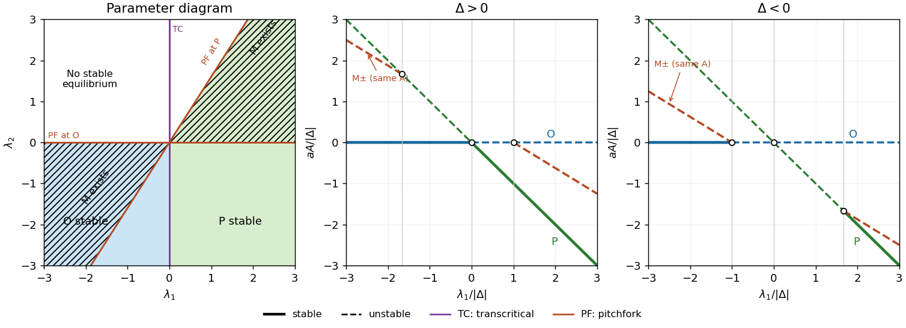

<h1 id="1/iii/solution">Solution</h1>

↑ **Parent:** [Iii](../iii.md)

Put $a=a_1>0$, so $a_2=4a/5$ and $a_3=8a/5$. The second equilibrium equation factors as $B(\lambda_2+a_3A)=0$. The resulting [equilibria](../../../../../../equilibrium-point-of-a-dynamical-system.md) are

$$
\boxed{O=(0,0),\qquad P=(-\lambda_1/a,0),\qquad M_\pm=\left(-\frac{5\lambda_2}{8a},\ \pm\sqrt{\frac{25\lambda_2(8\lambda_1-5\lambda_2)}{256a^2}}\right).}
$$

The mixed pair exists strictly when $\lambda_2(\lambda_1-5\lambda_2/8)>0$; equality describes its merger with an axial [equilibrium](../../../../../../equilibrium-point-of-a-dynamical-system.md). At $O$ the [eigenvalues](../../../../../../eigenvalue.md) of the [Jacobian matrix](../../../../../../jacobian-matrix.md) are $(\lambda_1,\lambda_2)$, and at $P$ they are $(-\lambda_1,\lambda_2-8\lambda_1/5)$. At a nonzero mixed [equilibrium](../../../../../../equilibrium-point-of-a-dynamical-system.md),

$$
J_M=\begin{pmatrix}\lambda_1-5\lambda_2/4&2a_2B\\a_3B&0\end{pmatrix},\qquad
\det J_M=-2a_2a_3B^2<0.
$$

Thus both mixed [equilibria](../../../../../../equilibrium-point-of-a-dynamical-system.md) are [saddle equilibria](../../../../../../saddle-equilibrium.md). The axial [equilibria](../../../../../../equilibrium-point-of-a-dynamical-system.md) are nodes when their two real [eigenvalues](../../../../../../eigenvalue.md) have the same sign and saddles when the signs differ. In particular,

$$
\boxed{O\text{ stable}:\ \lambda_1<0,\ \lambda_2<0;\qquad
P\text{ stable}:\ \lambda_1>0,\ \lambda_2<\frac85\lambda_1.}
$$

There are exactly three local [bifurcation](../../../../../../bifurcation.md) lines away from their common codimension-two intersection. On $\lambda_1=0$, $O$ and $P$ meet in a [transcritical bifurcation](../../../../../../transcritical-bifurcation.md), visible in $\dot A=\lambda_1A+aA^2$ on the invariant axis $B=0$. On $\lambda_2=0$, the mixed pair meets $O$ in a [pitchfork bifurcation](../../../../../../pitchfork-bifurcation-normal-form.md). Eliminating $A$ near $O$, for fixed nonzero $\lambda_1$, gives $\dot B=\lambda_2B-(a_2a_3/\lambda_1)B^3+\cdots$: this pitchfork is supercritical for $\lambda_1>0$ and subcritical for $\lambda_1<0$. On $\lambda_2=8\lambda_1/5$, the mixed pair meets $P$. Writing $A=-\lambda_1/a+u$ and $\eta=\lambda_2-8\lambda_1/5$, elimination gives $\dot B=\eta B+(a_2a_3/\lambda_1)B^3+\cdots$. This pitchfork is subcritical for $\lambda_1>0$ and supercritical for $\lambda_1<0$. A supercritical pitchfork here need not produce a stable mixed state: its other [eigenvalue](../../../../../../eigenvalue.md) can already be positive. The negative mixed [Jacobian determinant](../../../../../../jacobian-determinant.md) settles the full stability question. There is no [Hopf bifurcation](../../../../../../hopf-bifurcation.md) in this quadratic truncation.

Along $\lambda_2=\lambda_1-\Delta$, the axial curves are $A=0$ and $A=-\lambda_1/a$. The mixed pair has the same plotted amplitude for its two signs of $B$:

$$
A_M=-\frac{5(\lambda_1-\Delta)}{8a},\qquad
B^2=\frac{25(\lambda_1-\Delta)(3\lambda_1+5\Delta)}{256a^2}.
$$

Consequently the mixed curves exist outside the interval whose endpoints are $\Delta$ and $-5\Delta/3$. The stable portions of the axial curves are

$$
\boxed{A=0:\ \lambda_1<\min(0,\Delta);\qquad
A=-\lambda_1/a:\ \lambda_1>\max(0,-5\Delta/3).}
$$

For $\Delta>0$, stability passes directly from $O$ to $P$ at the [transcritical bifurcation](../../../../../../transcritical-bifurcation.md) $\lambda_1=0$; the two [pitchfork bifurcations](../../../../../../pitchfork-bifurcation-normal-form.md) lie at $-5\Delta/3$ and $\Delta$. For $\Delta<0$, $O$ loses stability at $\lambda_1=\Delta$ and $P$ becomes stable only at $\lambda_1=-5\Delta/3$. Between these points none of the equilibria is stable. This local statement does not prescribe a bounded attractor of the quadratic truncation. All mixed portions are unstable.

**[Figure 1](#1/iii/image-even-odd-mode-bifurcations-and-amplitude-branches-solid-branches-are-stable-dashed-branches-unstable). Even-odd mode bifurcations and amplitude branches; solid branches are stable, dashed branches unstable**.

## ↑ Ancestors (11)

1. [Iii](../iii.md)
2. [1](../../1.md)
3. [Paper 58](../../../paper-58-split.md)
4. [Iii](../../../split.md)
5. [2002](../../../../split.md)
6. [Past exam of the mathematics course of the University of Cambridge](../../../../../split.md)
7. [Mathematics course of the University of Cambridge](../../../../../../mathematics-course-of-the-university-of-cambridge.md)
8. [Course of the University of Cambridge](../../../../../../course-of-the-university-of-cambridge.md)
9. [University of Cambridge](../../../../../../university-of-cambridge-split.md)
10. [List of universities](../../../../../../list-of-universities.md)
11. [Codex Wiki](../../../../../../split.md)
