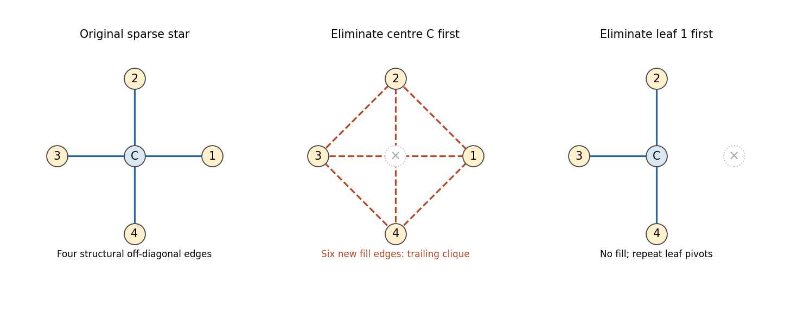

# Paper 60

↑ **Parent:** [Iii](../iii.md)

[https://www.maths.cam.ac.uk/postgrad/part-iii/files/pastpapers/2002/Paper60.pdf](https://www.maths.cam.ac.uk/postgrad/part-iii/files/pastpapers/2002/Paper60.pdf)

**Table of contents**

- [1](#1)
  - [a](#1/a)
    - [Solution](#1/a/solution)
  - [b](#1/b)
    - [Solution](#1/b/solution)
- [2](#2)
  - [Solution](#2/solution)
- [3](#3)
  - [a](#3/a)
    - [Solution](#3/a/solution)
  - [b](#3/b)
    - [Solution](#3/b/solution)
- [4](#4)
  - [a](#4/a)
    - [Solution](#4/a/solution)
  - [b](#4/b)
    - [Solution](#4/b/solution)
- [5](#5)
  - [a](#5/a)
    - [Solution](#5/a/solution)
  - [b](#5/b)
    - [Solution](#5/b/solution)
- [6](#6)
  - [Solution](#6/solution)
- [7](#7)
  - [Solution](#7/solution)

## 1

↑ **Parent:** [Paper 60](paper-60.md)

<h3 id="1/a">a</h3>

↑ **Parent:** [1](#1)

<h4 id="1/a/solution">Solution</h4>

↑ **Parent:** [A](#1/a)

Put $h=1/(m+1)$ and impose homogeneous [Dirichlet boundary conditions](../../../differential-equation.md#dirichlet-boundary-condition), as required by the stated continuum [eigenvalues](../../../linear-operator-theory.md#eigenvalue). Let $T=\operatorname{tridiag}(1,-2,1)$ be the unscaled one-dimensional [Dirichlet discrete Laplacian](../../../finite-difference.md#dirichlet-discrete-laplacian). For $1\leq k\leq m$, the vectors $v_j^{(k)}=\sin(jk\pi h)$ satisfy

$$
Tv^{(k)}=\tau_kv^{(k)},\qquad \tau_k=2\cos(k\pi h)-2=-4\sin^2\frac{k\pi h}{2}.
$$

The identity follows by adding the two neighboring [sines](../../../geometry-and-topology.md#sine); the values at $j=0,m+1$ vanish. These $m$ mutually orthogonal vectors form the [discrete sine transform](../../../numerical-analysis.md#discrete-sine-transform) basis. Consequently their [tensor products](../../../linear-algebra.md#tensor-product) give all $m^2$ two-dimensional modes, not merely a few candidate [eigenvectors](../../../linear-operator-theory.md#eigenvector).

In a compatible grid ordering the axial operator is $A_5=h^{-2}(T\otimes I+I\otimes T)$. The nine-point operator is

$$
A_9=A_5+\frac1{6h^2}T\otimes T.
$$

Indeed, the added [Kronecker product](../../../vector-space.md#kronecker-product) supplies the diagonal neighbors with weight $1/6$, subtracts $1/3$ from each axial neighbor and adds $2/3$ to the central coefficient. Thus it has exactly the coefficients of the second discretization. On $v^{(k)}\otimes v^{(l)}$ the [eigenvalues](../../../linear-operator-theory.md#eigenvalue) are

$$
\boxed{\lambda_{5,kl}=-\frac4{h^2}\left(\sin^2\frac{k\pi h}{2}+\sin^2\frac{l\pi h}{2}\right),}
$$

and

$$
\boxed{\lambda_{9,kl}=\lambda_{5,kl}+\frac8{3h^2}\sin^2\frac{k\pi h}{2}\sin^2\frac{l\pi h}{2},\qquad 1\leq k,l\leq m.}
$$

Equivalently, $h^2\lambda_{9,kl}=-10/3+4[\cos(k\pi h)+\cos(l\pi h)]/3+2\cos(k\pi h)\cos(l\pi h)/3$.

<h3 id="1/b">b</h3>

↑ **Parent:** [1](#1)

<h4 id="1/b/solution">Solution</h4>

↑ **Parent:** [B](#1/b)

For fixed mode numbers $k,l$, expansion of the [sines](../../../geometry-and-topology.md#sine) gives

$$
\lambda_{5,kl}=-\pi^2(k^2+l^2)+\frac{\pi^4h^2}{12}(k^4+l^4)+O(h^4),
$$

whereas the mixed [Kronecker product](../../../vector-space.md#kronecker-product) correction gives

$$
\lambda_{9,kl}=-\pi^2(k^2+l^2)+\frac{\pi^4h^2}{12}(k^2+l^2)^2+O(h^4).
$$

Thus **both [eigenvalue](../../../linear-operator-theory.md#eigenvalue) approximations are second order for fixed modes**. The leading nine-point error includes an additional positive term $\pi^4h^2k^2l^2/6$.

There is also an exact comparison, not just an asymptotic one. Since $\sin x<x$ for $0<x<\pi/2$, and both sine factors in the correction are positive,

$$
-\pi^2(k^2+l^2)<\lambda_{5,kl}<\lambda_{9,kl}.
$$

Both estimates lie on the less-negative side of the continuum [Laplacian](../../../calculus.md#laplacian) [eigenvalue](../../../linear-operator-theory.md#eigenvalue), so **the five-point formula is the better [eigenvalue](../../../linear-operator-theory.md#eigenvalue) estimate for every corresponding interior mode**. The [five-point versus nine-point Laplacian eigenvalue accuracy](../../../finite-difference.md#five-point-versus-nine-point-laplacian-eigenvalue-accuracy) comparison does not contradict the useful isotropy or special Poisson accuracy properties of a nine-point stencil. Those properties concern a different error criterion. The fixed-mode expansion is not uniform for modes with $k$ or $l$ comparable to $h^{-1}$; wavelengths close to the mesh scale need not have small relative spectral error.

## 2

↑ **Parent:** [Paper 60](paper-60.md)

<h3 id="2/solution">Solution</h3>

↑ **Parent:** [2](#2)

Work in the standard class of real constant-coefficient [linear multistep methods](../../../numerical-analysis.md#linear-multistep-method) using only first-derivative evaluations. Write

$$
\sum_{j=0}^s\alpha_jY_{n+j}=h\sum_{j=0}^s\beta_jf(t_{n+j},Y_{n+j}),\qquad
\rho(z)=\sum_{j=0}^s\alpha_jz^j,\quad \sigma(z)=\sum_{j=0}^s\beta_jz^j,
$$

with $\alpha_s\ne0$. The [Dahlquist equivalence theorem](../../../numerical-analysis.md#dahlquist-equivalence-theorem) states that such a method converges on each fixed finite time interval, for sufficiently regular Lipschitz [initial value problems](../../../differential-equation.md#initial-value-problem) and every set of consistent starting values, if and only if it is consistent and [zero-stable](../../../numerical-analysis.md#zero-stability). Consistency means $\rho(1)=0$ and $\rho'(1)=\sigma(1)$. [Zero-stability](../../../numerical-analysis.md#zero-stability) means all roots of $\rho$ lie in $|z|\leq1$ and every root on $|z|=1$ is simple. In particular the consistency root at $1$ is simple.

[Taylor expansion](../../../calculus.md#taylor-expansion) of the exact-solution residual gives the [exponential-symbol order criterion for a multistep method](../../../numerical-analysis.md#exponential-symbol-order-criterion-for-a-multistep-method)

$$
\rho(e^w)-w\sigma(e^w)=O(w^{p+1}).
$$

This criterion packages the identities $\sum\alpha_jj^q=q\sum\beta_jj^{q-1}$ through $q=p$. We now derive the upper bound on $p$ from the root condition, rather than assuming the [first Dahlquist barrier](../../../numerical-analysis.md#first-dahlquist-barrier).

Use the [Cayley transform](../../../group-theory.md#cayley-transform-complex-analysis) $z=(1+x)/(1-x)$ and define

$$
R(x)=(1-x)^s\rho\left(\frac{1+x}{1-x}\right)=xP(x),\qquad
S(x)=(1-x)^s\sigma\left(\frac{1+x}{1-x}\right).
$$

The simple root at $z=1$ gives $P(0)\ne0$, while $\deg P\leq s-1$ and $\deg S\leq s$. Each finite transformed root is $x=(z-1)/(z+1)$, with nonpositive real part when $|z|\leq1$. A possible root at $z=-1$ simply lowers the degree of $R$. Factor $P$ over the reals: a real root contributes $x+a$ with $a>0$, and a conjugate pair contributes $x^2+2ax+a^2+b^2$ with $a\geq0$. Therefore, after reversing the overall sign if needed,

$$
P(x)=\sum_{j=0}^{s-1}P_jx^j,\qquad P_j\geq0,\quad P_0>0.
$$

Since $w=2\operatorname{arctanh}x$, the order criterion is equivalent to

$$
S(x)-\frac12P(x)F(x)=O(x^p),\qquad F(x)=\frac{x}{\operatorname{arctanh}x}.
$$

The key [coefficient sign lemma for the first Dahlquist barrier](../../../numerical-analysis.md#coefficient-sign-lemma-for-the-first-dahlquist-barrier) is

$$
F(x)=1-\sum_{j\geq1}\gamma_jx^{2j},\qquad \gamma_j>0.
$$

Here is a proof of that sign assertion. Direct integration gives

$$
F(x)=\int_0^1(1+x)^t(1-x)^{1-t}\,dt.
$$

Differentiate twice and pair the terms at $t$ and $1-t$ to obtain

$$
F''(x)=-4\int_0^1t(1-t)(1-x^2)^{-3/2}
\cosh[(2t-1)\operatorname{arctanh}x]\,dt.
$$

The [power series](../../../real-analysis.md#power-series) of $\operatorname{arctanh}x$ has positive odd coefficients. The even powers in the [hyperbolic cosine](../../../calculus.md#hyperbolic-cosine) therefore have nonnegative coefficients, and $(1-x^2)^{-3/2}$ has strictly positive even coefficients. Every even coefficient of $F''$ is consequently negative. Also $F$ is even and $F(0)=1$, proving the assertion.

If $s$ is odd and $p\geq s+2$, the coefficient of $x^{s+1}$ in $PF$ must vanish because $\deg S\leq s$. But it is

$$
-\sum_{j\geq1}\gamma_jP_{s+1-2j}<0,
$$

where out-of-range indices are zero and the sum includes the strictly positive $\gamma_{(s+1)/2}P_0$. This is impossible, so $p\leq s+1$. If $s$ is even and $p\geq s+3$, exactly the same argument with the coefficient of $x^{s+2}$ gives a contradiction. Thus $p\leq s+2$ in that case. This proves the [Cayley coefficient proof of the first Dahlquist barrier](../../../numerical-analysis.md#cayley-coefficient-proof-of-the-first-dahlquist-barrier):

$$
\boxed{p\leq 2\left\lfloor\frac{s+2}{2}\right\rfloor.}
$$

To prove that the bound is attainable for every $s$, let $L_j$ be the [Lagrange polynomials](../../../numerical-analysis.md#lagrange-polynomial) for the nodes $0,1,\ldots,s$, and take $w_j=\int_0^sL_j(t)\,dt$. The [Newton-Cotes multistep methods attaining the first Dahlquist barrier](../../../numerical-analysis.md#newton-cotes-multistep-methods-attaining-the-first-dahlquist-barrier) are

$$
Y_{n+s}-Y_n=h\sum_{j=0}^sw_jf_{n+j}.
$$

The underlying [Newton-Cotes closed quadrature](../../../numerical-analysis.md#newton-cotes-closed-quadrature) is exact on all [polynomials](../../../polynomial.md) of degree at most $s$. For even $s$, the node [polynomial](../../../polynomial.md) $q(t)=\prod_{j=0}^s(t-j)$ is odd about $s/2$, so $\int_0^sq(t)\,dt=0$. Dividing any degree-$s+1$ [polynomial](../../../polynomial.md) by $q$ shows that quadrature exactness extends one degree further. Integrating the exact derivative therefore gives method order at least $s+1$ for odd $s$ and at least $s+2$ for even $s$.

Finally $\rho(z)=z^s-1$ has only simple unit-circle roots, so these methods satisfy the root condition. The weights sum to $s=\rho'(1)$, proving consistency. The [Dahlquist equivalence theorem](../../../numerical-analysis.md#dahlquist-equivalence-theorem) gives convergence with consistent starts; the proved upper bound makes the attained formal orders exact; starting values accurate to those orders also give the corresponding global accuracy. Hence **the highest convergent order is $2\lfloor(s+2)/2\rfloor$**. This result concerns the stated linear first-derivative class, not unrestricted multiderivative or nonlinear formulas.

## 3

↑ **Parent:** [Paper 60](paper-60.md)

<h3 id="3/a">a</h3>

↑ **Parent:** [3](#3)

<h4 id="3/a/solution">Solution</h4>

↑ **Parent:** [A](#3/a)

Let $e$ be the vector of ones. For a general nonautonomous [Runge-Kutta method](../../../numerical-analysis.md#runge-kutta-method) the stages satisfy $k_i=f(t+c_ih,y+h\sum_ja_{ij}k_j)$ and the update is $Y=y+h\sum_ib_ik_i$. Expansion at $(t,y)$ gives

$$
k_i=f+h\{c_if_t+(Ae)_if_yf\}+O(h^2),
$$

and therefore

$$
Y=y+h(b^Te)f+h^2\{(b^Tc)f_t+(b^TAe)f_yf\}+O(h^3).
$$

The exact solution is $y(t+h)=y+hf+h^2(f_t+f_yf)/2+O(h^3)$. Matching the independent terms gives the necessary and sufficient [second-order conditions with independent Runge-Kutta abscissae](../../../numerical-analysis.md#second-order-conditions-with-independent-runge-kutta-abscissae)

$$
\boxed{b^Te=1,\qquad b^Tc=\tfrac12,\qquad b^TAe=\tfrac12.}
$$

Under the usual internally consistent [Butcher tableau](../../../numerical-analysis.md#butcher-tableau) convention $c=Ae$, this reduces to $c=Ae$, $b^Te=1$, $b^Tc=1/2$. If the abscissae are allowed to be independent of the row sums, $c=Ae$ is a sufficient simplifying convention rather than a logically necessary order-two condition.

<h3 id="3/b">b</h3>

↑ **Parent:** [3](#3)

<h4 id="3/b/solution">Solution</h4>

↑ **Parent:** [B](#3/b)

**The original PDF has a sign defect in the lower-left stage coefficient.** Put $d=c_2-c_1$. With the printed negative sign, the row sums and the relevant [Butcher order conditions](../../../numerical-analysis.md#butcher-order-condition) are

$$
Ae=\begin{pmatrix}c_1\\-c_1c_2/d\end{pmatrix},\qquad
b^Te=1,\quad b^Tc=\tfrac12,\quad
q:=b^TAe=\tfrac12-\frac{(\tfrac12-c_1)c_2^2}{d^2}.
$$

Thus the claimed universal second order is false. For example $c_1=0,c_2=1$ gives, on $y'=y$, two stages equal to $y$ and the update $Y=(1+h)y$. This is the first-order [Forward Euler method](../../../numerical-analysis.md#euler-method). For the literal tableau, order at least two holds exactly when $c_1=1/2$ or $c_2=0$, subject to distinct allowed nodes.

For completeness the literal tableau's [A-stability](../../../numerical-analysis.md#a-stability) can also be classified algebraically. Define

$$
a=\frac{c_1+c_2}{2}>0,\qquad
D=\frac{c_1c_2}{2}\left(1-\frac{c_1c_2}{d^2}\right),\qquad
r=D+q-a.
$$

The [stability function](../../../numerical-analysis.md#stability-function) obtained from $R(z)=1+zb^T(I-zA)^{-1}e$ is

$$
R(z)=\frac{1+(1-a)z+rz^2}{1-az+Dz^2}.
$$

If $D\geq0$, the denominator has no zero in the closed left half-plane: its reciprocal roots are the stage-matrix [eigenvalues](../../../linear-operator-theory.md#eigenvalue), whose positive sum and nonnegative product give positive real parts for nonzero [eigenvalues](../../../linear-operator-theory.md#eigenvalue). On the imaginary axis,

$$
|1-aiy+D(iy)^2|^2-|1+(1-a)iy+r(iy)^2|^2
=(2q-1)y^2+(D^2-r^2)y^4.
$$

Consequently **for the literal tableau with uniquely solvable stages throughout the left half-plane, the complete parameter criterion is**

$$
\boxed{D\geq0,\qquad q\geq\tfrac12,\qquad D^2\geq(D+q-a)^2.}
$$

These explicit inequalities in $c_1,c_2$ are necessary by the small and large imaginary parameters, and sufficient by the [maximum modulus principle](../../../complex-analysis.md#maximum-modulus-principle), including the bound at infinity. For $D=0$ the last inequality forces $r=0$, leaving the stable linear-fractional case. For $D<0$ there is a negative real stage pole. If one defines [stability](../../../numerical-analysis.md#stability-of-a-numerical-method) solely through an analytically continued scalar [stability function](../../../numerical-analysis.md#stability-function), the only additional possibilities are

$$
D=q(a-q),\qquad q>a,\qquad q\geq\tfrac12.
$$

Indeed these are precisely the cases where the left pole cancels and $R(z)=[1+(1-q)z]/[1-qz]$ is an [A-stable](../../../numerical-analysis.md#a-stability) [theta method](../../../numerical-analysis.md#theta-method). The original stage equations are nevertheless singular at $z=-1/(q-a)$, so they do not give uniquely determined stages there. This distinction prevents a canceled rational factor from concealing an ill-defined stage solve.

The natural intended repair is to replace just the lower-left coefficient by $+c_2^2/(2d)$. This makes the method the [collocation Runge-Kutta method](../../../numerical-analysis.md#collocation-runge-kutta-method) on the two nodes. To derive the repaired entries, take

$$
L_1(t)=\frac{c_2-t}{d},\qquad L_2(t)=\frac{t-c_1}{d},\qquad
 a_{ij}=\int_0^{c_i}L_j(t)\,dt,\quad b_j=\int_0^1L_j(t)\,dt.
$$

Integration gives the other three printed entries and the weights unchanged, with the positive lower-left entry. Since $L_1+L_2=1$ and $c_1L_1+c_2L_2=t$, it follows that $Ae=c$, $b^Te=1$ and $b^Tc=1/2$. Hence **the corrected family is always of order at least two**.

For the corrected family let $a=(c_1+c_2)/2$, $D=c_1c_2/2$ and $r=(1-c_1)(1-c_2)/2$. Its [stability function](../../../numerical-analysis.md#stability-function) has the same displayed rational form, now with $q=1/2$. The denominator again has no left-half-plane zero, and on the imaginary axis the squared-modulus difference is $(D^2-r^2)y^4$. Because $D,r\geq0$, the necessary and sufficient inequality is $D\geq r$, or

$$
\boxed{c_1+c_2\geq1\quad\text{for the corrected two-node collocation family}.}
$$

For sufficiency, $|R|\leq1$ on the imaginary axis and at infinity; apply the [maximum modulus principle](../../../complex-analysis.md#maximum-modulus-principle) on growing left half-discs to get the same bound inside. If $D=0$, the condition leaves the endpoint [trapezoidal rule](../../../numerical-analysis.md#trapezoidal-rule) and its linear denominator. If $c_1+c_2<1$, every nonzero imaginary argument gives $|R|>1$. This is the [two-node collocation A-stability criterion](../../../numerical-analysis.md#two-node-collocation-a-stability-criterion), explicitly distinguished from the literal defective tableau.

## 4

↑ **Parent:** [Paper 60](paper-60.md)

<h3 id="4/a">a</h3>

↑ **Parent:** [4](#4)

<h4 id="4/a/solution">Solution</h4>

↑ **Parent:** [A](#4/a)

Expand the three [matrix exponentials](../../../linear-operator-theory.md#matrix-exponential) and retain terms through degree two. Their product is

$$
E(t)=I+t(A+B)+\frac{t^2}{2}(A^2+AB+BA+B^2)+O(t^3),
$$

which agrees with $e^{t(A+B)}$ to that order. Keeping the cubic terms gives the more informative defect

$$
E(t)-e^{t(A+B)}=t^3\left(-\frac1{24}[A,[A,B]]+\frac1{12}[B,[B,A]]\right)+O(t^4),
$$

where $[A,B]=AB-BA$ is the [commutator](../../../lie-algebra.md#commutator). For example, the coefficients of $A^2B,ABA,BA^2$ in the product are $1/8,1/4,1/8$, instead of the exact $1/6,1/6,1/6$. The cubic defect is generically nonzero. Therefore **[Strang splitting](../../../numerical-analysis.md#strang-splitting) has order $p=2$**. The symmetry $E(-t)=E(t)^{-1}$ is consistent with this cancellation of the quadratic defect; for commuting $A,B$ the composition is exact rather than merely second order.

<h3 id="4/b">b</h3>

↑ **Parent:** [4](#4)

<h4 id="4/b/solution">Solution</h4>

↑ **Parent:** [B](#4/b)

Choose the centered [Dirichlet discrete Laplacian](../../../finite-difference.md#dirichlet-discrete-laplacian) in each direction. With $T=\operatorname{tridiag}(1,-2,1)$ put $A=T\otimes I$, $B=I\otimes T$ and $\mu=\Delta t/h^2$. Thus $h^{-2}A$ and $h^{-2}B$ are the physical derivative approximations; the factor $h^{-2}$ has been absorbed into the [Courant number](../../../finite-difference.md#courant-number) in the written update. Equivalently use the scaled derivative [matrices](../../../vector-space.md#matrix) and the time parameter $\Delta t$.

For a one-dimensional vector with endpoint values $v_0=v_{m+1}=0$,

$$
v^TTv=-\sum_{j=0}^m(v_{j+1}-v_j)^2\leq0.
$$

Thus $A$ and $B$ are real symmetric negative-definite [matrices](../../../vector-space.md#matrix). An orthonormal [eigenvector](../../../linear-operator-theory.md#eigenvector) basis shows that all [eigenvalues](../../../linear-operator-theory.md#eigenvalue) of each exponential lie in $(0,1]$ for $\mu\geq0$, so

$$
\|E(\mu;A,B)\|_2
\leq\|e^{\mu A/2}\|_2^2\|e^{\mu B}\|_2\leq1.
$$

Iterating gives **$\|U^n\|_2\leq\|U^0\|_2$ for every nonnegative step parameter**, a mesh-independent unconditional [stability](../../../numerical-analysis.md#stability-of-a-numerical-method) bound. Multiplying the squared norm by the grid-area weight $h^2$ leaves the same estimate. In this natural tensor-grid choice $AB=BA=T\otimes T$, so $E(\mu;A,B)=e^{\mu(A+B)}$: the split update is even the exact semidiscrete diffusion flow. Contractivity of a product of these negative symmetric exponentials would prove [stability](../../../numerical-analysis.md#stability-of-a-numerical-method) even without commutation.

## 5

↑ **Parent:** [Paper 60](paper-60.md)

<h3 id="5/a">a</h3>

↑ **Parent:** [5](#5)

<h4 id="5/a/solution">Solution</h4>

↑ **Parent:** [A](#5/a)

Write $h=\Delta x$, $k=\Delta t=\mu h$. Every smooth exact solution of the [advection equation](../../../partial-differential-equation.md#transport-equation) here is $u(x,t)=F(x+t)$. At $s=x+t$, substitution into the scheme gives the unscaled residual

$$
\mathcal R=F(s+\mu h)-(1-2\mu)[F(s)-F(s+h)]-F(s+(1-\mu)h).
$$

The constant, linear and quadratic Taylor coefficients vanish. Its cubic coefficient is

$$
\frac{h^3}{6}\{\mu^3+1-2\mu-(1-\mu)^3\}F'''(s)
=\frac{\mu(1-\mu)(1-2\mu)}6h^3u_{xxx}.
$$

For a general smooth function the first-order residual is $2k(u_t-u_x)$, so the proper normalized [local truncation error](../../../numerical-analysis.md#local-truncation-error) on an exact solution is

$$
\boxed{\frac{\mathcal R}{2k}=\frac{(1-\mu)(1-2\mu)}{12}h^2u_{xxx}+O(h^3).}
$$

Hence **the scheme has formal order two for fixed general positive $\mu$**. At $\mu=1/2$ and $\mu=1$, the displayed residual vanishes identically for every $F$, not just to one higher Taylor order: the recurrence transports exactly sampled characteristics when both starting levels are compatible with the exact solution. This formal exactness does not imply [stability](../../../numerical-analysis.md#stability-of-a-numerical-method). At $\mu=0$ there is no positive time step. The two-level recurrence also requires a starting procedure for $U^1$; one initial solution profile alone is not two independent starting levels.

<h3 id="5/b">b</h3>

↑ **Parent:** [5](#5)

<h4 id="5/b/solution">Solution</h4>

↑ **Parent:** [B](#5/b)

Insert a [Fourier mode](../../../fourier-analysis.md#fourier-mode) $U_m^n=G^ne^{im\theta}$. With $r=1-2\mu$ and $\eta=e^{i\theta}$, the [amplification polynomial](../../../numerical-analysis.md#amplification-polynomial-of-a-multistep-method) is

$$
G^2-r(1-\eta)G-\eta=0.
$$

Its two roots have product $-\eta$, of modulus one. Thus if both roots are bounded by one, both must have modulus exactly one. Set $G=e^{i\theta/2}\lambda$. The equation becomes

$$
\lambda^2+2ir\sin(\theta/2)\lambda-1=0,
\qquad
\lambda_\pm=-ir\sin(\theta/2)\pm\sqrt{1-r^2\sin^2(\theta/2)}.
$$

When $|r|<1$, both roots have modulus one and their separation obeys $|G_+-G_-|\geq2\sqrt{1-r^2}>0$ for every frequency. The companion [matrix](../../../vector-space.md#matrix) has bounded entries and can be diagonalized with the two [eigenvectors](../../../linear-operator-theory.md#eigenvector) $(G_+,1)^T,(G_-,1)^T$. The uniform separation bounds the inverse [eigenvector](../../../linear-operator-theory.md#eigenvector) [matrix](../../../vector-space.md#matrix). Hence every [matrix](../../../vector-space.md#matrix) power is bounded uniformly in $n$ and $\theta$, and the [Parseval identity](../../../fourier-analysis.md#parseval-identity) proves [L2 norm](../../../real-analysis.md#l2-norm) [stability](../../../numerical-analysis.md#stability-of-a-numerical-method) for the two starting levels on the whole grid.

If $|r|>1$, frequencies near $\theta=\pi$ give one root outside the unit circle, so the scheme is unstable. If $|r|=1$, the Nyquist [polynomial](../../../polynomial.md) is $(G-r)^2$, a repeated unit root. The corresponding companion [matrix](../../../vector-space.md#matrix) has a nontrivial [Jordan block](../../../linear-operator-theory.md#jordan-block) and solutions containing $nr^n$. Thus the endpoints are unstable as well. On the whole line the individual Nyquist plane wave is not square-summable, but Fourier packets localized arbitrarily close to that frequency realize the unbounded power norm by continuity. Therefore the [uniform stability of a shifted two-level advection scheme](../../../finite-difference.md#uniform-stability-of-a-shifted-two-level-advection-scheme) criterion is

$$
\boxed{0<\mu<1.}
$$

In particular $\mu=1/2$ is stably exact with compatible starts, whereas $\mu=1$ is formally exact but unstable under arbitrary perturbations. Checking only the moduli of the roots and retaining both endpoints would miss this essential distinction.

## 6

↑ **Parent:** [Paper 60](paper-60.md)

<h3 id="6/solution">Solution</h3>

↑ **Parent:** [6](#6)

[Sparse Gaussian elimination](../../../numerical-analysis.md#sparse-gaussian-elimination) seeks a direct solution while preserving the advantage of a small number of nonzeros. The main issue is that eliminating unknowns creates new interactions between the remaining unknowns. For a symmetric positive-definite system, simultaneous row and column permutation merely changes the elimination order, and [Cholesky decomposition](../../../linear-algebra.md#cholesky-decomposition) or [LDL decomposition](../../../numerical-analysis.md#ldl-decomposition) can proceed without pivoting. Partition one elimination step as

$$
A=\begin{pmatrix}a&b^T\\b&C\end{pmatrix},\qquad
A=\begin{pmatrix}1&0\\b/a&I\end{pmatrix}
\begin{pmatrix}a&0\\0&C-bb^T/a\end{pmatrix}
\begin{pmatrix}1&b^T/a\\0&I\end{pmatrix}.
$$

The remaining system has the [Schur complement](../../../linear-algebra.md#schur-complement) $C-bb^T/a$. It is positive-definite because, for any nonzero $z$, minimizing the positive quadratic form of $A$ over the first coordinate gives $z^T(C-bb^T/a)z>0$. This both justifies the next positive pivot and identifies exactly where fill can appear.

The [matrix graph](../../../numerical-analysis.md#matrix-graph) of a symmetric sparsity pattern has one vertex per unknown and an edge $i-j$ when $a_{ij}$ is structurally nonzero. At pivot $k$, the update

$$
a_{ij}\longleftarrow a_{ij}-a_{ik}a_{kj}/a_{kk}
$$

can change an entry only when both $i$ and $j$ are current neighbors of $k$. Thus the [elimination graph](../../../numerical-analysis.md#elimination-graph) operation removes $k$ and makes its remaining neighbors a [clique](../../../graph-theory.md#clique-graph-theory). Edges absent before this update are [fill-in](../../../numerical-analysis.md#fill-in). The [graph](../../../graph.md) describes structural or generic nonzeros: special cancellations in the numerical values can reduce the actual fill, but cannot justify omitting possible entries in advance.

A useful global description is the [fill-path criterion for symmetric elimination](../../../numerical-analysis.md#fill-path-criterion-for-symmetric-elimination). After a set $E$ has been eliminated, remaining vertices $i,j$ are adjacent generically exactly when their original [graph](../../../graph.md) contains a path from $i$ to $j$ with all internal vertices in $E$. The assertion starts with the original edges when $E$ is empty. Eliminating the next vertex concatenates two earlier such paths through it; conversely, split any allowed path at the newly eliminated vertex to recover the two earlier connections. This induction explains why sparse long-range couplings may eventually become dense.

The order is decisive. For a star with four leaves, eliminating a leaf only changes the diagonal of its sole neighbor and creates no fill. Repeated leaf elimination preserves this property. Eliminating the central vertex first instead connects all four leaves, creating six edges and a dense four-variable trailing system. This occurs, for example, in a positive-definite star [matrix](../../../vector-space.md#matrix) with central diagonal $5$, leaf diagonals $2$ and edge entries $-1$; no cancellation removes the new leaf couplings.

**[Figure 1](#6/image-the-same-sparse-star-graph-creates-no-fill-with-leaf-elimination-and-six-fill-edges-with-central-elimination). The same sparse star graph creates no fill with leaf elimination and six fill edges with central elimination**.

For an arbitrary [graph](../../../graph.md), an ordering creates no fill precisely when each pivot's later neighbors are already a [clique](../../../graph-theory.md#clique-graph-theory), namely a [perfect elimination ordering](../../../graph-theory.md#perfect-elimination-ordering). Such an ordering exists exactly for a [chordal graph](../../../graph-theory.md#chordal-graph). A chordless cycle of length at least four illustrates the obstruction: its first removed vertex connects its two previously nonadjacent neighbors. Eliminating in a chosen order adds chords until the completed [graph](../../../graph.md) is chordal. Thus sparsity of the original [matrix](../../../vector-space.md#matrix) alone does not guarantee sparse factors; the [graph](../../../graph.md) and its ordering matter together.

If pivot $j$ has $d_j$ later neighbors, its column contains $d_j+1$ factor entries and its symmetric outer-product update costs $O(d_j^2)$ arithmetic. The total storage is governed by $\sum_j(d_j+1)$ and the work by $\sum_j(d_j+1)^2$. A band ordering with [matrix bandwidth](../../../vector-space.md#matrix-bandwidth) $b$ gives the familiar $O(Nb)$ storage and $O(Nb^2)$ work, but a narrow profile or [graph](../../../graph.md) separator can do better than a single global band. The [minimum degree algorithm](../../../numerical-analysis.md#minimum-degree-algorithm) greedily chooses a current low-degree pivot; it often keeps immediate updates small, but it must account for previously created fill and need not minimize total fill.

[Nested dissection](../../../numerical-analysis.md#nested-dissection) instead finds a small [vertex separator](../../../graph-theory.md#vertex-separator), recursively eliminates disconnected subdomains, and leaves separator variables until last. For a regular two-dimensional grid with $N$ unknowns, a separator has $O(\sqrt N)$ vertices. Its dense final work is $O(N^{3/2})$, and recursive balanced separation gives

$$
W(N)\leq2W(N/2)+CN^{3/2}=O(N^{3/2}).
$$

At each level the summed separator-square storage is $O(N)$, giving $O(N\log N)$ factor storage over the logarithmic number of levels. These estimates assume the usual geometric separator structure; they are not guarantees for every sparse [graph](../../../graph.md). Independent subdomains also expose parallel work.

In a practical solver a [symbolic factorization](../../../numerical-analysis.md#symbolic-factorization) phase uses the pattern and ordering to allocate factor storage and schedule updates. For the lower-triangular factor, the [elimination tree](../../../numerical-analysis.md#elimination-tree) takes the parent of column $j$ to be its first later row index containing a structural nonzero. Descendant updates flow towards those later pivots, making the tree useful for dependency scheduling and the organization of the factorization. [Compressed sparse storage](../../../vector-space.md#compressed-sparse-storage) records only entries and indices; the numerical phase then computes the values, followed by forward and backward substitution. The factors can be reused for many right-hand sides.

Finally, structural efficiency must be balanced with [numerical stability](../../../numerical-analysis.md#stability-of-a-numerical-method). For a nonsymmetric system the pattern can be represented by a directed or bipartite [graph](../../../graph.md), and elimination creates edges from incoming to outgoing neighbors. Separate row and column permutations are possible. A fill-reducing column ordering does not ensure a safe pivot: scaling and [partial pivoting](../../../numerical-analysis.md#columnwise-partial-pivoting) may be needed to prevent division by a tiny number and large growth. Such row interchanges can change the predicted fill. Positive-definite symmetric problems avoid this conflict; general sparse solvers must manage it explicitly. **Graph-based ordering controls factor sparsity, while pivoting controls numerical safety; an effective sparse factorization needs both.**

## 7

↑ **Parent:** [Paper 60](paper-60.md)

<h3 id="7/solution">Solution</h3>

↑ **Parent:** [7](#7)

[Stability of a numerical method](../../../numerical-analysis.md#stability-of-a-numerical-method) controls how perturbations in initial data, roundoff and local residuals propagate. For a linear evolution scheme $U^{n+1}=S_hU^n+kF^n$, a suitable finite-time requirement is

$$
\sup_{nk\leq T}\|S_h^n\|\leq C_T,
$$

with $C_T$ independent of the refining mesh. The norm should approximate the norm of the continuous problem, such as an area-weighted [L2 norm](../../../real-analysis.md#l2-norm). The bound need not imply decay: $C_T=e^{CT}$ is appropriate when the equation itself permits finite-time growth. For a multilevel scheme the state includes all required time levels.

The error recurrence shows why [stability](../../../numerical-analysis.md#stability-of-a-numerical-method) matters. If $e^{n+1}=S_he^n+k\tau^n$, then

$$
e^n=S_h^ne^0+k\sum_{j=0}^{n-1}S_h^{n-1-j}\tau^j,qquad
\|e^n\|\leq C_T(\|e^0\|+T\max_j\|\tau^j\|).
$$

Thus a consistent residual tending to zero and a convergent start produce convergence when the [stability](../../../numerical-analysis.md#stability-of-a-numerical-method) constant is uniform. Tiny defects need not remain tiny without that bound. The [Lax equivalence theorem](../../../finite-difference.md#lax-equivalence-theorem) makes this precise: for a well-posed linear [initial value problem](../../../differential-equation.md#initial-value-problem) and a consistent linear approximation, [stability](../../../numerical-analysis.md#stability-of-a-numerical-method) is equivalent to convergence in the compatible solution norms. It is not a theorem for arbitrary nonlinear schemes, and a high formal order does not substitute for [stability](../../../numerical-analysis.md#stability-of-a-numerical-method).

For constant coefficients on a periodic or infinite grid, [von Neumann stability analysis](../../../finite-difference.md#von-neumann-stability-analysis) diagonalizes spatial translations using [Fourier modes](../../../fourier-analysis.md#fourier-mode). If $\widehat U^{n+1}=g(\theta)\widehat U^n$, the [Parseval identity](../../../fourier-analysis.md#parseval-identity) converts a uniform multiplier-power bound into an [L2 norm](../../../real-analysis.md#l2-norm) bound. The contraction condition $|g(\theta)|\leq1$ is sufficient; a more general $|g(\theta)|\leq1+Ck$ also yields a finite-time bound. For the centered-space explicit heat method,

$$
g(\theta)=1-4\mu\sin^2(\theta/2),\qquad \mu=k/h^2,
$$

so $|g|\leq1$ exactly for $0\leq\mu\leq1/2$. Larger fixed Courant numbers amplify high frequencies. The [Backward Euler method](../../../numerical-analysis.md#backward-euler-method) gives instead $g=[1+4\mu\sin^2(\theta/2)]^{-1}$ and is contractive for every $\mu\geq0$.

For $u_t=u_x$, forward time and centered space give $g=1+i\nu\sin\theta$, with $\nu=k/h$. Hence $|g|^2=1+\nu^2\sin^2\theta>1$ for nonzero frequencies, causing instability at a fixed nonzero [Courant number](../../../finite-difference.md#courant-number). The directionally correct [upwind finite difference scheme](../../../finite-difference.md#upwind-finite-difference-scheme) uses the neighbor at $m+1$ and has

$$
g=1-\nu+\nu e^{i\theta},\qquad
|g|^2=1-4\nu(1-\nu)\sin^2(\theta/2).
$$

It is contractive exactly for $0\leq\nu\leq1$. This also has a direct maximum-norm proof: the update is a convex combination of two old values. The continuum domain of dependence must fit inside the numerical one for a local explicit hyperbolic method to converge, giving the [Courant–Friedrichs–Lewy condition](../../../finite-difference.md#courant-friedrichs-lewy-condition). That necessary geometric restriction is not by itself a sufficient [stability](../../../numerical-analysis.md#stability-of-a-numerical-method) proof.

For systems and multilevel methods, each Fourier multiplier becomes a [matrix](../../../vector-space.md#matrix). All [amplification roots](../../../numerical-analysis.md#amplification-root) must obey the appropriate root bound, but their moduli alone are insufficient. A repeated unit root in a companion [matrix](../../../vector-space.md#matrix) gives a [Jordan block](../../../linear-operator-theory.md#jordan-block); for instance $J=\begin{pmatrix}1&1\\0&1\end{pmatrix}$ has $J^n=\begin{pmatrix}1&n\\0&1\end{pmatrix}$. Even distinct roots require control of the diagonalizing [matrices](../../../vector-space.md#matrix) uniformly in frequency and mesh. The [uniform power bound from separated amplification roots](../../../finite-difference.md#uniform-power-bound-from-separated-amplification-roots) supplies such control for a bounded two-root family with a positive gap. Question5 illustrates both sides: strict $0<\mu<1$ gives a uniform gap, whereas the endpoints have a double unit root and are unstable despite unit moduli.

[Energy estimates](../../../partial-differential-equation.md#energy-estimate) are especially useful when coefficients vary or boundaries prevent Fourier diagonalization. As a simple example, for implicit heat evolution with homogeneous [Dirichlet boundary conditions](../../../differential-equation.md#dirichlet-boundary-condition), take the grid inner product of $(U^{n+1}-U^n)/k=D_{xx}U^{n+1}$ with $U^{n+1}$. Discrete integration by parts gives

$$
\frac12\left(\|U^{n+1}\|_h^2-\|U^n\|_h^2+\|U^{n+1}-U^n\|_h^2\right)
=-k\|D_+U^{n+1}\|_h^2\leq0.
$$

The boundary term vanishes because the boundary values are zero, proving contraction. For variable positive diffusion coefficients the corresponding flux-weighted squared differences remain nonnegative, so the argument extends without a constant-coefficient Fourier symbol. With forcing or lower-order terms, a discrete energy inequality and [Gronwall inequality](../../../probability-and-statistics.md#gronwall-inequality) yield a mesh-independent finite-time bound.

A related technique is [eigenvalue stability analysis of a finite difference method](../../../finite-difference.md#eigenvalue-stability-analysis-of-a-finite-difference-method). If the spatial [matrix](../../../vector-space.md#matrix) $L_h$ is symmetric with nonpositive [eigenvalues](../../../linear-operator-theory.md#eigenvalue) and the time update is $R(kL_h)$, an orthonormal eigenbasis gives

$$
\|R(kL_h)^n\|_2=\max_j|R(k\lambda_j)|^n.
$$

This proves [stability](../../../numerical-analysis.md#stability-of-a-numerical-method) when all scaled spatial [eigenvalues](../../../linear-operator-theory.md#eigenvalue) lie in the time method's [stability](../../../numerical-analysis.md#stability-of-a-numerical-method) domain. For a nonnormal spatial or amplification [matrix](../../../vector-space.md#matrix), the [eigenvalues](../../../linear-operator-theory.md#eigenvalue) alone do not control powers: ill-conditioned [eigenvectors](../../../linear-operator-theory.md#eigenvector) or Jordan terms can cause transient growth. Direct operator-norm estimates, symmetrizers or energy estimates then provide the missing information. In particular an [A-stable](../../../numerical-analysis.md#a-stability) scalar time formula does not automatically give mesh-uniform bounds for every ill-conditioned family of spatial [matrices](../../../vector-space.md#matrix).

Boundary conditions and starting procedures are part of the discretization. Interior Fourier analysis may fail to detect a growing boundary mode, and a multilevel method can excite a parasitic mode through a poor start. One must therefore analyze the actual finite-domain operator or include its boundary terms in an energy proof. **[Stability](../../../numerical-analysis.md#stability-of-a-numerical-method) is a uniform error-propagation bound; Fourier symbols, energy identities, [matrix](../../../vector-space.md#matrix) norms and spectral analysis are complementary ways of establishing that bound.**

## ↑ Ancestors (8)

1. [Iii](../iii.md)
2. [2002](../../2002.md)
3. [Past exam of the mathematics course of the University of Cambridge](../../../past-exam-of-the-mathematics-course-of-the-university-of-cambridge.md)
4. [Mathematics course of the University of Cambridge](../../../university-of-cambridge.md#mathematics-course-of-the-university-of-cambridge)
5. [Course of the University of Cambridge](../../../university-of-cambridge.md#course-of-the-university-of-cambridge)
6. [University of Cambridge](../../../university-of-cambridge.md)
7. [List of universities](../../../README.md#list-of-universities)
8. [Codex Wiki](../../../README.md)
