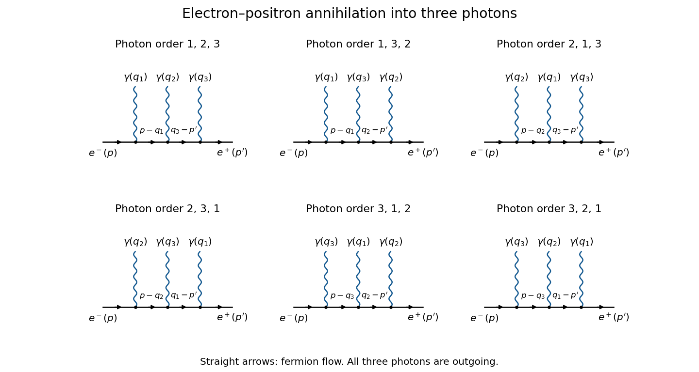

<h1 id="4/solution">Solution</h1>

↑ **Parent:** [4](../4.md)

The original PDF contains three algebraic misprints in this question. The second internal [four-momentum](../../../../../four-momentum.md) must consistently be $r'_k$, since it is defined by $r'_k=q_k-p'=r_i-q_j$. Its [Dirac propagator](../../../../../dirac-propagator.md) denominator is $(r'_k)^2-m^2$, including after contracting the first photon; the printed plus sign is incorrect. Finally, the middle-photon contraction must retain the mass term in both remaining [Dirac propagator](../../../../../dirac-propagator.md) numerators. The following calculation keeps the electron mass and proves the corrected identities.

Write $r=p-q_i$, $R=q_k-p'=r-q_j$ and introduce

$$
D(l)=\not l-m,\qquad F(l)=D(l)^{-1}=\frac{\not l+m}{l^2-m^2}.
$$

Here $F$ is the matrix part of the [Dirac propagator](../../../../../dirac-propagator.md), with the overall factors of $i$ kept in the common amplitude convention. The [Clifford algebra](../../../../../clifford-algebra.md) proves $D(l)F(l)=F(l)D(l)=I$. At tree level the intermediate lines here are off their [mass shell](../../../../../mass-shell.md), so this inverse can be used directly; the usual [Feynman i-epsilon prescription](../../../../../feynman-i-epsilon-prescription.md) defines its continuation at poles. With $C=(ie)^3$, the consistently routed tensor is

$$
T_{ijk}^{\mu\nu\sigma}=C\bar v(p')\gamma^\sigma F(R)\gamma^\nu F(r)\gamma^\mu u(p).
$$

The external [Dirac equations](../../../../../dirac-equation.md) are $(\not p-m)u(p)=0$ and $\bar v(p')(\not p'+m)=0$.

For the photon at the electron end, $\not q_i=\not p-\not r$ and hence $\not q_i u=-D(r)u$. Multiplication by $F(r)$ removes that internal line, giving

$$
\boxed{T_{ijk}^{\mu\nu\sigma}q_{i\mu}=-C\bar v(p')\gamma^\sigma F(R)\gamma^\nu u(p).}
$$

For the middle photon, $\not q_j=D(r)-D(R)$. Associativity, without any commuting of [gamma matrices](../../../../../gamma-matrices.md), gives

$$
F(R)\not q_j F(r)=F(R)D(r)F(r)-F(R)D(R)F(r)=F(R)-F(r).
$$

Therefore

$$
\boxed{T_{ijk}^{\mu\nu\sigma}q_{j\nu}=C\bar v(p')\gamma^\sigma\left[\frac{\not R+m}{R^2-m^2}-\frac{\not r+m}{r^2-m^2}\right]\gamma^\mu u(p).}
$$

Omitting the two mass numerators changes this expression by

$$
Cm\left[\frac1{R^2-m^2}-\frac1{r^2-m^2}\right]\bar v(p')\gamma^\sigma\gamma^\mu u(p),
$$

which need not vanish. For a concrete counterexample take $m=1$, $p=(2,0,0,\sqrt3)$, $p'= (2,0,0,-\sqrt3)$ and outgoing [photon](../../../../../photon.md) momenta $q_1=(1,1,0,0)$, $q_2=(6/5,2/5,4\sqrt2/5,0)$, $q_3=(9/5,-7/5,-4\sqrt2/5,0)$. All external momenta are [on shell](../../../../../on-shell.md) and conserve [four-momentum](../../../../../four-momentum.md). Choose the upper two-spinor $(1,0)^T$ for $u$ and the lower two-spinor $(1,0)^T$ for $v$, with the other blocks fixed by the [Dirac equations](../../../../../dirac-equation.md). For $(i,j,k)=(1,2,3)$ and $(\mu,\sigma)=(0,3)$, the correct middle contraction divided by $C$ is $1/3$, whereas the expression with the mass numerators omitted is $5/27$. Thus the printed middle identity is not valid for a massive [Electron](../../../../../electron.md).

At the positron end, $q_k=R+p'$. The adjoint [Dirac equation](../../../../../dirac-equation.md) gives $\bar v\not q_k=\bar v(\not R-m)=\bar vD(R)$, so the remaining requested contraction is

$$
\boxed{T_{ijk}^{\mu\nu\sigma}q_{k\sigma}=C\bar v(p')\gamma^\nu F(r)\gamma^\mu u(p).}
$$

The opposite signs at the two ends are precisely what makes the [Ward identity](../../../../../ward-identity.md) work.

There is one [Feynman diagram](../../../../../feynman-diagram.md) for each order in which the three outgoing [photons](../../../../../photon.md) attach to the electron line. Their orders, encountered from the incoming [Electron](../../../../../electron.md) to the incoming [Positron](../../../../../positron.md), are $(1,2,3)$, $(1,3,2)$, $(2,1,3)$, $(2,3,1)$, $(3,1,2)$ and $(3,2,1)$.

**[Figure 1](#4/image-the-six-tree-diagrams-for-electron-positron-annihilation-into-three-photons-ordered-along-fermion-flow). The six tree diagrams for electron-positron annihilation into three photons, ordered along fermion flow**.

The straight-line arrows indicate [fermion flow](../../../../../fermion-flow.md); the incoming [Positron](../../../../../positron.md) momentum is opposite to its line's [fermion flow](../../../../../fermion-flow.md). Each wavy branch is an outgoing [photon](../../../../../photon.md), and the order shown in a panel fixes the two internal [Dirac propagators](../../../../../dirac-propagator.md).

To prove the full [three-photon fermion Ward identity](../../../../../three-photon-fermion-ward-identity.md), replace the [photon polarization vector](../../../../../photon-polarization-vector.md) of one fixed photon $\ell$ by its [four-momentum](../../../../../four-momentum.md) $q_\ell$. Fix the order $(a,b)$ of the other two [photons](../../../../../photon.md) and write $\Gamma_a=\not\epsilon_a$, $\Gamma_b=\not\epsilon_b$. There are exactly three positions for photon $\ell$ relative to that order. By the three contractions just derived, their contributions, divided by $C$, are

$$
\begin{aligned}
(\ell,a,b):\quad&-\bar v\Gamma_b F(q_b-p')\Gamma_a u,\\
(a,\ell,b):\quad&\bar v\Gamma_b[F(q_b-p')-F(p-q_a)]\Gamma_a u,\\
(a,b,\ell):\quad&+\bar v\Gamma_b F(p-q_a)\Gamma_a u.
\end{aligned}
$$

[Four-momentum conservation](../../../../../four-momentum-conservation.md) $p+p'=q_\ell+q_a+q_b$ identifies the shared internal momenta in these expressions. The three terms cancel exactly. Repeating for the other order $(b,a)$ covers all six [Feynman diagrams](../../../../../feynman-diagram.md), and proves

$$
\boxed{\mathcal A(\epsilon_\ell\to q_\ell)=0\quad\text{for each }\ell=1,2,3.}
$$

Individual [Feynman diagrams](../../../../../feynman-diagram.md) generally fail this test; their complete sum is essential. By linearity in each [photon polarization vector](../../../../../photon-polarization-vector.md), the result also proves $\mathcal A(\epsilon_\ell+cq_\ell)=\mathcal A(\epsilon_\ell)$. **The amplitude is gauge invariant:** a pure-gauge external [photon](../../../../../photon.md) polarization decouples, and the physical [scattering amplitude](../../../../../scattering-amplitude.md) depends only on the two transverse [photon](../../../../../photon.md) polarizations. This is the tree-level [Ward identity](../../../../../ward-identity.md) for this process in [quantum electrodynamics](../../../../../quantum-electrodynamics.md).

## ↑ Ancestors (10)

1. [4](../4.md)
2. [Paper 62](../../paper-62-split.md)
3. [Iii](../../split.md)
4. [2002](../../../split.md)
5. [Past exam of the mathematics course of the University of Cambridge](../../../../split.md)
6. [Mathematics course of the University of Cambridge](../../../../../mathematics-course-of-the-university-of-cambridge.md)
7. [Course of the University of Cambridge](../../../../../course-of-the-university-of-cambridge.md)
8. [University of Cambridge](../../../../../university-of-cambridge-split.md)
9. [List of universities](../../../../../list-of-universities.md)
10. [Codex Wiki](../../../../../split.md)
