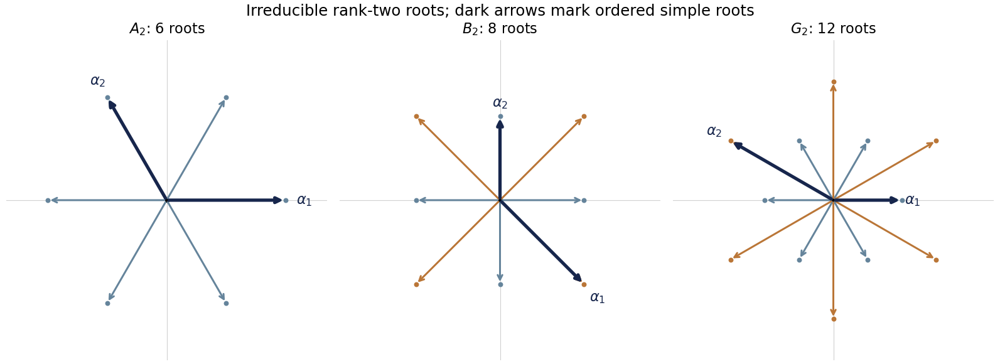

<h1 id="3/solution">Solution</h1>

↑ **Parent:** [3](../3.md)

For a [Cartan-Weyl basis](../../../../../cartan-weyl-basis.md), the [Jacobi identity](../../../../../jacobi-identity.md) gives

$$
[H_i,[E_\alpha,E_\beta]]=[[H_i,E_\alpha],E_\beta]+[E_\alpha,[H_i,E_\beta]]
=(\alpha_i+\beta_i)[E_\alpha,E_\beta].
$$

Thus the bracket has joint Cartan weight $\alpha+\beta$. If $\beta=-\alpha$, it belongs to the zero-weight space, which is the [Cartan subalgebra](../../../../../cartan-subalgebra.md), and so is a [linear combination](../../../../../linear-combination.md) $\widetilde\alpha_iH_i$. If $\alpha+\beta$ is a nonzero [root](../../../../../root-of-a-root-system.md), its [root space](../../../../../root-space.md) is one-dimensional and the bracket is proportional to $E_{\alpha+\beta}$. If that nonzero sum is not a [root](../../../../../root-of-a-root-system.md), the bracket vanishes. This proves the asserted forms without assuming every pair of [roots](../../../../../root-of-a-root-system.md) has a [root](../../../../../root-of-a-root-system.md) sum.

With the stated normalization, put $H_\alpha=2\alpha_iH_i/\alpha^2$. The commutators become

$$
[H_\alpha,E_\alpha]=2E_\alpha,\qquad [H_\alpha,E_{-\alpha}]=-2E_{-\alpha},\qquad
[E_\alpha,E_{-\alpha}]=H_\alpha.
$$

The adjoint relations make $J_3=H_\alpha/2$, $J_+=E_\alpha$, $J_-=E_{-\alpha}$ the usual [SU(2) Lie algebra](../../../../../su-2-lie-algebra.md) generators. Hence every finite-dimensional [SU(2)](../../../../../su-2-group.md) irreducible component has $J_3$ [eigenvalues](../../../../../eigenvalue.md) $m=-j,-j+1,\ldots,j$, with $2j$ an integer. Therefore **$H_\alpha$ has integer [eigenvalues](../../../../../eigenvalue.md) $2m$**, including in the finite-dimensional [Adjoint representation](../../../../../adjoint-representation-of-a-lie-algebra.md). Algebraically this is the [sl2 subalgebra associated with a root](../../../../../sl2-subalgebra-associated-with-a-root.md).

If $[H_\alpha,X_\lambda]=\lambda X_\lambda$, another use of the [Jacobi identity](../../../../../jacobi-identity.md) gives

$$
[H_\alpha,[E_\alpha,X_\lambda]]=(\lambda+2)[E_\alpha,X_\lambda].
$$

The bracket is therefore zero or lies in the [eigenvalue](../../../../../eigenvalue.md)-$\lambda+2$ space. Within one irreducible [SU(2)](../../../../../su-2-group.md) ladder it is proportional to the next chosen vector $X_{\lambda+2}$. If the full eigenspace has multiplicity, the weight statement is the general one; proportionality to one named vector presupposes the ladder choice. Similarly $E_{-\alpha}$ lowers this [eigenvalue](../../../../../eigenvalue.md) by two, and the ladder weights run from $-n$ to $n$ in steps of two.

For a [root vector](../../../../../root-vector.md) $E_\beta$, its $H_\alpha$ weight is

$$
m_{\alpha\beta}=\frac{2\alpha\cdot\beta}{\alpha^2}.
$$

The adjoint [SU(2)](../../../../../su-2-group.md) ladder therefore proves

$$
\boxed{\frac{2\alpha\cdot\beta}{\alpha^2}\in\mathbb Z.}
$$

For nonparallel $\alpha,\beta$, raising and lowering $E_\beta$ move its joint Cartan weight through the [root string](../../../../../root-string.md) $\beta+k\alpha$. The finite irreducible ladder has weights symmetric about zero. Starting at $m_{\alpha\beta}$, reaching its partner $-m_{\alpha\beta}$ requires $k=-m_{\alpha\beta}$. The corresponding nonzero vector lies in the [root space](../../../../../root-space.md) of $\beta-m_{\alpha\beta}\alpha$, proving the [Weyl reflection](../../../../../weyl-reflection.md) property:

$$
\boxed{s_\alpha(\beta)=\beta-\frac{2\alpha\cdot\beta}{\alpha^2}\alpha\text{ is a root}.}
$$

There is no zero joint [root](../../../../../root-of-a-root-system.md) in this string when $\alpha,\beta$ are nonparallel. Its one-dimensional [root spaces](../../../../../root-space.md) prevent two irreducible ladders with the same weight parity from overlapping, so the ladder argument applies to the entire string. For $\beta=\pm\alpha$, reflection simply interchanges the two opposite [roots](../../../../../root-of-a-root-system.md), which already exist by the adjoint relation.

For angle and length restrictions, set $p=2\alpha\cdot\beta/\alpha^2$ and $q=2\alpha\cdot\beta/\beta^2$. These [Cartan integers](../../../../../cartan-integer.md) have the same sign when nonzero and obey

$$
pq=4\cos^2\theta,\qquad \frac{\alpha^2}{\beta^2}=\frac qp.
$$

For nonparallel, nonorthogonal [roots](../../../../../root-of-a-root-system.md), $pq$ is an integer strictly between zero and four. The possibilities are consequently:

- $pq=1$: $|p|=|q|=1$, equal lengths, and $\theta=\pi/3$ or $2\pi/3$.
- $pq=2$: $\{|p|,|q|\}=\{1,2\}$, squared-length ratio $2$ or $1/2$, and $\theta=\pi/4$ or $3\pi/4$.
- $pq=3$: $\{|p|,|q|\}=\{1,3\}$, squared-length ratio $3$ or $1/3$, and $\theta=\pi/6$ or $5\pi/6$.

[Orthogonal](../../../../../orthogonal-vectors.md) [roots](../../../../../root-of-a-root-system.md) have $p=q=0$ and $\theta=\pi/2$. Parallel [roots](../../../../../root-of-a-root-system.md) have $pq=4$; the integer pairs would allow only length multiples $1,2,1/2$. The stated reducedness condition excludes the latter two, so parallel [roots](../../../../../root-of-a-root-system.md) are equal or opposite, with angles zero or $\pi$ and equal lengths. Thus

$$
\boxed{\theta\in\{0,\pi/6,\pi/4,\pi/3,\pi/2,2\pi/3,3\pi/4,5\pi/6,\pi\}.}
$$

Not every [root system](../../../../../root-system.md) realizes every listed angle.

The [orthogonal](../../../../../orthogonal-vectors.md) pair alone gives no ratio through $q/p$. To finish the length restriction for a [simple Lie algebra](../../../../../simple-lie-algebra.md), use irreducibility of its [root system](../../../../../root-system.md). Let $U$ span the [Weyl group](../../../../../weyl-group.md) orbit of $\alpha$. Both $U$ and $U^\perp$ are invariant under the [orthogonal](../../../../../orthogonal-vectors.md) [root reflections](../../../../../root-reflection.md). If a [root](../../../../../root-of-a-root-system.md) had nonzero projections in both, reflection of its projection in $U$ would have a nonzero $U^\perp$ component, violating invariance. Hence every [root](../../../../../root-of-a-root-system.md) is entirely in one of these subspaces. A proper nonzero $U$ would split the [root system](../../../../../root-system.md) into two [orthogonal](../../../../../orthogonal-vectors.md) parts, contradicting irreducibility. This proves that the [Weyl orbit spans an irreducible root space](../../../../../weyl-orbit-spans-an-irreducible-root-space.md).

In particular, some orbit [root](../../../../../root-of-a-root-system.md) $\gamma$ is nonorthogonal to any chosen $\beta$, and $\gamma^2=\alpha^2$. Applying the previous integer-pair restriction to $\gamma,\beta$ therefore also handles [orthogonal](../../../../../orthogonal-vectors.md) $\alpha,\beta$:

$$
\boxed{\frac{\alpha^2}{\beta^2}\in\{1,2,1/2,3,1/3\}.}
$$

There can be at most two different [root](../../../../../root-of-a-root-system.md) lengths: three lengths would have ratios two and three relative to the shortest, but then the longest-to-middle squared-length ratio would be $3/2$, which is forbidden. A reducible collection of [orthogonal](../../../../../orthogonal-vectors.md) rank-one factors could have independently chosen scales; the simple-algebra assumption excludes that exception.

Choose a generic linear functional to define [positive roots](../../../../../positive-root.md). The [simple roots](../../../../../simple-root.md) are those positive [roots](../../../../../root-of-a-root-system.md) which cannot be written as sums of two positive [roots](../../../../../root-of-a-root-system.md); they form a basis in which all [root](../../../../../root-of-a-root-system.md) coefficients are integers of one sign. Distinct simple [roots](../../../../../root-of-a-root-system.md) have nonpositive inner product: if their inner product were positive, their [root](../../../../../root-of-a-root-system.md) string would contain their difference, and whichever difference is positive would decompose one of them. In rank two, irreducibility excludes the [orthogonal](../../../../../orthogonal-vectors.md) case. The allowed simple-[root](../../../../../root-of-a-root-system.md) angles are therefore $120^\circ,135^\circ,150^\circ$, giving the three irreducible diagrams in the [classification of rank-two root systems](../../../../../classification-of-rank-two-root-systems.md): [A2 root system](../../../../../a2-root-system.md), [B2 root system](../../../../../b2-root-system.md) and [G2 root system](../../../../../g2-root-system.md). Reflections in the two simple [roots](../../../../../root-of-a-root-system.md) generate their respective six, eight and twelve [roots](../../../../../root-of-a-root-system.md).

Here are explicit simple-[root](../../../../../root-of-a-root-system.md) choices and positive [roots](../../../../../root-of-a-root-system.md); adding their negatives gives each complete diagram.

- For [A2 root system](../../../../../a2-root-system.md), take $\alpha_1=(1,0)$ and $\alpha_2=(-1/2,\sqrt3/2)$. The positive [roots](../../../../../root-of-a-root-system.md) are $\alpha_1,\alpha_2,\alpha_1+\alpha_2$; all have squared length one.
- For [B2 root system](../../../../../b2-root-system.md), take the long $\alpha_1=(1,-1)$ and short $\alpha_2=(0,1)$. The positive [roots](../../../../../root-of-a-root-system.md) are $\alpha_1,\alpha_2,\alpha_1+\alpha_2,\alpha_1+2\alpha_2$. These give the four axis [roots](../../../../../root-of-a-root-system.md) and four diagonal [roots](../../../../../root-of-a-root-system.md), with squared lengths one and two. The rank-two $C_2$ [Lie algebra](../../../../../lie-algebra-split.md) is isomorphic to this one; changing the long/short ordering changes its Cartan presentation.
- For [G2 root system](../../../../../g2-root-system.md), take short $\alpha_1=(1,0)$ and long $\alpha_2=(-3/2,\sqrt3/2)$. The positive [roots](../../../../../root-of-a-root-system.md) are $\alpha_1,\alpha_2,\alpha_1+\alpha_2,2\alpha_1+\alpha_2,3\alpha_1+\alpha_2,3\alpha_1+2\alpha_2$. They give two hexagons rotated by $30^\circ$, with squared lengths one and three.

The nonnegative coefficients in each positive-[root](../../../../../root-of-a-root-system.md) list verify the chosen [simple roots](../../../../../simple-root.md) explicitly. The [orthogonal](../../../../../orthogonal-vectors.md) four-[root system](../../../../../root-system.md) $A_1\times A_1$ is rank two but reducible, so it is not a diagram for the simple algebra assumed here.

Define the [Cartan matrix](../../../../../cartan-matrix.md) in the column-coroot convention:

$$
C_{ij}=\langle\alpha_i,\alpha_j^\vee\rangle=\frac{2\alpha_i\cdot\alpha_j}{\alpha_j^2},\qquad
[H_{\alpha_j},E_{\alpha_i}]=C_{ij}E_{\alpha_i}.
$$

Using the ordered [roots](../../../../../root-of-a-root-system.md) above gives

$$
\boxed{C_{A_2}=\begin{pmatrix}2&-1\\-1&2\end{pmatrix},\qquad
C_{B_2}=\begin{pmatrix}2&-2\\-1&2\end{pmatrix},\qquad
C_{G_2}=\begin{pmatrix}2&-1\\-3&2\end{pmatrix}.}
$$

The alternative row-coroot convention transposes these [matrices](../../../../../matrix.md). Stating the convention and [root](../../../../../root-of-a-root-system.md) ordering avoids a spurious disagreement in the unequal-length cases.

**[Figure 1](#3/image-the-irreducible-rank-two-root-systems-a2-b2-and-g2-with-long-and-short-roots-and-explicit-ordered-simple-roots-highlighted). The irreducible rank-two root systems A2, B2 and G2, with long and short roots and explicit ordered simple roots highlighted**.

## ↑ Ancestors (10)

1. [3](../3.md)
2. [Paper 63](../../paper-63-split.md)
3. [Iii](../../split.md)
4. [2002](../../../split.md)
5. [Past exam of the mathematics course of the University of Cambridge](../../../../split.md)
6. [Mathematics course of the University of Cambridge](../../../../../mathematics-course-of-the-university-of-cambridge.md)
7. [Course of the University of Cambridge](../../../../../course-of-the-university-of-cambridge.md)
8. [University of Cambridge](../../../../../university-of-cambridge-split.md)
9. [List of universities](../../../../../list-of-universities.md)
10. [Codex Wiki](../../../../../split.md)
