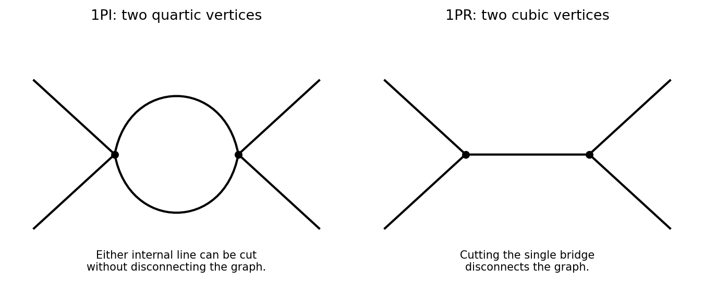

<h1 id="1/solution">Solution</h1>

↑ **Parent:** [1](../1.md)

Use [metric signature](../../../../../metric-signature.md) $(+,-,\ldots,-)$ and initially set $\hbar=1$. For an internal scalar line with [momentum](../../../../../momentum.md) $p$, the [Feynman propagator](../../../../../feynman-propagator.md) is $i/(p^2-m^2+i0)$. An $r$-leg [Feynman vertex](../../../../../interaction-vertex.md), for $r=3,4,6$, contributes $-i\lambda_r$, with all incident momenta incoming. Its $1/r!$ in the [Lagrangian density](../../../../../lagrangian-density.md) is canceled by the permutations of its identical fields. Each vertex conserves [momentum](../../../../../momentum.md) and supplies $(2\pi)^d\delta^{(d)}(\sum p)$. Integrate each independent [loop momentum](../../../../../loop-momentum.md) with $d^dk/(2\pi)^d$, multiply the line and vertex factors, and divide by the [Feynman-diagram symmetry factor](../../../../../feynman-diagram-symmetry-factor.md) for labeled external legs. Sum the distinct graphs and external-momentum assignments without counting the same assignment twice.

An unamputated momentum-space [correlation function](../../../../../correlation-function.md) also contains the external [propagators](../../../../../propagator.md). Dividing the [generating functional](../../../../../generating-functional.md) by its zero-source value removes disconnected vacuum bubbles; taking its logarithm selects [connected correlation functions](../../../../../connected-correlation-function.md). [Amputation of external propagators](../../../../../amputation-of-external-propagators.md) removes the external line factors when computing vertex amplitudes. Translational invariance leaves one overall momentum-conservation delta function for each connected graph.

The [loop order](../../../../../loop-order.md) is the number of independent graph cycles, equivalently the number of independent momentum integrations left after vertex conservation. A spanning tree through $V$ interaction vertices contains $V-1$ internal edges; hence, with $I$ internal lines,

$$
\boxed{L=I-V+1.}
$$

Restoring $\hbar$ in $\exp(iS/\hbar)$ gives $\hbar$ for each internal [propagator](../../../../../propagator.md) and $\hbar^{-1}$ for each interaction vertex. Thus an amputated connected amplitude has

$$
\boxed{\hbar^{I-V}=\hbar^{L-1}.}
$$

The same counting holds for a diagram in $\log Z[J]$ when the [external source](../../../../../source-quantum-field-theory.md) is coupled as $J\phi/\hbar$: every external propagator brings $\hbar$, canceled by the source insertion's $\hbar^{-1}$. This is [Planck-constant loop counting with source normalization](../../../../../planck-constant-loop-counting-with-source-normalization.md). An ordinary connected expectation of $n$ fields, with no such source factors, instead scales as $\hbar^{L+n-1}$; multiplying $\log Z$ by $-i\hbar$ to form $W$ shifts its source-kernel counting to $\hbar^L$. The normalization must be specified when applying the printed loop rule.

Let $V_r$ count $r$-valent interaction vertices. Counting their incident half-edges gives $2I+n=3V_3+4V_4+6V_6$. Substituting the loop identity yields

$$
L-1+\frac n2=\frac12V_3+V_4+2V_6,
\qquad V=V_3+V_4+V_6.
$$

Each coefficient on the right lies between $1/2$ and $2$, proving the [vertex-count bounds for bounded scalar valence](../../../../../vertex-count-bounds-for-bounded-scalar-valence.md)

$$
\boxed{\frac V2\le L-1+\frac n2\le2V.}
$$

The free two-point term, which has no interaction vertex, separately satisfies the bounds with $V=L=0$ and $n=2$.

A [one-particle-irreducible Feynman diagram](../../../../../one-particle-irreducible-feynman-diagram.md) is connected and remains connected after any single internal line is cut. The left graph below contains two quartic vertices and two parallel internal lines: cutting either line leaves the vertices connected by the other. The right graph contains two cubic vertices joined by one internal line, whose removal disconnects it, so it is a [one-particle-reducible Feynman diagram](../../../../../one-particle-reducible-feynman-diagram.md). Both have four external legs.

**[Figure 1](#1/image-one-particle-irreducible-quartic-loop-and-one-particle-reducible-cubic-exchange-with-four-external-legs). One-particle-irreducible quartic loop and one-particle-reducible cubic exchange with four external legs**.

The [quantum effective action](../../../../../effective-action.md) generates the [one-particle-irreducible vertices](../../../../../one-particle-irreducible-vertex.md). Their ultraviolet divergences and those of their proper divergent subgraphs are removed by local [counterterms](../../../../../counterterm.md). Reducible connected graphs are reconstructed by joining these vertices with full [propagators](../../../../../propagator.md); they do not introduce independent local interaction counterterms merely because they contain bridges. This makes the [one-particle-irreducible Feynman diagram](../../../../../one-particle-irreducible-feynman-diagram.md) decomposition useful for organizing [renormalization](../../../../../renormalization.md). Overall [power counting](../../../../../power-counting-in-quantum-field-theory.md) still has to be supplemented by subtraction of divergent subgraphs.

For a scalar with a two-derivative kinetic term, [mass dimensions](../../../../../mass-dimension.md) obey

$$
[\phi]=\frac{d-2}{2},\qquad
[\lambda_r]=d-r\frac{d-2}{2}.
$$

The general power-counting criterion used here is that interactions of nonnegative coupling dimension can be included in a perturbatively [renormalizable quantum field theory](../../../../../renormalizable-quantum-field-theory.md), with all symmetry-allowed required local counterterms included; negative-dimensional couplings generally require an unbounded tower of higher-dimensional counterterms. Indeed, the [scalar graph power-counting identity](../../../../../scalar-graph-power-counting-identity.md) gives

$$
D=d-\frac{d-2}{2}n-\sum_{r=3,4,6}[\lambda_r]V_r
$$

for the [superficial degree of divergence](../../../../../superficial-degree-of-divergence.md). Nonnegative coupling dimensions prevent this degree from increasing indefinitely with the vertex count.

The coupling dimensions are

$$
\begin{array}{c|ccc|c}
d&[\lambda_3]&[\lambda_4]&[\lambda_6]&\text{allowed displayed interactions}\\\hline
3&3/2&1&0&\phi^3,\phi^4,\phi^6\\
4&1&0&-2&\phi^3,\phi^4\\
6&0&-2&-6&\phi^3
\end{array}
$$

Thus **all three are power-counting renormalizable in three dimensions; cubic and quartic in four; cubic only in six**. Positive-dimensional interactions are super-renormalizable, while the zero-dimensional ones are marginal by classical [power counting](../../../../../power-counting-in-quantum-field-theory.md). Usual kinetic, mass, vacuum and, when no symmetry forbids it, linear counterterms must also be admitted. This conclusion concerns perturbative ultraviolet [renormalizability](../../../../../renormalizable-quantum-field-theory.md); it does not assert global stability of a cubic scalar potential.

## ↑ Ancestors (10)

1. [1](../1.md)
2. [Paper 65](../../paper-65-split.md)
3. [Iii](../../split.md)
4. [2002](../../../split.md)
5. [Past exam of the mathematics course of the University of Cambridge](../../../../split.md)
6. [Mathematics course of the University of Cambridge](../../../../../mathematics-course-of-the-university-of-cambridge.md)
7. [Course of the University of Cambridge](../../../../../course-of-the-university-of-cambridge.md)
8. [University of Cambridge](../../../../../university-of-cambridge-split.md)
9. [List of universities](../../../../../list-of-universities.md)
10. [Codex Wiki](../../../../../split.md)
