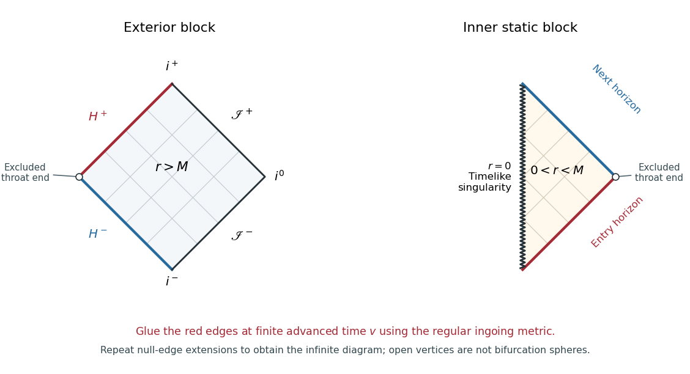

<h1 id="4/solution">Solution</h1>

↑ **Parent:** [4](../4.md)

Take $M=|Q|>0$ and use $G=c=1$. The case $M=Q=0$ is flat spacetime and is not a black hole. In the nontrivial extremal [Reissner-Nordstrom metric](../../../../../reissner-nordstrom-spacetime.md),

$$
ds^2=-f(r)dt^2+f(r)^{-1}dr^2+r^2d\Omega^2,\qquad
f(r)=\left(1-\frac Mr\right)^2.
$$

The horizon is a double zero at $r=M$, with [surface gravity](../../../../../surface-gravity.md) $\kappa=f'(M)/2=0$. The function $f$ is positive on both sides of the horizon. Thus the intermediate nonstatic region of a nonextremal charged hole disappears; one must not draw that region as a strip of nonzero width in the extremal [Penrose diagram](../../../../../penrose-diagram.md).

To construct the [Penrose diagram](../../../../../penrose-diagram.md), first integrate the radial [tortoise coordinate](../../../../../tortoise-coordinate.md):

$$
\frac{dr_*}{dr}=\frac1f,\qquad
r_*=r-M+2M\log\left|\frac rM-1\right|-\frac{M^2}{r-M}.
$$

The additive constant has been chosen so that $r_*(0)=0$ in the inner block. In the exterior, $r_*\to-\infty$ at $M^+$ and $r_*\to+\infty$ at infinity. In the inner static region $0<r<M$, it increases from $0$ to $+\infty$. Set $u=t-r_*$ and $v=t+r_*$. The radial metric is $-f\,du\,dv$, so its radial null directions are $u=\mathrm{constant}$ and $v=\mathrm{constant}$.

Compactify each static block using

$$
U=\arctan(u/M),\qquad V=\arctan(v/M),\qquad
T=\frac{V+U}{2},\quad X=\frac{V-U}{2}.
$$

This [conformal compactification](../../../../../conformal-compactification.md) puts radial [null geodesics](../../../../../null-geodesic.md) at $45$ degrees. The exterior is a diamond: its right-hand edges are past and [future null infinity](../../../../../future-null-infinity.md), while its left-hand edges are the past and future degenerate horizons. At the left vertex, finite static $t$ and $r\to M^+$ give $u\to+\infty$, $v\to-\infty$. This is an end of the infinite spatial throat, not a regular [bifurcation surface](../../../../../bifurcation-surface.md) where the two horizon branches meet. A [degenerate Killing horizon](../../../../../degenerate-killing-horizon.md) has no such bifurcation sphere. The inner block occupies the half-diamond $X>0$, because $r_*>0$ there. Its vertical edge $X=0$ is the timelike [curvature singularity](../../../../../curvature-singularity.md) $r=0$; its two diagonal edges are the two horizon branches at $r=M$. Its outer vertex likewise represents an excluded infinite-throat end.

The static-coordinate compactification identifies the blocks but does not by itself establish the smooth horizon extension. For that, use [Ingoing Eddington-Finkelstein coordinates](../../../../../ingoing-eddington-finkelstein-coordinates.md) on the future horizon:

$$
v=t+r_*,\qquad ds^2=-f\,dv^2+2\,dv\,dr+r^2d\Omega^2.
$$

Its radial determinant is $-1$, so it is nonsingular at $r=M$. Glue the exterior future edge, $u\to+\infty$ with $v$ finite, to the inner past edge, $u\to-\infty$ with the same finite $v$. The outgoing coordinate $u$ similarly gives $ds^2=-f\,du^2-2\,du\,dr+r^2d\Omega^2$ and extends the other horizon branch. Continue adjoining these regular blocks across every extendible null edge. The construction repeats indefinitely to the future and past, producing the maximal analytic diagram with infinitely many asymptotic exterior regions and inner static regions bounded by timelike singularities. Horizons are null edges, never the excluded throat vertices. Identical edges in different copies must be glued with their time orientations preserved; they are not all the same exterior infinity.

**[Figure 1](#4/image-exterior-and-inner-penrose-building-blocks-of-an-extremal-charged-black-hole-the-marked-edges-glue-in-ingoing-coordinates-and-open-circles-are-excluded-throat-ends). Exterior and inner Penrose building blocks of an extremal charged black hole; the marked edges glue in ingoing coordinates and open circles are excluded throat ends**.

The figure shows the two building blocks, rather than compressing the whole infinite extension into a misleading finite diagram. The red edges glue across a future horizon at finite advanced time. Outgoing coordinates extend the next edge to another exterior copy. The thin diagonal lines illustrate the radial light-cone directions.

For spatially conformally flat coordinates, compare the radial and angular parts of $f^{-1}dr^2+r^2d\Omega^2$ with $V(\rho)^2(d\rho^2+\rho^2d\Omega^2)$. The angular coefficient requires $V\rho=r$, and the radial coefficient then gives, in the exterior,

$$
\frac{d\rho}{\rho}=\frac{dr}{r\sqrt f}=\frac{dr}{r-M}.
$$

Choose the integration constant to make $\rho=r-M$ and $V\to1$ at infinity. In Cartesian coordinates $x=\rho\sin\theta\cos\varphi$, $y=\rho\sin\theta\sin\varphi$, $z=\rho\cos\theta$, put $\rho=\sqrt{x^2+y^2+z^2}$. The [Extremal Reissner-Nordstrom isotropic coordinates](../../../../../extremal-reissner-nordstrom-isotropic-coordinates.md) give

$$
\boxed{V=1+\frac M\rho,\qquad W=\left(1+\frac M\rho\right)^{-1},\qquad
 ds^2=-H^{-2}dt^2+H^2(dx^2+dy^2+dz^2),\quad H=1+M/\rho.}
$$

These coordinates have $\rho>0$ and describe the exterior only. The locus $\rho=0$ is the limit $r=M$, not an ordinary point included in this chart. An independent inner chart is obtained with $\rho=M-r$, $0<\rho<M$, giving $V=M/\rho-1$ and $W=(M/\rho-1)^{-1}$; it must be attached using the regular null coordinates, not by continuing the exterior radial coordinate through a Cartesian origin.

The infinite proper distance is real. Along a constant-$t$ exterior radius,

$$
L(\varepsilon,\rho_0)=\int_\varepsilon^{\rho_0}\left(1+\frac M\rho\right)d\rho
=\rho_0-\varepsilon+M\log(\rho_0/\varepsilon)\longrightarrow\infty.
$$

It is a property of a static spacelike slice. It does not bound the [proper time](../../../../../proper-time.md) of a freely falling observer. Indeed, a neutral radial timelike [geodesic](../../../../../geodesic.md) has conserved energy per unit rest mass $E=f\dot t>0$ and normalization $-f\dot t^2+f^{-1}\dot r^2=-1$, giving

$$
\dot r^2=E^2-f,\qquad \dot r=-\sqrt{E^2-f}.
$$

At the horizon $\dot r\to-E$, so the remaining [proper time](../../../../../proper-time.md) is finite. Moreover,

$$
\dot v=\frac{E+\dot r}{f}=\frac1{E+\sqrt{E^2-f}}\longrightarrow\frac1{2E}.
$$

The observer crosses the regular future horizon with finite $v$ and finite proper time. This is the [Extremal Reissner-Nordstrom causal crossing](../../../../../extremal-reissner-nordstrom-causal-crossing.md), which the singular static time coordinate conceals.

There is also a direct causal test for the [event horizon](../../../../../event-horizon.md). Inside the future horizon, outgoing radial null curves in the ingoing chart satisfy $dr/dv=f/2$. To reach $r=M$ from below they would require

$$
v-v_0=2\int_{r_0}^{r}\frac{ds}{f(s)}\longrightarrow+\infty\quad\text{as }r\to M^-.
$$

Near the horizon, $M-r\sim2M^2/v$. A future timelike or nonradial null curve cannot increase $r$ faster than the outgoing radial null curve, since $ds^2\le0$ and $\dot v>0$ imply $dr/dv\le f/2$ after dropping the nonnegative angular term. Hence a signal that crossed inward cannot return to the original exterior's [future null infinity](../../../../../future-null-infinity.md). Curves can encounter other blocks in the maximal analytic extension, but their infinities are not the original observer's infinity. Relative to that asymptotic end, $r=M$ is the boundary of the causal past of future null infinity: it is an [event horizon](../../../../../event-horizon.md).

Finally, the [Reissner-Nordstrom trapped spheres](../../../../../reissner-nordstrom-trapped-spheres.md) test explains why the proposed observation is unsurprising. Normalize future radial null normals by $\ell=\partial_v+(f/2)\partial_r$, $n=-\partial_r$, with $g(\ell,n)=-1$. The round-sphere [null expansions](../../../../../null-expansion.md) are

$$
\theta_\ell=\frac{f}{r}\ge0,\qquad \theta_n=-\frac2r<0.
$$

There is no region of strictly future-trapped round spheres, while the horizon spheres are marginal with $\theta_\ell=0$. Absence of those particular [trapped surfaces](../../../../../trapped-surface.md) does not imply absence of an [event horizon](../../../../../event-horizon.md). The geometry has a nonzero horizon area $4\pi M^2$ and a genuine timelike singularity at $r=0$ in its extension. **The infinite static throat does not remove the black hole: infall crosses its horizon in finite proper time, and no signal returns to the same exterior infinity.**

## ↑ Ancestors (10)

1. [4](../4.md)
2. [Paper 73](../../paper-73-split.md)
3. [Iii](../../split.md)
4. [2002](../../../split.md)
5. [Past exam of the mathematics course of the University of Cambridge](../../../../split.md)
6. [Mathematics course of the University of Cambridge](../../../../../mathematics-course-of-the-university-of-cambridge.md)
7. [Course of the University of Cambridge](../../../../../course-of-the-university-of-cambridge.md)
8. [University of Cambridge](../../../../../university-of-cambridge-split.md)
9. [List of universities](../../../../../list-of-universities.md)
10. [Codex Wiki](../../../../../split.md)
