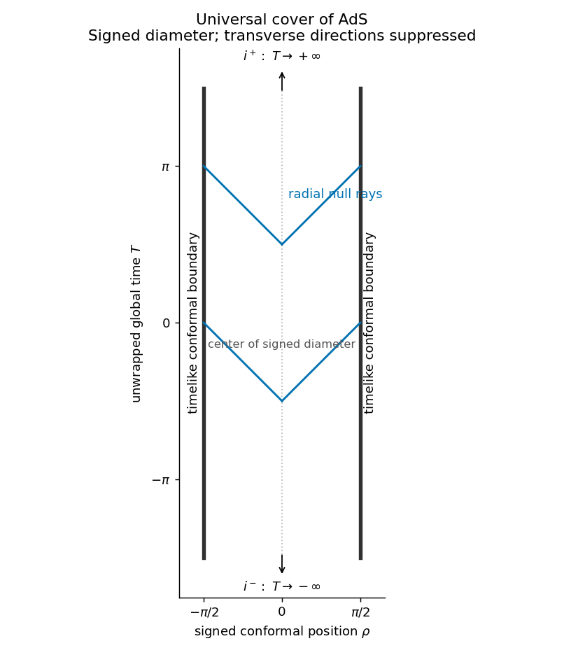

<h1 id="3/a/solution">Solution</h1>

↑ **Parent:** [A](../a.md)

Take the causally unwrapped [universal cover](../../../../../../universal-cover.md) of [Anti-de Sitter spacetime](../../../../../../anti-de-sitter-spacetime.md), with curvature radius $L$. In global coordinates,

$$
ds^2=\frac{L^2}{\cos^2\rho}\bigl[-dT^2+d\rho^2+\sin^2\rho\,d\Omega_{d-2}^2\bigr],
\qquad 0\le\rho<\pi/2,\quad T\in\mathbb R.
$$

The ordinary radial [Penrose diagram](../../../../../../penrose-diagram.md) is a half-strip: the left edge $\rho=0$ is a regular center and the right edge $\rho=\pi/2$ is a timelike [conformal boundary](../../../../../../conformal-boundary.md). For displaying signed spatial motion, the figure doubles the radial diameter to $-\pi/2<\rho<\pi/2$. Its two ends represent antipodal spatial directions of the higher-dimensional boundary; they are not a claim that the full AdS boundary has two disconnected components.

**[Figure 1](#3/a/image-conformal-strip-of-the-universal-cover-of-anti-de-sitter-spacetime-with-timelike-conformal-boundaries-and-past-future-timelike-ends). Conformal strip of the universal cover of anti-de Sitter spacetime, with timelike conformal boundaries and past/future timelike ends**.

The vertical edges are spatial infinity at every finite global time, forming the timelike boundary $\mathbb R\times S^{d-2}$. The arrows mark the future and past timelike ends $T\to\pm\infty$, conventionally $i^+$ and $i^-$. There are **no separate null-infinity edges like Minkowski $\mathscr I^\pm$**: radial null rays satisfy $dT=\pm d\rho$ and reach the timelike boundary in finite global time. Their physical affine parameter is nevertheless infinite there. The drawing is a finite excerpt of an infinitely tall strip, not an identification of its top and bottom. On the original hyperboloid global time is periodic and there are [closed timelike curves](../../../../../../closed-timelike-curve.md); unwrapping it is essential to the usual physical maximally extended AdS spacetime.

## ↑ Ancestors (11)

1. [A](../a.md)
2. [3](../../3.md)
3. [Paper 75](../../../paper-75-split.md)
4. [Iii](../../../split.md)
5. [2002](../../../../split.md)
6. [Past exam of the mathematics course of the University of Cambridge](../../../../../split.md)
7. [Mathematics course of the University of Cambridge](../../../../../../mathematics-course-of-the-university-of-cambridge.md)
8. [Course of the University of Cambridge](../../../../../../course-of-the-university-of-cambridge.md)
9. [University of Cambridge](../../../../../../university-of-cambridge-split.md)
10. [List of universities](../../../../../../list-of-universities.md)
11. [Codex Wiki](../../../../../../split.md)
