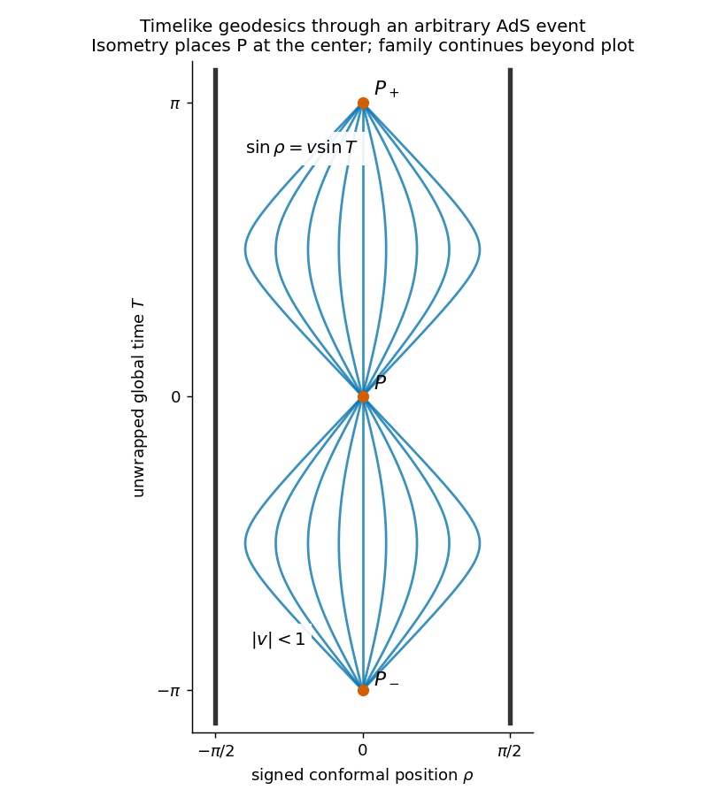

<h1 id="3/d/solution">Solution</h1>

↑ **Parent:** [D](../d.md)

In the ambient space of signature $(-,-,+,\ldots,+)$, AdS is $X\cdot X=-L^2$. Let an arbitrary event have embedding vector $X_P$, and let $V_P$ be any future unit timelike tangent, so

$$
X_P\cdot V_P=0,\qquad V_P\cdot V_P=-1.
$$

The complete family through that event is

$$
\boxed{X(s)=X_P\cos(s/L)+LV_P\sin(s/L).}
$$

Direct substitution gives $X^2=-L^2$ and $\dot X^2=-1$. Its ambient acceleration is $\ddot X=-X/L^2$, normal to the hyperboloid, so its tangential covariant acceleration vanishes. This proves that $s$ is [proper time](../../../../../../proper-time.md) and that each curve is a [timelike geodesic](../../../../../../timelike-geodesic.md), rather than just guessing sinusoidal tracks from the diagram.

An AdS isometry can place any chosen $P$ at $T=\rho=0$. Rotate the spatial direction into the displayed signed diameter. Write the initial local velocity as $v=\tanh\chi$, with $|v|<1$. Then $X_{-1}=L\cos(s/L)$, $X_0=L\cosh\chi\sin(s/L)$ and $X_1=L\sinh\chi\sin(s/L)$. Eliminating $s$ using the global coordinates gives

$$
\boxed{\sin\rho=v\sin T,\qquad |v|<1.}
$$

Varying the speed gives the drawn family; suppressed spatial directions can be restored by varying the tangent direction. It represents all timelike initial directions after the isometry and spatial rotations.

**[Figure 2](#3/d/image-timelike-geodesics-through-an-arbitrary-ads-event-placed-at-the-center-by-an-isometry-refocusing-at-later-antipodal-events). Timelike geodesics through an arbitrary AdS event, placed at the center by an isometry, refocusing at later antipodal events**.

Every finite-speed curve turns before the conformal boundary. At proper time $\pi L$, all reach $-X_P$; at $2\pi L$ their ambient coordinates return to $X_P$. This is [Anti-de Sitter timelike geodesic refocusing](../../../../../../anti-de-sitter-timelike-geodesic-refocusing.md). On the [universal cover](../../../../../../universal-cover.md) the global time has advanced by $\pi$ and $2\pi$, respectively, so these are later events. They are not closed timelike curves. The limits $|v|\to1$ approach the null directions and are not timelike members of the family.

## ↑ Ancestors (11)

1. [D](../d.md)
2. [3](../../3.md)
3. [Paper 75](../../../paper-75-split.md)
4. [Iii](../../../split.md)
5. [2002](../../../../split.md)
6. [Past exam of the mathematics course of the University of Cambridge](../../../../../split.md)
7. [Mathematics course of the University of Cambridge](../../../../../../mathematics-course-of-the-university-of-cambridge.md)
8. [Course of the University of Cambridge](../../../../../../course-of-the-university-of-cambridge.md)
9. [University of Cambridge](../../../../../../university-of-cambridge-split.md)
10. [List of universities](../../../../../../list-of-universities.md)
11. [Codex Wiki](../../../../../../split.md)
