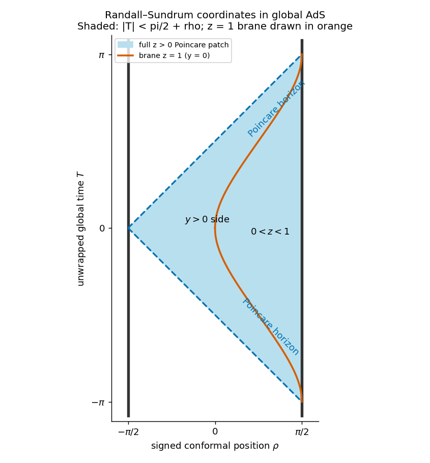

<h1 id="3/e/solution">Solution</h1>

↑ **Parent:** [E](../e.md)

Set $z=e^y$. The metric becomes

$$
ds^2=z^{-2}\bigl[dz^2-dt^2+d\mathbf x^2\bigr],\qquad z>0,
$$

so these are [Poincare coordinates on anti-de Sitter spacetime](../../../../../../poincare-coordinates-on-anti-de-sitter-spacetime.md) with unit curvature radius. They cover one patch, not the whole global extension.

On the two-dimensional section with the three transverse $x_i$ suppressed, choose embedding coordinates $X_{-1}=\sec\rho\cos T$, $X_0=\sec\rho\sin T$, $X_d=\tan\rho$. The Poincaré transformation is

$$
\boxed{z=\frac{\cos\rho}{\cos T+\sin\rho},\qquad
 t=\frac{\sin T}{\cos T+\sin\rho}.}
$$

Choose the connected component containing $T=\rho=0$. Its denominator is positive, giving

$$
\boxed{-\pi/2<\rho<\pi/2,\qquad |T|<\pi/2+\rho.}
$$

Its two sloping edges are [Poincaré horizons](../../../../../../poincare-horizon.md), null coordinate boundaries at $z\to\infty$. The right vertical edge is the $z\to0$ timelike conformal boundary. Substituting the transformation into $z^{-2}(dz^2-dt^2)$ gives $\sec^2\rho(d\rho^2-dT^2)$, verifying the chart and its null edges.

**[Figure 3](#3/e/image-the-randall-sundrum-poincare-patch-inside-global-ads-with-null-patch-horizons-and-the-reference-brane-z-1). The Randall-Sundrum Poincaré patch inside global AdS, with null patch horizons and the reference brane z=1**.

The full coordinates in this part have $y\in\mathbb R$, hence the whole shaded $z>0$ patch. If one additionally retains only the Randall–Sundrum bulk $y\ge0$ as in Question4, keep $z\ge1$. The brane $y=0$, or $z=1$, has $\cos T=\cos\rho-\sin\rho$ and is drawn in orange; the retained side contains $T=0$, $\rho<0$. A patch horizon is not a curvature singularity or the timelike conformal boundary. A geodesic can cross it in finite proper time while the patch coordinate $t$ diverges.

## ↑ Ancestors (11)

1. [E](../e.md)
2. [3](../../3.md)
3. [Paper 75](../../../paper-75-split.md)
4. [Iii](../../../split.md)
5. [2002](../../../../split.md)
6. [Past exam of the mathematics course of the University of Cambridge](../../../../../split.md)
7. [Mathematics course of the University of Cambridge](../../../../../../mathematics-course-of-the-university-of-cambridge.md)
8. [Course of the University of Cambridge](../../../../../../course-of-the-university-of-cambridge.md)
9. [University of Cambridge](../../../../../../university-of-cambridge-split.md)
10. [List of universities](../../../../../../list-of-universities.md)
11. [Codex Wiki](../../../../../../split.md)
