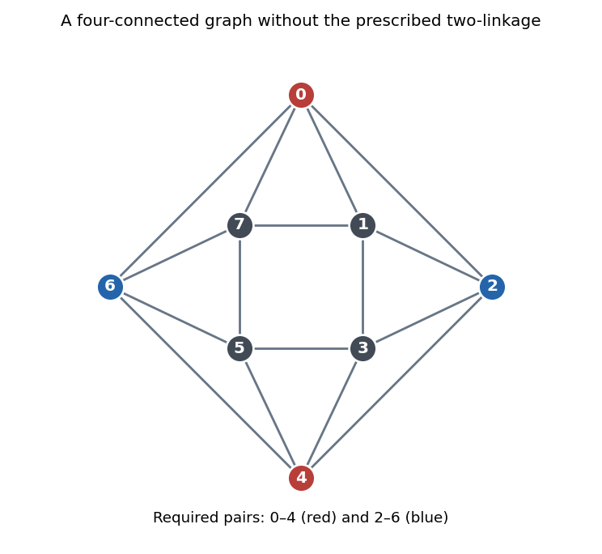

# Paper 9

↑ **Parent:** [Iii](../iii.md)

[https://www.maths.cam.ac.uk/postgrad/part-iii/files/pastpapers/2002/Paper9.pdf](https://www.maths.cam.ac.uk/postgrad/part-iii/files/pastpapers/2002/Paper9.pdf)

**Table of contents**

- [1](#1)
  - [Solution](#1/solution)
- [2](#2)
  - [Solution](#2/solution)
- [3](#3)
  - [Solution](#3/solution)
- [4](#4)
  - [Solution](#4/solution)

## 1

↑ **Parent:** [Paper 9](paper-9.md)

<h3 id="1/solution">Solution</h3>

↑ **Parent:** [1](#1)

Write $K_s(t)$ for a [balanced complete multipartite blow-up](../../../graph-theory.md#balanced-complete-multipartite-blow-up) with $s$ classes of size $t$. In the nonvacuous range $0<\varepsilon<1/r$, the answer is

$$
\boxed{t(r,\varepsilon,n)=\Theta_{r,\varepsilon}(\log n).}
$$

We prove both bounds, including the quantitative lower bound.

First, suppose a [bipartite graph](../../../graph-theory.md#bipartite-graph) with parts $A,B$, of sizes $m,N$, has at least $pmN$ [edges](../../../graph-theory.md#edge-of-a-graph). For any [integer](../../../number-theory.md#integer) $s\le pm/2$, counting pairs consisting of an $s$-subset of $A$ and a [common neighbour](../../../graph-theory.md#common-neighbour) in $B$ gives

$$
\sum_{S\in\binom As}|N(S)|=\sum_{v\in B}\binom{d_A(v)}s\ge N\binom{\lfloor pm\rfloor}s.
$$

The inequality follows from discrete [convexity](../../../real-analysis.md#convex-function): $\binom{x+1}s-\binom xs=\binom{x}{s-1}$ is nondecreasing, so balancing [integer](../../../number-theory.md#integer) [degrees of vertices](../../../graph-theory.md#degree-graph-theory) minimizes their sum. Consequently some $S$ has

$$
|N(S)|\ge N\frac{\binom{\lfloor pm\rfloor}s}{\binom ms}
\ge N\left(\frac{pm-s}{m}\right)^s\ge N(p/2)^s.
$$

The product estimate uses $\lfloor pm\rfloor-j\ge pm-s$ for $0\le j<s$. This is a [common neighbourhood from bipartite density](../../../graph-theory.md#common-neighbourhood-from-bipartite-density) bound.

We next prove by [induction](../../../foundations-of-mathematics.md#mathematical-induction) on $q\ge1$ that, for every fixed $\alpha>0$, a [graph](../../../graph.md) $J$ of order $N$ with [minimum degree](../../../graph-theory.md#minimum-degree-of-a-graph) at least $(1-1/q+\alpha)N$ contains $K_{q+1}(\lfloor c\log N\rfloor)$, for some $c=c(q,\alpha)>0$ and all sufficiently large $N$. Impossible minimum-[vertex degree](../../../graph-theory.md#degree-graph-theory) parameters need no argument. For $q=1$, take two copies of $V(J)$ with adjacency given by $J$. The preceding count with $p=\alpha$ and $s=\lfloor c\log N\rfloor$, where $c\log(2/\alpha)<1/2$, gives at least $\sqrt N$ [common neighbours](../../../graph-theory.md#common-neighbour). The selected [vertices](../../../graph.md#vertex-graph-theory) and their [common neighbours](../../../graph-theory.md#common-neighbour) are disjoint in $J$, since a [vertex](../../../graph.md#vertex-graph-theory) is not its own [neighbour](../../../graph-theory.md#neighbour-of-a-vertex). Selecting $s$ [common neighbours](../../../graph-theory.md#common-neighbour) gives $K_2(s)$.

For $q\ge2$, the [minimum degree](../../../graph-theory.md#minimum-degree-of-a-graph) hypothesis implies the [induction](../../../foundations-of-mathematics.md#mathematical-induction) hypothesis for $q-1$, for example with excess $1/[q(q-1)]$. Thus $J$ contains $K_q(m)$ with $m=\lfloor a\log N\rfloor$ for a positive constant $a$. Pair the [vertices](../../../graph.md#vertex-graph-theory) in its classes into $m$ disjoint transversal [cliques](../../../graph-theory.md#clique-graph-theory) $C_1,\ldots,C_m$, each of order $q$. By the [union bound](../../../probability-inequality.md#boole-s-inequality), every $C_i$ has at least

$$
N-q\bigl(N-\delta(J)\bigr)\ge q\alpha N
$$

[common neighbours](../../../graph-theory.md#common-neighbour). Form an auxiliary [bipartite graph](../../../graph-theory.md#bipartite-graph) between these $m$ [cliques](../../../graph-theory.md#clique-graph-theory) and the $N$ [vertices](../../../graph.md#vertex-graph-theory), using common-neighbour incidence, and put $p=q\alpha$. Choose $c>0$ small enough that $c<pa/3$ and $c\log(2/p)<1/2$. The count above, with $s=\lfloor c\log N\rfloor$, gives $s$ [cliques](../../../graph-theory.md#clique-graph-theory) with at least $\sqrt N$ simultaneous [common neighbours](../../../graph-theory.md#common-neighbour). Their [vertices](../../../graph.md#vertex-graph-theory) form $q$ classes of size $s$, and $s$ of those [common neighbours](../../../graph-theory.md#common-neighbour) form the last class. None of the [common neighbours](../../../graph-theory.md#common-neighbour) belongs to a selected [clique](../../../graph-theory.md#clique-graph-theory), because that would require a loop. This proves the [logarithmic clique blow-up from minimum degree](../../../graph-theory.md#logarithmic-clique-blow-up-from-minimum-degree) assertion.

To pass from an [edge](../../../graph-theory.md#edge-of-a-graph) count to [minimum degree](../../../graph-theory.md#minimum-degree-of-a-graph), put $b=1-1/r+\varepsilon$ and $a=b-\varepsilon/2$. Repeatedly remove a [vertex](../../../graph.md#vertex-graph-theory) whose current [degree of a vertex](../../../graph-theory.md#degree-graph-theory) is below $a$ times the current order. If the process reaches order $m$, its deleted [edges](../../../graph-theory.md#edge-of-a-graph) and remaining [edges](../../../graph-theory.md#edge-of-a-graph) give

$$
b\binom n2\le e(G)\le a\sum_{j=m+1}^n j+\binom m2
=\frac a2(n^2+n-m^2-m)+\frac12(m^2-m).
$$

Thus $(1-a)m^2\ge (\varepsilon/2)n^2-O(n)$. In particular, for a fixed sufficiently small $\gamma>0$, the process cannot reach $m=\lfloor\gamma n\rfloor$: the displayed inequality would fail. It stops earlier with a subgraph of order $N\ge\gamma n$ and [minimum degree](../../../graph-theory.md#minimum-degree-of-a-graph) at least $(1-1/r+\varepsilon/2)N$. The [induction](../../../foundations-of-mathematics.md#mathematical-induction) just proved supplies $K_{r+1}(\lfloor c\log N\rfloor)$, hence a lower bound $c'\log n$ on $t(r,\varepsilon,n)$. In particular, **the guaranteed part size tends to infinity**.

For the upper bound, choose a fixed $p$ with $b<p<1$ and take a [binomial random graph](../../../graph-theory.md#binomial-random-graph) $G(n,p)$. Its [edge](../../../graph-theory.md#edge-of-a-graph) count has [expectation](../../../probability-theory.md#expected-value) $p\binom n2$ and [variance](../../../variance.md) $p(1-p)\binom n2$. The [Chebyshev inequality](../../../probability-inequality.md#chebyshev-inequality) shows that $e(G)\ge b\binom n2$ with [probability](../../../probability-theory.md#probability) tending to one. The expected number of labeled copies of $K_{r+1}(t)$ is at most

$$
n^{(r+1)t}p^{\binom{r+1}2t^2}.
$$

For $t=\lceil C\log n\rceil$ and $C>2/[r\log(1/p)]$, this tends to zero. The [Markov inequality](../../../probability-inequality.md#markov-inequality) therefore shows that with positive [probability](../../../probability-theory.md#probability) both the required [edge](../../../graph-theory.md#edge-of-a-graph) density holds and there is no such copy. This proves $t(r,\varepsilon,n)=O(\log n)$ and completes the [random obstruction to larger clique blow-ups](../../../graph-theory.md#random-obstruction-to-larger-clique-blow-ups) argument.

There is a necessary qualification to the density parameter. If $\varepsilon=1/r$, the only eligible [graph](../../../graph.md) is the [complete graph](../../../graph-theory.md#complete-graph), and **$t(r,1/r,n)=\lfloor n/(r+1)\rfloor$**. If $\varepsilon>1/r$ and $n\ge2$, there are no eligible simple [graphs](../../../graph.md); the universal assertion is vacuous for every $t$, so the printed maximum has no finite value in that range.

## 2

↑ **Parent:** [Paper 9](paper-9.md)

<h3 id="2/solution">Solution</h3>

↑ **Parent:** [2](#2)

Each [vertex](../../../graph.md#vertex-graph-theory) of a [bipartite graph](../../../graph-theory.md#bipartite-graph) has a strict [preference](../../../set-theory.md#preference-relation) ordering of its [neighbours](../../../graph-theory.md#neighbour-of-a-vertex); every [neighbour](../../../graph-theory.md#neighbour-of-a-vertex) is preferred to being unmatched. A [stable matching in a bipartite graph](../../../graph-theory.md#stable-matching-in-a-bipartite-graph) is a [matching in a graph](../../../graph-theory.md#matching-graph-theory) with no blocking [edge](../../../graph-theory.md#edge-of-a-graph): an unused [edge](../../../graph-theory.md#edge-of-a-graph) blocks if both endpoints prefer each other to their assigned partners, interpreting an unmatched endpoint as willing to accept any [neighbour](../../../graph-theory.md#neighbour-of-a-vertex). Stability does not require a perfect [matching in a graph](../../../graph-theory.md#matching-graph-theory).

For existence, run the [Gale-Shapley algorithm](../../../graph-theory.md#gale-shapley-algorithm). Whenever a [vertex](../../../graph.md#vertex-graph-theory) in the first part is unmatched and has an untried [neighbour](../../../graph-theory.md#neighbour-of-a-vertex), it proposes to its most preferred untried [neighbour](../../../graph-theory.md#neighbour-of-a-vertex). A receiver keeps its preferred proposal and rejects the other, including any previously held proposal. At most $e(G)$ proposals occur, so the procedure stops with a [matching in a graph](../../../graph-theory.md#matching-graph-theory). Suppose an [edge](../../../graph-theory.md#edge-of-a-graph) $bg$ blocked this final [matching in a graph](../../../graph-theory.md#matching-graph-theory). Since $b$ prefers $g$ to its final partner, or is unmatched, $b$ must have proposed to $g$. But a receiver's held proposal only improves, so $g$'s final partner is preferred to $b$ if $b$ was rejected. If $b$ was not rejected, the [edge](../../../graph-theory.md#edge-of-a-graph) is in the [matching in a graph](../../../graph-theory.md#matching-graph-theory). Both alternatives contradict blocking. **Every finite bipartite preference instance therefore has a [stable matching](../../../graph-theory.md#stable-matching-in-a-bipartite-graph).**

For the [mutual-worst edge in stable matchings](../../../graph-theory.md#mutual-worst-edge-in-stable-matchings), let $M,N$ be [stable matchings](../../../graph-theory.md#stable-matching-in-a-bipartite-graph) with $bg\in M$ and $bg\notin N$. We give the argument using alternating [graph components](../../../graph.md#component-graph-theory) including possible unmatched endpoints. If $b$ were unmatched in $N$, then $g$ would have to prefer its $N$-partner to $b$, since otherwise $bg$ would block $N$. Following the $N$-edge from $g$, stability of $M$ forces its other endpoint to have and prefer an $M$-partner. Stability of $N$ then forces the next [vertex](../../../graph.md#vertex-graph-theory) to have and prefer an $N$-partner. These implications continue along the alternating [graph component](../../../graph.md#component-graph-theory) of $M\mathbin\triangle N$. They cannot stop, because at a missing next [edge](../../../graph-theory.md#edge-of-a-graph) the preceding [edge](../../../graph-theory.md#edge-of-a-graph) would block the appropriate [matching in a graph](../../../graph-theory.md#matching-graph-theory). They also cannot close into a [cycle in a graph](../../../graph-theory.md#cycle-in-a-graph), since the [graph component](../../../graph.md#component-graph-theory) already has endpoint $b$. This contradiction proves that $b$ is matched in $N$. The same reasoning applies to $g$.

Now $b$ prefers its $N$-partner to $g$, because $g$ is its worst choice. Along the alternating [graph component](../../../graph.md#component-graph-theory), stability of $M$ forces that partner to prefer its $M$-partner; stability of $N$ forces the next [vertex](../../../graph.md#vertex-graph-theory) in $b$'s part to prefer its $N$-partner, and so on. A [graph path](../../../graph-theory.md#path-in-a-graph) [graph component](../../../graph.md#component-graph-theory) is impossible by the same endpoint argument, so this is a [cycle in a graph](../../../graph-theory.md#cycle-in-a-graph). Thus throughout this [cycle in a graph](../../../graph-theory.md#cycle-in-a-graph) the part containing $b$ prefers $N$ and the part containing $g$ prefers $M$. In particular $g$ must prefer $b$ to its $N$-partner. That contradicts $b$ being $g$'s worst choice. Hence **an [edge](../../../graph-theory.md#edge-of-a-graph) ranked last by both endpoints, if present in one [stable matching](../../../graph-theory.md#stable-matching-in-a-bipartite-graph), is present in every [stable matching](../../../graph-theory.md#stable-matching-in-a-bipartite-graph)**.

For the [list edge coloring](../../../graph-theory.md#list-edge-coloring) assertion, let $\Delta$ be the [maximum degree](../../../graph-theory.md#maximum-degree). We first prove that the [chromatic index](../../../graph-theory.md#chromatic-index) is $\Delta$. Use [induction](../../../foundations-of-mathematics.md#mathematical-induction) on the number of [edges](../../../graph-theory.md#edge-of-a-graph), with a proper $\Delta$-[edge coloring](../../../graph-theory.md#edge-coloring) of $G-uv$. Some color $a$ is missing at $u$ and some color $b$ is missing at $v$. If $a=b$, color $uv$ with it. Otherwise the [edges](../../../graph-theory.md#edge-of-a-graph) of colors $a,b$ form alternating [graph paths](../../../graph-theory.md#path-in-a-graph) and even [cycles in a graph](../../../graph-theory.md#cycle-in-a-graph). The [graph component](../../../graph.md#component-graph-theory) containing $u$ cannot contain $v$: an alternating [graph path](../../../graph-theory.md#path-in-a-graph) from $u$, starting with color $b$, would end at $v$ with color $a$, have even length, and place $u,v$ in the same bipartition class. Swap $a,b$ in the [graph component](../../../graph.md#component-graph-theory) containing $u$. Now $b$ is missing at both ends of $uv$, so it can be colored $b$. The lower bound $\chi'(G)\ge\Delta$ is immediate at a [vertex](../../../graph.md#vertex-graph-theory) of [vertex degree](../../../graph-theory.md#degree-graph-theory) $\Delta$.

Fix such a proper [coloring](../../../set.md#colouring-of-a-set) $c:E(G)\to\{1,\ldots,\Delta\}$. Orient the [line graph](../../../graph-theory.md#line-graph) toward the smaller color at [vertices](../../../graph.md#vertex-graph-theory) in the first part of $G$, and toward the larger color at [vertices](../../../graph.md#vertex-graph-theory) in the second part. A [vertex](../../../graph.md#vertex-graph-theory) of the [line graph](../../../graph-theory.md#line-graph) corresponding to an [edge](../../../graph-theory.md#edge-of-a-graph) of color $j$ has [outdegree](../../../graph-theory.md#outdegree) at most

$$
(j-1)+(\Delta-j)=\Delta-1.
$$

Every [induced subgraph](../../../graph-theory.md#induced-subgraph) of this orientation has a [digraph kernel](../../../graph-theory.md#kernel-of-a-directed-graph). Indeed, restrict to its [edge](../../../graph-theory.md#edge-of-a-graph) [set](../../../set.md) in the original [bipartite graph](../../../graph-theory.md#bipartite-graph), give first-part [vertices](../../../graph.md#vertex-graph-theory) a preference for smaller colors and second-part [vertices](../../../graph.md#vertex-graph-theory) a preference for larger colors, and choose a [stable matching](../../../graph-theory.md#stable-matching-in-a-bipartite-graph). Its [edges](../../../graph-theory.md#edge-of-a-graph) form an [independent set](../../../graph-theory.md#independent-set-graph-theory) in the [line graph](../../../graph-theory.md#line-graph). Every [edge](../../../graph-theory.md#edge-of-a-graph) outside the [matching in a graph](../../../graph-theory.md#matching-graph-theory) has an endpoint whose partner is preferred to it, by stability; thus it has an outgoing [edge](../../../graph-theory.md#edge-of-a-graph) to the [independent set](../../../graph-theory.md#independent-set-graph-theory). This proves that the orientation is a [kernel-perfect directed graph](../../../graph-theory.md#kernel-perfect-directed-graph).

Here is the [kernel list-coloring lemma](../../../graph-theory.md#kernel-list-coloring-lemma) with its proof. If a [kernel-perfect directed graph](../../../graph-theory.md#kernel-perfect-directed-graph) $D$ has lists satisfying $|L(v)|\ge d_D^+(v)+1$, choose any color $a$ appearing in a list and a [digraph kernel](../../../graph-theory.md#kernel-of-a-directed-graph) $K$ of the [induced subgraph](../../../graph-theory.md#induced-subgraph) on [vertices](../../../graph.md#vertex-graph-theory) whose lists contain $a$. Color $K$ with $a$, delete $K$, and delete $a$ from the remaining lists. Each remaining [vertex](../../../graph.md#vertex-graph-theory) that loses a color had an outgoing [neighbour](../../../graph-theory.md#neighbour-of-a-vertex) in $K$, so its [outdegree](../../../graph-theory.md#outdegree) decreases by at least one; the list inequality persists. [Vertices](../../../graph.md#vertex-graph-theory) not losing a color also retain the inequality. [Induction](../../../foundations-of-mathematics.md#mathematical-induction) on the number of [vertices](../../../graph.md#vertex-graph-theory) completes a proper list [coloring](../../../set.md#colouring-of-a-set).

Lists of size $\Delta$ satisfy that lemma for our oriented [line graph](../../../graph-theory.md#line-graph), so $\chi'_\ell(G)\le\Delta$. Identical lists show $\chi'_\ell(G)\ge\chi'(G)$. Consequently the [Galvin theorem for bipartite list edge coloring](../../../graph-theory.md#galvin-theorem-for-bipartite-list-edge-coloring) gives

$$
\boxed{\chi'_\ell(G)=\chi'(G)=\Delta(G).}
$$

The empty [graph](../../../graph.md) is immediate; if parallel [edges](../../../graph-theory.md#edge-of-a-graph) are allowed, orient their line-graph adjacency in both directions when the two endpoints prescribe opposite directions. The [outdegree](../../../graph-theory.md#outdegree) bound still holds, and the same [stable matching](../../../graph-theory.md#stable-matching-in-a-bipartite-graph) and [digraph kernel](../../../graph-theory.md#kernel-of-a-directed-graph) proof applies with preferences on incident [edges](../../../graph-theory.md#edge-of-a-graph).

## 3

↑ **Parent:** [Paper 9](paper-9.md)

<h3 id="3/solution">Solution</h3>

↑ **Parent:** [3](#3)

A [linked graph](../../../graph-theory.md#linked-graph) is $k$-linked if it has at least $2k$ [vertices](../../../graph.md#vertex-graph-theory) and, for every choice of distinct terminals $s_1,\ldots,s_k,t_1,\ldots,t_k$, it has pairwise vertex-disjoint [graph paths](../../../graph-theory.md#path-in-a-graph) joining $s_i$ to $t_i$ for all $i$. The pairing is prescribed, which is stronger than the unpaired conclusion of the [Menger theorem](../../../graph-theory.md#menger-theorem).

We prove the [rooted dense minor linkage](../../../graph-theory.md#rooted-dense-minor-linkage) step carefully. We first prove the [rooted branch-set reduction](../../../graph-theory.md#rooted-branch-set-reduction). Let $q\ge2$ be even, let $S=\{x_1,\ldots,x_q\}$, and suppose a [graph](../../../graph.md) has $h$ disjoint nonempty [vertex](../../../graph.md#vertex-graph-theory) [sets](../../../set.md) $C_1,\ldots,C_h$, where $h\ge d+3q/2$. Suppose each $G[C_i]$ is connected or every one of its [graph components](../../../graph.md#component-graph-theory) meets $S$, and each $C_i$ is adjacent to all but at most $d$ of the other $C_j$ not meeting $S$. Assume also that no [rooted separation of a graph](../../../graph-theory.md#rooted-separation-of-a-graph) of order below $q$ avoids $d+1$ of these [sets](../../../set.md). Then there are $m=h-q/2$ disjoint connected [vertex](../../../graph.md#vertex-graph-theory) [sets](../../../set.md) $D_1,\ldots,D_m$ such that $x_i\in D_i$ for $1\le i\le q$ and each of these first $q$ [sets](../../../set.md) is adjacent to all but at most $d$ of $D_{q+1},\ldots,D_m$.

Here adjacency of [sets](../../../set.md) means existence of an [edge](../../../graph-theory.md#edge-of-a-graph) between them. A [rooted separation of a graph](../../../graph-theory.md#rooted-separation-of-a-graph) is $(A,B)$ with $A\cup B=V(G)$, $S\subseteq A$, no [edges](../../../graph-theory.md#edge-of-a-graph) between $A\setminus B$ and $B\setminus A$, and order $|A\cap B|$. It avoids $C_i$ when $A\cap C_i=\varnothing$. We prove the reduction by [induction](../../../foundations-of-mathematics.md#mathematical-induction), first on the [vertex](../../../graph.md#vertex-graph-theory) count and then on the [edge](../../../graph-theory.md#edge-of-a-graph) count; any counterexample chosen minimal in this ordering will be impossible.

We may delete [edges](../../../graph-theory.md#edge-of-a-graph) joining two [vertices](../../../graph.md#vertex-graph-theory) of $S$. They cannot affect [rooted separations of a graph](../../../graph-theory.md#rooted-separation-of-a-graph), since $S$ lies wholly on the first side. Within a branch [set](../../../set.md), their deletion can only split a [graph component](../../../graph.md#component-graph-theory) into [graph components](../../../graph.md#component-graph-theory) each containing an endpoint in $S$, so the branch-set hypothesis also persists. An isolated [vertex](../../../graph.md#vertex-graph-theory) outside $S$ and all branch [sets](../../../set.md) can be deleted. An isolated [vertex](../../../graph.md#vertex-graph-theory) $v\in S$ is also impossible, since $(S,V(G)\setminus\{v\})$ has order $q-1$ and avoids at least $h-q\ge d+q/2\ge d+1$ [sets](../../../set.md). Thus in a minimal counterexample $S$ is independent, and every isolated [vertex](../../../graph.md#vertex-graph-theory) outside $S$ belongs to a singleton branch [set](../../../set.md).

Consider a [rooted separation of a graph](../../../graph-theory.md#rooted-separation-of-a-graph) $(A,B)$ of order exactly $q$ avoiding at least $d+1$ branch [sets](../../../set.md), and put $S'=A\cap B$. Restrict to $G'=G[B]-E(G[S'])$ and $C'_i=C_i\cap B$. Each $C'_i$ is nonempty: any $C_i$ not itself avoided is adjacent to at least one of the $d+1$ avoided [sets](../../../set.md), and the endpoint of such an [edge](../../../graph-theory.md#edge-of-a-graph) in $C_i$ must lie in $B$. If a [graph component](../../../graph.md#component-graph-theory) of $G'[C'_i]$ misses $S'$, it lies in $B\setminus A$ and is a whole [graph component](../../../graph.md#component-graph-theory) of $G[C_i]$, with no [vertex](../../../graph.md#vertex-graph-theory) of $S$. The original hypothesis then forces $G[C_i]$ to be connected and $C'_i=C_i$, entirely outside $A$. Thus each restricted [set](../../../set.md) is connected or all its [graph components](../../../graph.md#component-graph-theory) meet $S'$. In particular every $C'_j$ missing $S'$ equals an original [set](../../../set.md) outside $A$, so all its required adjacencies from $C'_i$ persist.

A [rooted separation of a graph](../../../graph-theory.md#rooted-separation-of-a-graph) $(A',B')$ of $G'$ avoiding $d+1$ restricted [sets](../../../set.md) lifts to $(A\cup A',B')$ in $G$, of the same order: an avoided restricted [set](../../../set.md) misses $S'$, hence is an original [set](../../../set.md) outside $A$. The [edges](../../../graph-theory.md#edge-of-a-graph) removed inside $S'$ do not obstruct lifting, since $S'\subseteq A'$. This proves the required separation hypothesis for $G'$. If $G'$ is smaller, [induction](../../../foundations-of-mathematics.md#mathematical-induction) gives the desired connected [sets](../../../set.md) rooted at $S'$. Moreover $G[A]$ has $q$ disjoint [graph paths](../../../graph-theory.md#path-in-a-graph) from $S$ to $S'$, by the [Menger theorem](../../../graph-theory.md#menger-theorem). Indeed a separator of smaller order between these [sets](../../../set.md) would give a [rooted separation of a graph](../../../graph-theory.md#rooted-separation-of-a-graph) of $G$ of smaller order still avoiding those $d+1$ original [sets](../../../set.md). Truncate the [graph paths](../../../graph-theory.md#path-in-a-graph) at their first visits to $S'$, label their endpoints accordingly, and adjoin each [graph path](../../../graph-theory.md#path-in-a-graph) to the corresponding rooted connected [set](../../../set.md). They meet $B$ only in their distinct endpoints, so this gives the desired [sets](../../../set.md) for $G$, a contradiction. Consequently in a minimal counterexample every such separation of order $q$ has $B=V(G)$ and $A=S$, an [independent set](../../../graph-theory.md#independent-set-graph-theory).

Now contract any [edge](../../../graph-theory.md#edge-of-a-graph) whose endpoints do not belong to two different branch [sets](../../../set.md). Its endpoints cannot both lie in $S$, so the image of $S$ still has size $q$. The branch-set conditions persist. If the contraction created a forbidden [rooted separation of a graph](../../../graph-theory.md#rooted-separation-of-a-graph) of order below $q$, its lift would have order below $q$, except possibly when the contracted [vertex](../../../graph.md#vertex-graph-theory) lies in its separator. In that case the lifted order increases by one and is at most $q$. Equality would put the contracted [edge](../../../graph-theory.md#edge-of-a-graph) inside $A$, contradicting the just-proved independence of $A$ for an order-$q$ separation avoiding $d+1$ [sets](../../../set.md). Thus the separation hypothesis also persists. Applying [induction](../../../foundations-of-mathematics.md#mathematical-induction) in the contracted [graph](../../../graph.md) and expanding the contracted [vertex](../../../graph.md#vertex-graph-theory) would produce the required disjoint connected [sets](../../../set.md). Hence **every [edge](../../../graph-theory.md#edge-of-a-graph) in a minimal counterexample joins two different branch [sets](../../../set.md)**.

Every [vertex](../../../graph.md#vertex-graph-theory) outside the branch [sets](../../../set.md) would be isolated, since every [edge](../../../graph-theory.md#edge-of-a-graph) joins two branch [sets](../../../set.md); such an isolated [vertex](../../../graph.md#vertex-graph-theory) could be deleted. Thus the branch [sets](../../../set.md) cover the [graph](../../../graph.md). Each nonsingleton branch [set](../../../set.md) is therefore an [independent set](../../../graph-theory.md#independent-set-graph-theory), and all its [vertices](../../../graph.md#vertex-graph-theory) belong to $S$, because each of its singleton [graph components](../../../graph.md#component-graph-theory) must meet $S$. Let $C$ be the union of the nonsingleton branch [sets](../../../set.md), and write $c=|C|\le q$. There is a [matching in a graph](../../../graph-theory.md#matching-graph-theory) from $C$ into $V(G)\setminus S$. Otherwise the [Hall marriage theorem](../../../graph-theory.md#hall-s-marriage-theorem) gives $X\subseteq C$ with neighbourhood $Y\subseteq V(G)\setminus S$ satisfying $|Y|<|X|$. Since $S$ is independent, $(S\cup Y,V(G)\setminus X)$ is a [rooted separation of a graph](../../../graph-theory.md#rooted-separation-of-a-graph) of order $q-|X|+|Y|<q$. It avoids every singleton branch [set](../../../set.md) outside $S\cup Y$, of which there are at least

$$
|V(G)|-q-|Y|\ge |V(G)|-q-c+1\ge h-\frac c2-q+1\ge h-\frac{3q}2+1\ge d+1.
$$

The penultimate counting bound uses that the nonsingleton [sets](../../../set.md) number at most $c/2$, so $|V(G)|-c\ge h-c/2$. This contradicts the separation hypothesis.

Use that [matching in a graph](../../../graph-theory.md#matching-graph-theory) to make a two-vertex connected [set](../../../set.md) for each terminal in $C$; terminals outside $C$ remain singleton [sets](../../../set.md). There are at least

$$
|V(G)|-q-c\ge h-\frac{3q}2=m-q
$$

unused [vertices](../../../graph.md#vertex-graph-theory), all singleton original branch [sets](../../../set.md). Choose $m-q$ of them for the remaining $D_i$. Every rooted $D_i$ contains a singleton original branch [set](../../../set.md): either its terminal, or its terminal's matched [neighbour](../../../graph-theory.md#neighbour-of-a-vertex). That singleton misses at most $d$ of the selected nonterminal singleton [sets](../../../set.md). This constructs exactly the desired family, contradicting minimality and proving the branch-set reduction.

Return to the given $22k$-connected [graph](../../../graph.md). By the allowed assumption it has a [graph minor](../../../graph-theory.md#graph-minor) $H$ with $2\delta(H)\ge h+4k-1$, where $h=|H|$. Put $d=h-1-\delta(H)$. Then

$$
h\ge2d+4k+1.
$$

Take a branch-set model of $H$ and the $2k$ prescribed terminals as $S$. The branch [sets](../../../set.md) are connected and each misses at most $d$ of the others. The separation hypothesis holds with $q=2k$: a separation of order below $2k$ avoiding a branch [set](../../../set.md) would separate a surviving terminal from that [set](../../../set.md), contrary even to $2k$-connectivity. Since $h\ge d+3k$, the reduction applies. It produces $m=h-k$ [sets](../../../set.md) with $s_i\in D_i$, $t_i\in D_{k+i}$, each terminal [set](../../../set.md) missing at most $d$ of the $m-2k$ nonterminal [sets](../../../set.md). For each pair $D_i,D_{k+i}$ at least

$$
m-2k-2d=h-3k-2d\ge k+1
$$

nonterminal [sets](../../../set.md) are adjacent to both. Choose different such [sets](../../../set.md) for the $k$ pairs successively. The [connected graph](../../../graph.md#connected-graph) property inside the three [sets](../../../set.md) and the two joining [edges](../../../graph-theory.md#edge-of-a-graph) give a [graph path](../../../graph-theory.md#path-in-a-graph) from $s_i$ to $t_i$; take a simple [graph path](../../../graph-theory.md#path-in-a-graph) within their union. Different [graph paths](../../../graph-theory.md#path-in-a-graph) use disjoint [sets](../../../set.md). We have proved

$$
\boxed{\kappa(G)\ge22k\ \Longrightarrow\ G\text{ is }k\text{-linked}.}
$$

In fact the argument proves the stronger transfer statement with $2k$-connectivity and the stated dense [graph minor](../../../graph-theory.md#graph-minor).

For the negative assertion, it suffices to give a value of $k$ for which the proposed general implication fails. Take $k=2$ and the [graph](../../../graph.md) on cyclic indices $0,\ldots,7$ in which two indices are adjacent when their cyclic distance is one or two. This is the [four-connected planar obstruction to two-linkage](../../../graph-theory.md#four-connected-planar-obstruction-to-two-linkage). Draw the even [cycle in a graph](../../../graph-theory.md#cycle-in-a-graph) $0,2,4,6$ as the outer square, the odd [cycle in a graph](../../../graph-theory.md#cycle-in-a-graph) $1,3,5,7$ as an inner square rotated by $45$ [degrees of vertices](../../../graph-theory.md#degree-graph-theory), and join each odd [vertex](../../../graph.md#vertex-graph-theory) to the two neighbouring even [vertices](../../../graph.md#vertex-graph-theory); the annulus is triangulated without crossings. The outer face has [vertices](../../../graph.md#vertex-graph-theory) $0,2,4,6$ in this order.

**[Figure 1](#3/image-a-four-connected-planar-graph-with-alternating-terminal-pairs-on-a-square-face). A four-connected planar graph with alternating terminal pairs on a square face**.

Deleting at most three [vertices](../../../graph.md#vertex-graph-theory) leaves the [graph](../../../graph.md) connected. In cyclic order, consecutive surviving [vertices](../../../graph.md#vertex-graph-theory) are joined unless separated by a run of at least two deleted [vertices](../../../graph.md#vertex-graph-theory). Disconnection requires two distinct such runs, hence at least four deletions. Conversely deleting the four [neighbours](../../../graph-theory.md#neighbour-of-a-vertex) of a [vertex](../../../graph.md#vertex-graph-theory) isolates it, so the [vertex connectivity](../../../graph-theory.md#vertex-connectivity) is exactly four. Disjoint [graph paths](../../../graph-theory.md#path-in-a-graph) joining $0$ to $4$ and $2$ to $6$ cannot exist: both would lie in the closed disk complementary to the outer face, and their endpoints alternate on its boundary. A first such [graph path](../../../graph-theory.md#path-in-a-graph) is a crosscut of the disk; the [Jordan curve theorem](../../../topology.md#jordan-curve-theorem) puts the other two endpoints on opposite sides, forcing the second [graph path](../../../graph-theory.md#path-in-a-graph) to meet it. Thus

$$
\boxed{\kappa(G)=4=3\cdot2-2,\qquad G\text{ is not }2\text{-linked}.}
$$

This is a counterexample to the unrestricted implication; no claim that the same construction works for every $k$ is needed.

## 4

↑ **Parent:** [Paper 9](paper-9.md)

<h3 id="4/solution">Solution</h3>

↑ **Parent:** [4](#4)

We use the following precise form of the [Szemerédi regularity lemma](../../../probabilistic-combinatorics.md#szemeredi-regularity-lemma). For every $0<\eta<1/2$ and positive [integer](../../../number-theory.md#integer) $m_0$, there are [integers](../../../number-theory.md#integer) $M,n_0$ such that every [graph](../../../graph.md) on $n\ge n_0$ [vertices](../../../graph.md#vertex-graph-theory) has a partition

$$
V(G)=V_0\sqcup V_1\sqcup\cdots\sqcup V_k,
\qquad m_0\le k\le M,\quad |V_0|\le\eta n,\quad |V_1|=\cdots=|V_k|,
$$

with at most $\eta k^2$ irregular unordered pairs among the nonexceptional classes. Here $d(A,B)=e(A,B)/(|A||B|)$ for disjoint nonempty [sets](../../../set.md), and $(A,B)$ is an $\eta$-[regular pair](../../../probabilistic-combinatorics.md#regular-pair-of-vertex-sets) if

$$
|d(X,Y)-d(A,B)|\le\eta
$$

whenever $X\subseteq A$, $Y\subseteq B$, $|X|\ge\eta|A|$, $|Y|\ge\eta|B|$.

For the proof, let $f(x,y)$ be the adjacency indicator, including $f(x,x)=0$, and define $d(A,B)$ by averaging $f$ on $A\times B$ even for diagonal cells. The [regularity energy](../../../probabilistic-combinatorics.md#equitable-regularity-energy) of a partition $\mathcal P$ is

$$
q(\mathcal P)=\sum_{A,B\in\mathcal P}\frac{|A||B|}{n^2}d(A,B)^2,\qquad 0\le q\le1.
$$

Every exceptional [vertex](../../../graph.md#vertex-graph-theory) is represented by its own singleton cell in this energy. If a rectangle $A\times B$ is refined into smaller rectangles with densities $d_{ij}$ and weights $w_{ij}=|A_i||B_j|$, expanding the square gives the [refinement variance identity for regularity energy](../../../probabilistic-combinatorics.md#refinement-variance-identity-for-regularity-energy)

$$
\sum_{i,j}w_{ij}d_{ij}^2-|A||B|d(A,B)^2
=\sum_{i,j}w_{ij}(d_{ij}-d(A,B))^2\ge0.
$$

Thus refinement never decreases energy.

Suppose an equitable partition with $k$ classes of size $L$ fails the desired conclusion. For every [irregular pair](../../../probabilistic-combinatorics.md#irregular-pair-of-vertex-sets) choose witness subsets $X\subseteq V_i$, $Y\subseteq V_j$, each of size at least $\eta L$, whose density differs from $d(V_i,V_j)$ by more than $\eta$. Split each class by all witness subsets involving it. Each class has at most $2^{k-1}$ atoms. On a witness rectangle, the weighted mean of $d_{ab}-d(V_i,V_j)$ is $d(X,Y)-d(V_i,V_j)$. The [Cauchy-Schwarz inequality](../../../probability-and-statistics.md#cauchy-schwarz-inequality) therefore bounds the energy increment on this rectangle below by

$$
\frac{|X||Y|}{n^2}\bigl(d(X,Y)-d(V_i,V_j)\bigr)^2
>\eta^4\frac{L^2}{n^2}.
$$

The different original cell pairs have disjoint rectangles. More than $\eta k^2$ irregular unordered pairs, with both orientations counted in the energy, thus increase it by more than $2\eta^5k^2L^2/n^2$. As long as $|V_0|\le\eta n<n/2$, this is greater than $\eta^5/2$, and in particular greater than $\eta^5/4$.

Restore equitability by dividing each atom into pieces of common size $\ell=\lfloor L/4^k\rfloor$, moving each leftover [vertex](../../../graph.md#vertex-graph-theory) into the exceptional [set](../../../set.md) as a singleton energy cell. This remains a refinement, so the energy gain persists. There are at most $k2^k$ atoms, so the additional exceptional [vertices](../../../graph.md#vertex-graph-theory) number at most

$$
k2^k\ell\le kL/2^k\le n/2^k.
$$

If $L\ge2\cdot4^k$, then $\ell\ge L/(2\cdot4^k)$, and the new number $k'$ of equal cells satisfies $k\le k'\le4k4^k$. For the lower bound, within each old class the leftover count is at most $2^k\ell<L$, so at least one full new cell survives. For the upper bound, $n/\ell\le2(n/L)4^k\le4k4^k$, using $kL\ge n/2$. This proves [equalization with a controlled exceptional set](../../../probabilistic-combinatorics.md#equalization-with-a-controlled-exceptional-set) without any energy loss.

Put $T=\lceil4\eta^{-5}\rceil+1$. Choose $k_0\ge m_0$ with $T2^{-k_0}\le\eta/2$. Start with $k_0$ equal classes and fewer than $k_0$ exceptional [vertices](../../../graph.md#vertex-graph-theory). Iterate the bounded recurrence $k\mapsto4k4^k$ $T$ times to obtain a bound $M$. Choose $n_0$ so large that the initial remainder is at most $\eta n/2$ and, for every $k\le M$, $(1-\eta)n/k\ge2\cdot4^k$. The total exceptional [set](../../../set.md) remains at most $\eta n$, since at most $T$ rounds each add at most $n2^{-k_0}$. Each failing round raises an energy in $[0,1]$ by more than $\eta^5/4$, so fewer than $T$ rounds can fail. This proves the lemma with all constants independent of the input [graph](../../../graph.md).

For the application, write $h=|V(F)|$ and $\chi(F)=r+1$. We may replace the given tolerance by a smaller one, so assume $0<\varepsilon<1$. [Set](../../../set.md) $d=\varepsilon/4$, take $m_0\ge8/\varepsilon$, and choose

$$
0<\eta<\min\left\{\frac\varepsilon8,\frac d2,\frac{(d/2)^h}{4h}\right\}.
$$

Apply the lemma and delete all [edges](../../../graph-theory.md#edge-of-a-graph) incident with $V_0$, all [edges](../../../graph-theory.md#edge-of-a-graph) inside a class, all [edges](../../../graph-theory.md#edge-of-a-graph) across [irregular pairs](../../../probabilistic-combinatorics.md#irregular-pair-of-vertex-sets), and all [edges](../../../graph-theory.md#edge-of-a-graph) across [regular pairs](../../../probabilistic-combinatorics.md#regular-pair-of-vertex-sets) of density below $d$. The resulting spanning subgraph $H$ loses at most

$$
\eta n^2+\frac{n^2}{2k}+\eta k^2L^2+\frac d2 k^2L^2
\le\left(2\eta+\frac1{2m_0}+\frac d2\right)n^2
<\varepsilon n^2.
$$

Let $R$ be the [reduced graph of a regularity partition](../../../probabilistic-combinatorics.md#reduced-graph-of-a-regularity-partition), whose [edges](../../../graph-theory.md#edge-of-a-graph) represent the surviving [regular pairs](../../../probabilistic-combinatorics.md#regular-pair-of-vertex-sets) of density at least $d$. We show that a copy of $K_{r+1}$ in $R$ forces a copy of $F$ in $G$.

Choose a proper $(r+1)$-coloring of $F$ and assign its color classes to the corresponding clusters. Embed its [vertices](../../../graph.md#vertex-graph-theory) one at a time. For each unembedded [vertex](../../../graph.md#vertex-graph-theory) maintain the candidate [set](../../../set.md) in its cluster consisting of unused [vertices](../../../graph.md#vertex-graph-theory) adjacent to all already embedded [neighbours](../../../graph-theory.md#neighbour-of-a-vertex). After at most $h$ restrictions its size is at least $(d-\eta)^hL-h\ge(d/2)^hL-h$. This last quantity is at least $2h\eta L$ when $L$ is large, so every such candidate [set](../../../set.md) is large enough for regularity. In an $\eta$-regular pair of density $p\ge d$, fewer than $\eta L$ [vertices](../../../graph.md#vertex-graph-theory) on one side have fewer than $(p-\eta)|Y|$ [neighbours](../../../graph-theory.md#neighbour-of-a-vertex) in any fixed [set](../../../set.md) $Y$ on the other side of size at least $\eta L$: otherwise these [vertices](../../../graph.md#vertex-graph-theory) and $Y$ violate regularity. For the [vertex](../../../graph.md#vertex-graph-theory) currently being embedded, there are at most $h$ relevant future candidate [sets](../../../set.md). At most $h\eta L$ [vertices](../../../graph.md#vertex-graph-theory) are bad for one of them. Its own candidate [set](../../../set.md) has at least $2h\eta L$ [vertices](../../../graph.md#vertex-graph-theory), so an unused good [vertex](../../../graph.md#vertex-graph-theory) can be chosen. All future candidate [sets](../../../set.md) shrink by at most the factor $d-\eta$, apart from the removal of a used [vertex](../../../graph.md#vertex-graph-theory); the stated size bound follows inductively, since the accumulated removals are at most $h$. This completes the [graph embedding lemma for regular pairs](../../../probabilistic-combinatorics.md#graph-embedding-lemma-for-regular-pairs) in the form needed here.

Since $G$ is $F$-free, $R$ is $K_{r+1}$-free. Any $K_{r+1}$ in $H$ would use distinct clusters, because intraclass [edges](../../../graph-theory.md#edge-of-a-graph) were deleted, and project to a $K_{r+1}$ in $R$. Therefore

$$
\boxed{K_{r+1}\not\subseteq H,\qquad e(G)-e(H)<\varepsilon n^2.}
$$

The required threshold on $n$ depends only on $F$ and $\varepsilon$, since $k\le M$ makes every nonexceptional cluster sufficiently large.

## ↑ Ancestors (8)

1. [Iii](../iii.md)
2. [2002](../../2002.md)
3. [Past exam of the mathematics course of the University of Cambridge](../../../past-exam-of-the-mathematics-course-of-the-university-of-cambridge.md)
4. [Mathematics course of the University of Cambridge](../../../university-of-cambridge.md#mathematics-course-of-the-university-of-cambridge)
5. [Course of the University of Cambridge](../../../university-of-cambridge.md#course-of-the-university-of-cambridge)
6. [University of Cambridge](../../../university-of-cambridge.md)
7. [List of universities](../../../README.md#list-of-universities)
8. [Codex Wiki](../../../README.md)
