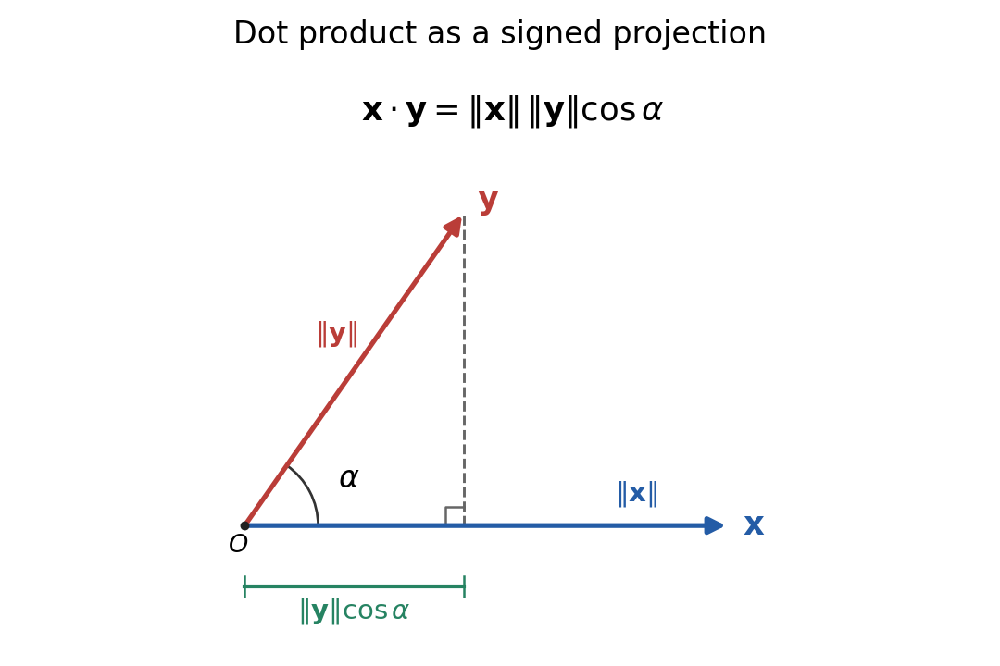

<h1 id="8d/solution">Solution</h1>

↑ **Parent:** [8D](../8d.md)

Two nonzero vectors are [linearly independent](../../../../../linear-independence.md) when $ax+by=0$ implies $a=b=0$. Their [span](../../../../../linear-span.md) then has [dimension](../../../../../dimension-vector-space.md) two. If they are [linearly dependent](../../../../../linear-dependence.md), one is a scalar multiple of the other, so their span is a nonzero line and has dimension one. Thus the requested dimensions are **two and one, respectively**.

The [dot product](../../../../../dot-product.md) and corresponding [Euclidean norm](../../../../../euclidean-norm.md) are

$$
x\cdot y=\sum_{j=1}^n x_jy_j,\qquad \|x\|=\sqrt{x\cdot x}=\left(\sum_{j=1}^n x_j^2\right)^{1/2}.
$$

The [Cauchy-Schwarz inequality](../../../../../cauchy-schwarz-inequality.md) states $\boxed{|x\cdot y|\le\|x\|\,\|y\|}$. If $y=0$ this is immediate. Otherwise the nonnegativity of a squared norm, with $t=(x\cdot y)/\|y\|^2$, gives

$$
0\le\|x-ty\|^2=\|x\|^2-\frac{(x\cdot y)^2}{\|y\|^2}.
$$

Multiplying by $\|y\|^2$ and taking square roots proves the inequality. Equality holds precisely when the vectors are linearly dependent. Expanding another squared norm and using the inequality gives

$$
\|x+y\|^2=\|x\|^2+2x\cdot y+\|y\|^2\le(\|x\|+\|y\|)^2,
$$

and hence the [triangle inequality](../../../../../triangle-inequality.md) $\boxed{\|x+y\|\le\|x\|+\|y\|}$.

In $\mathbb R^3$, the two vectors lie in a common plane. If their directions make angle $\alpha$, the [law of cosines](../../../../../law-of-cosines.md) gives $\|x-y\|^2=\|x\|^2+\|y\|^2-2\|x\|\|y\|\cos\alpha$. Comparing with the dot-product expansion yields

$$
\boxed{x\cdot y=\|x\|\,\|y\|\cos\alpha.}
$$

The sketch shows the same relation as a projection: multiply the length of $x$ by the signed component of $y$ in its direction. That component is negative for obtuse $\alpha$.

**[Figure 1](#8d/image-dot-product-as-a-signed-projection-in-the-plane-of-two-vectors). Dot product as a signed projection in the plane of two vectors**.

A [unit vector](../../../../../unit-vector.md) is a vector of [Euclidean norm](../../../../../euclidean-norm.md) one, equivalently $u\cdot u=1$. In particular the [dot product](../../../../../dot-product.md) of two unit vectors is the cosine of their mutual angle.

## ↑ Ancestors (10)

1. [8D](../8d.md)
2. [Paper 1](../../paper-1-split.md)
3. [Ia](../../split.md)
4. [2003](../../../split.md)
5. [Past exam of the mathematics course of the University of Cambridge](../../../../split.md)
6. [Mathematics course of the University of Cambridge](../../../../../mathematics-course-of-the-university-of-cambridge.md)
7. [Course of the University of Cambridge](../../../../../course-of-the-university-of-cambridge.md)
8. [University of Cambridge](../../../../../university-of-cambridge-split.md)
9. [List of universities](../../../../../list-of-universities.md)
10. [Codex Wiki](../../../../../split.md)
