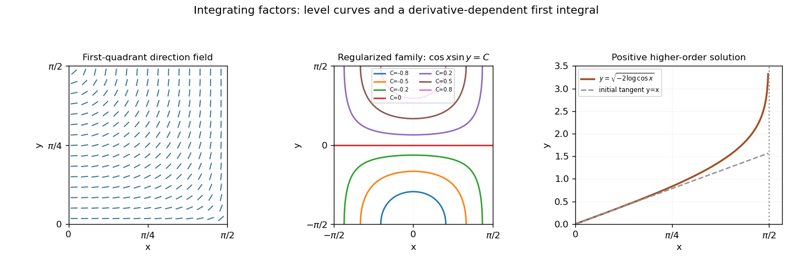

# Paper 2

↑ **Parent:** [Ia](../ia.md)

[https://www.maths.cam.ac.uk/undergrad/pastpapers/files/2003/PaperIA_2.pdf](https://www.maths.cam.ac.uk/undergrad/pastpapers/files/2003/PaperIA_2.pdf)

**Table of contents**

- [1D](#1d)
  - [Solution](#1d/solution)
  - [i](#1d/i)
    - [Solution](#1d/i/solution)
  - [ii](#1d/ii)
    - [Solution](#1d/ii/solution)
- [2D](#2d)
  - [Solution](#2d/solution)
- [3F](#3f)
  - [a](#3f/a)
    - [Solution](#3f/a/solution)
  - [b](#3f/b)
    - [Solution](#3f/b/solution)
- [4F](#4f)
  - [Solution](#4f/solution)
- [5D](#5d)
  - [a](#5d/a)
    - [Solution](#5d/a/solution)
  - [b](#5d/b)
    - [Solution](#5d/b/solution)
- [6D](#6d)
  - [Solution](#6d/solution)
- [7D](#7d)
  - [Solution](#7d/solution)
  - [i](#7d/i)
    - [Solution](#7d/i/solution)
  - [ii](#7d/ii)
    - [Solution](#7d/ii/solution)
- [8D](#8d)
  - [Solution](#8d/solution)
- [9F](#9f)
  - [Solution](#9f/solution)
- [10F](#10f)
  - [i](#10f/i)
    - [Solution](#10f/i/solution)
  - [ii](#10f/ii)
    - [Solution](#10f/ii/solution)
- [11F](#11f)
  - [Solution](#11f/solution)
- [12F](#12f)
  - [Solution](#12f/solution)

## 1D

↑ **Parent:** [Paper 2](paper-2.md)

<h3 id="1d/solution">Solution</h3>

↑ **Parent:** [1D](#1d)

The [direction field](../../../differential-equation.md#direction-field) has slope $1-y^2$, independent of $x$. Its line segments slope upward for $-1<y<1$, are horizontal at $y=\pm1$, and slope downward for $|y|>1$. Thus $y=1$ is an attracting [equilibrium](../../../dynamical-systems.md#equilibrium-point-of-a-dynamical-system) in forward $x$, while $y=-1$ is repelling. The two constant solutions $y\equiv\pm1$ must be included separately when separating variables.

The following original sketch shows the [slope field](../../../differential-equation.md#direction-field) and one solution in each requested region. The lower exterior solution ends at a finite pole; it cannot be continued across that pole as a real finite-valued solution.

**[Figure 1](#1d/image-direction-field-equilibrium-lines-and-representative-solutions-in-the-three-regions-of-the-autonomous-scalar-equation). Direction field, equilibrium lines and representative solutions in the three regions of the autonomous scalar equation**.

<h3 id="1d/i">i</h3>

↑ **Parent:** [1D](#1d)

<h4 id="1d/i/solution">Solution</h4>

↑ **Parent:** [I](#1d/i)

Separate variables and integrate on $|y|<1$:

$$
\int\frac{dy}{1-y^2}=x+C,\qquad
\operatorname{artanh}y=\frac12\log\frac{1+y}{1-y}=x+C.
$$

Hence the [general solution](../../../differential-equation.md#general-solution) in this region is

$$
\boxed{y(x)=\tanh(x+C),\qquad C\in\mathbb R.}
$$

Every such solution increases from values near $-1$ towards $1$, remains strictly between the two [equilibria](../../../dynamical-systems.md#equilibrium-point-of-a-dynamical-system), and is defined for all real $x$.

<h3 id="1d/ii">ii</h3>

↑ **Parent:** [1D](#1d)

<h4 id="1d/ii/solution">Solution</h4>

↑ **Parent:** [Ii](#1d/ii)

For $|y|>1$, the separated integral is

$$
\frac12\log\left|\frac{1+y}{1-y}\right|=x+C.
$$

Inverting gives

$$
\boxed{y(x)=\coth(x+C).}
$$

The upper branch has $x+C>0$, where $y>1$ decreases towards $1$ as $x\to\infty$. The lower branch has $x+C<0$, where $y<-1$ decreases to $-\infty$ as $x\uparrow-C$. These are separate maximal intervals: the pole is not part of a solution. For the domain $x\ge0$, a lower-branch initial value below $-1$ necessarily reaches that pole in finite positive $x$. The [direction field](../../../differential-equation.md#direction-field) sketch above displays both exterior branches and a central [hyperbolic tangent](../../../calculus.md#hyperbolic-tangent) branch.

## 2D

↑ **Parent:** [Paper 2](paper-2.md)

<h3 id="2d/solution">Solution</h3>

↑ **Parent:** [2D](#2d)

With $h=\delta t>0$, the [central finite difference](../../../finite-difference.md#central-finite-difference) converts the decay equation to

$$
\boxed{x_{n+1}+2Khx_n-x_{n-1}=0.}
$$

The continuous [ordinary differential equation](../../../differential-equation.md#ordinary-differential-equation) has the [general solution](../../../differential-equation.md#general-solution) $x(t)=Ce^{-Kt}$. The discrete [linear recurrence](../../../algebra.md#linear-recurrence-relation) is second order and requires two initial values, such as $x_0,x_1$. Trying $x_n=\rho^n$ gives the [characteristic equation of a linear recurrence](../../../algebra.md#characteristic-equation-of-a-linear-recurrence) $\rho^2+2Kh\rho-1=0$. Its roots are

$$
\rho_+=-Kh+\sqrt{1+K^2h^2},\qquad
\rho_-=-Kh-\sqrt{1+K^2h^2},
$$

so

$$
\boxed{x_n=A\rho_+^n+B\rho_-^n,\quad
A=\frac{x_1-\rho_-x_0}{\rho_+-\rho_-},\quad
B=\frac{\rho_+x_0-x_1}{\rho_+-\rho_-}.}
$$

There are no repeated roots, and the same formula extends to negative integer $n$ if required.

To demonstrate the continuum limit, put $a_h=\operatorname{arsinh}(Kh)$. Then $\rho_+=e^{-a_h}$ and $\rho_-=-e^{a_h}$, with $a_h/h\to K$. For $t_n=nh\in[0,T]$,

$$
\rho_+^n=e^{-(a_h/h)t_n}\longrightarrow e^{-Kt_n}
$$

uniformly, since $0\le t_n\le T$. More precisely $a_h/h=K-K^3h^2/6+O(h^4)$, giving an $O(h^2)$ error on a fixed interval. Thus $B=0$, $A=C$ selects the physical discrete mode and corresponds to $x_1=\rho_+x_0$.

The other root is a [parasitic amplification root](../../../numerical-analysis.md#parasitic-amplification-root):

$$
B\rho_-^n=B(-1)^n e^{(a_h/h)t_n}.
$$

For fixed $B\ne0$, even and odd mesh points approach values differing by $2Be^{Kt}$. Equivalently successive mesh values have a nonvanishing alternating jump despite their time separation tending to zero. This mode cannot converge uniformly to a continuous ODE solution; its limiting envelope also grows rather than decays.

For step-dependent initial data the precise result is the [centered two-step discretization of exponential decay](../../../numerical-analysis.md#centered-two-step-discretization-of-exponential-decay) criterion:

$$
\boxed{x_n\to Ce^{-Kt_n}\text{ uniformly on }[0,T]
\quad\Longleftrightarrow\quad A_h\to C\text{ and }B_h\to0.}
$$

Sufficiency follows from the two uniformly bounded exponential envelopes on a fixed interval. Necessity follows from convergence at the adjacent points $0,h$: $x_0\to C$, $x_1-x_0\to0$, and the coefficient formulas force $B_h\to0$, $A_h\to C$. In particular a nonzero but vanishing starting error is not excluded. Starting with the exact value $x_1=Ce^{-Kh}$ gives $B_h=CK^3h^3/12+O(h^4)$ and still converges on each fixed interval. The assertion about “remaining” solutions therefore concerns a fixed nonzero parasitic amplitude, not every nonzero step-dependent amplitude. The method is nevertheless not damping-stable for arbitrarily long times because $|\rho_-|>1$.

## 3F

↑ **Parent:** [Paper 2](paper-2.md)

<h3 id="3f/a">a</h3>

↑ **Parent:** [3F](#3f)

<h4 id="3f/a/solution">Solution</h4>

↑ **Parent:** [A](#3f/a)

For a nonnegative integer-valued [random variable](../../../random-variable.md) $X$, its [probability generating function](../../../probability-theory.md#probability-generating-function) is

$$
G_X(z)=\mathbb E[z^X]=\sum_{k=0}^{\infty}\mathbb P(X=k)z^k,
$$

initially defined at least for $|z|\le1$. A general real-valued random variable need not have a [probability generating function](../../../probability-theory.md#probability-generating-function) in this sense. For a [binomial distribution](../../../discrete-probability-distribution.md#binomial-distribution), the [binomial theorem](../../../combinatorics.md#binomial-theorem) gives

$$
G_X(z)=\sum_{k=0}^n\binom nkp^k(1-p)^{n-k}z^k=(1-p+pz)^n.
$$

Differentiating the generating function produces factorial moments:

$$
\mathbb EX=G_X'(1)=np,\qquad
\mathbb E[X(X-1)]=G_X''(1)=n(n-1)p^2.
$$

Since $X^2=X(X-1)+X$, the [mean](../../../probability-theory.md#expected-value) and [variance](../../../variance.md) are

$$
\boxed{\mathbb EX=np,\qquad\operatorname{Var}(X)=np(1-p).}
$$

These formulas include the degenerate endpoint [probabilities](../../../probability-theory.md#probability) and $n=0$.

<h3 id="3f/b">b</h3>

↑ **Parent:** [3F](#3f)

<h4 id="3f/b/solution">Solution</h4>

↑ **Parent:** [B](#3f/b)

For [independent random variables](../../../random-variable.md#independent-random-variables), their sum has the product of their [probability generating functions](../../../probability-theory.md#probability-generating-function):

$$
G_{X+Y}(z)=\mathbb E[z^Xz^Y]=G_X(z)G_Y(z)=(1-p+pz)^{n+m}.
$$

Comparing polynomial coefficients identifies a [binomial distribution](../../../discrete-probability-distribution.md#binomial-distribution) with parameters $n+m,p$:

$$
\boxed{\mathbb P(X+Y=k)=\binom{n+m}{k}p^k(1-p)^{n+m-k},\qquad k=0,\ldots,n+m,}
$$

and the [probability](../../../probability-theory.md#probability) is zero at all other values. The common success [probability](../../../probability-theory.md#probability) is essential to this binomial form; independent binomial counts with different [probabilities](../../../probability-theory.md#probability) do not in general add to a binomial count.

## 4F

↑ **Parent:** [Paper 2](paper-2.md)

<h3 id="4f/solution">Solution</h3>

↑ **Parent:** [4F](#4f)

The transformation is strictly increasing on $0\le x<1$, has range $[0,\infty)$, and its inverse is $x=y/(y+3)$. Therefore the [cumulative distribution function](../../../probability-theory.md#cumulative-distribution-function) is

$$
\boxed{F_Y(y)=\begin{cases}0,&y<0,\\[2pt]\dfrac{y}{y+3},&y\ge0.\end{cases}}
$$

Differentiation gives the [probability density function](../../../continuous-probability-distribution.md#probability-density-function)

$$
\boxed{f_Y(y)=\frac{3}{(y+3)^2}\ \ (y>0),\qquad f_Y(y)=0\ \ (y<0).}
$$

Its value at zero may be assigned arbitrarily without changing the distribution. There is no atom at zero or infinity. The expression is undefined at $X=1$, but that event has [probability](../../../probability-theory.md#probability) zero under the continuous [uniform distribution](../../../continuous-probability-distribution.md#continuous-uniform-distribution), so any convention there leaves the law unchanged. Finally $\int_0^\infty3/(y+3)^2\,dy=1$, as required.

## 5D

↑ **Parent:** [Paper 2](paper-2.md)

<h3 id="5d/a">a</h3>

↑ **Parent:** [5D](#5d)

<h4 id="5d/a/solution">Solution</h4>

↑ **Parent:** [A](#5d/a)

An [integrating factor for a differential one-form](../../../differential-equation.md#integrating-factor-for-a-differential-one-form) makes the multiplied form exact. If $dF=\mu g\,dx+\mu f\,dy$, then $F_x=\mu g$ and $F_y=\mu f$. Equality of the mixed [partial derivatives](../../../calculus.md#partial-derivative) yields

$$
\boxed{\partial_x(\mu f)=\partial_y(\mu g).}
$$

This is a local compatibility condition under the usual smoothness assumptions.

For the trigonometric equation, where its coefficients are defined and division is legitimate, the slope is $y'=\tan x\tan y$. In the first quadrant it is positive, small near either axis and large near the upper-right corner. The [direction field](../../../differential-equation.md#direction-field) below uses normalized line segments, so steep directions remain visible.

Multiplication by $\sin x\cos y$ gives

$$
\cos x\cos y\,dy-\sin x\sin y\,dx=d(\cos x\sin y)=0.
$$

Thus the multiplying function is an [integrating factor](../../../differential-equation.md#integrating-factor), and the implicit [general solution](../../../differential-equation.md#general-solution) is

$$
\boxed{\cos x\sin y=C.}
$$

In the larger square, $\cos x\ge0$. The positive-$C$ curves have positive $y$ and are symmetric about the $y$-axis; the negative-$C$ curves are their reflections. For $0<|C|<1$, a graph representation is

$$
y=\arcsin(C\sec x),\qquad |x|<\arccos|C|,
$$

with endpoints tending to $y=\operatorname{sgn}(C)\pi/2$. The $C=0$ interior curve is $y=0$. The domain boundaries include singular coefficients or zeros of the [integrating factor](../../../differential-equation.md#integrating-factor), so these endpoint limits and smooth continuations through $x=0$ describe the regularized relation; they must not be mistaken for additional solutions of the literal original equation at undefined points.

**[Figure 2](#5d/a/image-trigonometric-direction-field-regularized-implicit-solution-family-and-the-positive-higher-order-particular-solution). Trigonometric direction field, regularized implicit solution family, and the positive higher-order particular solution**.

<h3 id="5d/b">b</h3>

↑ **Parent:** [5D](#5d)

<h4 id="5d/b/solution">Solution</h4>

↑ **Parent:** [B](#5d/b)

After multiplication by $\sec^2x$, recognize both sides as derivatives:

$$
yy''+(y')^2=\sec^2x,\qquad
\frac{d}{dx}(yy'-\tan x)=0.
$$

The nontrivial [first integral](../../../differential-equation.md#first-integral) is therefore

$$
\boxed{h(x,y,y')=yy'-\tan x=C_1.}
$$

It necessarily depends on the derivative, correcting the printed notation $h(x,y)$. A second integration gives

$$
\boxed{y^2=-2\log(\cos x)+2C_1x+C_2}
$$

on the specified interval. Since $y(0)=0$, $C_2=0$. A finite derivative at zero also implies $yy'\to0$ there, forcing $C_1=0$. A positive [particular solution](../../../differential-equation.md#particular-solution) is consequently

$$
\boxed{y(x)=\sqrt{-2\log(\cos x)},\qquad 0\le x<\pi/2.}
$$

The negative of this function is the other sign choice. Near zero, $-2\log(\cos x)=x^2+x^4/6+O(x^6)$, so the positive branch has $y=x+x^3/12+O(x^5)$ and $y'(0)=1$; the negative branch has derivative $-1$.

For the positive branch, $y'=\tan x/y>0$. Its second derivative has numerator $-2\log\cos x-\sin^2x$, multiplied by a positive factor. This numerator is zero at zero and has derivative $2\sin^3x/\cos x>0$, so the curve is convex for positive $x$. It starts tangent to $y=x$ and rises without bound as $x\uparrow\pi/2$, with $y\sim\sqrt{-2\log(\pi/2-x)}$. The third panel of the sketch above shows this branch.

## 6D

↑ **Parent:** [Paper 2](paper-2.md)

<h3 id="6d/solution">Solution</h3>

↑ **Parent:** [6D](#6d)

For two solutions $y_1,y_2$, define the [Wronskian](../../../differential-equation.md#wronskian)

$$
W=y_1y_2'-y_1'y_2.
$$

Differentiate and substitute the [second-order linear differential equation](../../../differential-equation.md#second-order-linear-differential-equation):

$$
W'=y_1y_2''-y_1''y_2=-p(y_1y_2'-y_1'y_2)=-pW.
$$

Integration proves the [Abel identity](../../../differential-equation.md#abel-s-identity), including the identically zero case:

$$
\boxed{W(x)=W(x_0)\exp\left[-\int_{x_0}^xp(\xi)\,d\xi\right].}
$$

For $p=-2/x$, this is $W=Cx^2$ on either interval excluding zero, since the integral uses $\log|x|$. The coefficient singularity at zero must not be ignored.

Multiply the particular equation by $x^2$ and substitute the [Frobenius solution](../../../complex-analysis.md#frobenius-solution) $y=x^\lambda\sum_{n\ge0}a_nx^n$. With $a_{-1}=a_{-2}=0$, equating coefficients gives

$$
\boxed{(n+\lambda)(n+\lambda-3)a_n=a_{n-2}.}
$$

The leading coefficient is nonzero, so the [indicial equation](../../../differential-equation.md#indicial-equation) is $\lambda(\lambda-3)=0$. Thus only $\lambda=0,3$ are possible, and the recurrences below construct both.

For $\lambda=0$, $a_1=0$, $a_2=-a_0/2$, and the $n=3$ recurrence reads $0=a_1=0$, leaving $a_3$ free. For all later indices,

$$
\boxed{a_{2k}=a_0\frac{1-2k}{(2k)!}\quad(k\ge0),\qquad
 a_{2k+3}=\frac{6a_3(k+1)}{(2k+3)!}\quad(k\ge0),\qquad a_1=0.}
$$

This is an [undetermined coefficient at Frobenius resonance](../../../complex-analysis.md#undetermined-coefficient-at-frobenius-resonance); choosing $a_3=0$ selects a convenient even basis solution but is not forced by the differential equation.

For $\lambda=3$, all odd-indexed coefficients vanish and

$$
\boxed{a_{2k}=\frac{6a_0(k+1)}{(2k+3)!},\qquad a_{2k+1}=0\quad(k\ge0).}
$$

The factorial denominators show convergence for every finite $x$. Expanding the given [hyperbolic functions](../../../calculus.md#hyperbolic-function) directly yields

$$
\cosh x-x\sinh x=\sum_{k\ge0}\frac{1-2k}{(2k)!}x^{2k},
$$

$$
\sinh x-x\cosh x=-\sum_{k\ge0}\frac{2k+2}{(2k+3)!}x^{2k+3}.
$$

Consequently the exponent-zero family is $a_0(\cosh x-x\sinh x)-3a_3(\sinh x-x\cosh x)$, and the normalized exponent-three solution is $-3a_0(\sinh x-x\cosh x)$. This verifies the coefficient formulas and supplies two independent basis functions.

Finally $y_1'=-x\cosh x$ and $y_2'=-x\sinh x$, so

$$
W=(\cosh x-x\sinh x)(-x\sinh x)-(-x\cosh x)(\sinh x-x\cosh x)
=\boxed{-x^2}.
$$

This agrees with the Abel calculation. Its vanishing at zero does not contradict [independence](../../../random-variable.md#independent-random-variables) on regular intervals: the original equation is singular there.

## 7D

↑ **Parent:** [Paper 2](paper-2.md)

<h3 id="7d/solution">Solution</h3>

↑ **Parent:** [7D](#7d)

For the [homogeneous solution](../../../differential-equation.md#homogeneous-solution), expand in the independent [eigenvectors](../../../linear-operator-theory.md#eigenvector) of $A$. Each coefficient obeys $c_j'=\lambda_jc_j$, so the [complementary function](../../../differential-equation.md#homogeneous-solution) is

$$
\boxed{\mathbf x_c(t)=\sum_{j=1}^nC_j\mathbf a_j e^{\lambda_jt}.}
$$

If $\mathbf x_p$ is any [particular integral](../../../differential-equation.md#particular-solution), subtracting it from any other solution gives a [homogeneous solution](../../../differential-equation.md#homogeneous-solution). Hence $\mathbf x=\mathbf x_p+\mathbf x_c$ is the [general solution](../../../differential-equation.md#general-solution). Complex-conjugate modes can be combined to produce real solutions when the forcing is real.

For a real two-by-two matrix, the characteristic polynomial is $\lambda^2-(\operatorname{tr}A)\lambda+\det A$. Under the stated distinct-eigenvalue assumption, all nonzero homogeneous modes are purely oscillatory exactly when the [eigenvalues](../../../linear-operator-theory.md#eigenvalue) are $\pm i\omega$ with $\omega>0$. Their sum and product imply $\operatorname{tr}A=0$, $\det A=\omega^2>0$. Conversely these [trace](../../../linear-algebra.md#matrix-trace) and [determinant](../../../linear-algebra.md#determinant) conditions force those [eigenvalues](../../../linear-operator-theory.md#eigenvalue), so there is no exponential growth, decay or Jordan-block secular growth.

For the final specified initial-value problem, direct multiplication gives $A^2=-9I$. The forcing vector $\mathbf b=(2,3i-1)^T$ satisfies $A\mathbf b=3i\mathbf b$, so the forcing is resonant and $t\mathbf b e^{3it}$ is a [particular integral](../../../differential-equation.md#particular-solution). The [matrix exponential](../../../linear-operator-theory.md#matrix-exponential) is

$$
e^{At}=I\cos3t+\frac A3\sin3t.
$$

Since the resonant [particular integral](../../../differential-equation.md#particular-solution) vanishes initially, the initial-value solution is

$$
\boxed{\mathbf x(t)=
\begin{pmatrix}\cos3t+\tfrac13\sin3t\\-\tfrac53\sin3t\end{pmatrix}
+t e^{3it}\begin{pmatrix}2\\3i-1\end{pmatrix}.}
$$

This complex solution is appropriate to the complex forcing as written. Taking real parts gives the corresponding solution for the real part of that forcing.

<h3 id="7d/i">i</h3>

↑ **Parent:** [7D](#7d)

<h4 id="7d/i/solution">Solution</h4>

↑ **Parent:** [I](#7d/i)

Try a [particular integral](../../../differential-equation.md#particular-solution) along each forcing [eigenvector](../../../linear-operator-theory.md#eigenvector). Since $A\mathbf a_j=\lambda_j\mathbf a_j$,

$$
(\partial_t-A)\left(\frac{\mathbf a_j e^{i\omega_jt}}{i\omega_j-\lambda_j}\right)=\mathbf a_j e^{i\omega_jt}.
$$

With both denominators nonzero, add the two responses:

$$
\boxed{\mathbf x_p=\frac{\mathbf a_1e^{i\omega_1t}}{i\omega_1-\lambda_1}
+\frac{\mathbf a_2e^{i\omega_2t}}{i\omega_2-\lambda_2}.}
$$

Only the forcing component's own [eigenvalue](../../../linear-operator-theory.md#eigenvalue) enters its denominator; a frequency matching a different eigenmode does not create resonance in this already diagonal forcing component.

<h3 id="7d/ii">ii</h3>

↑ **Parent:** [7D](#7d)

<h4 id="7d/ii/solution">Solution</h4>

↑ **Parent:** [Ii](#7d/ii)

The second component is resonant. Differentiating $t e^{\lambda_2t}$ supplies the term missing from the exponential ansatz:

$$
(\partial_t-A)(t\mathbf a_2e^{\lambda_2t})=\mathbf a_2e^{\lambda_2t}.
$$

Thus a [particular integral](../../../differential-equation.md#particular-solution) is

$$
\boxed{\mathbf x_p=\frac{\mathbf a_1e^{i\omega_1t}}{i\omega_1-\lambda_1}
+t\mathbf a_2e^{\lambda_2t}.}
$$

The linearly growing oscillatory envelope is forced [resonance in a differential equation](../../../differential-equation.md#resonance-in-a-differential-equation); it does not contradict bounded oscillation of the [complementary function](../../../differential-equation.md#homogeneous-solution). The worked initial-value solution in the question's root Solution uses this same resonant mechanism.

## 8D

↑ **Parent:** [Paper 2](paper-2.md)

<h3 id="8d/solution">Solution</h3>

↑ **Parent:** [8D](#8d)

Differentiate the proposed [first integral](../../../differential-equation.md#first-integral) along the vector field:

$$
\dot K=2x\left(\frac\alpha2x+y-2y^3\right)+(2y-4y^3)(-x)
=\boxed{\alpha x^2}.
$$

At $\alpha=0$, $K$ is conserved and the system is an [inverted quartic oscillator phase portrait](../../../classical-mechanics.md#inverted-quartic-oscillator-phase-portrait). Its [equilibria](../../../dynamical-systems.md#equilibrium-point-of-a-dynamical-system) are $O=(0,0)$ and $S_\pm=(0,\pm1/\sqrt2)$. The [Jacobian matrix](../../../calculus.md#jacobian-matrix) is

$$
J=\begin{pmatrix}0&1-6y^2\\-1&0\end{pmatrix}.
$$

At the origin its [eigenvalues](../../../linear-operator-theory.md#eigenvalue) are $\pm i$. Moreover $K$ has a strict local minimum there, and its nearby positive contours are closed, so the origin is a genuine [center equilibrium](../../../dynamical-systems.md#center-equilibrium), not merely an inconclusive linear centre. The arrows circulate clockwise: on the positive $x$-axis, $\dot y<0$. At either $S_\pm$, the [eigenvalues](../../../linear-operator-theory.md#eigenvalue) are $\pm\sqrt2$, giving [saddle equilibria](../../../dynamical-systems.md#saddle-equilibrium). The stable eigendirection is $\delta x=\sqrt2\delta y$, and the unstable one is $\delta x=-\sqrt2\delta y$.

The special energy level factors as

$$
K=\frac14\quad\Longleftrightarrow\quad
x^2=(y^2-\tfrac12)^2,\qquad
\boxed{x=\pm(y^2-\tfrac12).}
$$

Between the two saddles, its left arc has $x<0$ and travels upward from $S_-$ to $S_+$; its right arc has $x>0$ and travels downward from $S_+$ to $S_-$. These two [heteroclinic orbits](../../../dynamical-systems.md#heteroclinic-orbit) bound the central eye. Trajectories inside the eye are closed [periodic orbits](../../../dynamical-systems.md#periodic-orbit) and do not tend to the centre as $t\to\infty$.

More explicitly, a level $K=C$ has

$$
x^2=y^4-y^2+C.
$$

For $0<C<1/4$, its bounded central component is periodic, while its exterior components turn at $|y|=\sqrt{(1+\sqrt{1-4C})/2}$ and then escape. For $C>1/4$, $x$ never vanishes and the two branches run from one vertical infinity to the other. Levels $C\le0$ have only exterior nonconstant components, apart from the origin at $C=0$.

On the upper outer [separatrix](../../../dynamical-systems.md#separatrix), the $x>0$ branch arrives from positive infinity and approaches $S_+$ in forward infinite time; the $x<0$ branch leaves $S_+$ towards positive infinity. On the lower outer [separatrix](../../../dynamical-systems.md#separatrix), the $x<0$ branch arrives from negative infinity and approaches $S_-$, while the $x>0$ branch leaves towards negative infinity. Approaching a saddle along its [stable manifold](../../../dynamical-systems.md#stable-manifold) is exponential at rate $\sqrt2$. A trajectory close to but off a [separatrix](../../../dynamical-systems.md#separatrix) can spend a long time near the saddle before completing a [periodic orbit](../../../dynamical-systems.md#periodic-orbit) or escaping.

The escape is **[finite-time blowup](../../../differential-equation.md#finite-time-blowup)**, not an asymptote at $t=\infty$. On any escaping level, $|x|=\sqrt{y^4-y^2+C}\sim y^2$, so the remaining travel time is bounded by a convergent integral proportional to $\int^\infty dy/y^2$. Thus an outward upper branch has $y\sim(T-t)^{-1}$, $x\sim-(T-t)^{-2}$; an outward lower branch has $y\sim-(T-t)^{-1}$, $x\sim(T-t)^{-2}$. The statement about approaching from infinity likewise refers to a finite past endpoint. Only [equilibria](../../../dynamical-systems.md#equilibrium-point-of-a-dynamical-system), periodic trajectories and trajectories tending to saddles have a future defined for all time in this conservative portrait.

For small positive $\alpha$, the [equilibria](../../../dynamical-systems.md#equilibrium-point-of-a-dynamical-system) remain in place, but the origin's [eigenvalues](../../../linear-operator-theory.md#eigenvalue) become $\alpha/4\pm i\sqrt{1-\alpha^2/16}$, so it becomes a repelling [focus](../../../dynamical-systems.md#focus-dynamical-systems). The saddles retain one [eigenvalue](../../../linear-operator-theory.md#eigenvalue) of each sign, $\alpha/4\pm\sqrt{2+\alpha^2/16}$. Since $\dot K\ge0$, and its time integral is strictly positive on every nonconstant trajectory, trajectories cross $K$-contours towards larger values. Near the centre this means outward spiralling. No nonconstant [periodic orbit](../../../dynamical-systems.md#periodic-orbit) can remain, and the former saddle-to-saddle connections at equal $K=1/4$ are broken. Stable saddle trajectories approach from $K<1/4$; unstable ones depart into $K>1/4$. Generic central trajectories eventually escape, while the exceptional stable saddle manifolds still approach their saddles.

**[Figure 3](#8d/image-conservative-quartic-phase-portrait-with-heteroclinic-separatrices-and-outward-contour-crossing-under-small-positive-antidamping). Conservative quartic phase portrait with heteroclinic separatrices, and outward contour crossing under small positive antidamping**.

## 9F

↑ **Parent:** [Paper 2](paper-2.md)

<h3 id="9f/solution">Solution</h3>

↑ **Parent:** [9F](#9f)

The [inclusion-exclusion principle](../../../combinatorics.md#inclusion-exclusion-principle) gives

$$
\boxed{\mathbb P\left(\bigcup_{i=1}^nA_i\right)=
\sum_{\varnothing\ne I\subseteq\{1,\ldots,n\}}(-1)^{|I|+1}\mathbb P\left(\bigcap_{i\in I}A_i\right).}
$$

For the coat problem, all $n!$ [permutations](../../../combinatorics.md#permutation) are equally likely. If a specified set of $j$ people gets its own coats, the other coats can be assigned in $(n-j)!$ ways, so that intersection has [probability](../../../probability-theory.md#probability) $(n-j)!/n!$. Taking the complement of the union of correct-coat events gives the [derangement](../../../combinatorics.md#derangement-of-a-permutation) [probability](../../../probability-theory.md#probability)

$$
\boxed{p(0,n)=\sum_{j=0}^n\frac{(-1)^j}{j!}.}
$$

To have exactly $m$ fixed coats, choose their recipients and derange all remaining coats. Thus the [fixed point count of a uniform random permutation](../../../combinatorics.md#fixed-point-count-of-a-uniform-random-permutation) has

$$
\boxed{p(m,n)=\frac{\binom nmD_{n-m}}{n!}
=\frac{p(0,n-m)}{m!}
=\frac1{m!}\sum_{j=0}^{n-m}\frac{(-1)^j}{j!},\quad0\le m\le n,}
$$

and zero [probability](../../../probability-theory.md#probability) outside this range. The empty [permutation](../../../combinatorics.md#permutation) has $D_0=1$, so the formula includes $m=n$; it also gives zero for $m=n-1$, since a lone remaining coat cannot be misplaced.

For fixed $m$, $n-m\to\infty$, and the exponential series gives

$$
\boxed{\lim_{n\to\infty}p(m,n)=\frac{e^{-1}}{m!}.}
$$

These are the [probabilities](../../../probability-theory.md#probability) of a [Poisson distribution](../../../discrete-probability-distribution.md#poisson-distribution) of [mean](../../../probability-theory.md#expected-value) one. The limit is for fixed $m$, not for $m$ increasing with $n$.

## 10F

↑ **Parent:** [Paper 2](paper-2.md)

<h3 id="10f/i">i</h3>

↑ **Parent:** [10F](#10f)

<h4 id="10f/i/solution">Solution</h4>

↑ **Parent:** [I](#10f/i)

The [probabilities](../../../probability-theory.md#probability) satisfy $a,b,c,d\ge0$ and $a+b+c+d=1$. Since the variables are indicators,

$$
\mathbb EX=c+d,\quad\mathbb EY=b+d,\quad\mathbb E[XY]=d.
$$

Their [covariance](../../../variance.md#covariance) is

$$
\operatorname{Cov}(X,Y)=d-(c+d)(b+d)=ad-bc.
$$

Thus the necessary and sufficient condition for [uncorrelated random variables](../../../variance.md#uncorrelated-random-variables) is

$$
\boxed{ad=bc.}
$$

This uses zero [covariance](../../../variance.md#covariance) as the definition. If one variable is constant, a normalized correlation coefficient is undefined, but zero [covariance](../../../variance.md#covariance) and this criterion remain meaningful.

<h3 id="10f/ii">ii</h3>

↑ **Parent:** [10F](#10f)

<h4 id="10f/ii/solution">Solution</h4>

↑ **Parent:** [Ii](#10f/ii)

Independence requires each joint [probability](../../../probability-theory.md#probability) to equal the product of the relevant marginals. In particular it implies $d=(c+d)(b+d)$, equivalent to $ad=bc$.

Conversely let $p=c+d$ and $q=b+d$, and assume $ad=bc$. The [covariance](../../../variance.md#covariance) calculation gives $d=pq$. Then

$$
c=p-d=p(1-q),\qquad b=q-d=(1-p)q,\qquad a=1-b-c-d=(1-p)(1-q).
$$

All four joint [probabilities](../../../probability-theory.md#probability) therefore factor, proving [independence](../../../random-variable.md#independent-random-variables). Hence

$$
\boxed{X,Y\text{ independent}\ \Longleftrightarrow\ ad=bc
\ \Longleftrightarrow\ X,Y\text{ uncorrelated}.}
$$

This is [Bernoulli independence from zero covariance](../../../variance.md#bernoulli-independence-from-zero-covariance), including degenerate marginals. It is special to two-point variables and is not a general equivalence for arbitrary random variables.

## 11F

↑ **Parent:** [Paper 2](paper-2.md)

<h3 id="11f/solution">Solution</h3>

↑ **Parent:** [11F](#11f)

An uneventful day leaves one aphid, a one-offspring day leaves the parent plus its offspring, and a two-offspring day leaves three aphids. Death leaves none. Thus the daily descendant counts are $0,1,2,3$ with [probabilities](../../../probability-theory.md#probability) $(1-q)t$, $q$, $(1-q)r$, $(1-q)s$, respectively. The [mean](../../../probability-theory.md#expected-value) and [probability generating function](../../../probability-theory.md#probability-generating-function) are

$$
\boxed{\mathbb EX_1=q+(1-q)(2r+3s),\qquad
G(z)=(1-q)t+qz+(1-q)rz^2+(1-q)sz^3.}
$$

Independence across individuals and days makes the daily population a [Galton-Watson process](../../../probability-and-statistics.md#galton-watson-process), with each surviving parent counted as one of the next day's descendants.

The standard [Galton-Watson extinction fixed point](../../../probability-and-statistics.md#galton-watson-extinction-fixed-point) result states that the eventual [extinction probability of a branching process](../../../probability-and-statistics.md#extinction-probability-of-a-branching-process) $e$ from one ancestor is the smallest root in $[0,1]$ of $G(e)=e$. Moreover a nondegenerate offspring law of [mean](../../../probability-theory.md#expected-value) at most one has [extinction probability of a branching process](../../../probability-and-statistics.md#extinction-probability-of-a-branching-process) one. Here, since $q<1$, the fixed-point equation reduces to

$$
\boxed{e=t+re^2+se^3,}
$$

which contains no $q$. This proves [laziness invariance of branching extinction](../../../probability-and-statistics.md#laziness-invariance-of-branching-extinction): uneventful days change the timescale, not eventual extinction. The excluded case $q=1$ would keep one aphid forever.

If $2r+3s\le1$, the offspring [mean](../../../probability-theory.md#expected-value) is at most one. In this parameter range $t>0$: if $t=0$, then $r+s=1$ would imply $2r+3s\ge2$. Thus the offspring law is not deterministically one, and the extinction criterion applies. **Extinction is certain.**

For the specified [probabilities](../../../probability-theory.md#probability), the fixed-point equation factors as

$$
2e^3+e^2-5e+2=(e-1)(2e-1)(e+2)=0.
$$

Its roots in $[0,1]$ are $1/2$ and $1$, and the smaller root is the [extinction probability of a branching process](../../../probability-and-statistics.md#extinction-probability-of-a-branching-process):

$$
\boxed{e=\frac12.}
$$

## 12F

↑ **Parent:** [Paper 2](paper-2.md)

<h3 id="12f/solution">Solution</h3>

↑ **Parent:** [12F](#12f)

By rotational invariance, fix the first landing point at the north pole of a [sphere](../../../geometry-and-topology.md#sphere) of radius $R$. A band of central angle $\theta$ and width $d\theta$ has area $2\pi R^2\sin\theta\,d\theta$. Dividing by total area gives the [central angle between independent uniform sphere points](../../../continuous-probability-distribution.md#central-angle-between-independent-uniform-sphere-points) density

$$
\boxed{f_\Theta(\theta)=\tfrac12\sin\theta,\quad0<\theta<\pi,}
$$

and zero outside this range. The radius cancels.

Given the first pair's central angle $\gamma$, the third point can communicate with each of them exactly when it lies in that point's positive [hemisphere](../../../geometry-and-topology.md#hemisphere). Choose their intersection line as a polar axis. Each [hemisphere](../../../geometry-and-topology.md#hemisphere) permits an azimuth interval of length $\pi$, and the intervals' centres are separated by $\gamma$. Their overlap is a [spherical lune](../../../geometry-and-topology.md#spherical-lune) of opening $\pi-\gamma$, with area $2R^2(\pi-\gamma)$. Therefore

$$
\mathbb P(C\text{ linked to both}\mid\gamma)=\frac{\pi-\gamma}{2\pi}.
$$

The union [probability](../../../probability-theory.md#probability) follows from inclusion-exclusion for two [hemispheres](../../../geometry-and-topology.md#hemisphere):

$$
\mathbb P(C\text{ linked to at least one}\mid\gamma)
=\frac12+\frac12-\frac{\pi-\gamma}{2\pi}
=\frac12+\frac{\gamma}{2\pi}.
$$

Thus the requested conditional answers are

$$
\boxed{\mathbb P(C\text{ linked to either}\mid\gamma<\pi/2,\gamma)
=\frac12+\frac{\gamma}{2\pi},}
$$

$$
\boxed{\mathbb P(C\text{ linked to both}\mid\gamma>\pi/2,\gamma)
=\frac12-\frac{\gamma}{2\pi}.}
$$

“Either” here is inclusive: a third ship linked to both is also linked to at least one.

For network connectivity, if $\gamma<\pi/2$ the first pair is already linked, and the third must link to at least one of them. If $\gamma>\pi/2$, the first pair is not linked, and both must link through the third. Consequently the [connectivity of three acute-angle sphere points](../../../continuous-probability-distribution.md#connectivity-of-three-acute-angle-sphere-points) is

$$
P_{\mathrm{conn}}=
\int_0^{\pi/2}\left(\frac12+\frac{\gamma}{2\pi}\right)\frac{\sin\gamma}{2}\,d\gamma
+\int_{\pi/2}^{\pi}\left(\frac12-\frac{\gamma}{2\pi}\right)\frac{\sin\gamma}{2}\,d\gamma.
$$

Using $\int_0^{\pi/2}\gamma\sin\gamma\,d\gamma=1$ and $\int_{\pi/2}^{\pi}\gamma\sin\gamma\,d\gamma=\pi-1$ gives

$$
\boxed{P_{\mathrm{conn}}=\frac12+\frac{2-\pi}{4\pi}=\frac{\pi+2}{4\pi}.}
$$

Angles exactly equal to the threshold have [probability](../../../probability-theory.md#probability) zero. Connectivity allows relaying and is weaker than requiring direct links between every pair.

## ↑ Ancestors (8)

1. [Ia](../ia.md)
2. [2003](../../2003.md)
3. [Past exam of the mathematics course of the University of Cambridge](../../../past-exam-of-the-mathematics-course-of-the-university-of-cambridge.md)
4. [Mathematics course of the University of Cambridge](../../../university-of-cambridge.md#mathematics-course-of-the-university-of-cambridge)
5. [Course of the University of Cambridge](../../../university-of-cambridge.md#course-of-the-university-of-cambridge)
6. [University of Cambridge](../../../university-of-cambridge.md)
7. [List of universities](../../../README.md#list-of-universities)
8. [Codex Wiki](../../../README.md)
