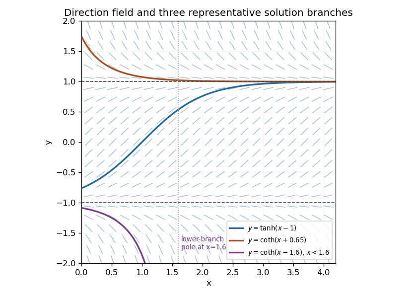

<h1 id="1d/solution">Solution</h1>

↑ **Parent:** [1D](../1d.md)

The [direction field](../../../../../direction-field.md) has slope $1-y^2$, independent of $x$. Its line segments slope upward for $-1<y<1$, are horizontal at $y=\pm1$, and slope downward for $|y|>1$. Thus $y=1$ is an attracting [equilibrium](../../../../../equilibrium-point-of-a-dynamical-system.md) in forward $x$, while $y=-1$ is repelling. The two constant solutions $y\equiv\pm1$ must be included separately when separating variables.

The following original sketch shows the [slope field](../../../../../direction-field.md) and one solution in each requested region. The lower exterior solution ends at a finite pole; it cannot be continued across that pole as a real finite-valued solution.

**[Figure 1](#1d/image-direction-field-equilibrium-lines-and-representative-solutions-in-the-three-regions-of-the-autonomous-scalar-equation). Direction field, equilibrium lines and representative solutions in the three regions of the autonomous scalar equation**.

## ↑ Ancestors (10)

1. [1D](../1d.md)
2. [Paper 2](../../paper-2-split.md)
3. [Ia](../../split.md)
4. [2003](../../../split.md)
5. [Past exam of the mathematics course of the University of Cambridge](../../../../split.md)
6. [Mathematics course of the University of Cambridge](../../../../../mathematics-course-of-the-university-of-cambridge.md)
7. [Course of the University of Cambridge](../../../../../course-of-the-university-of-cambridge.md)
8. [University of Cambridge](../../../../../university-of-cambridge-split.md)
9. [List of universities](../../../../../list-of-universities.md)
10. [Codex Wiki](../../../../../split.md)
