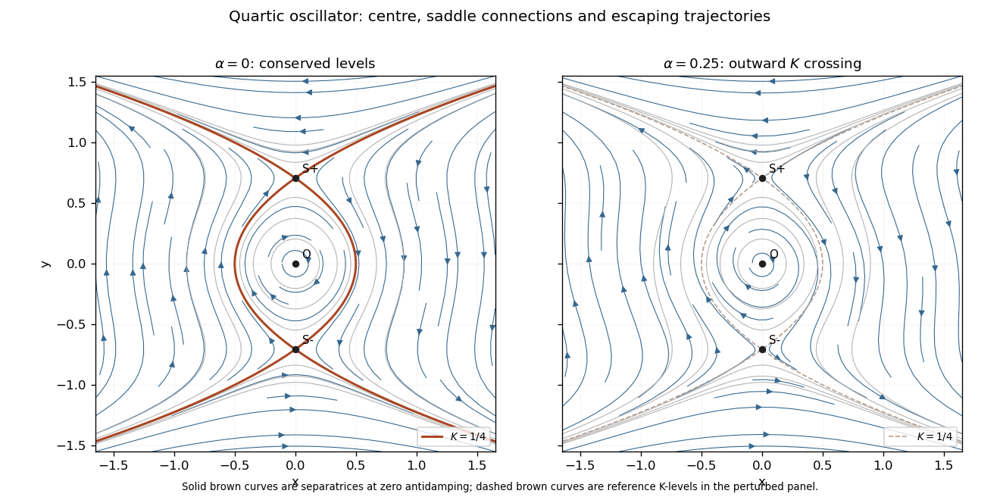

<h1 id="8d/solution">Solution</h1>

↑ **Parent:** [8D](../8d.md)

Differentiate the proposed [first integral](../../../../../first-integral.md) along the vector field:

$$
\dot K=2x\left(\frac\alpha2x+y-2y^3\right)+(2y-4y^3)(-x)
=\boxed{\alpha x^2}.
$$

At $\alpha=0$, $K$ is conserved and the system is an [inverted quartic oscillator phase portrait](../../../../../inverted-quartic-oscillator-phase-portrait.md). Its [equilibria](../../../../../equilibrium-point-of-a-dynamical-system.md) are $O=(0,0)$ and $S_\pm=(0,\pm1/\sqrt2)$. The [Jacobian matrix](../../../../../jacobian-matrix.md) is

$$
J=\begin{pmatrix}0&1-6y^2\\-1&0\end{pmatrix}.
$$

At the origin its [eigenvalues](../../../../../eigenvalue.md) are $\pm i$. Moreover $K$ has a strict local minimum there, and its nearby positive contours are closed, so the origin is a genuine [center equilibrium](../../../../../center-equilibrium.md), not merely an inconclusive linear centre. The arrows circulate clockwise: on the positive $x$-axis, $\dot y<0$. At either $S_\pm$, the [eigenvalues](../../../../../eigenvalue.md) are $\pm\sqrt2$, giving [saddle equilibria](../../../../../saddle-equilibrium.md). The stable eigendirection is $\delta x=\sqrt2\delta y$, and the unstable one is $\delta x=-\sqrt2\delta y$.

The special energy level factors as

$$
K=\frac14\quad\Longleftrightarrow\quad
x^2=(y^2-\tfrac12)^2,\qquad
\boxed{x=\pm(y^2-\tfrac12).}
$$

Between the two saddles, its left arc has $x<0$ and travels upward from $S_-$ to $S_+$; its right arc has $x>0$ and travels downward from $S_+$ to $S_-$. These two [heteroclinic orbits](../../../../../heteroclinic-orbit.md) bound the central eye. Trajectories inside the eye are closed [periodic orbits](../../../../../periodic-orbit.md) and do not tend to the centre as $t\to\infty$.

More explicitly, a level $K=C$ has

$$
x^2=y^4-y^2+C.
$$

For $0<C<1/4$, its bounded central component is periodic, while its exterior components turn at $|y|=\sqrt{(1+\sqrt{1-4C})/2}$ and then escape. For $C>1/4$, $x$ never vanishes and the two branches run from one vertical infinity to the other. Levels $C\le0$ have only exterior nonconstant components, apart from the origin at $C=0$.

On the upper outer [separatrix](../../../../../separatrix.md), the $x>0$ branch arrives from positive infinity and approaches $S_+$ in forward infinite time; the $x<0$ branch leaves $S_+$ towards positive infinity. On the lower outer [separatrix](../../../../../separatrix.md), the $x<0$ branch arrives from negative infinity and approaches $S_-$, while the $x>0$ branch leaves towards negative infinity. Approaching a saddle along its [stable manifold](../../../../../stable-manifold.md) is exponential at rate $\sqrt2$. A trajectory close to but off a [separatrix](../../../../../separatrix.md) can spend a long time near the saddle before completing a [periodic orbit](../../../../../periodic-orbit.md) or escaping.

The escape is **[finite-time blowup](../../../../../finite-time-blowup.md)**, not an asymptote at $t=\infty$. On any escaping level, $|x|=\sqrt{y^4-y^2+C}\sim y^2$, so the remaining travel time is bounded by a convergent integral proportional to $\int^\infty dy/y^2$. Thus an outward upper branch has $y\sim(T-t)^{-1}$, $x\sim-(T-t)^{-2}$; an outward lower branch has $y\sim-(T-t)^{-1}$, $x\sim(T-t)^{-2}$. The statement about approaching from infinity likewise refers to a finite past endpoint. Only [equilibria](../../../../../equilibrium-point-of-a-dynamical-system.md), periodic trajectories and trajectories tending to saddles have a future defined for all time in this conservative portrait.

For small positive $\alpha$, the [equilibria](../../../../../equilibrium-point-of-a-dynamical-system.md) remain in place, but the origin's [eigenvalues](../../../../../eigenvalue.md) become $\alpha/4\pm i\sqrt{1-\alpha^2/16}$, so it becomes a repelling [focus](../../../../../focus-dynamical-systems.md). The saddles retain one [eigenvalue](../../../../../eigenvalue.md) of each sign, $\alpha/4\pm\sqrt{2+\alpha^2/16}$. Since $\dot K\ge0$, and its time integral is strictly positive on every nonconstant trajectory, trajectories cross $K$-contours towards larger values. Near the centre this means outward spiralling. No nonconstant [periodic orbit](../../../../../periodic-orbit.md) can remain, and the former saddle-to-saddle connections at equal $K=1/4$ are broken. Stable saddle trajectories approach from $K<1/4$; unstable ones depart into $K>1/4$. Generic central trajectories eventually escape, while the exceptional stable saddle manifolds still approach their saddles.

**[Figure 3](#8d/image-conservative-quartic-phase-portrait-with-heteroclinic-separatrices-and-outward-contour-crossing-under-small-positive-antidamping). Conservative quartic phase portrait with heteroclinic separatrices, and outward contour crossing under small positive antidamping**.

## ↑ Ancestors (10)

1. [8D](../8d.md)
2. [Paper 2](../../paper-2-split.md)
3. [Ia](../../split.md)
4. [2003](../../../split.md)
5. [Past exam of the mathematics course of the University of Cambridge](../../../../split.md)
6. [Mathematics course of the University of Cambridge](../../../../../mathematics-course-of-the-university-of-cambridge.md)
7. [Course of the University of Cambridge](../../../../../course-of-the-university-of-cambridge.md)
8. [University of Cambridge](../../../../../university-of-cambridge-split.md)
9. [List of universities](../../../../../list-of-universities.md)
10. [Codex Wiki](../../../../../split.md)
