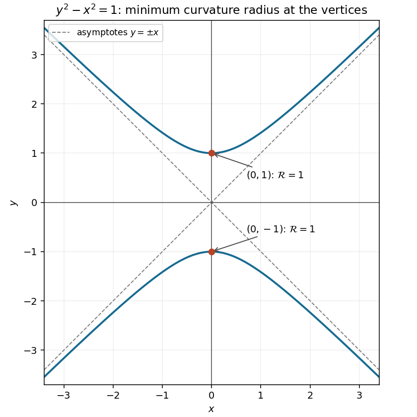

<h1 id="3a/solution">Solution</h1>

↑ **Parent:** [3A](../3a.md)

The curve is a [hyperbola](../../../../../hyperbola.md) with two branches, vertices $(0,1)$ and $(0,-1)$, and asymptotes $y=\pm x$. It is symmetric under [reflection](../../../../../reflection-mathematics.md) in either coordinate axis. The requested sketch marks both vertices:

**[Figure 1](#3a/image-two-branches-of-the-hyperbola-with-its-asymptotes-and-the-points-of-minimum-radius-of-curvature). Two branches of the hyperbola, with its asymptotes and the points of minimum radius of curvature**.

Parametrize the branches by $x=\sinh t$, $y=\pm\cosh t$, for $t\in\mathbb R$. The squared speed is $\dot x^2+\dot y^2=\cosh^2t+\sinh^2t=\cosh2t$, and $|\dot x\ddot y-\ddot x\dot y|=|\cosh^2t-\sinh^2t|=1$. The reciprocal of the [curvature of a plane curve](../../../../../curvature-of-a-plane-curve.md) is therefore

$$
\boxed{\mathcal R(t)=(\cosh2t)^{3/2}=(1+2x^2)^{3/2}}.
$$

Since $\cosh2t\ge1$, with equality only at $t=0$, **the least radius is $1$, attained at $(0,1)$ and $(0,-1)$**.

## ↑ Ancestors (10)

1. [3A](../3a.md)
2. [Paper 3](../../paper-3-split.md)
3. [Ia](../../split.md)
4. [2003](../../../split.md)
5. [Past exam of the mathematics course of the University of Cambridge](../../../../split.md)
6. [Mathematics course of the University of Cambridge](../../../../../mathematics-course-of-the-university-of-cambridge.md)
7. [Course of the University of Cambridge](../../../../../course-of-the-university-of-cambridge.md)
8. [University of Cambridge](../../../../../university-of-cambridge-split.md)
9. [List of universities](../../../../../list-of-universities.md)
10. [Codex Wiki](../../../../../split.md)
