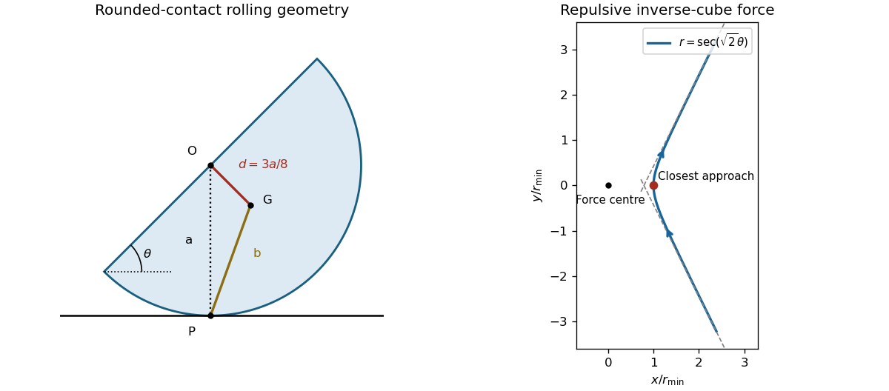

# Paper 4

↑ **Parent:** [Ia](../ia.md)

[https://www.maths.cam.ac.uk/undergrad/pastpapers/files/2003/PaperIA_4.pdf](https://www.maths.cam.ac.uk/undergrad/pastpapers/files/2003/PaperIA_4.pdf)

**Table of contents**

- [1C](#1c)
  - [i](#1c/i)
    - [Solution](#1c/i/solution)
  - [ii](#1c/ii)
    - [Solution](#1c/ii/solution)
- [2C](#2c)
  - [Solution](#2c/solution)
  - [i](#2c/i)
    - [Solution](#2c/i/solution)
  - [ii](#2c/ii)
    - [Solution](#2c/ii/solution)
  - [iii](#2c/iii)
    - [Solution](#2c/iii/solution)
  - [iv](#2c/iv)
    - [Solution](#2c/iv/solution)
- [3E](#3e)
  - [Solution](#3e/solution)
- [4E](#4e)
  - [Solution](#4e/solution)
- [5C](#5c)
  - [Solution](#5c/solution)
- [6C](#6c)
  - [i](#6c/i)
    - [Solution](#6c/i/solution)
  - [ii](#6c/ii)
    - [Solution](#6c/ii/solution)
  - [iii](#6c/iii)
    - [Solution](#6c/iii/solution)
- [7C](#7c)
  - [Solution](#7c/solution)
  - [i](#7c/i)
    - [Solution](#7c/i/solution)
  - [ii](#7c/ii)
    - [Solution](#7c/ii/solution)
  - [iii](#7c/iii)
    - [Solution](#7c/iii/solution)
- [8C](#8c)
  - [Solution](#8c/solution)
- [9E](#9e)
  - [Solution](#9e/solution)
- [10E](#10e)
  - [Solution](#10e/solution)
- [11E](#11e)
  - [Solution](#11e/solution)
- [12E](#12e)
  - [Solution](#12e/solution)

## 1C

↑ **Parent:** [Paper 4](paper-4.md)

<h3 id="1c/i">i</h3>

↑ **Parent:** [1C](#1c)

<h4 id="1c/i/solution">Solution</h4>

↑ **Parent:** [I](#1c/i)

Let $T_n=n(n+1)/2$, the $n$th [triangular number](../../../arithmetic.md#triangular-number). Pairing the terms of the [arithmetic progression](../../../arithmetic.md#arithmetic-progression) proves $\sum_{r=1}^n r=T_n$. We prove the cube identity by [mathematical induction](../../../foundations-of-mathematics.md#mathematical-induction). For $n=1$ both sides equal one. If $\sum_{r=1}^n r^3=T_n^2$, then

$$
T_{n+1}^2-T_n^2=\frac{(n+1)^2}{4}\left[(n+2)^2-n^2\right]=(n+1)^3.
$$

Adding $(n+1)^3$ establishes the next case. Thus

$$
\boxed{\sum_{r=1}^n r^3=\left[\frac{n(n+1)}2\right]^2=\left(\sum_{r=1}^n r\right)^2}.
$$

Equivalently, the same displayed difference telescopes from $T_0=0$, providing a direct proof without induction.

<h3 id="1c/ii">ii</h3>

↑ **Parent:** [1C](#1c)

<h4 id="1c/ii/solution">Solution</h4>

↑ **Parent:** [Ii](#1c/ii)

An [integer](../../../number-theory.md#integer) square is divisible by four exactly when its base is even: an even base has square $4j^2$, while an odd base has square $(2j+1)^2\equiv1\pmod4$. Apply this observation to the [triangular number](../../../arithmetic.md#triangular-number) $T_n$ obtained above. Since $n(n+1)$ is even,

$$
4\mid T_n^2\quad\Longleftrightarrow\quad 2\mid T_n\quad\Longleftrightarrow\quad4\mid n(n+1).
$$

Checking the four [residue classes](../../../number-theory.md#residue-class) of $n$ modulo four, the products $n(n+1)$ have residues $0,2,2,0$, respectively. Therefore

$$
\boxed{4\mid\sum_{r=1}^n r^3\quad\Longleftrightarrow\quad n\equiv0\text{ or }3\pmod4}.
$$

The original PDF has two alternatives modulo four; the TeX transcription incorrectly turns the second alternative into a modulus-three expression.

## 2C

↑ **Parent:** [Paper 4](paper-4.md)

<h3 id="2c/solution">Solution</h3>

↑ **Parent:** [2C](#2c)

An [equivalence relation](../../../set-theory.md#equivalence-relation) on a [set](../../../set.md) $X$ is a [binary relation](../../../set-theory.md#binary-relation) that is [reflexive](../../../set-theory.md#reflexive-relation), [symmetric](../../../set-theory.md#symmetric-relation) and [transitive](../../../set-theory.md#transitive-relation): every $x\in X$ satisfies $x\sim x$; $x\sim y$ implies $y\sim x$; and $x\sim y$, $y\sim z$ imply $x\sim z$. Each of these quantifiers ranges over the entire specified [set](../../../set.md). The separate entries below test these three properties.

<h3 id="2c/i">i</h3>

↑ **Parent:** [2C](#2c)

<h4 id="2c/i/solution">Solution</h4>

↑ **Parent:** [I](#2c/i)

**This is an [equivalence relation](../../../set-theory.md#equivalence-relation).** The difference $x-x=0$ is an even [integer](../../../number-theory.md#integer), proving [reflexivity](../../../set-theory.md#reflexive-relation). If $x-y=2k$ then $y-x=-2k$, proving that the relation is [symmetric](../../../set-theory.md#symmetric-relation). If $x-y=2k$ and $y-z=2\ell$ then $x-z=2(k+\ell)$, proving [transitivity](../../../set-theory.md#transitive-relation). Its [equivalence classes](../../../set-theory.md#equivalence-class) are the translates $x+2\mathbb Z$; two [real numbers](../../../arithmetic.md#real-number) need not be [integers](../../../number-theory.md#integer) themselves to belong to the same class.

<h3 id="2c/ii">ii</h3>

↑ **Parent:** [2C](#2c)

<h4 id="2c/ii/solution">Solution</h4>

↑ **Parent:** [Ii](#2c/ii)

For nonzero [complex numbers](../../../complex-analysis.md#complex-number), $x\overline y=(x/y)|y|^2$. Since $|y|^2$ is positive real, the condition is equivalent to $x/y\in\mathbb R\setminus\{0\}$. **This is an [equivalence relation](../../../set-theory.md#equivalence-relation).** The ratio $x/x=1$ gives [reflexivity](../../../set-theory.md#reflexive-relation); the reciprocal of a nonzero real ratio shows that the relation is [symmetric](../../../set-theory.md#symmetric-relation); and $(x/y)(y/z)=x/z$ gives [transitivity](../../../set-theory.md#transitive-relation). An [equivalence class](../../../set-theory.md#equivalence-class) is a real line through zero with zero removed, or equivalently all nonzero [complex numbers](../../../complex-analysis.md#complex-number) with the same [argument](../../../complex-analysis.md#argument-complex-analysis) modulo $\pi$.

<h3 id="2c/iii">iii</h3>

↑ **Parent:** [2C](#2c)

<h4 id="2c/iii/solution">Solution</h4>

↑ **Parent:** [Iii](#2c/iii)

**This is not an [equivalence relation](../../../set-theory.md#equivalence-relation).** For $x=1/2$, $x\overline x=1/4\notin\mathbb Z$, so [reflexivity](../../../set-theory.md#reflexive-relation) fails. It is [symmetric](../../../set-theory.md#symmetric-relation), because $y\overline x$ is the conjugate of $x\overline y$, and an [integer](../../../number-theory.md#integer) is real. It also fails [transitivity](../../../set-theory.md#transitive-relation): take $x=z=1/2$ and $y=2$. Then $x\overline y=y\overline z=1$ are [integers](../../../number-theory.md#integer) but $x\overline z=1/4$ is not. A single failure would suffice, but these examples identify exactly which properties break.

<h3 id="2c/iv">iv</h3>

↑ **Parent:** [2C](#2c)

<h4 id="2c/iv/solution">Solution</h4>

↑ **Parent:** [Iv](#2c/iv)

**This is not an [equivalence relation](../../../set-theory.md#equivalence-relation).** With the usual convention that zero is a [perfect square](../../../number-theory.md#square-number), $x^2-x^2=0$ gives [reflexivity](../../../set-theory.md#reflexive-relation), and changing the sign of $x^2-y^2$ shows that the relation is [symmetric](../../../set-theory.md#symmetric-relation). However $3\sim5$ because $3^2-5^2=-16=-4^2$, and $5\sim13$ because $5^2-13^2=-144=-12^2$, whereas $3^2-13^2=-160$ is neither a positive nor a negative [perfect square](../../../number-theory.md#square-number): $12^2<160<13^2$. Thus [transitivity](../../../set-theory.md#transitive-relation) fails. If “[perfect square](../../../number-theory.md#square-number)” were restricted to positive squares, reflexivity would fail as well, leaving the same negative classification.

## 3E

↑ **Parent:** [Paper 4](paper-4.md)

<h3 id="3e/solution">Solution</h3>

↑ **Parent:** [3E](#3e)

Let $s=m_0/T$ be the constant fuel [mass](../../../classical-mechanics.md#mass) rate, and let $q(t)=M+m_0-st$ be the remaining rocket [mass](../../../classical-mechanics.md#mass). Take positive motion opposite to the exhaust direction. Over a short interval $dt$, [momentum conservation](../../../classical-mechanics.md#momentum-conservation) including the [mass](../../../classical-mechanics.md#mass) $s\,dt$ expelled at [velocity](../../../classical-mechanics.md#velocity) $v-u$ gives

$$
qv-\mu qg\,dt=(q-s\,dt)(v+dv)+s\,dt(v-u)+o(dt).
$$

Consequently, while the rocket slides forward,

$$
q\dot v=su-\mu qg,\qquad \dot v=\frac{su}{M+m_0-st}-\mu g.
$$

This is the [constant-burn rocket with ground friction](../../../classical-mechanics.md#constant-burn-rocket-with-ground-friction). Assuming forward sliding begins immediately and persists, integration from rest gives

$$
v(t)=u\log\frac{M+m_0}{M+m_0-st}-\mu gt,
$$

and hence

$$
\boxed{v(T)=u\log\frac{M+m_0}{M}-\mu gT}.
$$

A necessary physical assumption is missing from the printed request. With a common [static friction](../../../classical-mechanics.md#static-friction) and [kinetic friction](../../../classical-mechanics.md#kinetic-friction) coefficient $\mu>0$, immediate motion requires $su\geq\mu g(M+m_0)$; equality allows motion as soon as fuel loss lowers the normal force. Then the acceleration is nonnegative initially and increases thereafter, so forward sliding is consistent. Without this assumption the displayed expression need not be the final [speed](../../../classical-mechanics.md#speed) and can even be negative.

For completeness, the physical rest/sliding solution with these equal coefficients is as follows. If $su\leq\mu gM$, the rocket never starts before burnout and its final [speed](../../../classical-mechanics.md#speed) is zero. If $\mu gM<su<\mu g(M+m_0)$, [static friction](../../../classical-mechanics.md#static-friction) initially balances the thrust and release occurs at

$$
t_s=\frac{M+m_0-su/(\mu g)}s,\qquad q_s=\frac{su}{\mu g}.
$$

Integrating only the sliding interval yields

$$
\boxed{v(T)=u\log(q_s/M)-\mu g(T-t_s)}.
$$

This [speed](../../../classical-mechanics.md#speed) is positive because, with $y=q_s/M>1$, it equals $u[\log y-1+1/y]$, whose derivative with respect to $y$ is $(y-1)/y^2>0$. The $\mu=0$ case recovers the frictionless [rocket equation](../../../classical-mechanics.md#rocket-equation). If static and kinetic coefficients differ, the release condition uses the static coefficient and the subsequent integral uses the kinetic coefficient; the prompt supplies no second coefficient.

## 4E

↑ **Parent:** [Paper 4](paper-4.md)

<h3 id="4e/solution">Solution</h3>

↑ **Parent:** [4E](#4e)

About a fixed origin, the total [momentum](../../../classical-mechanics.md#momentum) and [angular momentum](../../../classical-mechanics.md#angular-momentum) are

$$
\mathbf P=\sum_i m_i\mathbf v_i,\qquad \mathbf L=\sum_i\mathbf x_i\times m_i\mathbf v_i.
$$

A time-independent translation $\mathbf x'_i=\mathbf x_i-\mathbf b$ leaves every [velocity](../../../classical-mechanics.md#velocity) unchanged. Therefore

$$
\boxed{\mathbf P'=\mathbf P,\qquad \mathbf L'=\mathbf L-\mathbf b\times\mathbf P}.
$$

The [cross product](../../../vector-space.md#cross-product) $\mathbf b\times\mathbf P$ is perpendicular to $\mathbf P$, giving the invariant

$$
\boxed{\mathbf L'\cdot\mathbf P'=\mathbf L\cdot\mathbf P}.
$$

The other requested transformation follows from the vector triple-product identity:

$$
\boxed{\mathbf L'\times\mathbf P'=\mathbf L\times\mathbf P+|\mathbf P|^2\mathbf b-(\mathbf b\cdot\mathbf P)\mathbf P}.
$$

The actual PDF asks about $\mathbf L\times\mathbf P$; the TeX's occurrence of $\mathbf F$ is a transcription error.

If $\mathbf P=0$, the translation term vanishes and [angular momentum](../../../classical-mechanics.md#angular-momentum) is independent of origin. If $\mathbf P\ne0$, choose

$$
\boxed{\mathbf b=\frac{\mathbf P\times\mathbf L}{|\mathbf P|^2}+\lambda\mathbf P,\qquad \lambda\in\mathbb R}.
$$

Then $\mathbf b\times\mathbf P=\mathbf L-(\mathbf L\cdot\mathbf P)\mathbf P/|\mathbf P|^2$, and so

$$
\mathbf L'=\frac{\mathbf L\cdot\mathbf P}{|\mathbf P|^2}\mathbf P.
$$

Thus the new [angular momentum](../../../classical-mechanics.md#angular-momentum) is parallel to the total [momentum](../../../classical-mechanics.md#momentum). The freedom along $\mathbf P$ gives the [central axis of a momentum system](../../../classical-mechanics.md#central-axis-of-a-momentum-system). If the invariant [dot product](../../../linear-algebra.md#dot-product) is zero, the new [angular momentum](../../../classical-mechanics.md#angular-momentum) is the zero vector. All expressions assume a translated fixed origin, not a moving reference frame.

## 5C

↑ **Parent:** [Paper 4](paper-4.md)

<h3 id="5c/solution">Solution</h3>

↑ **Parent:** [5C](#5c)

Use the inclusive convention: a [set](../../../set.md) is [countable](../../../set-theory.md#countable-set) if it admits an [injective function](../../../algebra.md#injective-function) into $\mathbb N=\{1,2,\ldots\}$. This includes every [finite set](../../../set.md#finite-set) and the empty set. If $j:X\to\mathbb N$ is injective and $Y\subseteq X$, its restriction to $Y$ is still injective, proving directly that every subset of a [countable set](../../../set-theory.md#countable-set) is countable.

Enumerate pairs by diagonals. The positive-integer [Cantor pairing function](../../../set-theory.md#cantor-pairing-function)

$$
\pi(a,b)=\frac{(a+b-2)(a+b-1)}2+b
$$

is a [bijection](../../../function.md#bijection) $\mathbb N^2\to\mathbb N$: on the diagonal $a+b-2=d$, its values are $d(d+1)/2+1$ through $(d+1)(d+2)/2$, each once, and these consecutive blocks partition $\mathbb N$. This proves countability without assuming any product theorem.

For a sequence of [countable sets](../../../set-theory.md#countable-set) $X_1,X_2,\ldots$, choose injections $j_i:X_i\to\mathbb N$. For $x$ in their union, let $i(x)$ be the least index containing $x$. The map

$$
x\longmapsto\pi\bigl(i(x),j_{i(x)}(x)\bigr)
$$

is injective: its encoded index and the injective within-set code recover $x$. Thus a [countable union of countable sets](../../../set-theory.md#countable-union-of-countable-sets) is countable. Selecting the injections for an arbitrary given family uses the usual [axiom of countable choice](../../../set-theory.md#axiom-of-countable-choice); when the encodings are supplied, the displayed construction is entirely explicit.

For finite Cartesian powers, start with the identity injection on $\mathbb N$ and recursively encode $(a_1,\ldots,a_n)$ as $\pi(j_{n-1}(a_1,\ldots,a_{n-1}),a_n)$. This proves that $\mathbb N^n$ is countable for every [positive integer](../../../number-theory.md#positive-integer) $n$ and is the constructive proof of the [finite Cartesian power of a countable set](../../../set-theory.md#finite-cartesian-power-of-a-countable-set) property.

For each [positive integer](../../../number-theory.md#positive-integer) $m$, let $P_m$ consist of the functions for which $m$ is a period. Restriction to the residues $0,1,\ldots,m-1$ is a [bijection](../../../function.md#bijection) $P_m\to\mathbb N^m$: any tuple extends uniquely to all of $\mathbb Z$ by taking residues modulo $m$, including negative arguments. Hence $P_m$ is countable. Every [periodic function](../../../function.md#periodic-function) belongs to some $P_m$, so

$$
\boxed{\{f:\mathbb Z\to\mathbb N:f\text{ is periodic}\}=\bigcup_{m\geq1}P_m\text{ is countable}}.
$$

There is no need to assume the chosen period is minimal; multiple descriptions only create overlap, which does not invalidate the union argument. This is an instance of the [cardinality of integer-periodic function spaces](../../../function.md#cardinality-of-integer-periodic-function-spaces) principle.

## 6C

↑ **Parent:** [Paper 4](paper-4.md)

<h3 id="6c/i">i</h3>

↑ **Parent:** [6C](#6c)

<h4 id="6c/i/solution">Solution</h4>

↑ **Parent:** [I](#6c/i)

For a [prime number](../../../number-theory.md#prime-number) $p$, every nonzero [residue class](../../../number-theory.md#residue-class) has a unique multiplicative inverse modulo $p$: [Bezout identity](../../../algebra.md#bezout-identity) supplies one because its representative is [coprime](../../../number-theory.md#coprime-integers) to $p$, and cancellation modulo a prime gives uniqueness. Pair each residue with its inverse. The only unpaired residues satisfy $a^2\equiv1$, so $p\mid(a-1)(a+1)$; the [Euclid lemma](../../../number-theory.md#euclid-lemma) gives $a\equiv1$ or $-1$. For odd $p$, these are distinct. Every other pair contributes one to the product of all nonzero residues, leaving

$$
(p-1)!\equiv1\cdot(-1)\equiv-1\pmod p.
$$

For $p=2$, $1!\equiv-1\pmod2$ as well. This proves [Wilson theorem](../../../number-theory.md#wilson-s-theorem) in all cases.

For an odd prime, set $q=(p-1)/2$. Pair the upper half of the factorial with the negatives of the lower half:

$$
(p-1)!=q!\prod_{r=1}^q(p-r)\equiv(-1)^q(q!)^2\pmod p.
$$

If $p\equiv1\pmod4$, then $q$ is even. Therefore

$$
\boxed{\left[\left(\frac{p-1}{2}\right)!\right]^2\equiv-1\pmod p}.
$$

This constructs a [square root of minus one modulo a prime](../../../number-theory.md#square-root-of-minus-one-modulo-a-prime) explicitly.

<h3 id="6c/ii">ii</h3>

↑ **Parent:** [6C](#6c)

<h4 id="6c/ii/solution">Solution</h4>

↑ **Parent:** [Ii](#6c/ii)

The [modular congruence](../../../number-theory.md#modular-congruence) $x^4\equiv1$ first implies $x\not\equiv0$. Multiplication by such an $x$ permutes the nonzero [residue classes](../../../number-theory.md#residue-class) modulo the prime $p$: if $xa\equiv xb$, cancellation gives $a\equiv b$. Multiply all these residues and cancel their nonzero product to obtain $x^{p-1}\equiv1$, the usual short proof of [Fermat little theorem](../../../number-theory.md#fermat-little-theorem).

Now $(x^2-1)(x^2+1)\equiv0$. By the [Euclid lemma](../../../number-theory.md#euclid-lemma), either $x^2\equiv1$ or $x^2\equiv-1$. In the latter case, because $p-1=4k+2$,

$$
x^{p-1}=(x^2)^{2k+1}\equiv(-1)^{2k+1}=-1\pmod p,
$$

contradicting the preceding product argument, since $p$ is odd. Thus

$$
\boxed{x^2\equiv1\pmod p}.
$$

No unproved assertion about the number of fourth roots is needed.

<h3 id="6c/iii">iii</h3>

↑ **Parent:** [6C](#6c)

<h4 id="6c/iii/solution">Solution</h4>

↑ **Parent:** [Iii](#6c/iii)

For $p\equiv1\pmod4$, part (i) constructs a solution $a=q!$ to $a^2\equiv-1$. It is nonzero modulo $p$, so $a$ and $-a$ are distinct for odd $p$. Any other solution $x$ obeys

$$
(x-a)(x+a)=x^2-a^2\equiv0\pmod p.
$$

The [Euclid lemma](../../../number-theory.md#euclid-lemma) forces $x\equiv a$ or $-a$. Hence there are exactly two solutions. For $p\equiv3\pmod4$, a solution to $x^2\equiv-1$ would have $x^4\equiv1$, but part (ii) would imply $x^2\equiv1$, impossible because $p$ cannot divide two. Therefore

$$
\boxed{\#\{x\bmod p:x^2\equiv-1\}=\begin{cases}2,&p\equiv1\pmod4,\\0,&p\equiv3\pmod4.\end{cases}}
$$

These two cases exhaust all odd primes.

## 7C

↑ **Parent:** [Paper 4](paper-4.md)

<h3 id="7c/solution">Solution</h3>

↑ **Parent:** [7C](#7c)

For [integers](../../../number-theory.md#integer) $m,n$ not both zero, their [greatest common divisor](../../../number-theory.md#greatest-common-divisor) is the greatest [positive integer](../../../number-theory.md#positive-integer) dividing both. For the degenerate pair $(0,0)$ use the conventional value zero. A number $d$ divides both $m,n$ exactly when it divides both $m+kn,n$: one direction uses closure of divisibility under sums; the reverse subtracts $kn$. The positive common-divisor sets are therefore identical, proving

$$
\boxed{\gcd(m,n)=\gcd(m+kn,n)}.
$$

This also holds for $(0,0)$ under the stated convention and does not depend on the signs of the [integers](../../../number-theory.md#integer).

[Bezout identity](../../../algebra.md#bezout-identity) states that there exist [integers](../../../number-theory.md#integer) $a,b$ such that $am+bn=\gcd(m,n)$. If a prime $p$ divides $mn$ but does not divide $m$, then $\gcd(p,m)=1$, so choose $a,b$ with $ap+bm=1$. Multiplying by $n$ gives $apn+bmn=n$. Both terms on the left are divisible by $p$, so $p\mid n$. Thus

$$
\boxed{p\mid mn\ \Longrightarrow\ p\mid m\text{ or }p\mid n},
$$

which proves the [Euclid lemma](../../../number-theory.md#euclid-lemma) from the requested identity. The separately numbered entries use these arithmetic facts for the [Fibonacci numbers](../../../real-analysis.md#fibonacci-number).

<h3 id="7c/i">i</h3>

↑ **Parent:** [7C](#7c)

<h4 id="7c/i/solution">Solution</h4>

↑ **Parent:** [I](#7c/i)

Write $F_n=x_n$. For $n\geq1$, the recurrence and the previously proved [greatest common divisor](../../../number-theory.md#greatest-common-divisor) invariance give

$$
\gcd(F_{n+1},F_n)=\gcd(F_n+F_{n-1},F_n)=\gcd(F_{n-1},F_n).
$$

Repeating reaches $\gcd(F_1,F_0)=\gcd(1,0)=1$. This also gives the $n=0$ case directly. Applying the same invariance once more,

$$
\gcd(F_{n+2},F_n)=\gcd(F_{n+1}+F_n,F_n)=\gcd(F_{n+1},F_n)=1.
$$

Thus **both requested greatest common divisors equal one for every $n\geq0$**. This is the adjacent-index instance of [Fibonacci gcd reduction](../../../real-analysis.md#fibonacci-gcd-reduction), derived directly rather than assuming the stronger general formula.

<h3 id="7c/ii">ii</h3>

↑ **Parent:** [7C](#7c)

<h4 id="7c/ii/solution">Solution</h4>

↑ **Parent:** [Ii](#7c/ii)

Put $\mathbf v_n=(F_{n+1},F_n)^T$. The [Fibonacci recurrence matrix modulo an integer](../../../real-analysis.md#fibonacci-recurrence-matrix-modulo-an-integer) is $A=\begin{pmatrix}1&1\\1&0\end{pmatrix}$, so $\mathbf v_{n+r}=A^r\mathbf v_n$. Direct [matrix multiplication](../../../vector-space.md#matrix-multiplication) gives

$$
A^3=\begin{pmatrix}3&2\\2&1\end{pmatrix}\equiv I\pmod2,\qquad A^8=\begin{pmatrix}34&21\\21&13\end{pmatrix}\equiv I\pmod3.
$$

Taking the second coordinate proves

$$
\boxed{F_{n+3}\equiv F_n\pmod2,\qquad F_{n+8}\equiv F_n\pmod3},\qquad n\geq0.
$$

For explicit arithmetic behind the second power, squaring $A^2=\begin{pmatrix}2&1\\1&1\end{pmatrix}$ gives $A^4=\begin{pmatrix}5&3\\3&2\end{pmatrix}$, whose square is the displayed $A^8$. Thus the modular period assertions follow from calculations and the recurrence, not from quoting a period theorem.

<h3 id="7c/iii">iii</h3>

↑ **Parent:** [7C](#7c)

<h4 id="7c/iii/solution">Solution</h4>

↑ **Parent:** [Iii](#7c/iii)

The same recurrence [matrix](../../../vector-space.md#matrix) has

$$
A^5=A^3A^2=\begin{pmatrix}8&5\\5&3\end{pmatrix}\equiv3I\pmod5.
$$

Therefore $\mathbf v_{n+5}\equiv3\mathbf v_n\pmod5$, and in particular $F_{n+5}\equiv3F_n\pmod5$. Starting from $F_0=0$ and iterating,

$$
F_{5j}\equiv3^jF_0=0\pmod5.
$$

Consequently **every nonnegative index divisible by five has a Fibonacci number divisible by five**, including index zero. This directly proves the requested divisibility without assuming a general Fibonacci divisibility theorem.

## 8C

↑ **Parent:** [Paper 4](paper-4.md)

<h3 id="8c/solution">Solution</h3>

↑ **Parent:** [8C](#8c)

For each of the $n$ arguments of a [function](../../../function.md) $X\to X$, there are $n$ choices of image, independently. Thus there are $n^n$ functions. A [binary relation](../../../set-theory.md#binary-relation) is a subset of the $n^2$ ordered pairs in $X\times X$, giving $2^{n^2}$ relations.

Represent a [binary relation](../../../set-theory.md#binary-relation) by its incidence [matrix](../../../vector-space.md#matrix), with row $x$ and column $y$. Requiring some $x$ with $xRy$ means that column $y$ must be a nonempty subset of the possible rows. Each column therefore has $2^n-1$ choices, independently, giving

$$
\boxed{(2^n-1)^n}
$$

relations with no empty column.

To impose no empty row as well, apply the [inclusion-exclusion principle](../../../combinatorics.md#inclusion-exclusion-principle) within this already column-nonempty family. Let $A_x$ be the family whose row $x$ is empty. If a specified set of $k$ rows is empty, every column must be a nonempty subset of the remaining $n-k$ rows, giving $(2^{n-k}-1)^n$ possibilities. There are $\binom nk$ ways to choose those empty rows. Thus the number with neither an empty row nor an empty column is

$$
\boxed{\sum_{k=0}^n(-1)^k\binom nk(2^{n-k}-1)^n}.
$$

This is the [binary relations with no empty row or column](../../../set-theory.md#binary-relations-with-no-empty-row-or-column) count. It does not require symmetry or transitivity of the relation. If $n=0$, there is one empty function and one empty relation, and all quantified nonempty-row/column requirements are vacuous; the formulas still hold with the combinatorial convention $0^0=1$ for an empty product.

## 9E

↑ **Parent:** [Paper 4](paper-4.md)

<h3 id="9e/solution">Solution</h3>

↑ **Parent:** [9E](#9e)

With no electric force, the [Lorentz force](../../../electromagnetism.md#lorentz-force) equation is

$$
\boxed{m\ddot{\mathbf x}=e\dot{\mathbf x}\times\mathbf B(\mathbf x,t)}.
$$

Its scalar product with [velocity](../../../classical-mechanics.md#velocity) proves [conservation of energy](../../../physics.md#conservation-of-energy) for the particle's [kinetic energy](../../../classical-mechanics.md#kinetic-energy):

$$
\frac{d}{dt}\left(\frac m2|\dot{\mathbf x}|^2\right)=e\dot{\mathbf x}\cdot(\dot{\mathbf x}\times\mathbf B)=0.
$$

If $\mathbf B=\mathcal B(\mathbf x,t)\widehat{\mathbf b}$ with a fixed unit direction $\widehat{\mathbf b}$, then $m\ddot{\mathbf x}\cdot\widehat{\mathbf b}=0$, so the parallel component of [velocity](../../../classical-mechanics.md#velocity) is constant even when the field magnitude varies.

The [angular momentum](../../../classical-mechanics.md#angular-momentum) about the origin does not generally remain constant, because

$$
\dot{\mathbf L}=e\mathbf x\times(\dot{\mathbf x}\times\mathbf B)=e\left[\dot{\mathbf x}(\mathbf x\cdot\mathbf B)-\mathbf B(\mathbf x\cdot\dot{\mathbf x})\right].
$$

For example, at an instant with $\mathbf x=(r_0,0,0)$, $\dot{\mathbf x}=(v_0,0,0)$ and $\mathbf B=(0,0,B)$, its derivative is $(0,0,-eBr_0v_0)$, nonzero when those factors are nonzero. A force perpendicular to [velocity](../../../classical-mechanics.md#velocity) can preserve [kinetic energy](../../../classical-mechanics.md#kinetic-energy) while exerting a nonzero [torque](../../../classical-mechanics.md#torque).

For the constant axial field, Cartesian equations are $m\ddot x=eB\dot y$, $m\ddot y=-eB\dot x$, and $\ddot z=0$. Use the signed projected areal rate $\dot A=(x\dot y-y\dot x)/2=r^2\dot\theta/2$. Then

$$
m\ddot A=\frac m2(x\ddot y-y\ddot x)=-\frac{eB}{2}(x\dot x+y\dot y)=-\frac{eB}{4}\frac{d(r^2)}{dt}.
$$

Thus

$$
\boxed{m\dot A+\frac{eBr^2}{4}=c,\qquad mr^2\dot\theta+\frac{eBr^2}{2}=2c}.
$$

The second equation is the [magnetic axial angular-momentum invariant](../../../classical-mechanics.md#magnetic-axial-angular-momentum-invariant), replacing ordinary conservation of $L_z=mr^2\dot\theta$. In the [symmetric gauge](../../../quantum-theory.md#symmetric-gauge), the added term is the magnetic contribution to canonical [angular momentum](../../../classical-mechanics.md#angular-momentum); it is the axial component that is conserved, not the full mechanical angular-momentum vector.

Let $v^2=\dot x^2+\dot y^2$ be the constant squared transverse [speed](../../../classical-mechanics.md#speed). If the motion has a nonzero parallel [speed](../../../classical-mechanics.md#speed), $v^2=2K/m-\dot z^2$, where $K$ is total [kinetic energy](../../../classical-mechanics.md#kinetic-energy). Solving the invariant and using $v^2=\dot r^2+r^2\dot\theta^2$ gives

$$
\boxed{\dot\theta=\frac{2c}{mr^2}-\frac{eB}{2m},\qquad \dot r=\pm\sqrt{v^2-\left(\frac{2c}{mr}-\frac{eBr}{2m}\right)^2}}.
$$

The TeX transcription omits the angular equation, which is present in the PDF and restored here. The PDF's positive radial root describes the outward branch only. An inward branch needs the minus sign, with sign changes at radial turning points; polar coordinates themselves are singular at $r=0$. These qualifications are needed for a global description of a cyclotron trajectory whose radius about an arbitrary origin can both increase and decrease.

The initial time-dependent-field discussion treats the stipulated magnetic force as a prescribed particle model. If one additionally imposes full [Maxwell equations](../../../electromagnetism.md#maxwell-equations) with electric field zero throughout a region, [Faraday law](../../../electromagnetism.md#faraday-s-law-of-induction) requires the magnetic field there to be time independent. The [energy](../../../classical-mechanics.md#energy) calculation is nevertheless valid for the stated force model; it does not assert existence of a Maxwell-consistent time-dependent field with zero electric field everywhere.

## 10E

↑ **Parent:** [Paper 4](paper-4.md)

<h3 id="10e/solution">Solution</h3>

↑ **Parent:** [10E](#10e)

For positive [masses](../../../classical-mechanics.md#mass) and distinct positions, [Newtonian gravitational field](../../../classical-mechanics.md#newtonian-gravitational-field) gives

$$
\boxed{m_i\ddot{\mathbf x}_i=-\sum_{j\ne i}\frac{Gm_im_j(\mathbf x_i-\mathbf x_j)}{|\mathbf x_i-\mathbf x_j|^3}}.
$$

Insert $\mathbf x_i=a(t)\mathbf a_i$ with $a>0$. The separation numerator contributes a factor $a$ and the denominator $a^3$, so

$$
m_i\ddot a\,\mathbf a_i=-\frac{\mathbf G_i}{a^2},\qquad \mathbf G_i=\sum_{j\ne i}\frac{Gm_im_j(\mathbf a_i-\mathbf a_j)}{|\mathbf a_i-\mathbf a_j|^3}.
$$

Hence the time-dependent equations are satisfied whenever

$$
\boxed{\mathbf G_i=\Lambda m_i\mathbf a_i\text{ for every }i,\qquad \ddot a=-\frac\Lambda{a^2}}.
$$

The fixed-shape condition is a [Newtonian central configuration](../../../classical-mechanics.md#newtonian-central-configuration), and the resulting motion is a [homothetic gravitational motion](../../../classical-mechanics.md#homothetic-gravitational-motion). It applies away from the collision scale $a=0$; a negative scale would require absolute values in the force scaling rather than the same positive-scale formula.

Multiplying the scalar equation by $\dot a$ gives

$$
\frac{d}{dt}\left(\frac{\dot a^2}{2}-\frac\Lambda a\right)=\dot a\left(\ddot a+\frac\Lambda{a^2}\right)=0.
$$

Thus its [first integral](../../../differential-equation.md#first-integral) is $\dot a^2/2-\Lambda/a=k/2$ for some real constant $k$.

In the pair potential

$$
W=-\sum_{j<i}\frac{Gm_im_j}{|\mathbf a_i-\mathbf a_j|},
$$

differentiating a pair with respect to $\mathbf a_i$ produces $Gm_im_j(\mathbf a_i-\mathbf a_j)/|\mathbf a_i-\mathbf a_j|^3$. Every pair incident on $i$ contributes exactly once, so $\nabla_iW=\mathbf G_i$. Moreover $W(\lambda\mathbf a_1,\ldots,\lambda\mathbf a_n)=\lambda^{-1}W$ for $\lambda>0$. Differentiating with respect to $\lambda$ at one proves the relevant [Euler homogeneous function theorem](../../../real-analysis.md#euler-theorem-for-homogeneous-functions) identity directly:

$$
\sum_i\mathbf a_i\cdot\mathbf G_i=-W.
$$

Dot each fixed-shape equation with $\mathbf a_i$ and sum to obtain

$$
\boxed{\Lambda I=-W,\qquad I=\sum_i m_i|\mathbf a_i|^2}.
$$

For a nontrivial collision-free configuration with at least two positive [masses](../../../classical-mechanics.md#mass), $W<0$ and $I>0$, and therefore $\Lambda>0$. Positivity requires an interacting pair; an isolated one-particle system is the degenerate zero-force exception rather than a positive-$\Lambda$ gravitational configuration. Pairwise cancellation also gives $\sum_i\mathbf G_i=0$, so the nondegenerate configuration has $\sum_i m_i\mathbf a_i=0$: its scaling origin is the [centre of mass](../../../classical-mechanics.md#center-of-mass).

Finally, the system's [kinetic energy](../../../classical-mechanics.md#kinetic-energy) is $I\dot a^2/2$ and its [potential energy](../../../classical-mechanics.md#potential-energy) is $W/a$. Consequently

$$
\boxed{E_{\rm total}=\frac I2\dot a^2+\frac Wa=I\left(\frac{\dot a^2}{2}-\frac\Lambda a\right)=\frac{kI}{2}}.
$$

This establishes the [energy](../../../classical-mechanics.md#energy) relation for every fixed configuration satisfying the algebraic condition, without assuming any particular particle arrangement.

## 11E

↑ **Parent:** [Paper 4](paper-4.md)

<h3 id="11e/solution">Solution</h3>

↑ **Parent:** [11E](#11e)

The [parallel axis theorem](../../../classical-mechanics.md#parallel-axis-theorem) states $I_O=I_G+md^2$ for two parallel axes, one through the [centre of mass](../../../classical-mechanics.md#center-of-mass) and the other a perpendicular distance $d$ away. To see this, expand the squared distance to the translated axis in the [mass](../../../classical-mechanics.md#mass) integral; its mixed term vanishes because the centroidal first moment is zero.

For a uniform solid hemisphere, the moment about a diameter in its flat face is half the corresponding full-sphere moment. With full-sphere [mass](../../../classical-mechanics.md#mass) $2m$, it is $\tfrac12[\tfrac25(2m)a^2]=2ma^2/5$. The original PDF gives the centroidal displacement $d=3a/8$; the TeX's $3a/5$ is incorrect. Moving the diameter axis to its parallel centroidal axis therefore yields

$$
\boxed{I_G=\frac25ma^2-m\left(\frac{3a}{8}\right)^2=\frac{83}{320}ma^2}.
$$

This is the [moment of inertia of a uniform solid hemisphere](../../../classical-mechanics.md#moment-of-inertia-of-a-uniform-solid-hemisphere), not that of a thin hemispherical shell.

Take a cross-section perpendicular to the rotation axis. Let $O$ be the underlying sphere centre, $G$ the [centre of mass](../../../classical-mechanics.md#center-of-mass) and $P$ the contact point. During rounded-surface contact, $OP=a$ vertically and $OG=d$ points toward the curved face, with downward component $d\cos\theta$. Therefore

$$
y_G=a-d\cos\theta,\qquad b^2=GP^2=a^2+d^2-2ad\cos\theta.
$$

For [rolling without slipping](../../../classical-mechanics.md#rolling-without-slipping), $P$ is instantaneously at rest and the body rotates about it with angular [speed](../../../classical-mechanics.md#speed) $|\dot\theta|$. Thus **the centroid [speed](../../../classical-mechanics.md#speed) is $b|\dot\theta|$**. Translation and rotation contribute

$$
K=\frac12mb^2\dot\theta^2+\frac12I_G\dot\theta^2=\frac12ma^2\left(\frac75-\frac34\cos\theta\right)\dot\theta^2,\qquad V=mg\left(a-\frac{3a}{8}\cos\theta\right).
$$

The initial vertical base has $\theta=\pi/2$ and $K=0$, so conserved [energy](../../../classical-mechanics.md#energy) is $mga$. Equating the later $K+V$ to this value gives

$$
\boxed{\dot\theta^2=\frac{15g\cos\theta}{a(28-15\cos\theta)}}.
$$

On the initial roll toward the lowest centroid position, $\dot\theta<0$. Static contact friction does no work because the contacting material point is at rest; its coefficient must be large enough for the assumed no-slip motion. The formula describes the rounded-contact phase of the [rolling uniform solid hemisphere](../../../classical-mechanics.md#rolling-uniform-solid-hemisphere) and should not be continued through a change of contact geometry without another model.

**[Figure 1](#11e/image-rolling-hemisphere-centroid-and-contact-geometry-and-scattering-under-a-repulsive-inverse-cube-force). Rolling hemisphere centroid and contact geometry, and scattering under a repulsive inverse-cube force**.

## 12E

↑ **Parent:** [Paper 4](paper-4.md)

<h3 id="12e/solution">Solution</h3>

↑ **Parent:** [12E](#12e)

The [unit vectors](../../../vector-space.md#unit-vector) of [plane polar coordinates](../../../classical-mechanics.md#plane-polar-coordinates) obey $\dot{\mathbf e}_r=\dot\theta\mathbf e_\theta$ and $\dot{\mathbf e}_\theta=-\dot\theta\mathbf e_r$, as follows by differentiating their Cartesian sine/cosine components. Since $\mathbf x=r\mathbf e_r$,

$$
\boxed{\dot{\mathbf x}=\dot r\mathbf e_r+r\dot\theta\mathbf e_\theta}.
$$

At a regular point of nonzero [speed](../../../classical-mechanics.md#speed), rotating this [velocity vector](../../../differential-geometry.md#velocity-vector) through a right angle produces a [normal vector](../../../differential-geometry.md#normal-vector). Thus, up to its orientation,

$$
\mathbf n=\pm\frac{r\dot\theta\mathbf e_r-\dot r\mathbf e_\theta}{\sqrt{\dot r^2+r^2\dot\theta^2}}.
$$

Its scalar product with $\mathbf x$ gives the distance from the origin to the [tangent line](../../../calculus.md#tangent-line):

$$
p=|\mathbf x\cdot\mathbf n|=\frac{r^2|\dot\theta|}{\sqrt{\dot r^2+r^2\dot\theta^2}}.
$$

Where $r$ is a differentiable function of $\theta$ and $\dot\theta\ne0$, substitute $\dot r=(dr/d\theta)\dot\theta$ to obtain

$$
\boxed{\frac{r^2}{p^2}=1+\frac1{r^2}\left(\frac{dr}{d\theta}\right)^2}.
$$

A choice of principal normal is undefined on a locally straight segment, but the perpendicular normal line and the tangent-distance formula remain meaningful.

For a [central force](../../../physics.md#central-force), the torque vanishes. Use physical signed [angular momentum](../../../classical-mechanics.md#angular-momentum) $h=mr^2\dot\theta$, with $h\ne0$. The preceding geometric formula implies $|h|=mpv$, where $v=|\dot{\mathbf x}|$. [Conservation of energy](../../../physics.md#conservation-of-energy) gives $E=mv^2/2+V(r)$. Eliminate $v$ to obtain the [pedal equation for a central-force orbit](../../../physics.md#pedal-equation-for-a-central-force-orbit):

$$
\boxed{\frac1{p^2}=\frac{2m[E-V(r)]}{h^2}}.
$$

Equivalently the radial [energy](../../../classical-mechanics.md#energy) equation is

$$
\frac12m\dot r^2+V_{\rm eff}(r)=E,\qquad V_{\rm eff}(r)=V(r)+\frac{h^2}{2mr^2}.
$$

On an outward radial branch, divide $\dot\theta=h/(mr^2)$ by $\dot r=\sqrt{2[E-V_{\rm eff}]/m}$ and integrate:

$$
\boxed{\theta(r)-\theta(r_0)=\int_{r_0}^r\frac{h\,ds}{s^2\sqrt{2m[E-V_{\rm eff}(s)]}}}.
$$

On an inward radial branch the integrand acquires a minus sign. At a turning point the two branches must be joined; the quoted positive-root integral is a local branch representation, not a single global time-parametrized orbit.

For $V=c/r^2$ with $c>0$, define

$$
C=c+\frac{h^2}{2m},\qquad r_{\min}=\sqrt{\frac CE},\qquad \beta=\frac{\sqrt{h^2+2mc}}{|h|}>1.
$$

A finite moving orbit has $E>0$. In the radial integral, set $s=r_{\min}/r$. Because $dr/r^2=-ds/r_{\min}$, the outward integral, measured from the radial minimum, is

$$
\theta-\theta_0=\frac{h}{\sqrt{2mC}}\arccos\left(\frac{r_{\min}}r\right).
$$

Joining the inward and outward branches gives

$$
\boxed{r(\theta)=r_{\min}\sec[\beta(\theta-\theta_0)],\qquad |\theta-\theta_0|<\frac\pi{2\beta}}.
$$

The orientation in time is determined by the sign of $h$. The [repulsive inverse-square potential](../../../classical-mechanics.md#repulsive-inverse-square-potential) generates force $-V'(r)=2c/r^3$, an outward inverse-cube [central force](../../../physics.md#central-force), not an inverse-square force. The orbit approaches infinity along two asymptotic directions, turns once at $r_{\min}$ and escapes again. The total polar-angle sweep is $\pi/\beta<\pi$, and the repulsive scattering deflection is

$$
\boxed{\delta=\pi\left(1-\frac1\beta\right)}.
$$

The [effective potential](../../../physics.md#effective-potential) $C/r^2$ decreases strictly to zero, so it admits no finite circular or bounded orbit. The sketch shows this [scattering in a repulsive inverse-square potential](../../../classical-mechanics.md#scattering-in-a-repulsive-inverse-square-potential). In the radial case $h=0$, the formulas dividing by $h$ are inapplicable; the direction is fixed, the turning radius is $\sqrt{c/E}$ and the particle reverses on the same ray.

## ↑ Ancestors (8)

1. [Ia](../ia.md)
2. [2003](../../2003.md)
3. [Past exam of the mathematics course of the University of Cambridge](../../../past-exam-of-the-mathematics-course-of-the-university-of-cambridge.md)
4. [Mathematics course of the University of Cambridge](../../../university-of-cambridge.md#mathematics-course-of-the-university-of-cambridge)
5. [Course of the University of Cambridge](../../../university-of-cambridge.md#course-of-the-university-of-cambridge)
6. [University of Cambridge](../../../university-of-cambridge.md)
7. [List of universities](../../../README.md#list-of-universities)
8. [Codex Wiki](../../../README.md)
