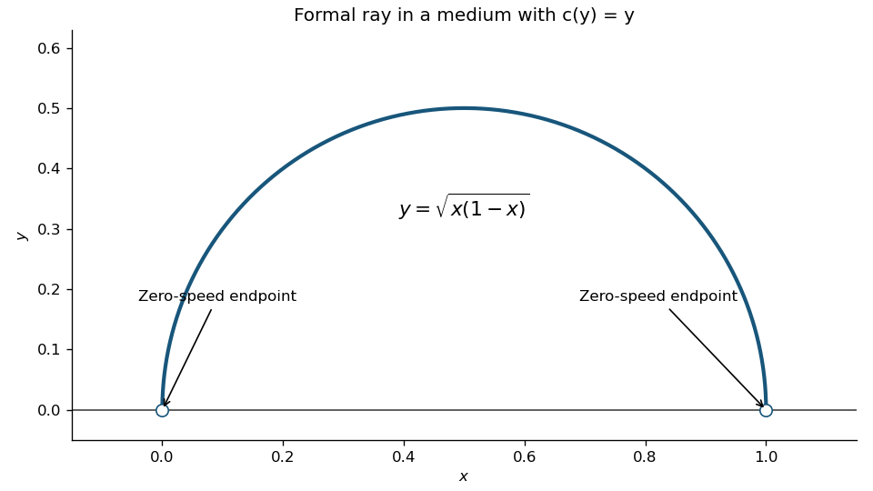

# Paper 1

↑ **Parent:** [Ib](../ib.md)

[https://www.maths.cam.ac.uk/undergrad/pastpapers/files/2003/PaperIB_1.pdf](https://www.maths.cam.ac.uk/undergrad/pastpapers/files/2003/PaperIB_1.pdf)

**Table of contents**

- [1F](#1f)
  - [i](#1f/i)
    - [Solution](#1f/i/solution)
  - [ii](#1f/ii)
    - [Solution](#1f/ii/solution)
  - [iii](#1f/iii)
    - [Solution](#1f/iii/solution)
- [2D](#2d)
  - [Solution](#2d/solution)
- [3H](#3h)
  - [Solution](#3h/solution)
- [4F](#4f)
  - [Solution](#4f/solution)
- [5E](#5e)
  - [Solution](#5e/solution)
- [6C](#6c)
  - [Solution](#6c/solution)
- [7B](#7b)
  - [Solution](#7b/solution)
- [8G](#8g)
  - [Solution](#8g/solution)
- [9A](#9a)
  - [Solution](#9a/solution)
- [10F](#10f)
  - [Solution](#10f/solution)
- [11D](#11d)
  - [a](#11d/a)
    - [Solution](#11d/a/solution)
  - [b](#11d/b)
    - [Solution](#11d/b/solution)
- [12H](#12h)
  - [Solution](#12h/solution)
- [13F](#13f)
  - [Solution](#13f/solution)
- [14E](#14e)
  - [a](#14e/a)
    - [Solution](#14e/a/solution)
  - [b](#14e/b)
    - [Solution](#14e/b/solution)
  - [c](#14e/c)
    - [Solution](#14e/c/solution)
  - [d](#14e/d)
    - [Solution](#14e/d/solution)
- [15C](#15c)
  - [Solution](#15c/solution)
- [16B](#16b)
  - [Solution](#16b/solution)
- [17G](#17g)
  - [a](#17g/a)
    - [Solution](#17g/a/solution)
  - [b](#17g/b)
    - [Solution](#17g/b/solution)
  - [c](#17g/c)
    - [Solution](#17g/c/solution)
  - [d](#17g/d)
    - [Solution](#17g/d/solution)
- [18A](#18a)
  - [Solution](#18a/solution)

## 1F

↑ **Parent:** [Paper 1](paper-1.md)

<h3 id="1f/i">i</h3>

↑ **Parent:** [1F](#1f)

<h4 id="1f/i/solution">Solution</h4>

↑ **Parent:** [I](#1f/i)

We prove the equivalence by a cycle of implications. First assume closedness and boundedness. Given a [sequence](../../../real-analysis.md#sequence) $(x_j)$ in $E$, boundedness puts each coordinate in a fixed closed bounded real interval. Apply the one-dimensional [Bolzano-Weierstrass theorem](../../../real-analysis.md#bolzano-weierstrass-theorem) to its first coordinate to extract a convergent subsequence, then apply it to the second coordinate of that subsequence, and continue through the finitely many coordinates. The final subsequence converges coordinatewise to some $x\in\mathbb R^n$. It also converges in the [Euclidean norm](../../../functional-analysis.md#euclidean-norm), since the sum of the squares of its finitely many coordinate differences tends to zero. Since $E$ is a [closed set](../../../topology.md#closed-set), this limit belongs to $E$. Thus **closedness and boundedness imply the required subsequence property**. No higher-dimensional compactness theorem has been assumed.

<h3 id="1f/ii">ii</h3>

↑ **Parent:** [1F](#1f)

<h4 id="1f/ii/solution">Solution</h4>

↑ **Parent:** [Ii](#1f/ii)

Assume the subsequence property, and let $f:E\to\mathbb R$ be a [continuous function](../../../calculus.md#continuous-function). If $f$ were unbounded, for each positive integer $j$ we could choose $x_j\in E$ with $|f(x_j)|>j$. There is a subsequence $x_{j_k}\to x$ with $x\in E$. By [continuity](../../../calculus.md#continuous-function), $f(x_{j_k})\to f(x)$, so that real sequence is bounded. But $|f(x_{j_k})|>j_k\to\infty$, a contradiction. Hence **every continuous real-valued function on $E$ is bounded**. This is the bounded-function consequence of [sequential compactness](../../../geometry-and-topology.md#sequentially-compact-space).

<h3 id="1f/iii">iii</h3>

↑ **Parent:** [1F](#1f)

<h4 id="1f/iii/solution">Solution</h4>

↑ **Parent:** [Iii](#1f/iii)

Assume every [continuous function](../../../calculus.md#continuous-function) $E\to\mathbb R$ is bounded. The [Euclidean norm](../../../functional-analysis.md#euclidean-norm) function $x\mapsto\|x\|$ is continuous, so its boundedness proves that $E$ is a [bounded set](../../../topological-analysis.md#bounded-set).

If $E$ were not a [closed set](../../../topology.md#closed-set), there would be $a\in\overline E\setminus E$. Choose $x_j\in E$ with $\|x_j-a\|<1/j$. The function $f(x)=1/\|x-a\|$ is continuous everywhere on $E$, because its denominator is nonzero there. Yet $f(x_j)>j$, contradicting the hypothesis. Thus $E$ is closed. Together with the two previous implications this proves **all three conditions are equivalent**. The empty set satisfies all three conditions trivially. This is the Euclidean case of the [bounded-continuous-function characterization of compact metric spaces](../../../topological-analysis.md#bounded-continuous-function-characterization-of-compact-metric-spaces).

## 2D

↑ **Parent:** [Paper 1](paper-1.md)

<h3 id="2d/solution">Solution</h3>

↑ **Parent:** [2D](#2d)

For positive differentiable speed $c(y)$ and a smooth ray written as a graph $y(x)$, the [Fermat principle](../../../physics.md#fermat-principle) minimizes travel time

$$
\mathcal T[y]=\int_{x_0}^{x_1}\frac{\sqrt{1+y'^2}}{c(y)}\,dx.
$$

A variation vanishing at the endpoints gives the [Euler-Lagrange equation](../../../analysis.md#euler-lagrange-equation) for $F=\sqrt{1+y'^2}/c$. Its derivatives are $F_y=-c'\sqrt{1+y'^2}/c^2$ and $F_{y'}=y'/(c\sqrt{1+y'^2})$. Thus

$$
\frac d{dx}F_{y'}-F_y=\frac{y''}{c(1+y'^2)^{3/2}}+\frac{c'}{c^2\sqrt{1+y'^2}}=0,
$$

and multiplying by $c^2(1+y'^2)^{3/2}$ gives

$$
\boxed{c(y)y''+c'(y)(1+y'^2)=0.}
$$

The displayed differential equation requires differentiability, beyond mere continuity of $c$. For constant positive speed it reduces to $y''=0$, so rays are straight lines; a straight segment minimizes travel time because it has the shortest Euclidean length.

For $c(y)=y$ in the positive-height region, the [Beltrami identity](../../../analysis.md#beltrami-identity) gives $F-y'F_{y'}=1/[y\sqrt{1+y'^2}]=1/R$. Hence $y^2(1+y'^2)=R^2$, whose nonvertical solutions are $(x-h)^2+y^2=R^2$. Formally imposing the given boundary points fixes $h=1/2$, $R=1/2$, and gives the [ray in a linear-speed medium](../../../physics.md#ray-in-a-linear-speed-medium)

$$
\boxed{y(x)=\sqrt{x(1-x)},\qquad 0<x<1.}
$$

It is the upper semicircle of diameter one, with vertical limiting tangents at its endpoints.

**[Figure 1](#2d/image-formal-semicircular-ray-with-zero-speed-ideal-endpoints-in-the-linear-speed-medium). Formal semicircular ray with zero-speed ideal endpoints in the linear-speed medium**.

There is a necessary endpoint qualification. The speed is zero at the two stated endpoints. For any rectifiable path entering positive height, $ds/y\geq |dy|/y$, and its travel time diverges logarithmically on leaving or approaching height zero. Thus **the semicircle is the formal interior ray, but there is no finite-time minimizer between the zero-speed endpoints**. For endpoints at height $\epsilon>0$ the circular ray has radius $\sqrt{1/4+\epsilon^2}$ and finite travel time $2\operatorname{arsinh}(1/(2\epsilon))$, which tends to infinity as $\epsilon\downarrow0$. This explains the intended semicircle as a limiting [hyperbolic geodesic](../../../geometry-and-topology.md#geodesic-in-the-poincare-half-plane-model), without asserting finite travel time where $c=0$.

## 3H

↑ **Parent:** [Paper 1](paper-1.md)

<h3 id="3h/solution">Solution</h3>

↑ **Parent:** [3H](#3h)

Put $z_i=x_i-\bar x$, so $\sum z_i=0$. The [ordinary least squares](../../../statistical-modelling.md#ordinary-least-squares) criterion is $S(\alpha,\beta)=\sum_i(Y_i-\alpha-\beta z_i)^2$. Setting both partial derivatives to zero gives $\sum_i(Y_i-\alpha-\beta z_i)=0$ and $\sum_i z_i(Y_i-\alpha-\beta z_i)=0$. Therefore, provided $S_{xx}=\sum z_i^2>0$, the [centred simple linear regression](../../../linear-regression.md#centred-simple-linear-regression) estimators are

$$
\boxed{\widehat\alpha=\bar Y,\qquad\widehat\beta=\frac{\sum_i(x_i-\bar x)Y_i}{\sum_i(x_i-\bar x)^2}.}
$$

The Hessian of $S$ is $2\operatorname{diag}(n,S_{xx})$, which is positive definite, so this stationary point is the unique minimum. From the mean-zero errors, both estimators are unbiased; independence and common error [variance](../../../variance.md) give $\operatorname{Var}\widehat\alpha=\sigma^2/n$, $\operatorname{Var}\widehat\beta=\sigma^2/S_{xx}$, and zero [covariance](../../../variance.md#covariance). Normality is not needed for this derivation. If all $x_i$ coincide, the slope is not identifiable and only the intercept is determined.

Using the PDF data gives $\bar x=6.2$, $\bar y=42.4$, $S_{xx}=86.8$ and $S_{xy}=-257.4$. In particular, the fourth cost is 37 in the PDF; the TeX's 75 is a transcription error and would contradict the supplied covariance sum. The fitted [simple linear regression](../../../linear-regression.md#simple-linear-regression) is

$$
\boxed{\widehat y=42.4-\frac{1287}{434}(x-6.2).}
$$

Here the centred intercept estimate is 42.4; an intercept at $x=0$ would instead be $\widehat\alpha-\widehat\beta\bar x$. For eight units the predicted unit cost is

$$
\boxed{\widehat y(8)=42.4-\frac{1287}{434}(1.8)\approx37.06\ \text{pounds}.}
$$

## 4F

↑ **Parent:** [Paper 1](paper-1.md)

<h3 id="4f/solution">Solution</h3>

↑ **Parent:** [4F](#4f)

Use the [Poincaré half-plane model](../../../geometry-and-topology.md#poincare-half-plane-model), $\mathbb H=\{x+iy:y>0\}$ with metric $ds^2=(dx^2+dy^2)/y^2$. Its [hyperbolic lines](../../../geometry-and-topology.md#hyperbolic-line) are vertical lines and semicircles centred on the real boundary, hence orthogonal to that boundary. Each has two [ideal endpoints](../../../geometry-and-topology.md#ideal-endpoint) in $\mathbb R\cup\{\infty\}$. Distinct [parallel hyperbolic lines](../../../geometry-and-topology.md#parallel-hyperbolic-lines) are disjoint inside $\mathbb H$ and share one ideal endpoint; distinct [ultraparallel hyperbolic lines](../../../geometry-and-topology.md#ultraparallel-hyperbolic-lines) are disjoint and share none. Intersecting lines are neither. Because the metric is conformal to the Euclidean metric, the two notions of angle agree.

Apply a hyperbolic [isometry](../../../riemannian-geometry.md#isometry) taking one line $l$ to the imaginary axis, whose ideal endpoints are $0,\infty$. If the other line $l'$ is ultraparallel, its endpoints are two finite nonzero real numbers of the same sign. Reflect if necessary to write them as $0<a<b$. Then $l'$ is the semicircle with centre $c=(a+b)/2$ and radius $r=(b-a)/2$.

Every [hyperbolic line](../../../geometry-and-topology.md#hyperbolic-line) perpendicular to the imaginary axis must be a semicircle centred at zero: at the intersection its tangent has to be horizontal, forcing its real centre to coincide with zero. Let its radius be $R$. Orthogonality to the circle representing $l'$ requires $c^2=R^2+r^2$, since the radii to the intersection form a right triangle. Consequently

$$
\boxed{R^2=c^2-r^2=ab.}
$$

This has exactly one positive solution. The circles intersect above the real axis: $c-r=a<\sqrt{ab}<b=c+r$. Hence the required [common perpendicular of ultraparallel hyperbolic lines](../../../geometry-and-topology.md#common-perpendicular-of-ultraparallel-hyperbolic-lines) exists and is unique.

Conversely, if $l'$ intersects the imaginary axis, its endpoints straddle zero and the same equation would require $R^2=ab<0$, which is impossible. If $l'$ has endpoint zero, it gives $R^2=0$, not a line. If its shared endpoint is infinity, $l'$ is another vertical line; no circle centred at zero meets a distinct vertical line with horizontal tangent. Thus parallel lines have no common perpendicular either. These cases exhaust distinct lines, proving **a unique common perpendicular exists exactly for ultraparallel lines**.

## 5E

↑ **Parent:** [Paper 1](paper-1.md)

<h3 id="5e/solution">Solution</h3>

↑ **Parent:** [5E](#5e)

Define the [linear map](../../../vector-space.md#linear-map) $A:\mathbb R^5\to\mathbb R^2$ by the two prescribed left-hand sides. Then $V=\ker A$, so it is a [vector subspace](../../../vector-space.md#vector-subspace): it contains zero, and linear combinations of vectors with zero image still have zero image.

Subtract the first equation from the second to obtain $a_2=-2a_3-3a_4-4a_5$. The first equation then gives $a_1=a_3+2a_4+3a_5$. Consequently

$$
(a_1,a_2,a_3,a_4,a_5)=a_3(1,-2,1,0,0)+a_4(2,-3,0,1,0)+a_5(3,-4,0,0,1).
$$

Each of the three displayed vectors satisfies both equations, and the decomposition proves they span $V$. If their linear combination is zero, its third, fourth and fifth coordinates respectively force all three coefficients to vanish. They are therefore [linearly independent](../../../vector-space.md#linear-independence), giving the [basis](../../../vector-space.md#basis)

$$
\boxed{\{(1,-2,1,0,0),\ (2,-3,0,1,0),\ (3,-4,0,0,1)\},\qquad\dim V=3.}
$$

## 6C

↑ **Parent:** [Paper 1](paper-1.md)

<h3 id="6c/solution">Solution</h3>

↑ **Parent:** [6C](#6c)

Follow a fluid particle released at time $s$, and use $\tau$ for its running time. Its [pathline](../../../fluid-mechanics.md#pathline) satisfies $dx/d\tau=1$, $dy/d\tau=\tau x$ and $dz/d\tau=0$, with zero position at $\tau=s$. Hence $x(\tau)=\tau-s$, $z(\tau)=0$, and

$$
y(t)=\int_s^t\tau(\tau-s)d\tau=\frac{t^3}{3}-\frac{st^2}{2}+\frac{s^3}{6}.
$$

At observation time $t$, set $x=t-s$. Substitution gives the [streakline](../../../fluid-mechanics.md#streakline)

$$
\boxed{(x,y,z)=\left(t-s,\ \frac12t(t-s)^2-\frac16(t-s)^3,\ 0\right),\quad y=\frac12tx^2-\frac16x^3.}
$$

The curve is parameterized by release times $s\leq t$. If release starts at time zero, only $0\leq x\leq t$ is occupied. This is a [streakline](../../../fluid-mechanics.md#streakline), the positions of different particles released at one fixed point, rather than an instantaneous [streamline](../../../fluid-mechanics.md#streamline) of this unsteady flow.

## 7B

↑ **Parent:** [Paper 1](paper-1.md)

<h3 id="7b/solution">Solution</h3>

↑ **Parent:** [7B](#7b)

Since $u$ and $v$ are [harmonic conjugates](../../../partial-differential-equation.md#harmonic-conjugate), $f=u+iv$ is a [holomorphic function](../../../complex-analysis.md#holomorphic-function) on $D$, with $u_x=v_y$ and $u_y=-v_x$. The entire function $w\mapsto e^{iw^2}$ can be composed with $f$. Its value is

$$
e^{if^2}=e^{i(u^2-v^2+2iuv)}=e^{-2uv}\bigl[\cos(u^2-v^2)+i\sin(u^2-v^2)\bigr]=U+iV.
$$

By the complex [chain rule](../../../calculus.md#chain-rule) the composition is holomorphic on $D$, so its real and imaginary parts obey the [Cauchy-Riemann equations](../../../analysis.md#cauchy-riemann-equations). They are harmonic as well: differentiating those equations gives $U_{xx}+U_{yy}=V_{yx}-V_{xy}=0$ and likewise $V_{xx}+V_{yy}=0$. Hence **$U,V$ are a pair of harmonic conjugates on $D$**. No simple-connectivity assumption is needed because the conjugate pair is already supplied globally. The PDF has $e^{-2uv}$ in both expressions; the differing TeX exponents are transcription defects.

## 8G

↑ **Parent:** [Paper 1](paper-1.md)

<h3 id="8g/solution">Solution</h3>

↑ **Parent:** [8G](#8g)

Nondegeneracy of $b$ means both radicals are zero: if $b(x,y)=0$ for every $y$, then $x=0$, and the analogous implication holds in the other variable. Define [linear maps](../../../vector-space.md#linear-map) $B_U:U\to V^*$ and $B_V:V\to U^*$ by $B_U(x)(y)=b(x,y)$ and $B_V(y)(x)=b(x,y)$. Both are injective. Finite dimensionality gives $\dim U\leq\dim V$ and $\dim V\leq\dim U$, so they are [isomorphisms](../../../algebra.md#isomorphism).

Similarly define $C_U(x)(y)=c(x,y)$ and $C_V(y)(x)=c(x,y)$, which are linear by bilinearity. Set

$$
\boxed{S=B_U^{-1}C_U,\qquad T=B_V^{-1}C_V.}
$$

Then $S$ and $T$ are [linear endomorphisms](../../../algebra.md#linear-endomorphism) of $U$ and $V$, respectively, and their definitions give $b(Sx,y)=c(x,y)=b(x,Ty)$ for every pair. These [dual isomorphisms induced by a nondegenerate pairing](../../../linear-algebra.md#dual-isomorphisms-induced-by-a-nondegenerate-pairing) also prove uniqueness. No symmetry of $b$, and no identification of the two vector spaces, is required.

## 9A

↑ **Parent:** [Paper 1](paper-1.md)

<h3 id="9a/solution">Solution</h3>

↑ **Parent:** [9A](#9a)

Interpret the box as an [infinite square well](../../../quantum-mechanics.md#infinite-square-well), with zero potential on $0<x<a$ and impenetrable walls. The wavefunction vanishes at both walls. The time-independent [Schrödinger equation](../../../physics.md#schrodinger-equation) inside is $-\hbar^2\psi''/(2m)=E\psi$. Multiplying by $\psi^*$ and [integration by parts](../../../calculus.md#integration-by-parts) shows $E\int|\psi|^2dx=(\hbar^2/(2m))\int|\psi'|^2dx>0$ for any nonzero state with the wall conditions.

For $E>0$, put $k^2=2mE/\hbar^2$. The condition at zero gives $\psi=A\sin(kx)$, and the condition at $a$ requires $\sin(ka)=0$. The zero value of $k$ gives only the zero wavefunction, so the allowed [energy eigenvalues](../../../quantum-mechanics.md#energy-eigenvalue) are

$$
\boxed{E_n=\frac{\hbar^2\pi^2n^2}{2ma^2},\qquad n=1,2,3,\ldots.}
$$

The corresponding normalized [energy eigenstates](../../../quantum-mechanics.md#energy-eigenstate) are $\sqrt{2/a}\sin(n\pi x/a)$. Each level is nondegenerate in this one-dimensional problem. A nonzero constant interior potential would add that constant to all energies.

## 10F

↑ **Parent:** [Paper 1](paper-1.md)

<h3 id="10f/solution">Solution</h3>

↑ **Parent:** [10F](#10f)

A [metric space](../../../topological-analysis.md#metric-space) is a set $X$ with a nonnegative symmetric distance $d$, zero exactly for equal points, satisfying $d(x,z)\leq d(x,y)+d(y,z)$. A [Cauchy sequence](../../../real-analysis.md#cauchy-sequence) is a sequence for which, given any $\epsilon>0$, there is $N$ such that $d(x_n,x_m)<\epsilon$ whenever $n,m\geq N$.

For a [pseudometric](../../../topological-analysis.md#pseudometric), zero distance defines an [equivalence relation](../../../set-theory.md#equivalence-relation). Reflexivity and symmetry are immediate; transitivity follows from $d(x,z)\leq d(x,y)+d(y,z)=0$ when both terms vanish. Define $d_Q([x],[y])=d(x,y)$. If $x\sim x'$ and $y\sim y'$, the triangle inequality gives $d(x,y)\leq d(x',y')$ and its reversed version gives equality. Thus the definition is independent of representatives. The nonnegative, symmetric and triangle properties descend, while zero distance means precisely that the two classes are equal. It is therefore a [metric quotient of a pseudometric](../../../topological-analysis.md#metric-quotient-of-a-pseudometric).

Now take two [Cauchy sequences](../../../real-analysis.md#cauchy-sequence) in the original metric space. Two applications of the triangle inequality give

$$
|d(x_n,y_n)-d(x_m,y_m)|\leq d(x_n,x_m)+d(y_n,y_m).
$$

The right-hand side is arbitrarily small when both indices are large, so $(d(x_n,y_n))$ is a real Cauchy sequence and has a finite real limit. Consequently

$$
\overline d((x_n),(y_n))=\lim_n d(x_n,y_n)
$$

is well defined. Nonnegativity, symmetry and zero self-distance follow by passing to the limit in the corresponding properties of $d$. Passing to the limit in $d(x_n,z_n)\leq d(x_n,y_n)+d(y_n,z_n)$ gives its triangle inequality. Thus $\overline d$ is a pseudometric on $C$, and the preceding quotient construction makes $C/R$ a metric space.

Map $x\in X$ to the class of its constant sequence. The distance between two such classes is $d(x,y)$, so this is an injective [isometric embedding](../../../riemannian-geometry.md#isometric-embedding). It is surjective exactly when every Cauchy sequence $(x_n)$ is equivalent to a constant sequence $(x)$, that is, when $d(x_n,x)\to0$ for some $x\in X$. This is precisely [completeness](../../../topological-analysis.md#completeness). Hence

$$
\boxed{X\longrightarrow C/R\text{ is bijective if and only if }X\text{ is complete}.}
$$

The quotient is the [Cauchy-sequence construction of a metric completion](../../../topological-analysis.md#cauchy-sequence-construction-of-a-metric-completion); the conclusion requires no assumption that $X$ is compact.

## 11D

↑ **Parent:** [Paper 1](paper-1.md)

<h3 id="11d/a">a</h3>

↑ **Parent:** [11D](#11d)

<h4 id="11d/a/solution">Solution</h4>

↑ **Parent:** [A](#11d/a)

Away from the source point, the [Green function](../../../analysis.md#green-s-function) obeys the homogeneous equation and must satisfy the appropriate endpoint condition. Thus it has the form $A\sin(kx)$ to the left of $\xi$ and $B\sin(k(\pi-x))$ to the right. It must be continuous at $\xi$: otherwise its second distributional derivative would contain an unwanted derivative of a [Dirac delta](../../../distribution-theory.md#dirac-delta-function). Integrating across $\xi$ gives the jump condition $G_x(\xi^+,\xi)-G_x(\xi^-,\xi)=1$.

The left and right homogeneous solutions $u=\sin(kx)$, $v=\sin(k(\pi-x))$ have constant [Wronskian](../../../differential-equation.md#wronskian)

$$
uv'-u'v=-k\sin(k\pi).
$$

This is nonzero for real noninteger $k$. Dividing the product of the left and right solutions by that Wronskian therefore gives the [Dirichlet Helmholtz Green function on an interval](../../../analysis.md#dirichlet-helmholtz-green-function-on-an-interval)

$$
\boxed{G(x,\xi)=-\frac{\sin(k\min(x,\xi))\sin(k(\pi-\max(x,\xi)))}{k\sin(k\pi)}.}
$$

The formula vanishes at both endpoints, is continuous at the source and has derivative jump one, verifying all distributional and boundary conditions. A difference of two such Green functions would be a homogeneous Dirichlet solution; it vanishes because $\sin(k\pi)\ne0$, proving uniqueness. Although zero is excluded by the stated noninteger condition, the removable $k\to0$ limit is $-\min(x,\xi)(\pi-\max(x,\xi))/\pi$.

<h3 id="11d/b">b</h3>

↑ **Parent:** [11D](#11d)

<h4 id="11d/b/solution">Solution</h4>

↑ **Parent:** [B](#11d/b)

First use a homogeneous solution to meet the nonzero endpoint values:

$$
y_h(x)=\frac{a\sin(k(\pi-x))+b\sin(kx)}{\sin(k\pi)}.
$$

It satisfies $y_h''+k^2y_h=0$, $y_h(0)=a$ and $y_h(\pi)=b$. The [Green-function representation](../../../analysis.md#green-function-representation) then gives

$$
\boxed{y(x)=\frac{a\sin(k(\pi-x))+b\sin(kx)}{\sin(k\pi)}+\int_0^\pi G(x,\xi)f(\xi)\,d\xi.}
$$

Applying the differential operator to the integral gives $f(x)$ by the defining [Dirac delta](../../../distribution-theory.md#dirac-delta-function) property of $G$, and that integral vanishes at the endpoints. For continuous $f$ this is a classical solution; integrable $f$ also gives the corresponding weak solution. The same nonresonant homogeneous argument as in part (a) proves uniqueness.

## 12H

↑ **Parent:** [Paper 1](paper-1.md)

<h3 id="12h/solution">Solution</h3>

↑ **Parent:** [12H](#12h)

Assume the two normal samples are independent. Write $n_X=6$, $n_Y=21$, and let $S_X,S_Y$ denote their residual sums of squares about the respective sample means. The joint [likelihood function](../../../statistical-modelling.md#likelihood-function), apart from its constant factor, is

$$
L=(v_X)^{-n_X/2}(v_Y)^{-n_Y/2}\exp\left[-\frac{\sum(X_i-\mu_X)^2}{2v_X}-\frac{\sum(Y_j-\mu_Y)^2}{2v_Y}\right],
$$

where $v_X=\sigma_X^2$, $v_Y=\sigma_Y^2$. For every fixed variance pair the means maximize this likelihood at $\bar X,\bar Y$, because $\sum(X_i-\mu_X)^2=S_X+n_X(\bar X-\mu_X)^2$, and likewise for $Y$.

Under equal variances, differentiate the profiled log-likelihood to obtain $\widehat v_0=(S_X+S_Y)/(n_X+n_Y)$. Without the order constraint, the separate variance maxima are $\widehat v_X=S_X/n_X$, $\widehat v_Y=S_Y/n_Y$. If $\widehat v_X>\widehat v_Y$ they lie in the alternative. If their order is reversed, maximizing over $v_X\geq v_Y$ puts the optimum on the equal-variance boundary. These assertions also follow by strict concavity in the precisions $1/v_X,1/v_Y$.

Thus the [one-sided likelihood-ratio test for two normal variances](../../../statistical-modelling.md#one-sided-likelihood-ratio-test-for-two-normal-variances) uses the quotient of the null maximum to the maximum over null and ordered alternative:

$$
\Lambda=\begin{cases}\displaystyle\frac{(S_X/n_X)^{n_X/2}(S_Y/n_Y)^{n_Y/2}}{[(S_X+S_Y)/(n_X+n_Y)]^{(n_X+n_Y)/2}},&R>1,\\1,&R\leq1,\end{cases}\qquad R=\frac{S_X/n_X}{S_Y/n_Y}.
$$

To identify the rejection direction, put $q=S_X/(S_X+S_Y)$. Up to constants, $\log\Lambda=(n_X/2)\log q+(n_Y/2)\log(1-q)$. Its derivative is $[n_X-(n_X+n_Y)q]/[2q(1-q)]$, negative on the ordered branch $q>n_X/(n_X+n_Y)$. Hence small likelihood ratios mean a large sample variance ratio.

The null law must account for estimating both means. By [Cochran's theorem](../../../statistical-modelling.md#cochran-s-theorem), $S_X/\sigma^2$ and $S_Y/\sigma^2$ are independent random variables with [chi-squared distributions](../../../probability-theory.md#chi-squared-distribution) of 5 and 20 degrees of freedom. Consequently the exact null statistic is

$$
F=\frac{S_X/5}{S_Y/20}\sim F_{5,20}.
$$

It is an increasing multiple of $R$, so an upper-tail critical region is the likelihood-ratio rejection region. The observed statistic is $F=(30/5)/(40/20)=3$. The supplied 95th percentile is 2.71, so

$$
\boxed{3>2.71:\quad\text{reject equal variances at the 5 percent level in favor of }\sigma_X^2>\sigma_Y^2.}
$$

The [F-distribution](../../../continuous-probability-distribution.md#f-distribution) degrees of freedom are $5,20$, not $6,21$, although the variance maximum-likelihood estimates themselves have denominators $6,21$.

## 13F

↑ **Parent:** [Paper 1](paper-1.md)

<h3 id="13f/solution">Solution</h3>

↑ **Parent:** [13F](#13f)

The [Poincaré half-plane model](../../../geometry-and-topology.md#poincare-half-plane-model) has [Riemannian metric](../../../differential-geometry.md#riemannian-metric) $ds^2=(dx^2+dy^2)/y^2=|dz|^2/(\operatorname{Im}z)^2$. Every [Möbius transformation](../../../group-theory.md#mobius-transformation) preserving this half-plane can be represented as $f(z)=(Az+B)/(Cz+D)$ with real coefficients and $\Delta=AD-BC>0$. Direct calculation gives

$$
f'(z)=\frac{\Delta}{(Cz+D)^2},\qquad\operatorname{Im}f(z)=\frac{\Delta\operatorname{Im}z}{|Cz+D|^2}.
$$

Therefore $|df|/\operatorname{Im}f=|dz|/\operatorname{Im}z$, proving it is an [isometry](../../../riemannian-geometry.md#isometry).

The imaginary axis is a [hyperbolic geodesic](../../../geometry-and-topology.md#geodesic-in-the-poincare-half-plane-model). Its distance from $ib$ to $ic$ is $|\int_b^cdy/y|=|\log(c/b)|$. This is also the minimum over all paths, since path length is at least $|\int dy/y|$. The two vertical points at distance $r$ from $ib$ are $ibe^{-r}$ and $ibe^r$. Reflection in the imaginary axis preserves the [hyperbolic circle](../../../geometry-and-topology.md#hyperbolic-circle) and its centre. Since it is assumed to be a Euclidean circle, its Euclidean centre lies on that axis and its two vertical intersections determine the Euclidean centre and radius:

$$
\boxed{\text{Euclidean centre }ib\cosh r,\qquad\text{Euclidean radius }b\sinh r.}
$$

This proves the [hyperbolic circle in the upper half-plane](../../../geometry-and-topology.md#hyperbolic-circle-in-the-upper-half-plane) formula for the specified centre.

For the horizontal-distance calculation, the geodesic joining $ib$ to $a+ib$ is the semicircle of centre $a/2$ and radius $R=\sqrt{b^2+a^2/4}$. Parameterize it as $z=a/2+Re^{i\theta}$. Its metric length is $|d\theta|/\sin\theta$. If the right endpoint angle is $\theta_0$, then $\sin\theta_0=b/R$, $\cos\theta_0=a/(2R)$, and the other endpoint angle is $\pi-\theta_0$. Hence

$$
d_H(ib,a+ib)=\int_{\theta_0}^{\pi-\theta_0}\frac{d\theta}{\sin\theta}=2\log\frac{R+a/2}{b}=2\operatorname{arsinh}\frac a{2b}.
$$

The [equality of horizontal hyperbolic and Euclidean distances](../../../geometry-and-topology.md#equality-of-horizontal-hyperbolic-and-euclidean-distances) therefore requires

$$
\boxed{b=\frac{a}{2\sinh(a/2)}.}
$$

Let $t=a/2>0$. The derivative of $t/\sinh t$ has the sign of $\sinh t-t\cosh t$. This quantity vanishes at zero and has derivative $-t\sinh t<0$, so the height function is strictly decreasing. Its limits are one at $a\downarrow0$ and zero at $a\to\infty$. Continuity and the [intermediate value theorem](../../../calculus.md#intermediate-value-theorem) prove that **each $0<b<1$ has exactly one positive matching separation $a$**.

## 14E

↑ **Parent:** [Paper 1](paper-1.md)

<h3 id="14e/a">a</h3>

↑ **Parent:** [14E](#14e)

<h4 id="14e/a/solution">Solution</h4>

↑ **Parent:** [A](#14e/a)

Choose a [basis](../../../vector-space.md#basis) $e_1,\ldots,e_k$ for $U\cap U'$. Extend it to a basis $e_1,\ldots,e_k,u_1,\ldots,u_r$ of $U$, and separately to a basis $e_1,\ldots,e_k,v_1,\ldots,v_s$ of $U'$. The combined list spans $U+U'$.

To prove [linear independence](../../../vector-space.md#linear-independence), suppose a linear combination of the combined list is zero. Then the combination of the $v_j$ lies in $U\cap U'$, so it can be expressed using the $e_i$. Independence of the chosen basis of $U'$ forces every $v_j$ coefficient to vanish. Independence of the chosen basis of $U$ then forces the remaining coefficients to vanish. Thus the combined list is a basis, with $k+r+s$ elements. This proves the [dimension formula for a sum of subspaces](../../../vector-space.md#dimension-formula-for-a-sum-of-subspaces):

$$
\boxed{\dim(U+U')=\dim U+\dim U'-\dim(U\cap U').}
$$

<h3 id="14e/b">b</h3>

↑ **Parent:** [14E](#14e)

<h4 id="14e/b/solution">Solution</h4>

↑ **Parent:** [B](#14e/b)

For every $v\in V$, $(\alpha+\beta)v=\alpha v+\beta v$, so $\operatorname{im}(\alpha+\beta)\subseteq\operatorname{im}\alpha+\operatorname{im}\beta$. Taking [dimensions](../../../vector-space.md#dimension-vector-space) and applying the preceding [dimension formula for a sum of subspaces](../../../vector-space.md#dimension-formula-for-a-sum-of-subspaces) gives

$$
\operatorname{rank}(\alpha+\beta)\leq\dim(\operatorname{im}\alpha+\operatorname{im}\beta)\leq\operatorname{rank}\alpha+\operatorname{rank}\beta.
$$

This proves the upper [rank bounds for a sum of linear maps](../../../vector-space.md#rank-bounds-for-a-sum-of-linear-maps), without assuming the two images have zero intersection.

<h3 id="14e/c">c</h3>

↑ **Parent:** [14E](#14e)

<h4 id="14e/c/solution">Solution</h4>

↑ **Parent:** [C](#14e/c)

Apply the preceding [rank bounds for a sum of linear maps](../../../vector-space.md#rank-bounds-for-a-sum-of-linear-maps) to $\alpha=(\alpha+\beta)+(-\beta)$. Since multiplying a [linear map](../../../vector-space.md#linear-map) by $-1$ does not change its image, $\operatorname{rank}\alpha\leq\operatorname{rank}(\alpha+\beta)+\operatorname{rank}\beta$. Thus $\operatorname{rank}(\alpha+\beta)\geq\operatorname{rank}\alpha-\operatorname{rank}\beta$. Interchanging the maps gives the other difference, proving

$$
\boxed{\operatorname{rank}(\alpha+\beta)\geq|\operatorname{rank}\alpha-\operatorname{rank}\beta|.}
$$

<h3 id="14e/d">d</h3>

↑ **Parent:** [14E](#14e)

<h4 id="14e/d/solution">Solution</h4>

↑ **Parent:** [D](#14e/d)

Use the standard [basis](../../../vector-space.md#basis) $e_1,\ldots,e_n$. For the smallest possible rank, set $\alpha e_j=e_j$ for $j\leq r$ and zero otherwise, and set $\beta e_j=-e_j$ for $j\leq s$ and zero otherwise. Then the maps have ranks $r,s$, while their sum has nonzero diagonal entries only for $r<j\leq s$. Hence

$$
\boxed{\operatorname{rank}(\alpha+\beta)=s-r.}
$$

For full rank when $r+s\geq n$, instead take $\alpha e_j=e_j$ for $j\leq r$ and zero otherwise, and $\beta e_j=e_j$ for $j\geq n-s+1$ and zero otherwise. Their supports cover every basis index because $n-s+1\leq r+1$. The sum has diagonal entries one where just one map is nonzero and two where both are nonzero. None vanish over $\mathbb R$, so these [linear maps](../../../vector-space.md#linear-map) have ranks $r,s$ and

$$
\boxed{\operatorname{rank}(\alpha+\beta)=n.}
$$

## 15C

↑ **Parent:** [Paper 1](paper-1.md)

<h3 id="15c/solution">Solution</h3>

↑ **Parent:** [15C](#15c)

For constant density, divide the incompressible [Euler equations](../../../fluid-mechanics.md#euler-equations-for-an-inviscid-fluid) by $\rho$. The vector identity $(\mathbf u\cdot\nabla)\mathbf u=\nabla(|\mathbf u|^2/2)-\mathbf u\times\boldsymbol\omega$ converts them into $\partial_t\mathbf u=\mathbf u\times\boldsymbol\omega-\nabla(p/\rho+|\mathbf u|^2/2)$. Taking the [curl](../../../calculus.md#curl) eliminates the gradient. Expand the curl of the cross product, use $\nabla\cdot\mathbf u=0$ and $\nabla\cdot\boldsymbol\omega=0$, and obtain

$$
\partial_t\boldsymbol\omega=(\boldsymbol\omega\cdot\nabla)\mathbf u-(\mathbf u\cdot\nabla)\boldsymbol\omega,\qquad\boxed{\frac{D\boldsymbol\omega}{Dt}=(\boldsymbol\omega\cdot\nabla)\mathbf u.}
$$

This is the [vorticity equation](../../../physics.md#vorticity-equation), including [vortex stretching](../../../physics.md#vortex-stretching). Without constant density there would in general be an additional baroclinic term; the displayed source equations use the constant-density interpretation.

For the specified velocity, direct differentiation gives $\boldsymbol\omega=2\Omega(t)\mathbf k$. It is spatially uniform, while $(\boldsymbol\omega\cdot\nabla)\mathbf u=2\beta\boldsymbol\omega$. Thus $\Omega'=2\beta\Omega$ and

$$
\boxed{\boldsymbol\omega=2\Omega(0)e^{2\beta t}\mathbf k.}
$$

If the positive $z$ direction agrees with the initial vorticity, $2\Omega(0)=\omega_0$ as written in the question. For opposite rotation the initial component is signed and the vector has the corresponding minus sign.

For a material particle, $d(x^2+y^2)/dt=2x(-\beta x-\Omega y)+2y(-\beta y+\Omega x)=-2\beta(x^2+y^2)$, while $dz/dt=2\beta z$. The initial material circle therefore evolves into

$$
\boxed{a(t)=e^{-\beta t},\qquad x^2+y^2=a(t)^2,\qquad z=e^{2\beta t}=a(t)^{-2}.}
$$

The azimuthal rotation changes the labels of points on the circle but not the circle as a set. Its counterclockwise [circulation](../../../fluid-mechanics.md#circulation-physics), viewed from positive $z$, is

$$
\Gamma=\oint\mathbf u\cdot d\mathbf r=2\pi\Omega(t)a(t)^2=2\pi\Omega(0)=\pi\omega_0
$$

for the positive-orientation convention. The strain contributes no tangential velocity. Thus **circulation stays constant although vorticity grows and the enclosed material area shrinks**, illustrating [Kelvin's circulation theorem](../../../fluid-mechanics.md#kelvin-s-circulation-theorem) for a material loop in constant-density inviscid flow with no nonconservative body force.

## 16B

↑ **Parent:** [Paper 1](paper-1.md)

<h3 id="16b/solution">Solution</h3>

↑ **Parent:** [16B](#16b)

The boundary circles intersect at $z=1$ and $z=i$: subtracting their equations gives $x+y=1$, and $x^2+y^2=1$ then gives these two points. Their intersection is the open lens in the first quadrant, bounded by the unit-circle arc from $1$ to $i$ and the corresponding lower-left arc of the circle centred at $1+i$.

**[Figure 2](#16b/image-open-circular-lens-bounded-by-the-unit-discs-centred-at-zero-and-one-plus-i). Open circular lens bounded by the unit discs centred at zero and one plus i**.

To construct a [conformal map of a circular lens](../../../geometry-and-topology.md#conformal-map-of-a-circular-lens), apply the [Möbius transformation](../../../group-theory.md#mobius-transformation)

$$
\zeta(z)=\frac{1-z}{z-i}.
$$

It sends the intersection points to zero and infinity, so both boundary circles become straight lines through zero. The boundary arc of the circle centred at zero maps to the ray of argument $-\pi/4$; the other arc maps to the ray of argument $+\pi/4$. For example, their arc midpoints $e^{i\pi/4}$ and $(1+i)-e^{i\pi/4}$ give these signs. The interior point $(1+i)/2$ maps to one, selecting the sector $-\pi/4<\arg\zeta<\pi/4$, not the complementary sector. As a Möbius bijection, $\zeta$ maps the whole lens onto that sector.

Squaring maps this sector bijectively onto the right half-plane: arguments double into $(-\pi/2,\pi/2)$, and the inverse is the unique square root with argument in $(-\pi/4,\pi/4)$. Thus

$$
\boxed{F(z)=\left(\frac{1-z}{z-i}\right)^2\quad\text{maps }A\text{ conformally onto }\{\operatorname{Re}w>0\}.}
$$

The derivative never vanishes inside the lens: $\zeta$ and its derivative are nonzero there. Finally use the [Cayley transform between the half-plane and disk](../../../complex-analysis.md#cayley-transform-between-the-half-plane-and-disk) $w\mapsto(w-1)/(w+1)$. Since $|w-1|<|w+1|$ precisely when $\operatorname{Re}w>0$, it maps the right half-plane bijectively to the unit disc. The desired second map is

$$
\boxed{G(z)=\frac{(1-z)^2-(z-i)^2}{(1-z)^2+(z-i)^2}.}
$$

The denominator cannot vanish in the lens because $F(z)$ has positive real part. The maps send the centre-line test point $(1+i)/2$ to one and zero respectively.

## 17G

↑ **Parent:** [Paper 1](paper-1.md)

<h3 id="17g/a">a</h3>

↑ **Parent:** [17G](#17g)

<h4 id="17g/a/solution">Solution</h4>

↑ **Parent:** [A](#17g/a)

For a nonzero residue $a$ modulo an odd [prime](../../../number-theory.md#prime-number) $p$, the [Legendre symbol](../../../number-theory.md#legendre-symbol) $(a/p)$ equals $+1$ if $a$ is a nonzero square modulo $p$ and $-1$ otherwise. The extension to multiples of $p$ has value zero. [Euler's criterion](../../../number-theory.md#euler-s-criterion) states

$$
\boxed{a^{(p-1)/2}\equiv\left(\frac ap\right)\pmod p,\qquad p\nmid a.}
$$

<h3 id="17g/b">b</h3>

↑ **Parent:** [17G](#17g)

<h4 id="17g/b/solution">Solution</h4>

↑ **Parent:** [B](#17g/b)

Apply [Euler's criterion](../../../number-theory.md#euler-s-criterion) to $-1$. It gives

$$
\boxed{\left(\frac{-1}{p}\right)=(-1)^{(p-1)/2}=\begin{cases}1,&p\equiv1\pmod4,\\-1,&p\equiv3\pmod4.\end{cases}}
$$

For $p\nmid ab$, the same criterion gives $(ab/p)\equiv (ab)^{(p-1)/2}=a^{(p-1)/2}b^{(p-1)/2}\equiv(a/p)(b/p)\pmod p$. Both sides are integers in $\{1,-1\}$, which are distinct modulo an odd prime, so congruence implies equality. This proves [multiplicativity of the Legendre symbol](../../../number-theory.md#multiplicativity-of-the-legendre-symbol):

$$
\boxed{\left(\frac{ab}{p}\right)=\left(\frac ap\right)\left(\frac bp\right).}
$$

<h3 id="17g/c">c</h3>

↑ **Parent:** [17G](#17g)

<h4 id="17g/c/solution">Solution</h4>

↑ **Parent:** [C](#17g/c)

Since $n$ is nonzero modulo $p$, it has a unique multiplicative inverse $m$ in the nonzero residues. The inverse cannot be $-1$ because that would imply $n=-1$, excluded by the range. Thus $1\leq m\leq p-2$ as claimed. The congruence $mn=1$ gives

$$
n(n+1)=n^2(1+m)\pmod p.
$$

The [Legendre symbol](../../../number-theory.md#legendre-symbol) of the nonzero square $n^2$ is one. Using [multiplicativity of the Legendre symbol](../../../number-theory.md#multiplicativity-of-the-legendre-symbol) therefore gives

$$
\boxed{\left(\frac{n(n+1)}p\right)=\left(\frac{1+m}p\right).}
$$

<h3 id="17g/d">d</h3>

↑ **Parent:** [17G](#17g)

<h4 id="17g/d/solution">Solution</h4>

↑ **Parent:** [D](#17g/d)

Inversion permutes the nonzero residues excluding $-1$. Hence the result of part (c) changes the requested sum into

$$
\sum_{n=1}^{p-2}\left(\frac{n(n+1)}p\right)=\sum_{m=1}^{p-2}\left(\frac{m+1}p\right)=\sum_{j=2}^{p-1}\left(\frac jp\right).
$$

There are exactly $(p-1)/2$ nonzero squares: the map $x\mapsto x^2$ on nonzero residues identifies exactly the pairs $x,-x$, because $x^2=y^2$ implies $x=\pm y$ in the [finite field](../../../algebra.md#finite-field). Thus there are equally many nonzero squares and nonsquares, and the [complete Legendre-symbol sum](../../../number-theory.md#complete-legendre-symbol-sum) is zero. Removing the $j=1$ term leaves

$$
\boxed{\sum_{n=1}^{p-2}\left(\frac{n(n+1)}p\right)=-1.}
$$

## 18A

↑ **Parent:** [Paper 1](paper-1.md)

<h3 id="18a/solution">Solution</h3>

↑ **Parent:** [18A](#18a)

The [expectation value](../../../quantum-mechanics.md#expectation-value) of an [observable](../../../quantum-mechanics.md#observable) is the mean outcome of repeated measurements on identically prepared systems in the normalized state. For a [self-adjoint](../../../linear-operator-theory.md#self-adjoint-operator) $Q$ it is real and equals $\langle\psi,Q\psi\rangle$. Assume the state belongs to the domains needed for the second moments and the commutator below, so all these quantities exist.

For real $\lambda$, positivity of the squared norm gives

$$
0\leq\|(Q+i\lambda P)\psi\|^2=\langle Q^2\rangle+\lambda^2\langle P^2\rangle+i\lambda\langle[Q,P]\rangle.
$$

The commutator expectation is purely imaginary, so this is a real quadratic in $\lambda$. If $\langle P^2\rangle>0$, its minimum is nonnegative exactly when its discriminant is nonpositive. If $\langle P^2\rangle=0$, nonnegativity for all real $\lambda$ forces the linear coefficient to vanish, yielding the same conclusion. Thus

$$
\boxed{\langle Q^2\rangle\langle P^2\rangle\geq\frac14|\langle[Q,P]\rangle|^2.}
$$

Replace the observables by their centred versions $Q-\langle Q\rangle I$, $P-\langle P\rangle I$. Their commutator is unchanged, and their second moments are the [variances](../../../variance.md) $(\Delta Q)^2,(\Delta P)^2$. Taking square roots gives the [Robertson uncertainty principle](../../../quantum-theory.md#robertson-uncertainty-principle)

$$
\boxed{\Delta Q\,\Delta P\geq\frac12|\langle[Q,P]\rangle|.}
$$

For the [quantum harmonic oscillator](../../../quantum-mechanics.md#quantum-harmonic-oscillator), $p=-i\hbar\partial_x$ gives $[x,p]\psi=i\hbar\psi$. The uncentred inequality above consequently gives $\langle x^2\rangle\langle p^2\rangle\geq\hbar^2/4$. The [arithmetic-geometric mean inequality](../../../mathematical-optimization.md#arithmetic-geometric-mean-inequality) now yields

$$
\langle H\rangle=\frac{\langle p^2\rangle}{2m}+\frac{m\omega^2\langle x^2\rangle}{2}\geq\omega\sqrt{\langle x^2\rangle\langle p^2\rangle}\geq\boxed{\frac12\hbar\omega}.
$$

This is a bound for every normalized state of finite oscillator energy, not just an eigenstate. It is attained by the centred Gaussian ground state, for which $\langle p^2\rangle=m^2\omega^2\langle x^2\rangle$ and the uncertainty product equals $\hbar/2$.

## ↑ Ancestors (8)

1. [Ib](../ib.md)
2. [2003](../../2003.md)
3. [Past exam of the mathematics course of the University of Cambridge](../../../past-exam-of-the-mathematics-course-of-the-university-of-cambridge.md)
4. [Mathematics course of the University of Cambridge](../../../university-of-cambridge.md#mathematics-course-of-the-university-of-cambridge)
5. [Course of the University of Cambridge](../../../university-of-cambridge.md#course-of-the-university-of-cambridge)
6. [University of Cambridge](../../../university-of-cambridge.md)
7. [List of universities](../../../README.md#list-of-universities)
8. [Codex Wiki](../../../README.md)
