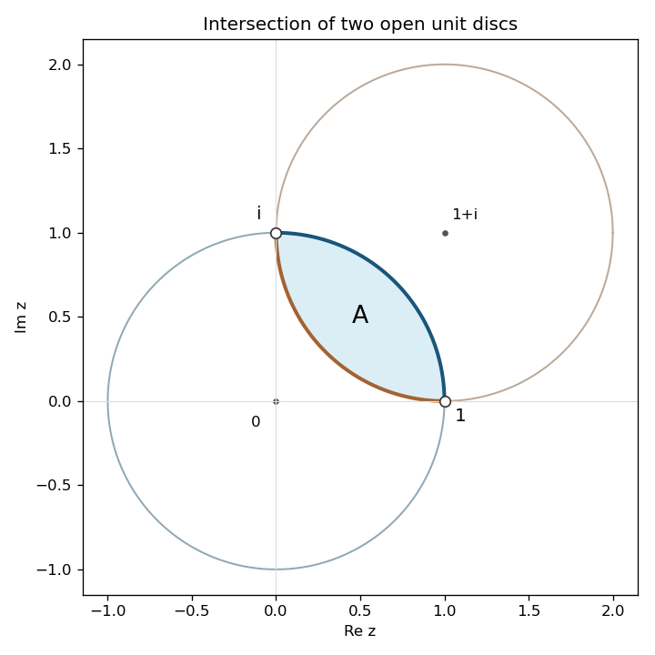

<h1 id="16b/solution">Solution</h1>

↑ **Parent:** [16B](../16b.md)

The boundary circles intersect at $z=1$ and $z=i$: subtracting their equations gives $x+y=1$, and $x^2+y^2=1$ then gives these two points. Their intersection is the open lens in the first quadrant, bounded by the unit-circle arc from $1$ to $i$ and the corresponding lower-left arc of the circle centred at $1+i$.

**[Figure 2](#16b/image-open-circular-lens-bounded-by-the-unit-discs-centred-at-zero-and-one-plus-i). Open circular lens bounded by the unit discs centred at zero and one plus i**.

To construct a [conformal map of a circular lens](../../../../../conformal-map-of-a-circular-lens.md), apply the [Möbius transformation](../../../../../mobius-transformation.md)

$$
\zeta(z)=\frac{1-z}{z-i}.
$$

It sends the intersection points to zero and infinity, so both boundary circles become straight lines through zero. The boundary arc of the circle centred at zero maps to the ray of argument $-\pi/4$; the other arc maps to the ray of argument $+\pi/4$. For example, their arc midpoints $e^{i\pi/4}$ and $(1+i)-e^{i\pi/4}$ give these signs. The interior point $(1+i)/2$ maps to one, selecting the sector $-\pi/4<\arg\zeta<\pi/4$, not the complementary sector. As a Möbius bijection, $\zeta$ maps the whole lens onto that sector.

Squaring maps this sector bijectively onto the right half-plane: arguments double into $(-\pi/2,\pi/2)$, and the inverse is the unique square root with argument in $(-\pi/4,\pi/4)$. Thus

$$
\boxed{F(z)=\left(\frac{1-z}{z-i}\right)^2\quad\text{maps }A\text{ conformally onto }\{\operatorname{Re}w>0\}.}
$$

The derivative never vanishes inside the lens: $\zeta$ and its derivative are nonzero there. Finally use the [Cayley transform between the half-plane and disk](../../../../../cayley-transform-between-the-half-plane-and-disk.md) $w\mapsto(w-1)/(w+1)$. Since $|w-1|<|w+1|$ precisely when $\operatorname{Re}w>0$, it maps the right half-plane bijectively to the unit disc. The desired second map is

$$
\boxed{G(z)=\frac{(1-z)^2-(z-i)^2}{(1-z)^2+(z-i)^2}.}
$$

The denominator cannot vanish in the lens because $F(z)$ has positive real part. The maps send the centre-line test point $(1+i)/2$ to one and zero respectively.

## ↑ Ancestors (10)

1. [16B](../16b.md)
2. [Paper 1](../../paper-1-split.md)
3. [Ib](../../split.md)
4. [2003](../../../split.md)
5. [Past exam of the mathematics course of the University of Cambridge](../../../../split.md)
6. [Mathematics course of the University of Cambridge](../../../../../mathematics-course-of-the-university-of-cambridge.md)
7. [Course of the University of Cambridge](../../../../../course-of-the-university-of-cambridge.md)
8. [University of Cambridge](../../../../../university-of-cambridge-split.md)
9. [List of universities](../../../../../list-of-universities.md)
10. [Codex Wiki](../../../../../split.md)
