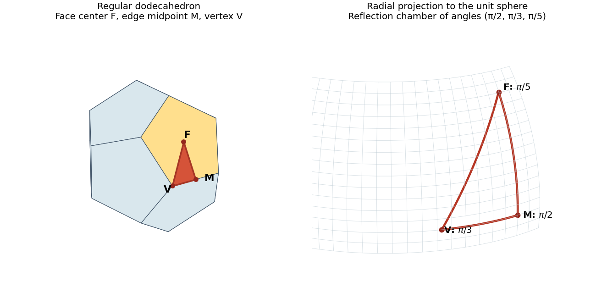

<h1 id="14f/solution">Solution</h1>

↑ **Parent:** [14F](../14f.md)

Work first on the unit [sphere](../../../../../sphere.md). A [spherical lune](../../../../../spherical-lune.md) of angle $\alpha$ has area $2\alpha$: its fraction of sphere area is $\alpha/(2\pi)$. The three [great circles](../../../../../great-circle.md) extending the sides of a nondegenerate [spherical triangle](../../../../../spherical-triangle.md) divide the sphere into four antipodal pairs of triangular regions. Call the desired region $T$, of area $A$, and its three adjacent regions $T_1,T_2,T_3$, of areas $A_1,A_2,A_3$. These four regions contain one region from each antipodal pair, so $A+A_1+A_2+A_3=2\pi$. The lune at each vertex consists of $T$ and one of these adjacent regions. Therefore, if the three interior angles are $\alpha,\beta,\gamma$,

$$
2(\alpha+\beta+\gamma)=3A+A_1+A_2+A_3=2A+2\pi,
$$

which proves the [spherical excess formula](../../../../../spherical-excess-formula.md), the spherical-triangle form of the [Gauss-Bonnet theorem](../../../../../gauss-bonnet-theorem.md):

$$
\boxed{A=\alpha+\beta+\gamma-\pi.}
$$

For a sphere of radius $s$, multiply this area by $s^2$.

Triangulate a convex spherical $n$-gon by diagonals from a vertex. There are $n-2$ [spherical triangles](../../../../../spherical-triangle.md), and their angles add to the polygon's interior angle sum. Thus its unit-sphere area is

$$
\boxed{A=\sum_{i=1}^n\alpha_i-(n-2)\pi.}
$$

For a nondegenerate convex regular polygon in an [open hemisphere](../../../../../open-hemisphere.md), area is positive and each angle is less than $\pi$, giving $(n-2)\pi/n<\alpha<\pi$. Every angle in this interval occurs. Indeed place $n$ vertices at equal longitude spacings and colatitude $t\in(0,\pi/2)$ about a pole, and join consecutive vertices by shorter [great circle](../../../../../great-circle.md) arcs. The polygon is convex and regular. Split a central isosceles [spherical triangle](../../../../../spherical-triangle.md) along the perpendicular to its edge. The resulting right [spherical triangle](../../../../../spherical-triangle.md) has angles $\pi/n$, $\alpha/2$, $\pi/2$, and hypotenuse $t$. The angular [spherical law of cosines](../../../../../spherical-law-of-cosines.md) yields

$$
0=-\cos(\pi/n)\cos(\alpha/2)+\sin(\pi/n)\sin(\alpha/2)\cos t,
$$

so $\cot(\alpha/2)=\cos t\tan(\pi/n)$. As $t$ increases from $0$ to $\pi/2$, $\alpha$ increases continuously through exactly

$$
\boxed{\frac{n-2}{n}\pi<\alpha<\pi,\qquad n\geq3.}
$$

The endpoints are degenerate limits, not strict convex polygons.

For the [spherical triangle reflection group](../../../../../spherical-triangle-reflection-group.md), positive area requires $1/p+1/q+1/r>1$. Each angle is less than $\pi$, so the integer denominators are at least two. Arrange $p\leq q\leq r$. If $p\geq3$ the sum is at most one, hence $p=2$. If $q\geq4$ the sum is again at most one; thus either $q=2$ and any $r\geq2$ works, or $q=3$ and $r=3,4,5$. These triangles exist, for example as the reflection chambers of a regular dihedral configuration, tetrahedron, cube, and dodecahedron, respectively.

To count group elements using the assumed [tessellation](../../../../../tessellation.md), first label the original triangle's three vertices by their types and propagate these labels through side [reflections](../../../../../reflection-mathematics.md). Around a type-$p$ vertex there are $2p$ sectors; the associated alternating reflections make a full turn and return the labels unchanged. The same holds at the other types. Every closed path in the dual tessellation is generated by these circuits around vertices, since the sphere is [simply connected](../../../../../simply-connected-space.md). Thus the labels are globally consistent, including when two angle denominators coincide. Every generated [isometry](../../../../../isometry.md) preserves these labels. An element stabilizing a triangle therefore fixes its three vertices and is the identity. Consequently group elements correspond bijectively to triangles, and area gives

$$
|G|=\frac{4\pi}{\pi(1/p+1/q+1/r-1)}.
$$

The possibilities, including permutations of the entries, are

$$
\boxed{\begin{array}{c|c}(p,q,r)&|G|\\\hline(2,2,n),\ n\geq2&4n\\(2,3,3)&24\\(2,3,4)&48\\(2,3,5)&120\end{array}}.
$$

Here is an explicit [dodecahedron](../../../../../dodecahedron.md) construction for the last case, avoiding an assumption about which vertices of the tessellation to join. Put $\varphi=(1+\sqrt5)/2$, and take the [convex hull](../../../../../convex-hull.md) of the twenty points

$$
(\pm1,\pm1,\pm1),\quad (0,\pm\varphi^{-1},\pm\varphi),\quad(\pm\varphi^{-1},\pm\varphi,0),\quad(\pm\varphi,0,\pm\varphi^{-1}),
$$

with independent signs. They all have squared radius three. The supporting plane $\varphi y+z=\varphi^2$ contains the five vertices

$$
(1,1,1),\ (\varphi^{-1},\varphi,0),\ (-\varphi^{-1},\varphi,0),\ (-1,1,1),\ (0,\varphi^{-1},\varphi)
$$

in cyclic order. Consecutive distances are $2/\varphi$, and nonconsecutive distances are $2$, so this is a regular pentagon. Changing the two signs in its normal $(0,\varphi,1)$ and cyclically permuting coordinates gives twelve supporting planes, all with a congruent pentagon. Each listed vertex lies on three of these faces; the sixty face-edge incidences pair into thirty edges. The faces form a closed convex polyhedral surface with $20-30+12=2$, hence exhaust the boundary of the [convex hull](../../../../../convex-hull.md). This constructs a regular [dodecahedron](../../../../../dodecahedron.md).

Choose the spherical directions of a face center $F=(0,\varphi,1)$, the midpoint $M=(0,\varphi,0)$ of its edge between $(\pm\varphi^{-1},\varphi,0)$, and that edge's endpoint $V=(\varphi^{-1},\varphi,0)$. Normalize these to the unit sphere. The three side planes of triangle $FMV$ are $x=0$, $z=0$, and $\mathbf n\cdot\mathbf x=0$ with $\mathbf n=(-\varphi,\varphi^{-1},-1)$. Their [reflections](../../../../../reflection-mathematics.md) are coordinate sign changes in the first two cases and

$$
H(\mathbf x)=\mathbf x-\frac12(\mathbf n\cdot\mathbf x)\mathbf n
$$

in the third, since $\|\mathbf n\|^2=4$. Substitution in the twenty listed vertices, using $\varphi^2=\varphi+1$, shows that all three [reflections](../../../../../reflection-mathematics.md) permute the vertex set. The side-plane angles give interior angles $\pi/2$ at $M$, $\pi/3$ at $V$, and $\pi/5$ at $F$ because $|n_z|/\|\mathbf n\|=1/2$ and $|n_x|/\|\mathbf n\|=\varphi/2=\cos(\pi/5)$. Thus this triangle is congruent to $\Delta$, and its side-generated group is $G$, conjugated by the aligning [isometry](../../../../../isometry.md).

**[Figure 1](#14f/image-regular-dodecahedron-and-its-face-center-edge-midpoint-vertex-spherical-reflection-chamber). Regular dodecahedron and its face-center, edge-midpoint, vertex spherical reflection chamber**.

It already has $120$ elements. Conversely, a symmetry of the [dodecahedron](../../../../../dodecahedron.md) is determined by the image of one face, one vertex on that face, and the orientation along its boundary: there are at most $12\cdot5\cdot2=120$ choices. An [isometry](../../../../../isometry.md) fixing these choices fixes that face pointwise and must preserve the polyhedron's interior side, hence is the identity. Therefore **the complete symmetry group of the constructed dodecahedron is $G$**, including orientation-reversing symmetries.

## ↑ Ancestors (10)

1. [14F](../14f.md)
2. [Paper 3](../../paper-3-split.md)
3. [Ib](../../split.md)
4. [2003](../../../split.md)
5. [Past exam of the mathematics course of the University of Cambridge](../../../../split.md)
6. [Mathematics course of the University of Cambridge](../../../../../mathematics-course-of-the-university-of-cambridge.md)
7. [Course of the University of Cambridge](../../../../../course-of-the-university-of-cambridge.md)
8. [University of Cambridge](../../../../../university-of-cambridge-split.md)
9. [List of universities](../../../../../list-of-universities.md)
10. [Codex Wiki](../../../../../split.md)
