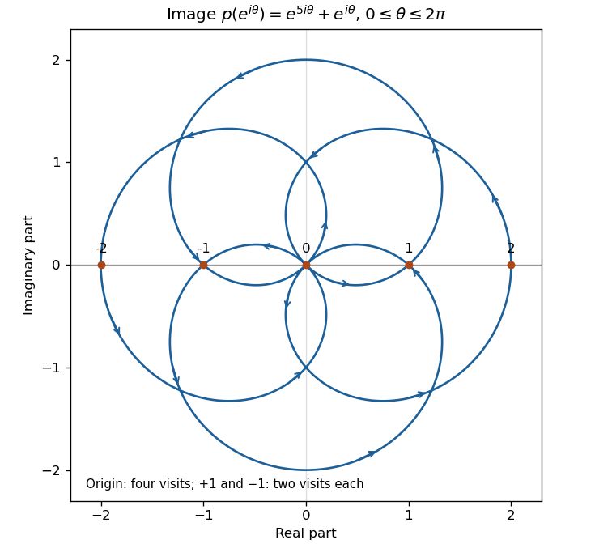

# Paper 4

↑ **Parent:** [Ib](../ib.md)

[https://www.maths.cam.ac.uk/undergrad/pastpapers/files/2003/PaperIB_4.pdf](https://www.maths.cam.ac.uk/undergrad/pastpapers/files/2003/PaperIB_4.pdf)

**Table of contents**

- [1F](#1f)
  - [Solution](#1f/solution)
- [2D](#2d)
  - [a](#2d/a)
    - [Solution](#2d/a/solution)
  - [b](#2d/b)
    - [Solution](#2d/b/solution)
- [3H](#3h)
  - [Solution](#3h/solution)
- [4E](#4e)
  - [a](#4e/a)
    - [Solution](#4e/a/solution)
  - [b](#4e/b)
    - [Solution](#4e/b/solution)
- [5H](#5h)
  - [Solution](#5h/solution)
- [6G](#6g)
  - [Solution](#6g/solution)
- [7C](#7c)
  - [Solution](#7c/solution)
- [8B](#8b)
  - [a](#8b/a)
    - [Solution](#8b/a/solution)
  - [b](#8b/b)
    - [Solution](#8b/b/solution)
  - [c](#8b/c)
    - [Solution](#8b/c/solution)
- [9A](#9a)
  - [Solution](#9a/solution)
- [10F](#10f)
  - [Solution](#10f/solution)
- [11D](#11d)
  - [a](#11d/a)
    - [Solution](#11d/a/solution)
  - [b](#11d/b)
    - [Solution](#11d/b/solution)
- [12H](#12h)
  - [Solution](#12h/solution)
- [13E](#13e)
  - [a](#13e/a)
    - [Solution](#13e/a/solution)
  - [b](#13e/b)
    - [Solution](#13e/b/solution)
  - [c](#13e/c)
    - [Solution](#13e/c/solution)
  - [d](#13e/d)
    - [Solution](#13e/d/solution)
- [14H](#14h)
  - [Solution](#14h/solution)
- [15G](#15g)
  - [a](#15g/a)
    - [Solution](#15g/a/solution)
  - [b](#15g/b)
    - [Solution](#15g/b/solution)
  - [c](#15g/c)
    - [Solution](#15g/c/solution)
  - [d](#15g/d)
    - [Solution](#15g/d/solution)
- [16C](#16c)
  - [Solution](#16c/solution)
- [17B](#17b)
  - [a](#17b/a)
    - [Solution](#17b/a/solution)
  - [b](#17b/b)
    - [Solution](#17b/b/solution)
  - [c](#17b/c)
    - [Solution](#17b/c/solution)
- [18A](#18a)
  - [Solution](#18a/solution)

## 1F

↑ **Parent:** [Paper 4](paper-4.md)

<h3 id="1f/solution">Solution</h3>

↑ **Parent:** [1F](#1f)

[Uniform convergence](../../../real-analysis.md#uniform-convergence) on an interval $I$ means that for every $\epsilon>0$ there is $N$ such that $|f_n(x)-f(x)|<\epsilon$ for every $x\in I$ and every $n\ge N$. Equivalently, the supremum of this difference tends to zero. A [uniform limit](../../../real-analysis.md#uniform-limit) of [continuous functions](../../../calculus.md#continuous-function) is continuous: at a point $x_0$, choose one $f_N$ uniformly within $\epsilon/3$ of $f$, then use [continuity](../../../calculus.md#continuous-function) of $f_N$ to make $|f_N(x)-f_N(x_0)|<\epsilon/3$. The [triangle inequality](../../../topological-analysis.md#triangle-inequality) gives $|f(x)-f(x_0)|<\epsilon$. Thus $f$ is integrable on the compact interval, and

$$
\left|\int_a^b f_n-\int_a^b f\right|\le (b-a)\sup_{[a,b]}|f_n-f|\longrightarrow0.
$$

For the half-line example, differentiating gives $f_n'(x)=n^{-2}e^{-x/n}(1-x/n)$. The maximum is attained at $x=n$, where $f_n(n)=1/(en)$. Therefore **$f_n\to0$ uniformly on $[0,\infty)$**. Nevertheless, the substitution $x=ny$ gives

$$
\boxed{\int_0^\infty f_n(x)\,dx=\int_0^\infty y e^{-y}\,dy=1}.
$$

The integral does not tend to zero. This is the phenomenon that [uniformly vanishing functions can retain a nonzero integral](../../../real-analysis.md#uniformly-vanishing-functions-can-retain-a-nonzero-integral): the finite-length estimate above has no finite analogue for the entire half-line.

## 2D

↑ **Parent:** [Paper 4](paper-4.md)

<h3 id="2d/a">a</h3>

↑ **Parent:** [2D](#2d)

<h4 id="2d/a/solution">Solution</h4>

↑ **Parent:** [A](#2d/a)

Put $v(r,t)=ru(r,t)$. Multiplication of the radial [wave equation](../../../wave-equation.md) by $r$ gives $v_{tt}=c^2v_{rr}$ for $r>0$. In the [characteristic coordinates](../../../partial-differential-equation.md#characteristic-coordinate) $\xi=r+ct$, $\eta=r-ct$, this becomes $v_{\xi\eta}=0$. Integrating first in $\xi$ and then in $\eta$ gives $v=f(\xi)+g(\eta)$. Consequently

$$
\boxed{u(r,t)=\frac{f(r+ct)+g(r-ct)}r}\qquad(r>0).
$$

The two terms are incoming and outgoing radial disturbances. If the field is finite at the origin, their numerators must cancel there; arbitrary independent choices generally produce a $1/r$ singularity.

<h3 id="2d/b">b</h3>

↑ **Parent:** [2D](#2d)

<h4 id="2d/b/solution">Solution</h4>

↑ **Parent:** [B](#2d/b)

For the single-frequency response, use [separation of variables](../../../partial-differential-equation.md#separation-of-variables) with $u=R(r)\sin\omega t$. Set $k=\omega/c$ and $V=rR$; then $V''+k^2V=0$, so $V=C\sin kr+D\cos kr$. A finite origin value forces $D=0$, since $\cos kr/r$ is singular. Since $\sin kr/r\to k$, the prescribed origin amplitude gives $C=A/k$. The [regular time-harmonic spherical wave](../../../wave-equation.md#regular-time-harmonic-spherical-wave) is therefore

$$
\boxed{u(r,t)=A\frac{\sin(\omega r/c)}{\omega r/c}\sin\omega t},
$$

with the quotient defined by its limit at zero.

This answers the literal finite-origin condition in the class of regular single-frequency responses. It is a standing combination of inward and outward waves: the numerator is proportional to $\cos(kr-\omega t)-\cos(kr+\omega t)$. A purely outgoing wave from an ideal point source would instead be proportional to $r^{-1}\sin[\omega(t-r/c)]$, which has no finite prescribed value $u(0,t)$. Such a source must be specified by a singularity strength, for example $\lim_{r\downarrow0}ru$. The source's wording supplies neither an initial field nor an outgoing singular-source normalization; without restriction to the stated harmonic response, a general initial-value problem is not uniquely determined by the one origin condition.

## 3H

↑ **Parent:** [Paper 4](paper-4.md)

<h3 id="3h/solution">Solution</h3>

↑ **Parent:** [3H](#3h)

Use the [Pearson chi-squared goodness-of-fit test](../../../statistical-modelling.md#pearson-chi-squared-goodness-of-fit-test). Under the [null hypothesis](../../../statistical-modelling.md#null-hypothesis), each count has the specified [binomial distribution](../../../discrete-probability-distribution.md#binomial-distribution), and no parameter is estimated from the data. The seven mutually exclusive classes give $7-1=6$ [degrees of freedom](../../../classical-mechanics.md#degree-of-freedom). Their expected counts are all at least five, so the usual [chi-squared asymptotic approximation](../../../probability-theory.md#chi-squared-asymptotic-approximation) does not require pooling. The computed statistic is

$$
X^2=\frac{(-2)^2}{5}+\frac{(-9)^2}{30}+\frac{10^2}{75}+\frac{10^2}{100}
+\frac{(-13)^2}{75}+\frac{2^2}{30}+\frac{2^2}{5}
=\boxed{9.02}.
$$

Since $9.02<12.59$, **do not reject fairness at the 5% level**. The approximate $p$-value is $0.172$. This conclusion concerns agreement with the specified independent fair-coin count model; a nonrejection is not proof of fairness.

## 4E

↑ **Parent:** [Paper 4](paper-4.md)

<h3 id="4e/a">a</h3>

↑ **Parent:** [4E](#4e)

<h4 id="4e/a/solution">Solution</h4>

↑ **Parent:** [A](#4e/a)

[Morera's theorem](../../../complex-analysis.md#morera-s-theorem) states that a continuous complex-valued function on an open set is [holomorphic](../../../complex-analysis.md#complex-differentiability-at-a-point) if its integral around every triangle whose closed interior lies in the set is zero. It is enough to impose this condition locally on disks.

Fix a [disk](../../../topology.md#disk-mathematics) $B$ contained in the open set and a base point $z_0\in B$. Define $F(z)$ as the integral of $f$ along the straight segment from $z_0$ to $z$. The zero triangle integral gives, for sufficiently small $h$,

$$
F(z+h)-F(z)=\int_{[z,z+h]}f(w)\,dw
=h\int_0^1 f(z+th)\,dt.
$$

[Continuity](../../../calculus.md#continuous-function) makes the quotient by $h$ tend to $f(z)$, so $F$ is [holomorphic](../../../complex-analysis.md#complex-differentiability-at-a-point) and $F'=f$. To justify that its derivative is [holomorphic](../../../complex-analysis.md#complex-differentiability-at-a-point), apply the [Cauchy integral formula](../../../analysis.md#cauchy-integral-formula) for $F$ on a smaller [circle](../../../topology.md#circle):

$$
F'(z)=\frac1{2\pi i}\int_{\Gamma}\frac{F(w)}{(w-z)^2}\,dw.
$$

The right side may be differentiated again inside the [circle](../../../topology.md#circle) because its denominator stays uniformly away from zero on the [contour](../../../complex-analysis.md#complex-integration-contour). Thus $F'=f$ is [holomorphic](../../../complex-analysis.md#complex-differentiability-at-a-point) on $B$. Such disks cover the open set, proving the theorem.

<h3 id="4e/b">b</h3>

↑ **Parent:** [4E](#4e)

<h4 id="4e/b/solution">Solution</h4>

↑ **Parent:** [B](#4e/b)

The [uniform limit theorem](../../../real-analysis.md#uniform-limit-theorem) first gives [continuity](../../../calculus.md#continuous-function) of $f$ on $D$. For any triangle $\Gamma$ whose closed interior is in $D$, the [Cauchy integral theorem](../../../complex-analysis.md#cauchy-s-integral-theorem) gives $\int_\Gamma f_n(z)\,dz=0$. Moreover,

$$
\left|\int_\Gamma(f-f_n)(z)\,dz\right|
\le\operatorname{length}(\Gamma)\sup_D|f-f_n|\longrightarrow0.
$$

Hence $\int_\Gamma f=0$, and [Morera's theorem](../../../complex-analysis.md#morera-s-theorem) proves that **$f$ is analytic on $D$**. In fact, the proof only needs [locally uniform convergence](../../../real-analysis.md#locally-uniform-convergence) on compact subsets, since each triangle is compact; the stated [uniform convergence](../../../real-analysis.md#uniform-convergence) on the entire domain is stronger.

## 5H

↑ **Parent:** [Paper 4](paper-4.md)

<h3 id="5h/solution">Solution</h3>

↑ **Parent:** [5H](#5h)

For [constrained optimization](../../../numerical-analysis.md#constrained-optimization) in minimization form, let $x\in X$, $g_i(x)\le0$ and $h_j(x)=0$, and define the [Lagrangian](../../../calculus-of-variations.md#lagrangian)

$$
L(x,\lambda,\nu)=f(x)+\sum_i\lambda_i g_i(x)+\sum_j\nu_jh_j(x).
$$

The [Lagrangian sufficiency theorem](../../../mathematical-optimization.md#lagrange-sufficiency-theorem) says: if $x_*$ is feasible, $\lambda_i\ge0$, $\lambda_i g_i(x_*)=0$ for every $i$, and $x_*$ minimizes $L(\cdot,\lambda,\nu)$ globally over $X$, then $x_*$ minimizes $f$ over the feasible set. Equality multipliers $\nu_j$ may have either sign.

Indeed, for every feasible $x$,

$$
f(x)\ge L(x,\lambda,\nu)\ge L(x_*,\lambda,\nu)=f(x_*).
$$

The first inequality uses the inequality-multiplier signs and the equality constraints; the last equality uses [complementary slackness](../../../mathematical-optimization.md#complementary-slackness). This proves global optimality without assuming [convexity](../../../real-analysis.md#convex-function) or differentiability. The maximization version reverses the relevant signs, or follows by replacing $f$ with $-f$.

When $X$ is convex and the Lagrangian is differentiable and convex, the first-order condition $\nabla_xL(x_*)=0$ implies its global minimum, because $L(x)\ge L(x_*)+\nabla L(x_*)\cdot(x-x_*)$. Thus feasible stationarity plus [complementary slackness](../../../mathematical-optimization.md#complementary-slackness) is sufficient in that convex setting. Mere stationarity in a general nonconvex problem is not the theorem's global-minimum hypothesis.

## 6G

↑ **Parent:** [Paper 4](paper-4.md)

<h3 id="6g/solution">Solution</h3>

↑ **Parent:** [6G](#6g)

For every $u\in U$, write $u=(u-\alpha u)+\alpha u$. The first term lies in $\ker\alpha$, since $\alpha^2=\alpha$, and the second lies in $\operatorname{im}\alpha$. If $v$ belongs to both spaces, write $v=\alpha w$; then $\alpha v=\alpha^2w=\alpha w=v$, whereas membership in the [kernel](../../../linear-algebra.md#kernel-of-a-linear-map) gives $\alpha v=0$. Thus the intersection is zero and

$$
\boxed{U=\ker\alpha\oplus\operatorname{im}\alpha}.
$$

In a [basis](../../../vector-space.md#basis) assembled from [bases](../../../vector-space.md#basis) of these two spaces, the [idempotent linear map](../../../vector-space.md#projection-linear-algebra) has [matrix](../../../vector-space.md#matrix) $\operatorname{diag}(0_{d-r},I_r)$, where $d=\dim U$ and $r=\operatorname{rank}\alpha$. Therefore

$$
\boxed{\chi_\alpha(t)=t^{d-r}(t-1)^r}.
$$

This [basis](../../../vector-space.md#basis) consists entirely of [eigenvectors](../../../linear-operator-theory.md#eigenvector), so **$\alpha$ is diagonalizable over the reals**, including the extreme cases $r=0$ and $r=d$.

## 7C

↑ **Parent:** [Paper 4](paper-4.md)

<h3 id="7c/solution">Solution</h3>

↑ **Parent:** [7C](#7c)

For steady [inviscid flow](../../../fluid-mechanics.md#inviscid-flow) at atmospheric [pressure](../../../thermodynamics.md#pressure), [Bernoulli's equation](../../../fluid-mechanics.md#bernoulli-equation) along a freely falling [streamline](../../../fluid-mechanics.md#streamline) gives $u^2/2+gz=u_0^2/2+gH$. The downward speed is therefore

$$
\boxed{u=u_0\left[1+\frac{2g}{u_0^2}(H-z)\right]^{1/2}}.
$$

For the incompressible jet, [mass conservation](../../../continuum-mechanics.md#mass-conservation) fixes its [volume flux](../../../fluid-mechanics.md#volumetric-flow-rate): $\pi R^2u=\pi a^2u_0$. Consequently

$$
\boxed{R=a\left[1+\frac{2g}{u_0^2}(H-z)\right]^{-1/4}}.
$$

Far from impact, the [inviscid falling jet and radial impact film](../../../fluid-mechanics.md#inviscid-falling-jet-and-radial-impact-film) is thin and nearly horizontal. Let $v$ be its radial speed and $h$ its thickness. The same [volume flux](../../../fluid-mechanics.md#volumetric-flow-rate) now crosses a cylindrical surface of area $2\pi rh$, giving $v=a^2u_0/(2rh)$. At the [free surface](../../../fluid-mechanics.md#free-surface), atmospheric [pressure](../../../thermodynamics.md#pressure) and [Bernoulli's equation](../../../fluid-mechanics.md#bernoulli-equation) give $v^2=u_0^2+2g(H-h)$. Eliminate $v$ to obtain

$$
\boxed{\frac{a^4}{4r^2h^2}=1+\frac{2g}{u_0^2}(H-h)}.
$$

This description assumes a steady incompressible jet, negligible surface tension, and negligible dissipation between the tube and the thin far-field film. It is a free-surface relation, not an assertion that [pressure](../../../thermodynamics.md#pressure) is atmospheric throughout the film or that the impact region itself is thin.

## 8B

↑ **Parent:** [Paper 4](paper-4.md)

<h3 id="8b/a">a</h3>

↑ **Parent:** [8B](#8b)

<h4 id="8b/a/solution">Solution</h4>

↑ **Parent:** [A](#8b/a)

Partial fractions give $f(z)=-1/(z-1)+1/(z-2)$. In the interior [disk](../../../topology.md#disk-mathematics), expand both terms as [geometric series](../../../real-analysis.md#geometric-series):

$$
-\frac1{z-1}=\sum_{n=0}^\infty z^n,\qquad
\frac1{z-2}=-\sum_{n=0}^\infty\frac{z^n}{2^{n+1}}.
$$

Thus the [Laurent series](../../../analysis.md#laurent-series) is a [Taylor series](../../../calculus.md#taylor-series) in this region:

$$
\boxed{f(z)=\sum_{n=0}^\infty(1-2^{-n-1})z^n},\qquad |z|<1.
$$

The nearer [pole](../../../isolated-singularity.md#pole) at $z=1$ determines the radius of convergence.

<h3 id="8b/b">b</h3>

↑ **Parent:** [8B](#8b)

<h4 id="8b/b/solution">Solution</h4>

↑ **Parent:** [B](#8b/b)

In the middle annulus, expand the [pole](../../../isolated-singularity.md#pole) at one in negative powers and the [pole](../../../isolated-singularity.md#pole) at two in positive powers:

$$
-\frac1{z-1}=-\sum_{n=0}^\infty z^{-n-1},\qquad
\frac1{z-2}=-\sum_{n=0}^\infty2^{-n-1}z^n.
$$

Their [geometric series](../../../real-analysis.md#geometric-series) convergence conditions are $|z|>1$ and $|z|<2$, respectively. The required [Laurent series](../../../analysis.md#laurent-series) is

$$
\boxed{f(z)=-\sum_{n=0}^\infty z^{-n-1}-\sum_{n=0}^\infty2^{-n-1}z^n},\qquad1<|z|<2.
$$

<h3 id="8b/c">c</h3>

↑ **Parent:** [8B](#8b)

<h4 id="8b/c/solution">Solution</h4>

↑ **Parent:** [C](#8b/c)

Outside both [poles](../../../isolated-singularity.md#pole), the two [geometric series](../../../real-analysis.md#geometric-series) use negative powers:

$$
-\frac1{z-1}=-\sum_{n=0}^\infty z^{-n-1},\qquad
\frac1{z-2}=\sum_{n=0}^\infty2^n z^{-n-1}.
$$

Hence

$$
\boxed{f(z)=\sum_{n=0}^\infty(2^n-1)z^{-n-1}},\qquad |z|>2.
$$

The coefficient of $z^{-1}$ vanishes, as it must since the [rational function](../../../isolated-singularity.md#rational-function) starts with $z^{-2}$ at infinity.

## 9A

↑ **Parent:** [Paper 4](paper-4.md)

<h3 id="9a/solution">Solution</h3>

↑ **Parent:** [9A](#9a)

For a standard collinear [Lorentz boost](../../../special-relativity.md#lorentz-boost), put $\beta=v/c$ and $\Gamma=(1-\beta^2)^{-1/2}$. Its equations are $x'=\Gamma(x-\beta ct)$ and $ct'=\Gamma(ct-\beta x)$. Define the [rapidity](../../../special-relativity.md#rapidity) $\phi=\operatorname{arctanh}\beta$. Since $\cosh^2\phi-\sinh^2\phi=1$ and $\cosh\phi>0$, $\cosh\phi=\Gamma$ and $\sinh\phi=\Gamma\beta$. Therefore

$$
\boxed{x'=x\cosh\phi-ct\sinh\phi,\qquad
ct'=-x\sinh\phi+ct\cosh\phi}.
$$

Adding and subtracting, and using $\cosh\phi\mp\sinh\phi=e^{\mp\phi}$, gives

$$
\boxed{x'+ct'=e^{-\phi}(x+ct),\qquad x'-ct'=e^\phi(x-ct)}.
$$

A second boost multiplies these factors by $e^{\mp\phi'}$, so the combined [rapidity](../../../special-relativity.md#rapidity) is $\phi+\phi'$. The [hyperbolic tangent](../../../calculus.md#hyperbolic-tangent) addition formula then gives the [relativistic velocity addition](../../../special-relativity.md#velocity-addition-formula) law

$$
\boxed{v''=c\tanh(\phi+\phi')=\frac{v+v'}{1+vv'/c^2}}.
$$

Velocities are signed along the common axis, so this formula also covers oppositely directed boosts.

## 10F

↑ **Parent:** [Paper 4](paper-4.md)

<h3 id="10f/solution">Solution</h3>

↑ **Parent:** [10F](#10f)

Fix $z_0\in E$ and $\epsilon>0$. Choose $N$ so that $\sup_E|f_N-f|<\epsilon/3$, and then choose $\delta>0$ so that $|f_N(z)-f_N(z_0)|<\epsilon/3$ for $z\in E$ with $|z-z_0|<\delta$. The [triangle inequality](../../../topological-analysis.md#triangle-inequality) gives $|f(z)-f(z_0)|<\epsilon$. This proves the [uniform limit theorem](../../../real-analysis.md#uniform-limit-theorem) on the relative topology of $E$, whether or not $E$ is open.

The [Weierstrass M-test](../../../probability-and-statistics.md#weierstrass-m-test) states that if $|u_n(z)|\le M_n$ for every $z\in E$ and $\sum M_n<\infty$, then $\sum u_n$ converges uniformly and absolutely on $E$. Indeed, the supremum of a tail is at most the corresponding tail of $\sum M_n$, proving the uniform Cauchy criterion.

For the given [secant function](../../../geometry-and-topology.md#secant-trigonometry) terms, a denominator can vanish only at $z=n(2k+1)$, an integer. Thus every individual term is continuous off the integers. Fix $z_0\notin\mathbb Z$, and choose a closed [disk](../../../topology.md#disk-mathematics) $K$ about $z_0$ containing no integer. Let $R=\sup_K|\operatorname{Re}z|$ and take $N>2R$. For $n\ge N$, $|\pi\operatorname{Re}z/(2n)|<\pi/4$; the permitted cosine inequality gives

$$
\left|n^{-2}\sec\frac{\pi z}{2n}\right|\le\frac{\sqrt2}{n^2}\quad(z\in K).
$$

The [Weierstrass M-test](../../../probability-and-statistics.md#weierstrass-m-test) makes the tail uniformly convergent on $K$. The finitely many earlier terms are continuous there, so the [uniform limit theorem](../../../real-analysis.md#uniform-limit-theorem) makes their sum continuous at $z_0$. Therefore **$f$ is continuous on $\mathbb C\setminus\mathbb Z$**. The argument is local; a global M-test on the whole punctured plane would fail near its [poles](../../../isolated-singularity.md#pole).

## 11D

↑ **Parent:** [Paper 4](paper-4.md)

<h3 id="11d/a">a</h3>

↑ **Parent:** [11D](#11d)

<h4 id="11d/a/solution">Solution</h4>

↑ **Parent:** [A](#11d/a)

Use [separation of variables](../../../partial-differential-equation.md#separation-of-variables), $\phi=R(r)\Theta(\theta)$. After multiplying the [Laplace equation](../../../partial-differential-equation.md#laplace-equation) by $r^2/(R\Theta)$, the two separated equations are

$$
\Theta''+\lambda\Theta=0,\qquad r^2R''+rR'-\lambda R=0.
$$

Single-valuedness requires $2\pi$-periodicity. Thus the nonconstant angular modes have $\lambda=n^2$, $n=1,2,\ldots$, and angular factors $\cos n\theta,\sin n\theta$. Their radial factors are $r^n,r^{-n}$. The zero mode has constant angular factor and radial solution $A+B\log r$; a term proportional to $\theta$ would be multivalued.

Finiteness at the origin removes the logarithm and negative powers. In the [disk](../../../topology.md#disk-mathematics) the general regular harmonic expansion is

$$
\boxed{\phi=A_0+\sum_{n\ge1}r^n(A_n\cos n\theta+B_n\sin n\theta)}.
$$

For the exterior, regularity at every finite radius allows

$$
\boxed{\phi=C_0+D_0\log r+\sum_{n\ge1}\big[(C_nr^n+D_nr^{-n})\cos n\theta+(E_nr^n+F_nr^{-n})\sin n\theta\big]}.
$$

Coefficients must give convergent harmonic expansions on the domain and the intended boundary regularity at $r=a$. If “finite” is intended to mean bounded as $r\to\infty$, then $D_0=C_n=E_n=0$ and only the constant and decaying modes remain. Infinity is not included in the printed interval; moreover part (b)'s uniform background flow necessarily has an unbounded potential. Stating both interpretations avoids discarding that background mode.

<h3 id="11d/b">b</h3>

↑ **Parent:** [11D](#11d)

<h4 id="11d/b/solution">Solution</h4>

↑ **Parent:** [B](#11d/b)

The far-field derivative fixes the growing $n=1$ cosine coefficient to $U$ and removes all other growing modes. The possible logarithmic term has derivative $D_0/a$ at the wall, so the zero wall derivative removes it. For each decaying Fourier mode, the wall condition relates its coefficient to its growing partner: the $n=1$ cosine partner has coefficient $Ua^2$, and every other partner vanishes. Thus the [potential flow around a circular cylinder](../../../fluid-mechanics.md#potential-flow-around-a-circular-cylinder) has

$$
\boxed{\phi(r,\theta)=U\left(r+\frac{a^2}{r}\right)\cos\theta+C}.
$$

Indeed, $\phi_r=U(1-a^2/r^2)\cos\theta$, which is zero at $r=a$ and tends to $U\cos\theta$ at infinity. The additive constant does not change the velocity. The [equipotential curves](../../../classical-mechanics.md#equipotential-curve) satisfy $(r+a^2/r)\cos\theta=\text{constant}$. They approach vertical straight lines far away and meet the cylinder radially wherever the tangential velocity is nonzero. The two stagnation points are at $\theta=0,\pi$.

**[Figure 1](#11d/b/image-equipotential-curves-outside-a-circular-cylinder-in-uniform-potential-flow). Equipotential curves outside a circular cylinder in uniform potential flow**.

## 12H

↑ **Parent:** [Paper 4](paper-4.md)

<h3 id="12h/solution">Solution</h3>

↑ **Parent:** [12H](#12h)

The [Rao-Blackwell theorem](../../../probability-and-statistics.md#rao-blackwell-theorem) says that, for a [sufficient statistic](../../../probability-and-statistics.md#sufficient-statistic) $T$ and a finite-second-moment estimator $\delta(X)$, the conditional estimator $\delta_T(T)=E_\theta[\delta(X)\mid T]$ can be chosen independently of the unknown parameter and has no greater [mean squared error](../../../statistical-modelling.md#mean-squared-error) for estimating any specified function $g(\theta)$. Sufficiency makes the [conditional distribution](../../../probability-theory.md#conditional-distribution) of the data given $T$ parameter-independent. [Conditional expectation](../../../measure-theory.md#conditional-expectation) preserves the [expectation](../../../probability-theory.md#expected-value), hence preserves unbiasedness. Writing $\delta-g=(\delta-\delta_T)+(\delta_T-g)$, the cross term has [expectation](../../../probability-theory.md#expected-value) zero, because $E[\delta-\delta_T\mid T]=0$. Therefore

$$
E_\theta[(\delta-g)^2]
=E_\theta[(\delta_T-g)^2]+E_\theta[(\delta-\delta_T)^2]
\ge E_\theta[(\delta_T-g)^2].
$$

Equality holds exactly when $\delta=\delta_T$ almost surely. This proves the squared-loss form, including the usual unbiased-estimator [variance](../../../variance.md) statement.

Here $\theta>0$ is necessary for the stated uniform interval. Put $L=X_{(1)}=\min_iX_i$ and $R=X_{(n)}=\max_iX_i$. The joint density factors as

$$
p_\theta(x)=(2\theta)^{-n}\mathbf1\{\theta<L,\ R<3\theta\}
=(2\theta)^{-n}\mathbf1\{R/3<\theta<L\}.
$$

The [factorization theorem for sufficient statistics](../../../probability-and-statistics.md#fisher-neyman-factorization-theorem) shows that **$T=(L,R)$ is sufficient**. Also $E[X_1]=2\theta$, so $X_1/2$ is unbiased and has [variance](../../../variance.md) $\theta^2/12$.

For $n\ge2$, conditional on distinct extrema $l,r$, [exchangeability](../../../probability-theory.md#exchangeable-random-variables) gives probability $1/n$ that $X_1$ is each endpoint; with probability $(n-2)/n$ it is one of the remaining observations, uniform on $(l,r)$. Its conditional mean is consequently

$$
E[X_1\mid L=l,R=r]=\frac{l+r}{n}+\frac{n-2}{n}\frac{l+r}{2}=\frac{l+r}{2}.
$$

Thus the [Rao-Blackwell estimator for a uniform scale interval](../../../probability-and-statistics.md#rao-blackwell-estimator-for-a-uniform-scale-interval) is

$$
\boxed{\widetilde\theta=\frac{L+R}{4}},
$$

which is unbiased and has no greater [mean squared error](../../../statistical-modelling.md#mean-squared-error). For $n=1$, $L=R=X_1$ and the same formula reduces to the original estimator. As a quantitative check, the [covariance of two uniform order statistics](../../../probability-theory.md#covariance-of-two-uniform-order-statistics) gives

$$
\operatorname{Var}(\widetilde\theta)=\frac{\theta^2}{2(n+1)(n+2)}\le\frac{\theta^2}{12}.
$$

For instance, after writing $X_i=\theta+2\theta U_i$, both extreme uniform [variances](../../../variance.md) are $n/[(n+1)^2(n+2)]$ and their [covariance](../../../variance.md#covariance) is $1/[(n+1)^2(n+2)]$. These formulas follow by integrating the joint extreme density $n(n-1)(r-l)^{n-2}$ on $0<l<r<1$; they also display strict improvement for $n>1$.

## 13E

↑ **Parent:** [Paper 4](paper-4.md)

<h3 id="13e/a">a</h3>

↑ **Parent:** [13E](#13e)

<h4 id="13e/a/solution">Solution</h4>

↑ **Parent:** [A](#13e/a)

For a closed piecewise smooth [contour](../../../complex-analysis.md#complex-integration-contour) $\Gamma$ in a domain, null-homologous there and avoiding the [poles](../../../isolated-singularity.md#pole) of a [meromorphic function](../../../isolated-singularity.md#meromorphic-function) $F$, the [residue theorem](../../../analysis.md#residue-theorem) is

$$
\int_\Gamma F(z)\,dz=2\pi i\sum_a n(\Gamma,a)\operatorname{Res}(F;a),
$$

where $n(\Gamma,a)=(2\pi i)^{-1}\int_\Gamma dz/(z-a)$ is the [winding number](../../../complex-analysis.md#winding-number) and the sum runs over enclosed [poles](../../../isolated-singularity.md#pole) with their indices. Suppose now $f$ is meromorphic and has neither zeros nor [poles](../../../isolated-singularity.md#pole) on $\Gamma$. At a zero or [pole](../../../isolated-singularity.md#pole) $a$, write $f(z)=(z-a)^m h(z)$ with $h$ [holomorphic](../../../complex-analysis.md#complex-differentiability-at-a-point) and nonzero, where $m>0$ for a zero and $m<0$ for a [pole](../../../isolated-singularity.md#pole). Then

$$
\frac{f'}f=\frac m{z-a}+\frac{h'}h,
$$

so its [residue](../../../analysis.md#residue) is $m$. Substituting into the [residue theorem](../../../analysis.md#residue-theorem) and changing variables along the [image](../../../set-theory.md#image-of-a-function) [contour](../../../complex-analysis.md#complex-integration-contour) gives the [argument principle](../../../complex-analysis.md#argument-principle):

$$
\boxed{n(f\circ\Gamma,0)=\sum_{f(a)=0}m_a n(\Gamma,a)
-\sum_{a\text{ pole}}p_a n(\Gamma,a)}.
$$

For a positively oriented simple boundary, this is the number of zeros minus [poles](../../../isolated-singularity.md#pole) inside, counted with [multiplicity](../../../polynomial.md#multiplicity-mathematics). The winding-number form also applies to self-intersecting [image](../../../set-theory.md#image-of-a-function) paths.

<h3 id="13e/b">b</h3>

↑ **Parent:** [13E](#13e)

<h4 id="13e/b/solution">Solution</h4>

↑ **Parent:** [B](#13e/b)

Write $z=e^{i\theta}$. The trigonometric sum formulas give

$$
p(e^{i\theta})=2e^{3i\theta}\cos2\theta,\qquad
\operatorname{Im}p=2\sin3\theta\cos2\theta.
$$

Thus the imaginary part is zero either when $\theta=k\pi/3$, $k=0,\ldots,5$, or when $\theta=\pi/4+k\pi/2$, $k=0,\ldots,3$. These two lists are disjoint. At the latter four points $p=0$. At the former six points the real values, in increasing angular order, are

$$
\boxed{2,\ 1,\ -1,\ -2,\ -1,\ 1}.
$$

Equivalently, $z=1$ maps to $2$, $z=-1$ to $-2$, $z=e^{\pm i\pi/3}$ to $1$, $z=e^{\pm2i\pi/3}$ to $-1$, and the four roots of $z^4=-1$ map to zero. These are all the unit-circle points with real [image](../../../set-theory.md#image-of-a-function).

<h3 id="13e/c">c</h3>

↑ **Parent:** [13E](#13e)

<h4 id="13e/c/solution">Solution</h4>

↑ **Parent:** [C](#13e/c)

The [image](../../../set-theory.md#image-of-a-function) [contour](../../../complex-analysis.md#complex-integration-contour) has polar representation $2\cos2\theta\,e^{3i\theta}$. It is invariant under complex conjugation and under reflection through the origin. As $\theta$ runs from zero to $2\pi$, the successive real-axis visits are

$$
2,\ 0,\ 1,\ -1,\ 0,\ -2,\ 0,\ -1,\ 1,\ 0,\ 2,
$$

at angles $0,\pi/4,\pi/3,2\pi/3,3\pi/4,\pi,5\pi/4,4\pi/3,5\pi/3,7\pi/4,2\pi$. To specify the crossing direction, differentiate:

$$
\frac d{d\theta}p(e^{i\theta})=i(5p(e^{i\theta})-4e^{i\theta}).
$$

Its imaginary component is $6$ at the point $2$, $-6$ at $-2$, $3$ at either visit to $1$, and $-3$ at either visit to $-1$. At a visit to zero it is $-4\cos\theta$, nonzero for each of the four angles. Therefore all these visits are transverse crossings of the real axis, even though different arcs share the same [image](../../../set-theory.md#image-of-a-function) point.

**[Figure 2](#13e/c/image-oriented-image-of-the-unit-circle-under-z-to-the-fifth-power-plus-z-showing-its-real-axis-crossings). Oriented image of the unit circle under z to the fifth power plus z, showing its real-axis crossings**.

<h3 id="13e/d">d</h3>

↑ **Parent:** [13E](#13e)

<h4 id="13e/d/solution">Solution</h4>

↑ **Parent:** [D](#13e/d)

Let $N(t)$ count roots in the open [unit disk](../../../geometry-and-topology.md#unit-disk). A boundary crossing can occur only at the real values $0,\pm1,\pm2$ found above, so the count is constant between them. Also $N(-t)=N(t)$, because the [polynomial](../../../polynomial.md) is odd. At $t=0$, $p(z)=z(z^4+1)$ has one root inside and four on the [circle](../../../topology.md#circle), giving $N(0)=1$.

For small positive $t$, the root near zero stays inside. At each boundary root $\zeta^4=-1$, $p'(\zeta)=-4$, so implicit differentiation gives $z(t)=\zeta-t/4+O(t^2)$. The [radial crossing test for polynomial root counts](../../../complex-analysis.md#radial-crossing-test-for-polynomial-root-counts) is

$$
\left.\frac d{dt}\log|z(t)|\right|_{t=0}=-\frac{\operatorname{Re}\zeta}{4}.
$$

The two roots with positive real part enter and the other two leave. Hence $N(t)=3$ for $0<t<1$.

At $t=1$, the boundary roots are $\zeta=e^{\pm i\pi/3}$. Since $\zeta p'(\zeta)=5t-4\zeta$, their radial derivative is $\operatorname{Re}(1/(5-4\zeta))=1/7>0$. Both leave as $t$ increases, so the count becomes one; at $t=1$ itself they are excluded, also leaving one interior root. At $t=2$, the remaining boundary root $z=1$ has radial derivative $1/6>0$ and leaves. For $t\ge2$ no interior root is possible, since $|p(z)|\le |z|^5+|z|<2$ in the open [disk](../../../topology.md#disk-mathematics). Combining these facts and odd symmetry gives

$$
\boxed{N(t)=\begin{cases}
3,&0<|t|<1,\\
1,&t=0\ \text{or}\ 1\le|t|<2,\\
0,&|t|\ge2.
\end{cases}}
$$

This also gives the corresponding [winding numbers](../../../complex-analysis.md#winding-number) of the [image](../../../set-theory.md#image-of-a-function) [contour](../../../complex-analysis.md#complex-integration-contour) away from its crossings. Boundary roots are excluded at the crossing values; using a nearby [winding number](../../../complex-analysis.md#winding-number) at $t=0$ would incorrectly count two extra roots.

## 14H

↑ **Parent:** [Paper 4](paper-4.md)

<h3 id="14h/solution">Solution</h3>

↑ **Parent:** [14H](#14h)

Introduce nonnegative slack variables $s_1,s_3$, a nonnegative surplus variable $s_2$, and an artificial variable $a$. Phase I of the [two-phase simplex method](../../../mathematical-optimization.md#two-phase-simplex) minimizes $w=a$. The initial [simplex dictionary](../../../numerical-analysis.md#simplex-dictionary) is

$$
\begin{aligned}
s_1&=9-4x_1-5x_2,\\
a&=12-6x_1-4x_2-x_3+s_2,\\
s_3&=3-3x_1-2x_2+x_3,\\
w&=12-6x_1-4x_2-x_3+s_2.
\end{aligned}
$$

With the nonbasic variables zero this is feasible for the artificial problem. Enter $x_1$; the minimum ratios are $9/4,12/6,3/3$, so $s_3$ leaves. Solving its row for $x_1$ and substituting gives

$$
\begin{aligned}
x_1&=1-\frac23x_2+\frac13x_3-\frac13s_3,\\
s_1&=5-\frac73x_2-\frac43x_3+\frac43s_3,\\
a&=6-3x_3+s_2+2s_3,\\
w&=6-3x_3+s_2+2s_3.
\end{aligned}
$$

Now enter $x_3$. The ratios from decreasing basic variables are $5/(4/3)=15/4$ and $6/3=2$, so $a$ leaves. The resulting dictionary is

$$
\begin{aligned}
x_3&=2+\frac13s_2+\frac23s_3-\frac13a,\\
x_1&=\frac53-\frac23x_2+\frac19s_2-\frac19s_3-\frac19a,\\
s_1&=\frac73-\frac73x_2-\frac49s_2+\frac49s_3+\frac49a,\\
w&=a.
\end{aligned}
$$

Setting the nonbasic variables zero gives $a=0$, so Phase I has reached its minimum and found feasibility. Remove $a$ and reinstate the true objective $z$. Substitution of the basic variables gives

$$
z=\frac{103}{3}-\frac{46}{3}x_2+\frac{44}{9}s_2+\frac{73}{9}s_3.
$$

Enter $x_2$. The decreasing rows give ratios $(5/3)/(2/3)=5/2$ for $x_1$ and $(7/3)/(7/3)=1$ for $s_1$, so $s_1$ leaves. Phase II then has

$$
\begin{aligned}
x_2&=1-\frac37s_1-\frac4{21}s_2+\frac4{21}s_3,\\
x_1&=1+\frac27s_1+\frac5{21}s_2-\frac5{21}s_3,\\
x_3&=2+\frac13s_2+\frac23s_3,\\
z&=19+\frac{46}{7}s_1+\frac{164}{21}s_2+\frac{109}{21}s_3.
\end{aligned}
$$

Every nonbasic variable is nonnegative and every [reduced cost](../../../mathematical-optimization.md#reduced-cost) is positive. Thus the [simplex optimality criterion](../../../mathematical-optimization.md#simplex-optimality-criterion) proves

$$
\boxed{(x_1,x_2,x_3)=(1,1,2),\qquad z_{\min}=19}.
$$

All three original constraints are active. Positivity of all three [reduced costs](../../../mathematical-optimization.md#reduced-cost) also proves uniqueness: equality in the objective lower bound forces $s_1=s_2=s_3=0$, which fixes the displayed solution.

## 15G

↑ **Parent:** [Paper 4](paper-4.md)

<h3 id="15g/a">a</h3>

↑ **Parent:** [15G](#15g)

<h4 id="15g/a/solution">Solution</h4>

↑ **Parent:** [A](#15g/a)

The [zero-composition subspaces of a linear map](../../../vector-space.md#zero-composition-subspaces-of-a-linear-map) are subspaces because the defining equations are homogeneous linear equations in $\beta$: they hold for the zero map and are preserved by addition and [scalar multiplication](../../../vector-space.md#scalar-multiplication). A map with $\beta\alpha=0$ vanishes on $\operatorname{im}\alpha$, so it factors uniquely through the [quotient vector space](../../../vector-space.md#quotient-vector-space) $V/\operatorname{im}\alpha$. Conversely every map from that quotient to $U$ gives such a $\beta$. Therefore

$$
M^l(\alpha)\cong L(V/\operatorname{im}\alpha,U),\qquad
\boxed{\dim M^l(\alpha)=(\dim V-\operatorname{rank}\alpha)\dim U}.
$$

The condition $\alpha\beta=0$ says exactly that the [image](../../../set-theory.md#image-of-a-function) of $\beta$ lies in $\ker\alpha$. Consequently

$$
M^r(\alpha)\cong L(V,\ker\alpha),\qquad
\boxed{\dim M^r(\alpha)=\dim V\,\dim\ker\alpha}.
$$

Both dimension formulas use the fact that the space of maps between spaces of dimensions $p,q$ has dimension $pq$: [matrix](../../../vector-space.md#matrix) units in any chosen [bases](../../../vector-space.md#basis) supply a [basis](../../../vector-space.md#basis).

<h3 id="15g/b">b</h3>

↑ **Parent:** [15G](#15g)

<h4 id="15g/b/solution">Solution</h4>

↑ **Parent:** [B](#15g/b)

The [dual map](../../../linear-algebra.md#transpose-of-a-linear-map) is defined by $\alpha^*(\lambda)=\lambda\circ\alpha$. Suppose $\alpha^*=0$. Then $\lambda(\alpha u)=0$ for every $u\in U$ and every $\lambda\in V^*$. The [dual space](../../../linear-algebra.md#dual-space) separates vectors: a nonzero vector can be included in a [basis](../../../vector-space.md#basis) and a coordinate functional takes value one on it. Thus $\alpha u=0$ for every $u$, and $\alpha=0$. This proves [injectivity](../../../algebra.md#injective-function) of $\Phi$.

Its source and target have the same finite dimension:

$$
\dim L(U,V)=(\dim U)(\dim V)=\dim L(V^*,U^*).
$$

An injective [linear map](../../../vector-space.md#linear-map) between equal finite dimensions is [surjective](../../../algebra.md#surjective-function) by the [rank-nullity theorem](../../../linear-algebra.md#rank-nullity-theorem). Therefore **$\Phi$ is an [isomorphism](../../../algebra.md#isomorphism)**. The inverse is also described by taking the dual again and identifying each space canonically with its double dual.

<h3 id="15g/c">c</h3>

↑ **Parent:** [15G](#15g)

<h4 id="15g/c/solution">Solution</h4>

↑ **Parent:** [C](#15g/c)

Here $\Phi$ acts on $\beta:V\to U$, so it is the same dualization construction with the source and target interchanged: $\Phi_{V,U}:L(V,U)\to L(U^*,V^*)$. This is the natural family interpretation of the symbol used in part (b).

If $\beta\alpha=0$, composition reversal gives $\alpha^*\beta^*=0$, so $\beta^*\in M^r(\alpha^*)$. Conversely, if $\delta\in M^r(\alpha^*)$, the [isomorphism](../../../algebra.md#isomorphism) in part (b) writes $\delta=\beta^*$ uniquely. Then $\alpha^*\beta^*=0$ implies $(\beta\alpha)^*=0$; [injectivity](../../../algebra.md#injective-function) of dualization gives $\beta\alpha=0$. Thus

$$
\boxed{\Phi(M^l(\alpha))=M^r(\alpha^*)}.
$$

Similarly, $\alpha\beta=0$ is equivalent to $\beta^*\alpha^*=0$, giving

$$
\boxed{\Phi(M^r(\alpha))=M^l(\alpha^*)}.
$$

Equivalently, the reverse implications follow by taking double duals and using the canonical double-dual identification. The equalities are of subspaces under an [isomorphism](../../../algebra.md#isomorphism), not only inclusions.

<h3 id="15g/d">d</h3>

↑ **Parent:** [15G](#15g)

<h4 id="15g/d/solution">Solution</h4>

↑ **Parent:** [D](#15g/d)

Let $m=\dim U$, $n=\dim V$, $r=\operatorname{rank}\alpha$ and $r_* =\operatorname{rank}\alpha^*$. The [isomorphism](../../../algebra.md#isomorphism) of part (c) preserves dimensions, so the formulas of part (a), applied also to $\alpha^*:V^*\to U^*$, give

$$
(n-r)m=\dim M^l(\alpha)=\dim M^r(\alpha^*)=(n-r_*)m.
$$

If $m>0$, cancellation proves **$\operatorname{rank}\alpha=\operatorname{rank}\alpha^*$**. If $m=0$, both maps are zero and the equality remains true. This argument derives dual-rank equality from the requested subspace correspondence without assuming it beforehand.

## 16C

↑ **Parent:** [Paper 4](paper-4.md)

<h3 id="16c/solution">Solution</h3>

↑ **Parent:** [16C](#16c)

[Irrotational flow](../../../fluid-mechanics.md#irrotational-flow) means $\nabla\times\boldsymbol u=0$; [incompressible flow](../../../fluid-mechanics.md#incompressible-flow) means $\nabla\cdot\boldsymbol u=0$. The given [streamfunction](../../../fluid-mechanics.md#stream-function) automatically satisfies the second condition, since $\partial_x\psi_y-\partial_y\psi_x=0$. For an oriented path with unit tangent $(dx/ds,dy/ds)$, choose its right-hand unit normal $\boldsymbol n=(dy/ds,-dx/ds)$. Then

$$
\boldsymbol u\cdot\boldsymbol n\,ds=\psi_y\,dy+\psi_x\,dx=d\psi,
\qquad
\boxed{\int_{\boldsymbol x_1}^{\boldsymbol x_2}\boldsymbol u\cdot\boldsymbol n\,ds
=\psi(\boldsymbol x_2)-\psi(\boldsymbol x_1)}.
$$

The opposite normal reverses the sign; the source's unspecified normal orientation must be chosen consistently. The [volume flux](../../../fluid-mechanics.md#volumetric-flow-rate) between two [streamlines](../../../fluid-mechanics.md#streamline) is thus their [streamfunction](../../../fluid-mechanics.md#stream-function) difference. A closed [contour](../../../complex-analysis.md#complex-integration-contour) has zero net flux, expressing [mass conservation](../../../continuum-mechanics.md#mass-conservation) for constant-density flow without a source inside.

For the channel, a rigid boundary has zero normal velocity and hence constant [streamfunction](../../../fluid-mechanics.md#stream-function). Choose zero on the lower wall. Uniform inflow at infinity must have horizontal velocity $-m$, so there $\psi=-my$. The upper wall then has constant $-m$. The unbroken left wall connects to it and also has constant $-m$. The jump by $m$ between the walls at the corner represents the withdrawn flux. Finally the vorticity is $v_x-u_y=-\Delta\psi$, so irrotationality gives $\Delta\psi=0$.

Write $\psi=-my+w$. Then $w$ vanishes at $y=0,1$ and at infinity, while $w(0,y)=-m(1-y)$ for $0<y<1$. [Separation of variables](../../../partial-differential-equation.md#separation-of-variables) gives the [harmonic sine mode in a half-strip](../../../analysis.md#harmonic-sine-mode-in-a-half-strip) $e^{-n\pi x}\sin n\pi y$. The [Fourier sine series](../../../fourier-series.md#fourier-sine-series) coefficients of the left boundary are

$$
b_n=2\int_0^1[-m(1-y)]\sin(n\pi y)\,dy=-\frac{2m}{n\pi}.
$$

Therefore the [corner sink in a semi-infinite channel](../../../fluid-mechanics.md#corner-sink-in-a-semi-infinite-channel) is

$$
\boxed{\psi(x,y)=-my-\frac{2m}{\pi}\sum_{n=1}^\infty\frac{e^{-n\pi x}\sin(n\pi y)}n}.
$$

For $x>0$ the series and its differentiated series converge on compact subsets, making the sum harmonic. At $x=0$, $\sum_{n\ge1}\sin(n\pi y)/n=\pi(1-y)/2$ for $0<y<1$, so the left-wall value is exactly $-m$. The other wall values and far-field limit follow directly.

**The plus sign printed in the final series is inconsistent with the printed [boundary conditions](../../../differential-equation.md#boundary-condition).** It would give $m-2my$ on the left wall, not $-m$. The negative sign above is required. As a local flux check, near the corner the wall values give $\psi\sim-2m\theta/\pi$; the radial velocity is $-2m/(\pi r)$ and its outward flux across a quarter-circle is $-m$, precisely withdrawal.

## 17B

↑ **Parent:** [Paper 4](paper-4.md)

<h3 id="17b/a">a</h3>

↑ **Parent:** [17B](#17b)

<h4 id="17b/a/solution">Solution</h4>

↑ **Parent:** [A](#17b/a)

The sector contains exactly one [simple pole](../../../isolated-singularity.md#simple-pole), at $z_0=e^{i\pi/n}$. All roots of $1+z^n$ are simple, and its [residue](../../../analysis.md#residue) is

$$
\operatorname{Res}(f;z_0)=\frac{z_0^m}{nz_0^{n-1}}
=-\frac1n e^{i\pi(m+1)/n},
$$

since $z_0^n=-1$. For the positively oriented boundary, the [residue theorem](../../../analysis.md#residue-theorem) gives

$$
\boxed{\int_{C_R}f(z)\,dz=-\frac{2\pi i}{n}e^{i\pi(m+1)/n}}\qquad(R>1).
$$

The vertex at zero is harmless: $f$ is analytic there for nonnegative integer $m$, or a small indent may be removed because its integral is $O(\rho^{m+1})$.

<h3 id="17b/b">b</h3>

↑ **Parent:** [17B](#17b)

<h4 id="17b/b/solution">Solution</h4>

↑ **Parent:** [B](#17b/b)

On the circular arc, $|z|=R$, the reverse [triangle inequality](../../../topological-analysis.md#triangle-inequality) gives $|1+z^n|\ge R^n-1$. The arc length is $2\pi R/n$, so the [ML inequality](../../../complex-analysis.md#estimation-lemma) gives

$$
\left|\int_{\gamma_R}f(z)\,dz\right|
\le\frac{2\pi R}{n}\frac{R^m}{R^n-1}
=O(R^{m+1-n})\longrightarrow0.
$$

The strict assumption $n>m+1$ is exactly what makes the exponent negative; it also ensures convergence of the positive-real-axis integral at infinity.

<h3 id="17b/c">c</h3>

↑ **Parent:** [17B](#17b)

<h4 id="17b/c/solution">Solution</h4>

↑ **Parent:** [C](#17b/c)

Let $\alpha=\pi(m+1)/n$, which lies strictly between zero and $\pi$. On the lower ray $z=x$, the integral is $I_R=\int_0^R x^m/(1+x^n)dx$. On the upper ray $z=xe^{2\pi i/n}$, the positive boundary orientation runs from $R$ down to zero. Since $z^n=x^n$, that contribution is $-e^{2i\alpha}I_R$. The circular contribution vanishes by part (b); hence

$$
(1-e^{2i\alpha})I=-\frac{2\pi i}{n}e^{i\alpha}.
$$

Use $1-e^{2i\alpha}=-2ie^{i\alpha}\sin\alpha$ to obtain

$$
\boxed{\int_0^\infty\frac{x^m}{1+x^n}\,dx
=\frac\pi{n\sin[\pi(m+1)/n]}}.
$$

The result is positive as expected. Convergence near zero follows from $m\ge0$, so both endpoint limits used in the [contour](../../../complex-analysis.md#complex-integration-contour) argument are justified.

## 18A

↑ **Parent:** [Paper 4](paper-4.md)

<h3 id="18a/solution">Solution</h3>

↑ **Parent:** [18A](#18a)

In the pion rest frame, [conservation of momentum](../../../classical-mechanics.md#momentum-conservation) makes the muon and massless neutrino momenta equal and opposite, of magnitude $p$. The neutrino energy is $pc$, while the muon satisfies $E^2=p^2c^2+m^2c^4$. Energy conservation gives $E+pc=Mc^2$. Squaring after substituting $E=Mc^2-pc$ yields

$$
p=\frac{M^2-m^2}{2M}c,\qquad E=\frac{M^2+m^2}{2M}c^2.
$$

The [relativistic two-body decay](../../../special-relativity.md#relativistic-two-body-decay) speed is thus

$$
\boxed{u=\frac{pc^2}{E}=c\frac{M^2-m^2}{M^2+m^2}}.
$$

Choose $S'$ moving with velocity $+v$ along $x$ relative to $S$, so the pion has velocity $-v$ in $S'$ and speed $v$. With $\Gamma_v=(1-v^2/c^2)^{-1/2}$, the four-dimensional [Lorentz transformation](../../../special-relativity.md#lorentz-transformation) is

$$
\begin{pmatrix}ct'\\x'\\y'\\z'\end{pmatrix}
=\begin{pmatrix}\Gamma_v&-\Gamma_vv/c&0&0\\-\Gamma_vv/c&\Gamma_v&0&0\\0&0&1&0\\0&0&0&1\end{pmatrix}
\begin{pmatrix}ct\\x\\y\\z\end{pmatrix}.
$$

The muon's [four-momentum](../../../special-relativity.md#four-momentum) is $(E/c,0,p,0)$ before the boost. The same [matrix](../../../vector-space.md#matrix) gives

$$
E'=\Gamma_vE,\qquad
\boxed{\boldsymbol p'=\left(-\Gamma_v\frac{vE}{c^2},\ p,\ 0\right)}.
$$

Velocity and momentum have the same spatial direction. The unsigned deflection angle from the positive $y$ axis therefore satisfies

$$
\boxed{\tan\theta=\frac{|p'_x|}{p'_y}
=\frac{M^2+m^2}{M^2-m^2}\frac{v}{\sqrt{c^2-v^2}}}.
$$

Choosing the opposite boost makes the pion move along positive $x$ and reverses $p'_x$, leaving this speed-based angle formula unchanged.

## ↑ Ancestors (8)

1. [Ib](../ib.md)
2. [2003](../../2003.md)
3. [Past exam of the mathematics course of the University of Cambridge](../../../past-exam-of-the-mathematics-course-of-the-university-of-cambridge.md)
4. [Mathematics course of the University of Cambridge](../../../university-of-cambridge.md#mathematics-course-of-the-university-of-cambridge)
5. [Course of the University of Cambridge](../../../university-of-cambridge.md#course-of-the-university-of-cambridge)
6. [University of Cambridge](../../../university-of-cambridge.md)
7. [List of universities](../../../README.md#list-of-universities)
8. [Codex Wiki](../../../README.md)
