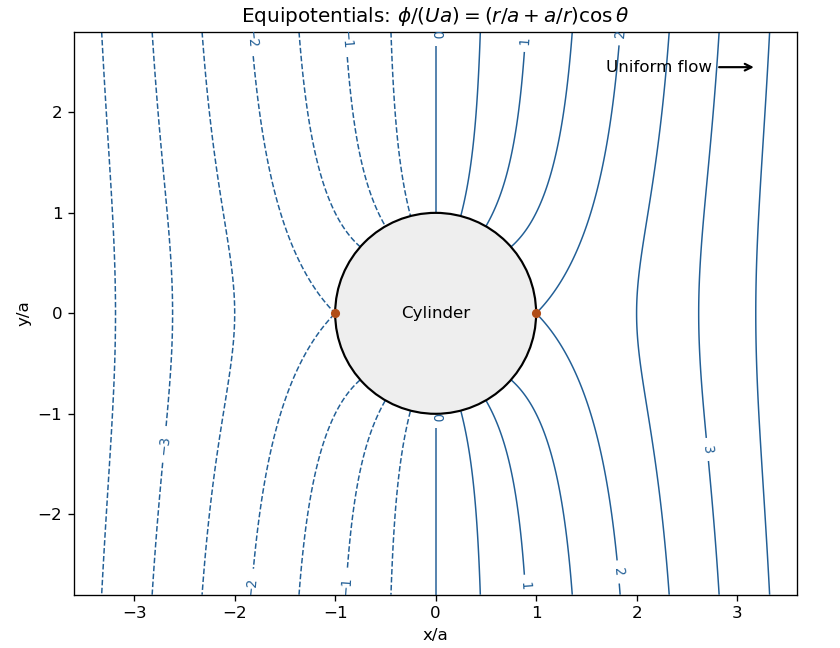

<h1 id="11d/b/solution">Solution</h1>

↑ **Parent:** [B](../b.md)

The far-field derivative fixes the growing $n=1$ cosine coefficient to $U$ and removes all other growing modes. The possible logarithmic term has derivative $D_0/a$ at the wall, so the zero wall derivative removes it. For each decaying Fourier mode, the wall condition relates its coefficient to its growing partner: the $n=1$ cosine partner has coefficient $Ua^2$, and every other partner vanishes. Thus the [potential flow around a circular cylinder](../../../../../../potential-flow-around-a-circular-cylinder.md) has

$$
\boxed{\phi(r,\theta)=U\left(r+\frac{a^2}{r}\right)\cos\theta+C}.
$$

Indeed, $\phi_r=U(1-a^2/r^2)\cos\theta$, which is zero at $r=a$ and tends to $U\cos\theta$ at infinity. The additive constant does not change the velocity. The [equipotential curves](../../../../../../equipotential-curve.md) satisfy $(r+a^2/r)\cos\theta=\text{constant}$. They approach vertical straight lines far away and meet the cylinder radially wherever the tangential velocity is nonzero. The two stagnation points are at $\theta=0,\pi$.

**[Figure 1](#11d/b/image-equipotential-curves-outside-a-circular-cylinder-in-uniform-potential-flow). Equipotential curves outside a circular cylinder in uniform potential flow**.

## ↑ Ancestors (11)

1. [B](../b.md)
2. [11D](../../11d.md)
3. [Paper 4](../../../paper-4-split.md)
4. [Ib](../../../split.md)
5. [2003](../../../../split.md)
6. [Past exam of the mathematics course of the University of Cambridge](../../../../../split.md)
7. [Mathematics course of the University of Cambridge](../../../../../../mathematics-course-of-the-university-of-cambridge.md)
8. [Course of the University of Cambridge](../../../../../../course-of-the-university-of-cambridge.md)
9. [University of Cambridge](../../../../../../university-of-cambridge-split.md)
10. [List of universities](../../../../../../list-of-universities.md)
11. [Codex Wiki](../../../../../../split.md)
