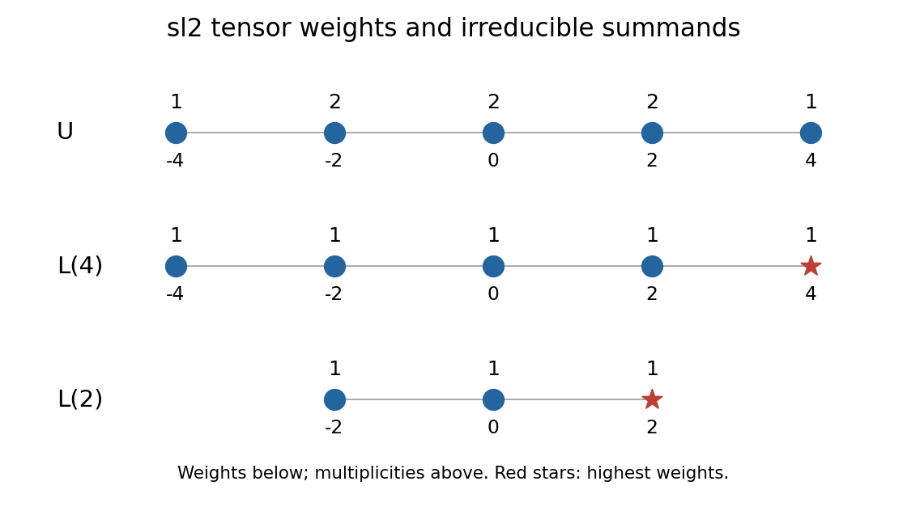

<h1 id="1/a/ii/solution">Solution</h1>

↑ **Parent:** [Ii](../ii.md)

Write $L(n)$ for the [irreducible representation](../../../../../../../irreducible-representation.md) of $\mathfrak{sl}_2$ with highest weight $n$, dimension $n+1$ and weights $n,n-2,\ldots,-n$. The [weight diagram](../../../../../../../weight-diagram.md) below records multiplicities $1,2,2,2,1$ at weights $4,2,0,-2,-4$.

**[Figure 1](#1/a/ii/image-weights-and-irreducible-summands-of-the-defining-sl2-module-tensor-its-cubic-symmetric-power). Weights and irreducible summands of the defining sl2 module tensor its cubic symmetric power**.

The unique top weight four forces one copy of $L(4)$, by [complete reducibility of semisimple Lie algebra representations](../../../../../../../weyl-s-theorem-on-complete-reducibility.md). Removing its five weights, each with multiplicity one, leaves weights $2,0,-2$ with multiplicity one, exactly the character of $L(2)$. Hence

$$
\boxed{U\cong L(4)\oplus L(2),\qquad\dim U=5+3.}
$$

The two lower rows draw their separate [weight diagrams](../../../../../../../weight-diagram.md). The explicit invariant copies constructed next establish the [Clebsch-Gordan splitting of a defining module and its cubic symmetric power](../../../../../../../clebsch-gordan-splitting-of-a-defining-module-and-its-cubic-symmetric-power.md) within $U$ itself.

## ↑ Ancestors (12)

1. [Ii](../ii.md)
2. [A](../../a.md)
3. [1](../../../1.md)
4. [Paper 1](../../../../paper-1-split.md)
5. [Iii](../../../../split.md)
6. [2003](../../../../../split.md)
7. [Past exam of the mathematics course of the University of Cambridge](../../../../../../split.md)
8. [Mathematics course of the University of Cambridge](../../../../../../../mathematics-course-of-the-university-of-cambridge.md)
9. [Course of the University of Cambridge](../../../../../../../course-of-the-university-of-cambridge.md)
10. [University of Cambridge](../../../../../../../university-of-cambridge-split.md)
11. [List of universities](../../../../../../../list-of-universities.md)
12. [Codex Wiki](../../../../../../../split.md)
