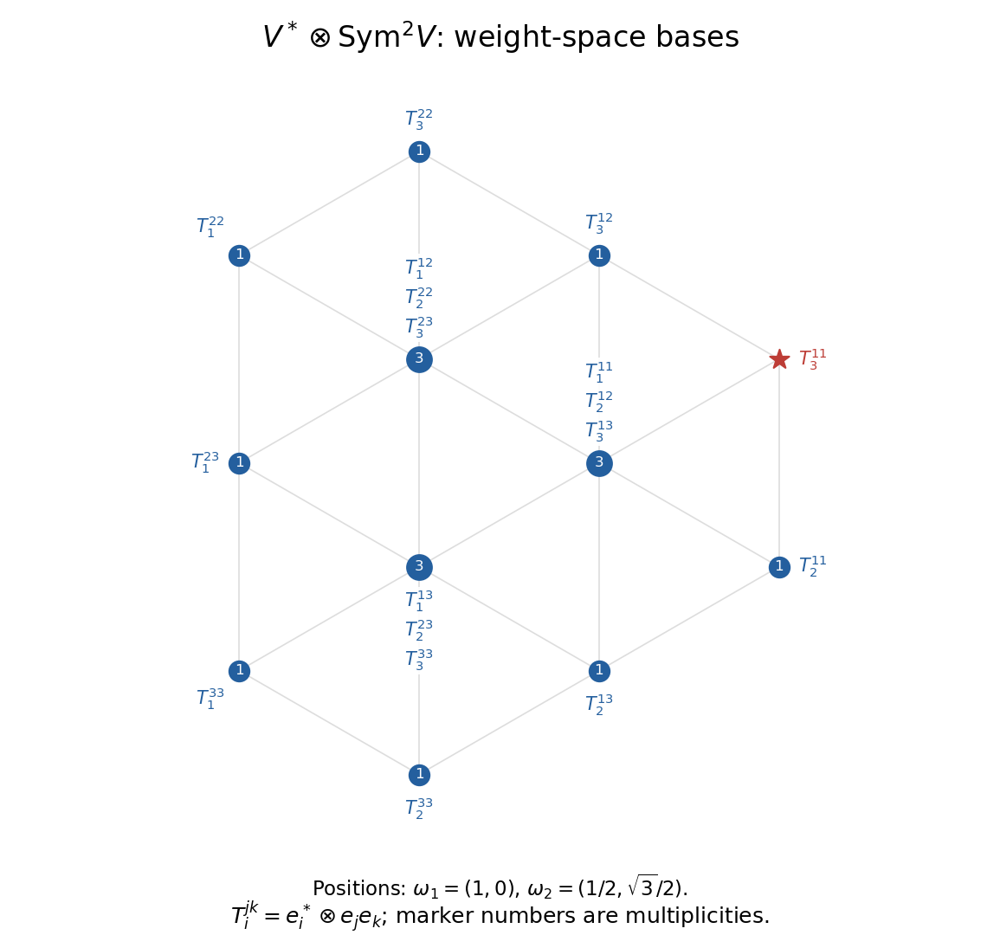

<h1 id="1/b/i/solution">Solution</h1>

↑ **Parent:** [I](../i.md)

Let $e_1=x,e_2=y,e_3=z$, and let $\epsilon_i$ be the [weight of a representation](../../../../../../../weight-of-a-representation.md) defined by $\epsilon_i(\operatorname{diag}(h_1,h_2,h_3))=h_i$. Since the trace is zero, $\epsilon_1+\epsilon_2+\epsilon_3=0$. The [dual representation](../../../../../../../dual-representation.md) gives weight $-\epsilon_i$ to $e_i^*$. Put

$$
T_i^{jk}=e_i^*\otimes e_je_k=T_i^{kj}.
$$

Taking $j\le k$ gives an eighteen-vector [tensor product](../../../../../../../tensor-product.md) basis. Its weight is $\epsilon_j+\epsilon_k-\epsilon_i$.

For explicit coordinates use the usual simple coroots $H_1=\operatorname{diag}(1,-1,0)$ and $H_2=\operatorname{diag}(0,1,-1)$, and write each weight as $(\mu(H_1),\mu(H_2))$. Then $\epsilon_1=(1,0)$, $\epsilon_2=(-1,1)$ and $\epsilon_3=(0,-1)$. Collecting equal weights gives every [weight space](../../../../../../../weight-space.md):

$$
\begin{array}{c|c}
\text{weight coordinates}&\text{basis}\\\hline
(2,1)&T_3^{11}\\
(3,-1)&T_2^{11}\\
(-2,3)&T_3^{22}\\
(-3,2)&T_1^{22}\\
(1,-3)&T_2^{33}\\
(-1,-2)&T_1^{33}\\
(0,2)&T_3^{12}\\
(2,-2)&T_2^{13}\\
(-2,0)&T_1^{23}\\
(1,0)&T_1^{11},\ T_2^{12},\ T_3^{13}\\
(-1,1)&T_1^{12},\ T_2^{22},\ T_3^{23}\\
(0,-1)&T_1^{13},\ T_2^{23},\ T_3^{33}
\end{array}
$$

The first six weights are $2\epsilon_j-\epsilon_i$ with $i\ne j$; the next three are $-2\epsilon_i$; the last three are the defining weights $\epsilon_i$. Thus **there are nine multiplicity-one weights and three multiplicity-three weights**, giving total dimension $9+9=18$.

**[Figure 2](#1/b/i/image-weight-diagram-and-tensor-bases-of-the-dual-defining-sl3-module-tensor-its-symmetric-square). Weight diagram and tensor bases of the dual defining sl3 module tensor its symmetric square**.

The planar coordinates are $a\omega_1+b\omega_2$ with $\omega_1=(1,0)$ and $\omega_2=(1/2,\sqrt3/2)$, so the [weight diagram](../../../../../../../weight-diagram.md) uses an equilateral root geometry rather than orthogonal Dynkin-coordinate axes. Every point is labelled with its complete weight-space basis.

## ↑ Ancestors (12)

1. [I](../i.md)
2. [B](../../b.md)
3. [1](../../../1.md)
4. [Paper 1](../../../../paper-1-split.md)
5. [Iii](../../../../split.md)
6. [2003](../../../../../split.md)
7. [Past exam of the mathematics course of the University of Cambridge](../../../../../../split.md)
8. [Mathematics course of the University of Cambridge](../../../../../../../mathematics-course-of-the-university-of-cambridge.md)
9. [Course of the University of Cambridge](../../../../../../../course-of-the-university-of-cambridge.md)
10. [University of Cambridge](../../../../../../../university-of-cambridge-split.md)
11. [List of universities](../../../../../../../list-of-universities.md)
12. [Codex Wiki](../../../../../../../split.md)
