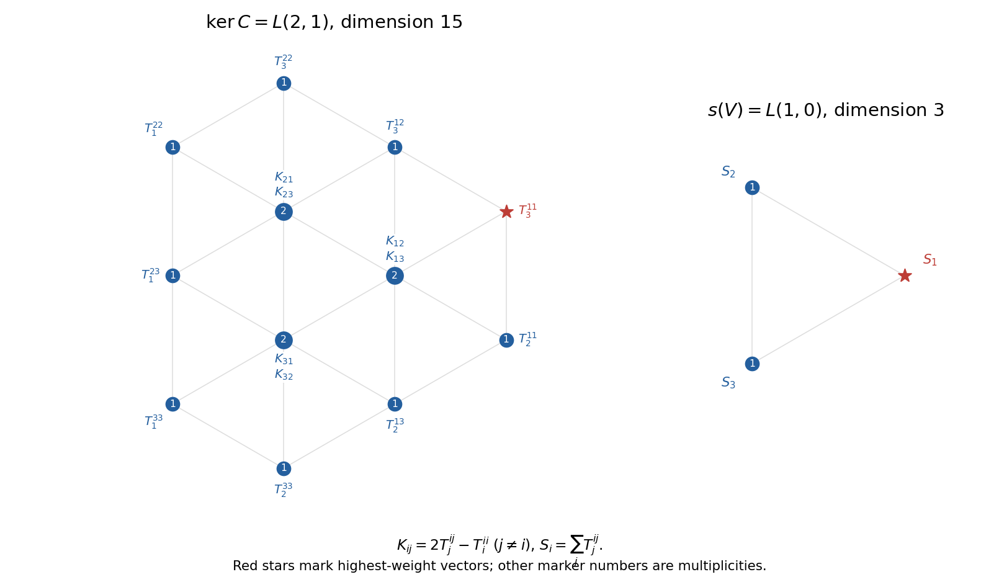

<h1 id="1/b/ii/solution">Solution</h1>

↑ **Parent:** [Ii](../ii.md)

Define an equivariant contraction $C:V^*\otimes\operatorname{Sym}^2V\to V$ by

$$
C(\varphi\otimes uv)=\varphi(u)v+\varphi(v)u.
$$

This uses the natural dual pairing, so it commutes with the [Lie algebra representation](../../../../../../../lie-algebra-representation.md). Also define $s(v)=\sum_i e_i^*\otimes e_iv$. The identity tensor $\sum_i e_i^*\otimes e_i$ is invariant, making $s$ equivariant. Direct contraction gives $C(s(v))=3v+v=4v$. Thus $s$ is injective and $C$ is surjective, and

$$
w=\left(w-\frac14s(Cw)\right)+\frac14s(Cw)
$$

is a direct decomposition into $\ker C$ and $s(V)$. In particular $\dim\ker C=18-3=15$ and $s(V)$ is a defining irreducible module of [highest weight](../../../../../../../highest-weight-of-a-representation.md) $\omega_1$.

For the usual upper-triangular choice of positive roots, $T_3^{11}=z^*\otimes x^2$ lies in the kernel and is killed by both simple raising operators $E_{12},E_{23}$. Its highest weight is $2\epsilon_1-\epsilon_3=2\omega_1+\omega_2$, with [Dynkin labels](../../../../../../../dynkin-label.md) $(2,1)$. The [highest-weight classification](../../../../../../../highest-weight-classification-of-finite-dimensional-semisimple-lie-algebra-modules.md) and complete reducibility give an irreducible copy $L(2,1)$ generated by this vector. The [Weyl dimension formula](../../../../../../../weyl-dimension-formula.md) for $\mathfrak{sl}_3$ is

$$
\dim L(p,q)=\frac{(p+1)(q+1)(p+q+2)}2,
$$

so $\dim L(2,1)=15$. It fills the entire kernel. Therefore the [sl3 decomposition of the symmetric-square dual tensor product](../../../../../../../sl3-decomposition-of-the-symmetric-square-dual-tensor-product.md), with its tensor factors exchanged, is

$$
\boxed{W=\ker C\oplus s(V)\cong L(2,1)\oplus L(1,0),\qquad 18=15+3.}
$$

The weight diagrams below record both summands. Their labels use $K_{ij}=2T_j^{ij}-T_i^{ii}$ for $j\ne i$ and $S_i=\sum_jT_j^{ij}$; these are the weight bases detailed in part (iii).

**[Figure 3](#1/b/ii/image-annotated-weight-bases-and-highest-weights-of-the-fifteen-dimensional-and-defining-sl3-summands). Annotated weight bases and highest weights of the fifteen-dimensional and defining sl3 summands**.

## ↑ Ancestors (12)

1. [Ii](../ii.md)
2. [B](../../b.md)
3. [1](../../../1.md)
4. [Paper 1](../../../../paper-1-split.md)
5. [Iii](../../../../split.md)
6. [2003](../../../../../split.md)
7. [Past exam of the mathematics course of the University of Cambridge](../../../../../../split.md)
8. [Mathematics course of the University of Cambridge](../../../../../../../mathematics-course-of-the-university-of-cambridge.md)
9. [Course of the University of Cambridge](../../../../../../../course-of-the-university-of-cambridge.md)
10. [University of Cambridge](../../../../../../../university-of-cambridge-split.md)
11. [List of universities](../../../../../../../list-of-universities.md)
12. [Codex Wiki](../../../../../../../split.md)
