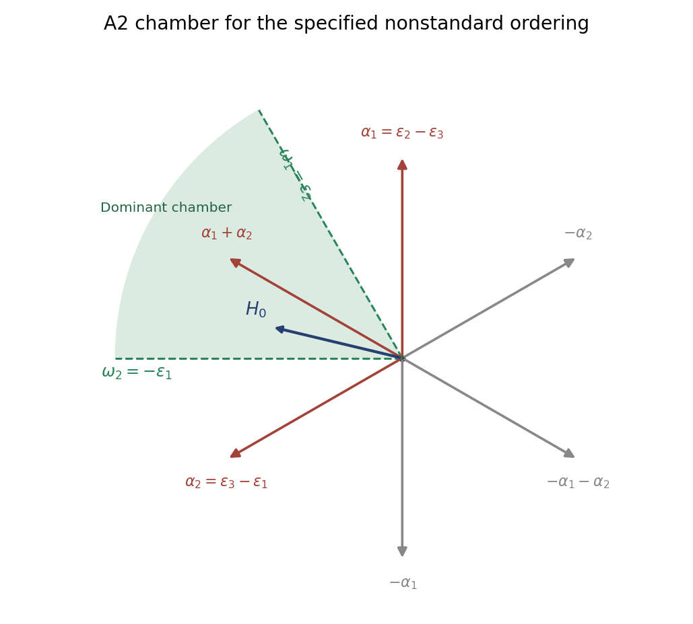

<h1 id="5/v/solution">Solution</h1>

↑ **Parent:** [V](../v.md)

For the usual diagonal [Cartan subalgebra](../../../../../../cartan-subalgebra.md), write $\epsilon_i(H)=H_{ii}$. The roots are $\epsilon_i-\epsilon_j$ for $i\ne j$. The three diagonal entries of the specified $H_0$ have ordering

$$
1>\sqrt2-1>-\sqrt2.
$$

Therefore the [positive roots](../../../../../../positive-root.md) selected by $\ell(\mu)=\mu(H_0)$ are

$$
\boxed{\Phi^+=\{\epsilon_2-\epsilon_3,\ \epsilon_3-\epsilon_1,\ \epsilon_2-\epsilon_1\}.}
$$

Their positive evaluations are respectively $2-\sqrt2$, $2\sqrt2-1$ and $1+\sqrt2$. For this nonstandard ordering the simple roots are $\alpha_1=\epsilon_2-\epsilon_3$ and $\alpha_2=\epsilon_3-\epsilon_1$; the third positive root is their sum. These simple roots differ from the usual choice used in Question 1.

Identify the real weight plane with triples $(u_1,u_2,u_3)$ of sum zero. Pairing with these simple coroots gives the differences $u_2-u_3$ and $u_3-u_1$. Consequently the [fundamental chamber of a root system](../../../../../../fundamental-chamber-of-a-root-system.md) is

$$
\boxed{C=\{u_1+u_2+u_3=0:\ u_2>u_3>u_1\}.}
$$

Its closure replaces the inequalities by weak inequalities. The fundamental weights for this ordering are $\omega_1=\epsilon_2$ and $\omega_2=-\epsilon_1$, represented by $(-1/3,2/3,-1/3)$ and $(-2/3,1/3,1/3)$. Their simple-coroot pairings are $(1,0)$ and $(0,1)$, so the two boundary rays are

$$
\boxed{\overline C=\mathbb R_{\ge0}\epsilon_2+\mathbb R_{\ge0}(-\epsilon_1).}
$$

The sketch uses $\epsilon_1=(1,0)$, $\epsilon_2=(-1/2,\sqrt3/2)$ and $\epsilon_3=(-1/2,-\sqrt3/2)$ in a Euclidean plane. The shaded sector is the sixty-degree closed chamber; its interior is the open chamber. The ordering vector $H_0$, identified with its dual direction, lies inside it.

**[Figure 4](#5/v/image-positive-a2-roots-and-fundamental-weyl-chamber-for-the-specified-ordering). Positive A2 roots and fundamental Weyl chamber for the specified ordering**.

## ↑ Ancestors (11)

1. [V](../v.md)
2. [5](../../5.md)
3. [Paper 1](../../../paper-1-split.md)
4. [Iii](../../../split.md)
5. [2003](../../../../split.md)
6. [Past exam of the mathematics course of the University of Cambridge](../../../../../split.md)
7. [Mathematics course of the University of Cambridge](../../../../../../mathematics-course-of-the-university-of-cambridge.md)
8. [Course of the University of Cambridge](../../../../../../course-of-the-university-of-cambridge.md)
9. [University of Cambridge](../../../../../../university-of-cambridge-split.md)
10. [List of universities](../../../../../../list-of-universities.md)
11. [Codex Wiki](../../../../../../split.md)
