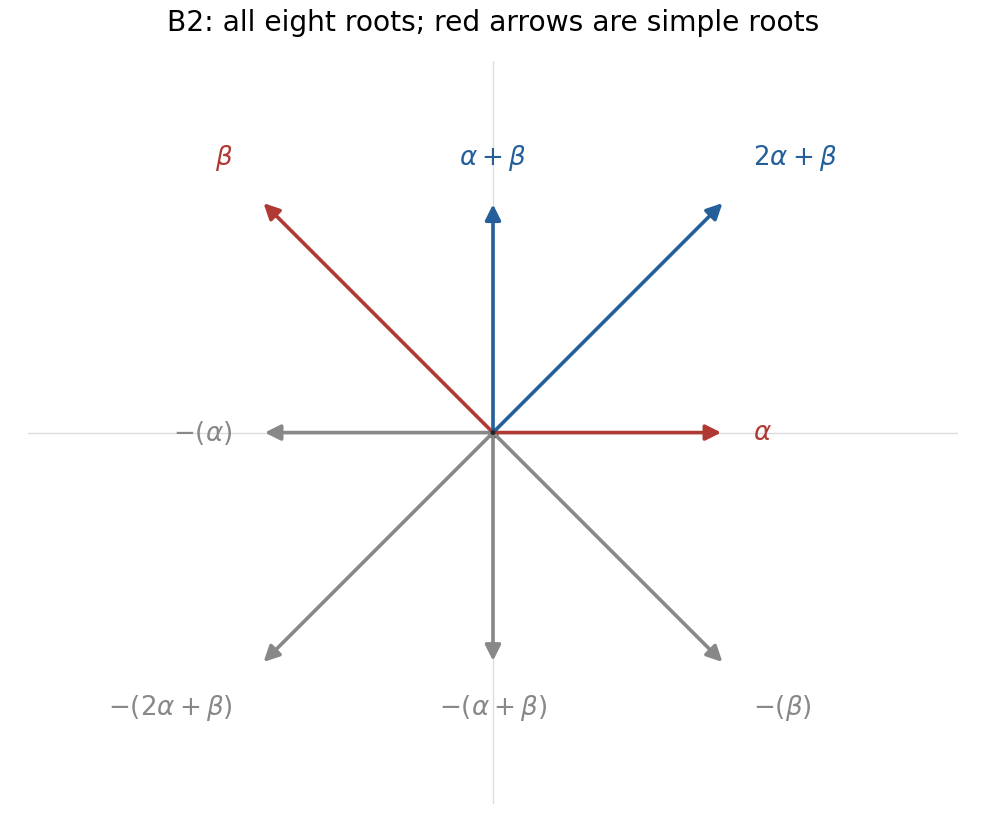

<h1 id="6/ii/solution">Solution</h1>

↑ **Parent:** [Ii](../ii.md)

The drawn simple roots have $\|\alpha\|^2=1$, $\|\beta\|^2=2$ and $\alpha\cdot\beta=-1$. Their [Cartan integers](../../../../../../cartan-integer.md) are therefore $\langle\beta,\alpha^\vee\rangle=-2$ and $\langle\alpha,\beta^\vee\rangle=-1$, identifying a [B2 root system](../../../../../../b2-root-system.md). The corresponding [root reflections](../../../../../../root-reflection.md) act on coordinates by

$$
s_\alpha(u,v)=(-u,v),\qquad s_\beta(u,v)=(v,u).
$$

In particular $s_\beta(\alpha)=\alpha+\beta=(0,1)$ and $s_\alpha(\beta)=2\alpha+\beta=(1,1)$, so both new positive roots are forced. Reflection in any root also forces its negative. Thus

$$
\boxed{\Phi^+=\{\alpha,\beta,\alpha+\beta,2\alpha+\beta\},\qquad\Phi=\{\pm(1,0),\pm(0,1),\pm(-1,1),\pm(1,1)\}.}
$$

These eight roots are drawn below, with the given simple pair highlighted.

**[Figure 5](#6/ii/image-all-roots-forced-by-the-given-simple-roots-of-the-b2-root-system). All roots forced by the given simple roots of the B2 root system**.

For completeness, no further roots can occur. In a finite reduced root system, every root is a [Weyl group](../../../../../../weyl-group.md) translate of a simple root: reflect a nonsimple positive root in a simple root with positive inner product to decrease its height, and iterate. This standard simple-root descent may also be quoted here. The eight-vector set just listed is stable under both generating reflections, and the orbits of the two simple roots already fill it. Hence no simple-root orbit, and therefore no root, lies outside that set. This establishes both the necessity of every drawn root and exhaustion of the root system.

## ↑ Ancestors (11)

1. [Ii](../ii.md)
2. [6](../../6.md)
3. [Paper 1](../../../paper-1-split.md)
4. [Iii](../../../split.md)
5. [2003](../../../../split.md)
6. [Past exam of the mathematics course of the University of Cambridge](../../../../../split.md)
7. [Mathematics course of the University of Cambridge](../../../../../../mathematics-course-of-the-university-of-cambridge.md)
8. [Course of the University of Cambridge](../../../../../../course-of-the-university-of-cambridge.md)
9. [University of Cambridge](../../../../../../university-of-cambridge-split.md)
10. [List of universities](../../../../../../list-of-universities.md)
11. [Codex Wiki](../../../../../../split.md)
