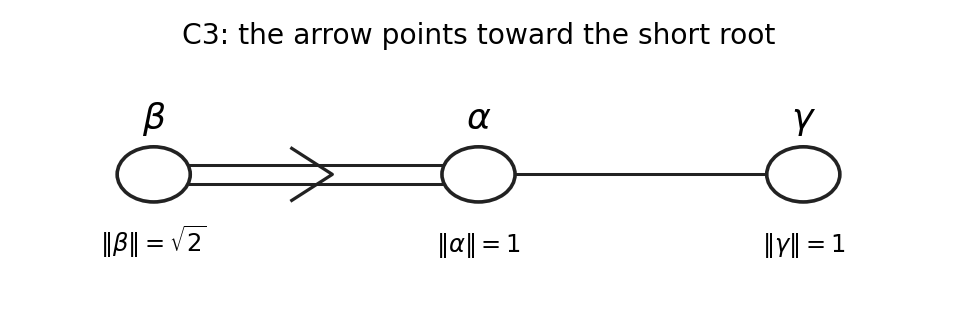

<h1 id="6/iii/solution">Solution</h1>

↑ **Parent:** [Iii](../iii.md)

The double-bond arrow points to the middle node in the PDF. Since $\|\alpha\|=1$ and $\|\beta\|=\sqrt2$, the short root $\alpha$ must occupy that middle node and the long root $\beta$ the left node. The right node $\gamma$, joined to $\alpha$ by a single bond, is another short root. Thus the diagram is [C3 root system](../../../../../../c3-root-system.md) type, labelled as follows.

**[Figure 6](#6/iii/image-labelling-the-c3-dynkin-diagram-with-the-given-short-and-long-roots). Labelling the C3 Dynkin diagram with the given short and long roots**.

The bonds require $\gamma\cdot\beta=0$, $\gamma\cdot\alpha=-1/2$ and $\|\gamma\|^2=1$. Writing $\gamma=(a,b,c)$ gives $a=-1/2$, $b=a$, and $c^2=1/2$. One choice is therefore

$$
\boxed{\gamma=\left(-\frac12,-\frac12,\frac1{\sqrt2}\right).}
$$

The opposite choice of the last coordinate reflects the entire realization across the first two coordinate axes' plane and is equally valid.

To enumerate exhaustively, set $f_1=(0,0,1)$, $f_2=(1,1,0)/\sqrt2$ and $f_3=(-1,1,0)/\sqrt2$. These are orthonormal, and

$$
\gamma=(f_1-f_2)/\sqrt2,\qquad\alpha=(f_2-f_3)/\sqrt2,\qquad\beta=\sqrt2f_3.
$$

The complete [C3 root system](../../../../../../c3-root-system.md) is $\{\pm\sqrt2f_i,\ (\pm f_i\pm f_j)/\sqrt2:i<j\}$, with eighteen roots. Its nine roots with nonnegative coefficients in this simple basis are exactly

$$
\begin{array}{c|c}
\text{positive root}&\text{coordinates}\\\hline
\alpha&(1,0,0)\\
\beta&(-1,1,0)\\
\gamma&(-1/2,-1/2,1/\sqrt2)\\
\alpha+\beta&(0,1,0)\\
\alpha+\gamma&(1/2,-1/2,1/\sqrt2)\\
\alpha+\beta+\gamma&(-1/2,1/2,1/\sqrt2)\\
2\alpha+\beta&(1,1,0)\\
2\alpha+\beta+\gamma&(1/2,1/2,1/\sqrt2)\\
2\alpha+\beta+2\gamma&(0,0,\sqrt2)
\end{array}
$$

There are six short and three long positive roots, and the other nine roots are their negatives.

The single-bond rank-two diagram is [A2 root system](../../../../../../a2-root-system.md) type. Three suitable positive simple pairs for its [root subsystems](../../../../../../root-subsystem.md) are

$$
\boxed{(\alpha,\gamma),\qquad(\alpha,\alpha+\beta+\gamma),\qquad(\alpha+\beta,\gamma).}
$$

Each pair $p,q$ has squared lengths one and inner product $-1/2$, so its angle is $120$ degrees. Its plane meets the full root set in $\pm p,\pm q,\pm(p+q)$, with $p+q$ respectively $\alpha+\gamma$, $2\alpha+\beta+\gamma$ and $\alpha+\beta+\gamma$. These exhaust the roots of the plane, and their coordinates in the pair have one sign. Thus each pair is genuinely a simple basis of an $A_2$ subsystem.

The double-bond diagram is rank-two [B2 root system](../../../../../../b2-root-system.md) type, equivalently $C_2$. Three suitable pairs, written short root first, are

$$
\boxed{(\alpha,\beta),\qquad(\alpha+\gamma,\beta),\qquad(\gamma,2\alpha+\beta).}
$$

For each pair $s,l$, $\|s\|^2=1$, $\|l\|^2=2$ and $s\cdot l=-1$. The remaining positive roots in its plane are

$$
\begin{array}{c|c|c}
(s,l)&s+l&2s+l\\\hline
(\alpha,\beta)&\alpha+\beta&2\alpha+\beta\\
(\alpha+\gamma,\beta)&\alpha+\beta+\gamma&2\alpha+\beta+2\gamma\\
(\gamma,2\alpha+\beta)&2\alpha+\beta+\gamma&2\alpha+\beta+2\gamma
\end{array}
$$

Together with their negatives these are precisely the eight plane roots, and all four positive roots have nonnegative integral pair-coordinates. Hence the displayed pairs are simple bases of the required subsystems. The [rank-two subsystems of a C3 root system](../../../../../../rank-two-subsystems-of-a-c3-root-system.md) description explains these as the three coordinate-plane subsystems in the orthonormal $f_i$ realization; the chosen $A_2$ pairs lie in three different diagonal planes.

## ↑ Ancestors (11)

1. [Iii](../iii.md)
2. [6](../../6.md)
3. [Paper 1](../../../paper-1-split.md)
4. [Iii](../../../split.md)
5. [2003](../../../../split.md)
6. [Past exam of the mathematics course of the University of Cambridge](../../../../../split.md)
7. [Mathematics course of the University of Cambridge](../../../../../../mathematics-course-of-the-university-of-cambridge.md)
8. [Course of the University of Cambridge](../../../../../../course-of-the-university-of-cambridge.md)
9. [University of Cambridge](../../../../../../university-of-cambridge-split.md)
10. [List of universities](../../../../../../list-of-universities.md)
11. [Codex Wiki](../../../../../../split.md)
