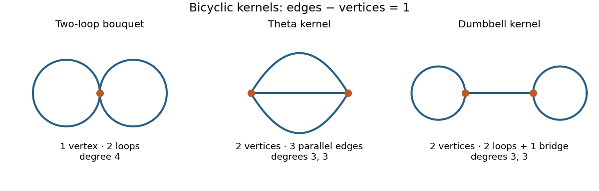

<h1 id="4/ii/solution">Solution</h1>

↑ **Parent:** [Ii](../ii.md)

**The lower bound cannot hold at $n=3$ as printed:** a [simple graph](../../../../../../simple-graph.md) on three vertices has at most three edges, so $C(3,4)=0$. We prove the intended bound for every $n\geq4$, and hence its stated asymptotic order.

Delete leaves from a connected graph of [graph excess](../../../../../../graph-excess.md) one to obtain its nonempty [2-core](../../../../../../2-core-of-a-graph.md). Deleting a leaf and its incident edge preserves edges minus vertices. The deleted part is a forest rooted at the core vertices: it cannot contain a cycle, which would survive deletion, and it cannot join two core vertices, since the joining path would itself survive. The [2-core](../../../../../../2-core-of-a-graph.md) remains connected. Suppress its maximal paths with degree-two internal vertices, allowing coincident endpoints for a cycle based at a branching vertex. The resulting [graph kernel](../../../../../../graph-kernel.md) is a connected [multigraph](../../../../../../multigraph.md) of [minimum degree](../../../../../../minimum-degree-of-a-graph.md) at least three, retaining loops and parallel edges, with the same excess one.

In that kernel,

$$
\sum_v(\deg(v)-2)=2|E|-2|V|=2.
$$

Thus it has either one degree-four vertex or two degree-three vertices. In the first case its two edges are loops. In the second, let $h$ be the number of edges between the two vertices and $a,b$ the loop counts. Connectivity gives $h\geq1$, and $2a+h=2b+h=3$, leaving $h=3,a=b=0$ or $h=1,a=b=1$. This proves the [bicyclic kernel classification](../../../../../../bicyclic-kernel-classification.md): the two-loop [bouquet graph](../../../../../../bouquet-graph.md), the three-edge [Theta graph](../../../../../../theta-graph.md), and the two-loop [dumbbell graph](../../../../../../dumbbell-graph.md). Original simple cores are [graph subdivisions](../../../../../../graph-subdivision.md) of these kernels; loops must subdivide to cycles of length at least three, and at most one of the three theta paths can be an unsubdivided edge.

**[Figure 1](#4/ii/image-the-two-loop-bouquet-theta-and-dumbbell-kernels-of-connected-bicyclic-graphs). The two-loop bouquet, theta and dumbbell kernels of connected bicyclic graphs**.

Let $b_k$ count labelled [bicyclic](../../../../../../bicyclic-graph.md) cores on a fixed $k$-vertex set. The classification gives an absolute constant $A$ with

$$
b_k\leq A k!k^2.
$$

To see the bound concretely, order the one or two branching labels, choose one of the three kernel types, and distribute the other $k-v$ labels as ordered internal vertices of its two or three edges. There are at most $\binom{k+1}{2}=O(k^2)$ weak compositions of their lengths, and at most $k!$ ordered assignments of all labels. This overcounts orientations and edge permutations and ignores simplicity restrictions, both harmless for an upper bound.

For a lower bound, use only theta cores whose three paths each have at least one internal vertex. For $k\geq5$, choose an ordered pair of branching vertices and an ordered list of the other $k-2$ labels, then cut that list into three nonempty ordered paths. There are $k!\binom{k-3}{2}$ encodings. Every resulting simple theta core is encoded exactly $2\cdot3!=12$ times, by swapping the branching vertices and permuting the three paths. Hence

$$
b_k\geq\frac{k!}{12}\binom{k-3}{2}\geq\frac{k!k^2}{96}\quad(k\geq8).
$$

Choose the core's vertices and attach the forest counted in part (i). The decomposition is unique, so

$$
C(n,n+1)=\sum_{k=1}^n\binom nk b_k\,kn^{n-k-1}.
$$

Putting $q_{n,k}=(n)_k/n^k=\prod_{j=0}^{k-1}(1-j/n)$, the two estimates on $b_k$ reduce the [labelled bicyclic graph count](../../../../../../labelled-bicyclic-graph-count.md) to the sum of $k^3q_{n,k}$ divided by $n^2$.

For the upper bound, $\log(1-x)\leq-x$ gives

$$
q_{n,k}\leq e^{-k(k-1)/(2n)}\leq e^{-k^2/(4n)}\quad(k\geq2).
$$

The corresponding sum is $O(n^2)$. For example, divide the positive integers into blocks $j\sqrt n\leq k<(j+1)\sqrt n$: the sum in block $j$ is at most a constant times $n^2(j+1)^3e^{-j^2/4}$, and the series over $j$ converges. Including the finitely small indices makes no difference. Therefore $C(n,n+1)\leq c_2n^{n+1}$.

For the lower bound, take $n$ sufficiently large and $\sqrt n\leq k\leq2\sqrt n$. Then $k\geq8$, and $j/n\leq1/2$ throughout the product. Since $\log(1-x)\geq-2x$ on $[0,1/2]$,

$$
q_{n,k}\geq e^{-k(k-1)/n}\geq e^{-4}.
$$

There are at least $\tfrac12\sqrt n$ such integer indices, each with $k^3\geq n^{3/2}$. The lower core bound therefore gives

$$
\frac{C(n,n+1)}{n^{n+1}}\geq\frac1{96n^2}\sum_{\sqrt n\leq k\leq2\sqrt n}k^3q_{n,k}\geq\frac{e^{-4}}{192}>0.
$$

This proves the two-sided bounds for all sufficiently large $n$. They extend to every $n\geq4$ by adjusting the constants over the remaining finite set: $C(n,n+1)>0$ there, since $K_4$ minus one edge is connected with five edges, and adding a pendant path supplies an example at every larger order. Consequently the correctly qualified conclusion is

$$
\boxed{c_1n^{n+1}\leq C(n,n+1)\leq c_2n^{n+1}\quad\text{for every }n\geq4,\qquad c_1,c_2>0.}
$$

The exceptional $n=3$ is a genuine defect in the printed quantifier, not a missing case of the proof.

## ↑ Ancestors (11)

1. [Ii](../ii.md)
2. [4](../../4.md)
3. [Paper 12](../../../paper-12-split.md)
4. [Iii](../../../split.md)
5. [2003](../../../../split.md)
6. [Past exam of the mathematics course of the University of Cambridge](../../../../../split.md)
7. [Mathematics course of the University of Cambridge](../../../../../../mathematics-course-of-the-university-of-cambridge.md)
8. [Course of the University of Cambridge](../../../../../../course-of-the-university-of-cambridge.md)
9. [University of Cambridge](../../../../../../university-of-cambridge-split.md)
10. [List of universities](../../../../../../list-of-universities.md)
11. [Codex Wiki](../../../../../../split.md)
