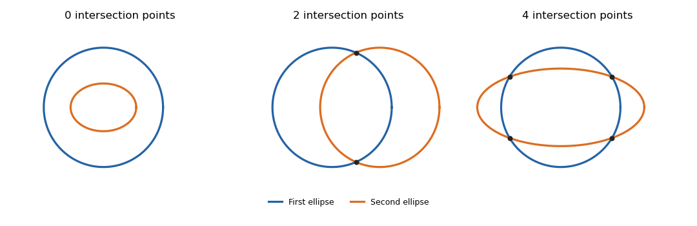

<h1 id="6/solution">Solution</h1>

↑ **Parent:** [6](../6.md)

An [ellipse](../../../../../ellipse.md) here is a [nondegenerate ellipse](../../../../../nondegenerate-ellipse.md), hence a smooth embedded circle. Write the first [ellipse](../../../../../ellipse.md) as

$$
\gamma(t)=c+A\begin{pmatrix}\cos t\\\sin t\end{pmatrix},\qquad t\in\mathbb R/(2\pi\mathbb Z),
$$

where $A$ is invertible. Write the second as $Q(x)=0$, where

$$
Q(x)=(x-d)^TB(x-d)-1
$$

for a positive-definite symmetric matrix $B$. Its gradient is nonzero on the [ellipse](../../../../../ellipse.md). Let $g(t)=Q(\gamma(t))$. At an intersection, [transversality](../../../../../transversality-of-a-map-to-a-submanifold.md) says the tangent vector $\gamma'(t)$ is not tangent to $Q=0$, so

$$
g'(t)=\nabla Q(\gamma(t))\cdot\gamma'(t)\ne0.
$$

Every intersection is thus a simple zero of $g$, and $g$ changes sign there. The intersection set is finite: it is closed and compact, and [transversality](../../../../../transversality-of-a-map-to-a-submanifold.md) makes each of its points isolated. Start at a parameter with $g\ne0$ and traverse one full period. Returning to the same sign requires an even number of sign changes. Therefore **the number of intersection points is even**, including zero when the [ellipses](../../../../../ellipse.md) are disjoint.

For the upper bound, substituting the parametrization into the quadratic gives the [trigonometric polynomial](../../../../../trigonometric-polynomial.md)

$$
g(t)=a_0+a_1\cos t+b_1\sin t+a_2\cos2t+b_2\sin2t.
$$

It is not identically zero: otherwise the first [ellipse](../../../../../ellipse.md) would lie on the second, and its tangent would be tangent to the second everywhere, violating [transversality](../../../../../transversality-of-a-map-to-a-submanifold.md). Put $z=e^{it}$. Multiplying by $z^2$ turns this function into the [polynomial](../../../../../polynomial-split.md)

$$
P(z)=\frac{a_2-ib_2}{2}z^4+\frac{a_1-ib_1}{2}z^3+a_0z^2+\frac{a_1+ib_1}{2}z+\frac{a_2+ib_2}{2}.
$$

It is nonzero and has degree at most four, so it has at most four distinct roots. Distinct points on the first [ellipse](../../../../../ellipse.md) correspond to distinct parameters modulo $2\pi$ and hence distinct points $z$ on the unit circle. Thus

$$
\boxed{|E_1\cap E_2|\in\{0,2,4\}.}
$$

Both the parity and the upper bound follow without using an algebraic intersection theorem. The four-point bound is attained by a unit circle and a concentric [ellipse](../../../../../ellipse.md) whose semiaxes lie on opposite sides of one.

**[Figure 1](#6/image-transverse-ellipses-with-zero-two-and-four-intersection-points). Transverse ellipses with zero, two and four intersection points**.

## ↑ Ancestors (10)

1. [6](../6.md)
2. [Paper 26](../../paper-26-split.md)
3. [Iii](../../split.md)
4. [2003](../../../split.md)
5. [Past exam of the mathematics course of the University of Cambridge](../../../../split.md)
6. [Mathematics course of the University of Cambridge](../../../../../mathematics-course-of-the-university-of-cambridge.md)
7. [Course of the University of Cambridge](../../../../../course-of-the-university-of-cambridge.md)
8. [University of Cambridge](../../../../../university-of-cambridge-split.md)
9. [List of universities](../../../../../list-of-universities.md)
10. [Codex Wiki](../../../../../split.md)
