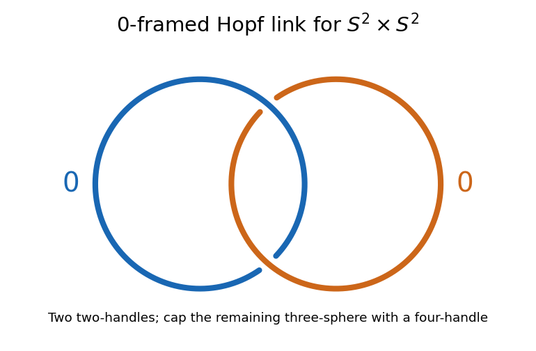

<h1 id="6/solution">Solution</h1>

↑ **Parent:** [6](../6.md)

An index-$\lambda$ [handle](../../../../../handle.md) in dimension $d$ is $D^\lambda\times D^{d-\lambda}$. A [handle attachment](../../../../../handle-attachment.md) glues its attaching region $S^{\lambda-1}\times D^{d-\lambda}$ to a corresponding neighborhood in the boundary of the preceding [manifold with boundary](../../../../../manifold-with-boundary.md). Besides the embedding of the [attaching sphere](../../../../../attaching-sphere.md), one specifies a [framing of an embedded sphere](../../../../../framing-of-an-embedded-sphere.md), namely the normal-disk directions used in this gluing. Corners are then smoothed.

In dimension four, a [two-handle](../../../../../two-handle.md) is $D^2\times D^2$ and attaches along $S^1\times D^2$. Its attaching circle is a [knot](../../../../../knot.md) in the boundary of the [zero-handle](../../../../../zero-handle.md) $D^4$. Identify that boundary with $S^3$ and remove a point away from the circles to draw them in $\mathbb R^3$. Disjoint attaching circles give a [framed link](../../../../../framed-link.md). Each integer records the twist of its normal framing relative to the zero [Seifert framing](../../../../../seifert-framing.md); the integer is also the [linking number](../../../../../linking-number.md) of the circle and its framed push-off. The resulting boundary change is [Dehn surgery on a framed link](../../../../../dehn-surgery-on-a-framed-link.md). This is the two-handle part of a [Kirby diagram](../../../../../kirby-diagram.md).

For $S^2\times S^2$, use the following explicit [handle decomposition](../../../../../handle-decomposition.md). Write each factor as two disks, $S^2=D_-^2\cup D_+^2$, glued along their boundary circles. The four product pieces give

$$
h^0=D_-^2\times D_-^2,\qquad h^2_1=D_+^2\times D_-^2,\qquad h^2_2=D_-^2\times D_+^2,\qquad h^4=D_+^2\times D_+^2.
$$

The first is a four-dimensional [zero-handle](../../../../../zero-handle.md) after rounding its corners. Its boundary is the union of the solid tori $S^1\times D^2$ and $D^2\times S^1$. The two middle product pieces attach along these tori. Their attaching circles $S^1\times\{0\}$ and $\{0\}\times S^1$ form the standard [Hopf link](../../../../../hopf-link.md), with [linking number](../../../../../linking-number.md) one after choosing orientations.

Both framings are zero. For example, the normal disk of $S^1\times\{0\}$ is the second disk factor. Its constant normal push-off has linking number zero with the original circle: the circle bounds $D^2\times\{0\}$ in the four-ball, and a parallel push-off bounds a disjoint translated disk. Thus the framed self-intersection is zero; the same argument applies with the factors interchanged. These product framings are the zero [Seifert framings](../../../../../seifert-framing.md).

**[Figure 1](#6/image-zero-framed-hopf-link-for-the-two-two-handles-of-s2-times-s2-the-upper-crossing-has-blue-over-orange-and-the-lower-crossing-has-orange-over-blue). Zero-framed Hopf link for the two two-handles of S2 times S2; the upper crossing has blue over orange and the lower crossing has orange over blue**.

After these two [two-handles](../../../../../two-handle.md), the remaining product piece $D_+^2\times D_+^2$ is a four-ball. Its boundary is exactly the boundary of the assembled first three pieces, so it attaches as a [four-handle](../../../../../four-handle.md). Equivalently, [zero surgery on the Hopf link](../../../../../zero-surgery-on-the-hopf-link.md) gives $S^3$, which this handle caps. We have therefore constructed the actual product, proving

$$
\boxed{S^2\times S^2=\text{one zero-handle}+\text{two zero-framed Hopf-linked two-handles}+\text{one four-handle}.}
$$

There are no one- or three-handles. As a check, the two factor spheres have self-intersection zero and meet once, giving the [intersection form](../../../../../intersection-form.md) $\left(\begin{smallmatrix}0&1\\1&0\end{smallmatrix}\right)$. The explicit product construction, rather than the intersection form alone, identifies the smooth four-manifold. This is the [zero-framed Hopf-link handle decomposition of the sphere product](../../../../../zero-framed-hopf-link-handle-decomposition-of-the-sphere-product.md).

## ↑ Ancestors (10)

1. [6](../6.md)
2. [Paper 27](../../paper-27-split.md)
3. [Iii](../../split.md)
4. [2003](../../../split.md)
5. [Past exam of the mathematics course of the University of Cambridge](../../../../split.md)
6. [Mathematics course of the University of Cambridge](../../../../../mathematics-course-of-the-university-of-cambridge.md)
7. [Course of the University of Cambridge](../../../../../course-of-the-university-of-cambridge.md)
8. [University of Cambridge](../../../../../university-of-cambridge-split.md)
9. [List of universities](../../../../../list-of-universities.md)
10. [Codex Wiki](../../../../../split.md)
