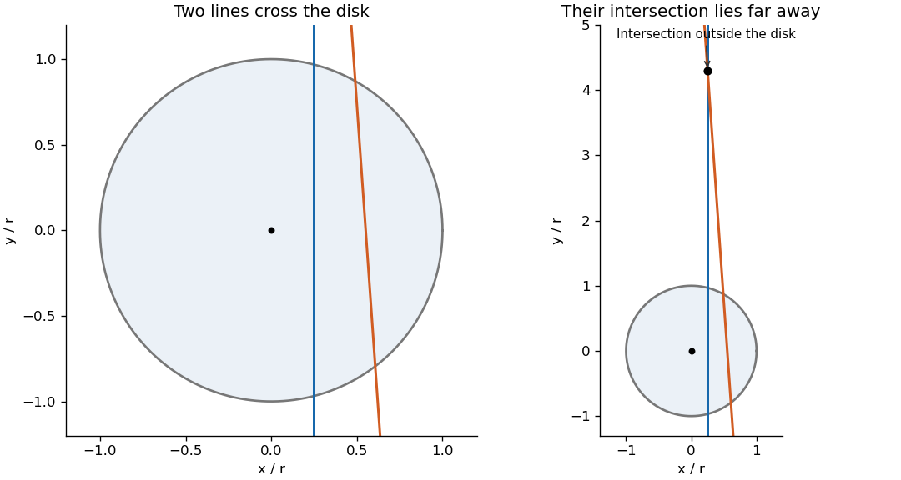

# Paper 31

↑ **Parent:** [Iii](../iii.md)

[https://www.maths.cam.ac.uk/postgrad/part-iii/files/pastpapers/2003/Paper31.pdf](https://www.maths.cam.ac.uk/postgrad/part-iii/files/pastpapers/2003/Paper31.pdf)

**Table of contents**

- [1](#1)
  - [Solution](#1/solution)
- [2](#2)
  - [Solution](#2/solution)
- [3](#3)
  - [Solution](#3/solution)

## 1

↑ **Parent:** [Paper 31](paper-31.md)

<h3 id="1/solution">Solution</h3>

↑ **Parent:** [1](#1)

Write $z=(x,y)$ and $\mu(dz)=\lambda(z)\,dz$. Treat the nonnegative plant weights as [independent](../../../random-variable.md#independent-random-variables) marks conditional on the locations, with a [measurable](../../../measure-theory.md#measurability) mark law $K_z(dw)$ depending only on $z$. Its first and second moments are

$$
\int w\,K_z(dw)=m(z),\qquad\int w^2\,K_z(dw)=m(z)^2+v(z).
$$

This is the independent-marking interpretation appropriate for location-dependent weights.

The general results needed are the following. The [Independent marking theorem for Poisson point processes](../../../probability-theory.md#independent-marking-theorem-for-poisson-point-processes) says that such marks turn a [Poisson point process](../../../probability-theory.md#poisson-point-process) of intensity $\mu$ into a [Poisson point process](../../../probability-theory.md#poisson-point-process) on location-mark space with intensity $\nu(dz,dw)=\mu(dz)K_z(dw)$. The [Campbell first-moment formula](../../../probability-theory.md#campbell-first-moment-formula) says that for any nonnegative [measurable](../../../measure-theory.md#measurability) $g$, $\mathbb E\sum_{u\in\Pi}g(u)=\int g\,d\nu$, allowing infinite values. The second [Poisson factorial moment measure](../../../probability-theory.md#poisson-factorial-moment-measure) identity says that for nonnegative [measurable](../../../measure-theory.md#measurability) $h$,

$$
\mathbb E\sum_{u,u'\in\Pi,\ u\ne u'}h(u,u')=\iint h(u,u')\,\nu(du)\nu(du').
$$

These statements apply to sigma-finite intensities and therefore do not require finitely many plants in the entire field. We use these general results without proving them.

Define the total as the nonnegative sum $W=\sum_{(z,w)\in\Pi}w$, or equivalently as the increasing limit of its finite-intensity truncations. the [Campbell theorem](../../../probability-theory.md#campbell-s-theorem) gives

$$
\mathbb EW=\int_S\int_0^\infty w\,K_z(dw)\,\mu(dz)=\int_Sm(z)\lambda(z)\,dz=:M.
$$

Since $M<\infty$, the nonnegative [random variable](../../../random-variable.md) $W$ cannot be infinite on an event of positive [probability](../../../probability-theory.md#probability). Thus **$W$ is finite [almost surely](../../../convergence-of-random-variables.md#almost-sure-convergence)**, even if the number of plants is infinite.

Separate the square into its diagonal and ordered distinct-pair terms. Nonnegativity allows the use of [Tonelli's theorem](../../../measure-theory.md#tonelli-theorem) and increasing limits, giving

$$
\begin{aligned}
\mathbb EW^2
&=\mathbb E\sum_{(z,w)\in\Pi}w^2+\mathbb E\sum_{(z,w)\ne(z',w')}ww'\\
&=\int_S\bigl(m(z)^2+v(z)\bigr)\lambda(z)\,dz+M^2.
\end{aligned}
$$

The assumed second [integral](../../../calculus.md#integral) is finite, so $W$ is [square-integrable](../../../measure-theory.md#square-integrable-function). Subtracting $(\mathbb EW)^2$ yields

$$
\boxed{\mathbb EW=\int_Sm\lambda\,dz,\qquad\operatorname{Var}W=\int_S(v+m^2)\lambda\,dz.}
$$

The term $v$ accounts for random weights at fixed locations; the term $m^2$ accounts for the [Poisson](../../../discrete-probability-distribution.md#poisson-distribution) fluctuations in the locations and count. Nonnegativity is natural for weights. For signed marks, absolute first-moment integrability, rather than just a conditionally convergent [integral](../../../calculus.md#integral) of the signed [mean](../../../probability-theory.md#expected-value), would be needed for the ordinary sum.

## 2

↑ **Parent:** [Paper 31](paper-31.md)

<h3 id="2/solution">Solution</h3>

↑ **Parent:** [2](#2)

The [intensity function of a point process](../../../probability-theory.md#intensity-function-of-a-point-process) is positive and continuous inside the interval, so its [measure](../../../measure-theory.md#measure) is finite on every [compact](../../../topology.md#compact-space) subinterval. Consequently the [Poisson point process](../../../probability-theory.md#poisson-point-process) is locally finite there. Its nonatomic intensity makes it simple and gives no point at $0$ [almost surely](../../../convergence-of-random-variables.md#almost-sure-convergence). At the endpoints,

$$
\lambda(x)\sim\frac{1}{4(1-x)^3}\quad(x\uparrow1),\qquad\lambda(x)\sim\frac{1}{8(1+x)^2}\quad(x\downarrow-1).
$$

Both half-intervals therefore have infinite intensity. More explicitly, exhaust either half by increasing [compact](../../../topology.md#compact-space) intervals with means $t_j\to\infty$. For any fixed integer $k$,

$$
\mathbb P\{\#\Pi\text{ in that half}\leq k\}\leq e^{-t_j}\sum_{i=0}^k\frac{t_j^i}{i!}\longrightarrow0.
$$

Taking the [countable](../../../set-theory.md#countable-set) union over $k$ proves **infinitely many points on each side [almost surely](../../../convergence-of-random-variables.md#almost-sure-convergence)**.

Local finiteness excludes accumulation in the interior, including at $0$. Hence there is a largest negative point and a smallest positive point. For example, given any negative point, the [compact](../../../topology.md#compact-space) interval between it and $0$ contains finitely many points and therefore a largest one. Call it $X_0$; call the smallest positive point $X_1$, and enumerate consecutively in both directions. Infinite counts give every integer index, and the lack of interior accumulation implies $X_n\uparrow1$ as $n\to\infty$ and $X_n\downarrow-1$ as $n\to-\infty$. Thus the specified two-sided labeling exists [almost surely](../../../convergence-of-random-variables.md#almost-sure-convergence).

Use the cumulative-intensity transformation

$$
\boxed{f(x)=\int_0^x\frac{dt}{(1+t)^2(1-t)^3}.}
$$

It has $f(0)=0$, positive derivative, and limits $-\infty,+\infty$ at the two endpoints, so it is an increasing [bijection](../../../function.md#bijection) onto $\mathbb R$. One explicit expression is

$$
f(x)=\frac{3}{16}\log\frac{1+x}{1-x}-\frac{1}{8(1+x)}+\frac{1}{4(1-x)}+\frac{1}{8(1-x)^2}-\frac14.
$$

For any bounded interval $(a,b)$ in the target, its preimage has intensity

$$
\int_{f^{-1}(a)}^{f^{-1}(b)}\lambda(x)\,dx=b-a.
$$

Disjoint target sets have disjoint preimages, so their counts are [independent](../../../random-variable.md#independent-random-variables). This proves directly, or by the [Poisson mapping theorem](../../../probability-theory.md#poisson-mapping-theorem), that the transformed points form a unit-rate [Poisson process](../../../probability-theory.md#poisson-process) on the real line.

Put $Y_n=f(X_n)$. On the positive half-line, the successive spacings are [independent](../../../random-variable.md#independent-random-variables) [exponential random variables](../../../continuous-probability-distribution.md#exponential-distribution) of [mean](../../../probability-theory.md#expected-value) $1$, so $Y_n=E_1+\cdots+E_n$. The [strong law of large numbers](../../../convergence-of-random-variables.md#strong-law-of-large-numbers) gives $Y_n/n\to1$ [almost surely](../../../convergence-of-random-variables.md#almost-sure-convergence). On the negative half-line, independently, the reflected points satisfy $-Y_{-k}=E'_1+\cdots+E'_{k+1}$, because $Y_0$ is the first point to the left of zero. Thus $-Y_{-k}/k\to1$, or $Y_n/n\to1$ also as $n\to-\infty$. The shift by one has no effect on these limits.

From the explicit formula, or by integrating the endpoint intensity asymptotics,

$$
f(x)(1-x)^2\longrightarrow\frac18\quad(x\uparrow1),\qquad[-f(x)](1+x)\longrightarrow\frac18\quad(x\downarrow-1).
$$

Substitute $x=X_n$ and use the [strong law for Poisson arrival times](../../../probability-theory.md#strong-law-for-poisson-arrival-times). At the right endpoint,

$$
n(1-X_n)^2=\frac{n}{f(X_n)}\,f(X_n)(1-X_n)^2\longrightarrow\frac18,
$$

so

$$
\boxed{\sqrt{2n}\,(1-X_n)\longrightarrow\frac12\quad(n\to+\infty),\ \text{almost surely}.}
$$

At the left endpoint the corresponding result is

$$
\boxed{|n|(1+X_n)\longrightarrow\frac18\quad(n\to-\infty),\ \text{almost surely}.}
$$

Equivalently $8|n|(1+X_n)\to1$. The different powers of $|n|$ reflect the different endpoint singularity orders, an instance of [power-law boundary accumulation of a Poisson point process](../../../probability-theory.md#power-law-boundary-accumulation-of-a-poisson-point-process).

## 3

↑ **Parent:** [Paper 31](paper-31.md)

<h3 id="3/solution">Solution</h3>

↑ **Parent:** [3](#3)

Identify a line with its unique parameter pair in $E=(0,\infty)\times[0,2\pi)$, using

$$
L(p,\theta)=\{z\in\mathbb R^2:z\cdot n_\theta=p\},\qquad n_\theta=(\cos\theta,\sin\theta).
$$

A [Poisson line process](../../../probability-theory.md#poisson-line-process) means a [Poisson point process](../../../probability-theory.md#poisson-point-process) on the Borel parameter space $E$: for each [measurable](../../../measure-theory.md#measurability) $B$ of finite [mean](../../../probability-theory.md#expected-value) [measure](../../../measure-theory.md#measure), the number of its parameter points is [Poisson](../../../discrete-probability-distribution.md#poisson-distribution) with [mean](../../../probability-theory.md#expected-value) $\mu(B)$, and counts in finitely many disjoint sets are [independent](../../../random-variable.md#independent-random-variables). Infinite-measure sets are handled by a [countable](../../../set-theory.md#countable-set) finite-measure exhaustion. Here $\mu(dp,d\theta)=dp\,d\theta$ is sigma-finite and nonatomic, so there are countably many distinct lines [almost surely](../../../convergence-of-random-variables.md#almost-sure-convergence). It is not an assertion that line counts are [Poisson](../../../discrete-probability-distribution.md#poisson-distribution) with respect to planar area.

Fix $r>0$ and let $D_r=\{z:|z|<r\}$. Exactly the lines with $0<p<r$ hit this disk, apart from the zero-probability tangent case. Thus the count of disk-hitting lines is

$$
M_r\sim\operatorname{Poisson}(2\pi r).
$$

Every intersection in $D_r$ uses two of these lines. Writing $N_r=\#(\Phi\cap D_r)$, we have

$$
\{N_r\geq1\}\subseteq\{M_r\geq2\},\qquad N_r\leq\binom{M_r}{2}.
$$

This also proves local finiteness of the intersection [point process](../../../probability-theory.md#point-process). Initially it gives a non-strict bound $\mathbb P(N_r\geq1)\leq1-(1+2\pi r)e^{-2\pi r}$.

To establish strictness, choose the two parameter boxes

$$
B_1=(r/8,r/4)\times(0,1/16),\qquad B_2=(r/2,5r/8)\times(0,1/16).
$$

Each has positive [measure](../../../measure-theory.md#measure), and both lie among the disk-hitting lines. If one line from each box intersected at $z\in D_r$, then

$$
|p_2-p_1|=|z\cdot(n_{\theta_2}-n_{\theta_1})|\leq r|n_{\theta_2}-n_{\theta_1}|\leq r|\theta_2-\theta_1|<r/16.
$$

But their distance parameters differ by more than $r/4$, a contradiction. The event of exactly one line in each box and no other disk-hitting lines has [probability](../../../probability-theory.md#probability)

$$
\delta_r=e^{-2\pi r}\mu(B_1)\mu(B_2)=e^{-2\pi r}\left(\frac{r}{128}\right)^2>0.
$$

On this event $M_r=2$ but $N_r=0$. Therefore

$$
\boxed{\mathbb P(N_r\geq1)\leq1-(1+2\pi r)e^{-2\pi r}-\delta_r<1-(1+2\pi r)e^{-2\pi r}.}
$$

The following original diagram illustrates why two disk-hitting lines need not produce an intersection inside the disk.

**[Figure 1](#3/image-two-lines-meeting-a-disk-can-have-their-intersection-outside-it). Two lines meeting a disk can have their intersection outside it**.

To decide whether $\Phi$ is [Poisson](../../../discrete-probability-distribution.md#poisson-distribution), compute its [intensity measure](../../../probability-theory.md#intensity-measure-of-a-point-process) and compare its void [probability](../../../probability-theory.md#probability). Use the equivalent signed line coordinates $L(t,\theta)$ with $t\in\mathbb R$ and $0\leq\theta<\pi$. If $t>0$ this is the original pair $(t,\theta)$; if $t<0$ it is $(-t,\theta+\pi)$. The [measure](../../../measure-theory.md#measure) is $dt\,d\theta$, with no extra factor of two. Translation by $a$ sends $t$ to $t+a\cdot n_\theta$, preserving this [measure](../../../measure-theory.md#measure). Thus both the line and intersection processes are stationary.

[Almost surely](../../../convergence-of-random-variables.md#almost-sure-convergence) no two lines are parallel and no three are concurrent. In each finite-intensity parameter region, conditional line parameters have continuous joint densities. Parallel pairs and concurrent triples satisfy lower-dimensional equations and have [probability](../../../probability-theory.md#probability) zero; a [countable](../../../set-theory.md#countable-set) exhaustion proves the assertion for all lines. Hence different unordered pairs have distinct intersections [almost surely](../../../convergence-of-random-variables.md#almost-sure-convergence). For a bounded [Borel set](../../../measure-theory.md#borel-set) $A$, the second [Poisson factorial moment measure](../../../probability-theory.md#poisson-factorial-moment-measure) identity gives

$$
\mathbb EN(A)=\frac12\int_0^\pi\int_0^\pi\int_{\mathbb R}\int_{\mathbb R}\mathbf1_{\{L(t,\theta)\cap L(s,\phi)\in A\}}\,dt\,ds\,d\theta\,d\phi.
$$

For nonparallel normals, their intersection $z$ satisfies $t=z\cdot n_\theta$, $s=z\cdot n_\phi$. The absolute [Jacobian determinant](../../../calculus.md#jacobian-determinant) of this transformation is $|\sin(\phi-\theta)|$. Consequently

$$
\begin{aligned}
\mathbb EN(A)&=\frac{|A|}{2}\int_0^\pi\int_0^\pi|\sin(\phi-\theta)|\,d\phi\,d\theta\\
&=\pi|A|,
\end{aligned}
$$

since the inner [integral](../../../calculus.md#integral) is $2$ for every $\theta$. In particular **$\mathbb EN_r=\pi^2r^2$**.

If $\Phi$ were a [Poisson point process](../../../probability-theory.md#poisson-point-process), the count $N_r$ would therefore be [Poisson](../../../discrete-probability-distribution.md#poisson-distribution) with that [mean](../../../probability-theory.md#expected-value), giving $\mathbb P(N_r=0)=e^{-\pi^2r^2}$. But the earlier necessary-two-lines argument gives

$$
\mathbb P(N_r=0)\geq(1+2\pi r)e^{-2\pi r}.
$$

At $r=2/\pi$ this lower bound is $5e^{-4}$, whereas the supposed [Poisson](../../../discrete-probability-distribution.md#poisson-distribution) void [probability](../../../probability-theory.md#probability) is $e^{-4}$. This contradiction proves **$\Phi$ is not a [Poisson point process](../../../probability-theory.md#poisson-point-process)**. Its points share parent lines, and the explicit void/[mean](../../../probability-theory.md#expected-value) comparison demonstrates the resulting dependence rather than merely asserting it.

## ↑ Ancestors (8)

1. [Iii](../iii.md)
2. [2003](../../2003.md)
3. [Past exam of the mathematics course of the University of Cambridge](../../../past-exam-of-the-mathematics-course-of-the-university-of-cambridge.md)
4. [Mathematics course of the University of Cambridge](../../../university-of-cambridge.md#mathematics-course-of-the-university-of-cambridge)
5. [Course of the University of Cambridge](../../../university-of-cambridge.md#course-of-the-university-of-cambridge)
6. [University of Cambridge](../../../university-of-cambridge.md)
7. [List of universities](../../../README.md#list-of-universities)
8. [Codex Wiki](../../../README.md)
