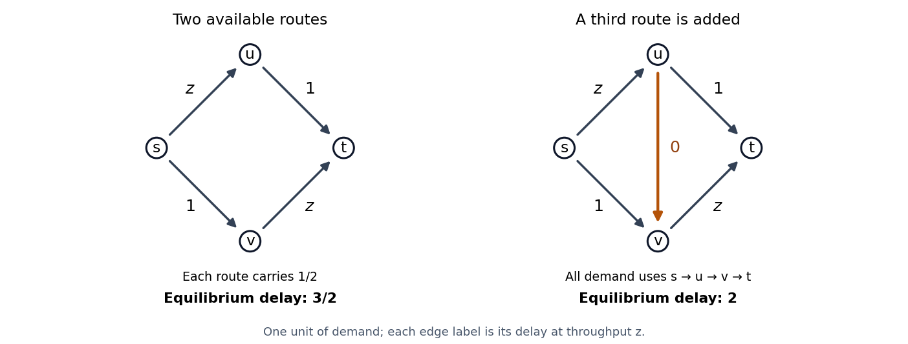

<h1 id="3/solution">Solution</h1>

↑ **Parent:** [3](../3.md)

Take a finite set of source-sink pairs $S$, with fixed demands $b_s\geq0$, and finitely many permitted routes $R_s$ for each pair. Every positive demand must have at least one available route. Let $\nu_r$ be route flow and $\rho_j$ link [throughput](../../../../../throughput.md). The [source-sink route incidence matrix](../../../../../source-sink-route-incidence-matrix.md) and [link-route incidence matrix](../../../../../link-route-incidence-matrix.md) are

$$
H_{sr}=\mathbf1_{\{r\in R_s\}},\qquad
A_{jr}=\mathbf1_{\{j\in r\}},
$$

for simple routes; if a route traverses a link repeatedly, its entry counts those traversals. Thus $H\nu=b$ conserves each demand and $A\nu=\rho$ aggregates link traffic.

At a [Wardrop equilibrium](../../../../../wardrop-equilibrium.md), every route carrying positive flow has minimum delay among routes for the same source-sink pair. If

$$
c_r(\rho)=\sum_j A_{jr}D_j(\rho_j),
$$

there are numbers $\tau_s$ such that $c_r(\rho)\geq\tau_s$ for $r\in R_s$, with equality whenever $\nu_r>0$. This is a [nonatomic routing game](../../../../../nonatomic-congestion-game.md): one infinitesimal user's route change does not alter the link costs it sees.

For continuous nondecreasing link delays, define the [Beckmann potential](../../../../../beckmann-potential.md)

$$
V(\rho)=\sum_j\int_0^{\rho_j}D_j(z)\,dz.
$$

Each term is convex because its [derivative](../../../../../derivative.md) is nondecreasing. The feasible route-flow set $\mathcal F=\{\nu\geq0:H\nu=b\}$ is nonempty and compact: $0\leq\nu_r\leq b_s$ on each pair's routes. Hence the [continuous function](../../../../../continuous-function.md) $V(A\nu)$ attains a minimum. Its [gradient](../../../../../gradient.md) with respect to route flow is

$$
\frac{\partial V(A\nu)}{\partial\nu_r}
=\sum_jA_{jr}D_j(\rho_j)=c_r(\rho).
$$

If $r$ carries positive flow and $r'$ serves the same pair, moving a small amount of flow from $r$ to $r'$ is feasible. At a [minimizer](../../../../../global-minimizer.md) its directional [derivative](../../../../../derivative.md) $c_{r'}-c_r$ is nonnegative. Thus every used route minimizes delay, proving existence of a [Wardrop equilibrium](../../../../../wardrop-equilibrium.md).

Conversely, at such an equilibrium, any feasible competitor $\widetilde\nu$ satisfies

$$
\nabla V(A\nu)\cdot A(\widetilde\nu-\nu)
=\sum_s\sum_{r\in R_s}c_r(\rho)(\widetilde\nu_r-\nu_r)\geq0.
$$

Indeed, the competitor's cost sum for pair $s$ is at least $\tau_sb_s$, while the current flow's cost sum equals $\tau_sb_s$. This first-order [variational inequality](../../../../../variational-inequality.md) is sufficient for optimality of a differentiable [convex function](../../../../../convex-function.md). Therefore

$$
\boxed{\text{Wardrop equilibria are exactly the minimizers of }V(\rho)
\text{ with }H\nu=b,\ A\nu=\rho,\ \nu,\rho\geq0.}
$$

The argument proves both directions of the claimed optimization equivalence, including unused routes with costs tied at the minimum.

If each $D_j$ is strictly increasing, each integral is [strictly convex](../../../../../strictly-convex-function.md), hence so is $V$ as a function of link [throughputs](../../../../../throughput.md). The feasible link-throughput set $A\mathcal F$ is convex. Two distinct minimizing vectors would have a feasible midpoint with strictly smaller potential, so **the equilibrium link-throughput vector is unique**. [Strictly convex function](../../../../../strictly-convex-function.md) in $\rho$ need not give [strictly convex function](../../../../../strictly-convex-function.md) in $\nu$, because $A$ can have a nontrivial kernel.

For an explicit route-flow ambiguity, put two parallel links in each of two consecutive stages, with one unit of demand traversing both stages. Order the four routes by the first and second link choices: $(1,1),(1,2),(2,1),(2,2)$. Set all four link delays to $D_j(z)=z$. Then

$$
\nu=(t,1/2-t,1/2-t,t),\qquad0\leq t\leq1/2,
$$

induces [throughput](../../../../../throughput.md) $1/2$ on each link, and every route has delay one. Every member of this family is an equilibrium, though its route-flow vector changes. This is [route-flow nonuniqueness at a Wardrop equilibrium](../../../../../route-flow-nonuniqueness-at-a-wardrop-equilibrium.md) with strictly increasing delays.

For [Braess paradox](../../../../../braess-s-paradox.md), use vertices $s,u,v,t$ and one unit of $s$-to-$t$ demand. The delays are $D_{su}(z)=z$, $D_{ut}(z)=1$, $D_{sv}(z)=1$, and $D_{vt}(z)=z$. Initially the only routes are $s\!u\!t$ and $s\!v\!t$. If the upper route carries $p$, their costs are $1+p$ and $2-p$, so equilibrium has $p=1/2$ and common delay $3/2$.

Add the directed link $u\to v$ with delay zero. Let the upper, lower and new middle routes carry $p,q,c$, where $p+q+c=1$. Their costs become

$$
c_{sut}=2-q,\qquad c_{svt}=2-p,\qquad c_{suvt}=2-p-q.
$$

If $p>0$, the middle route is strictly cheaper than the upper route, contradicting equilibrium; likewise $q>0$ is impossible. Thus all flow uses the middle route, with $p=q=0,c=1$, and all three route costs are two. Therefore

$$
\boxed{\text{adding a zero-delay link increases the equilibrium delay from }3/2\text{ to }2.}
$$

**[Figure 1](#3/image-adding-the-central-route-raises-the-selfish-equilibrium-delay-in-a-four-node-network). Adding the central route raises the selfish equilibrium delay in a four-node network**.

The potential for the expanded network is

$$
V=\tfrac12\rho_{su}^2+\rho_{ut}+\rho_{sv}+\tfrac12\rho_{vt}^2.
$$

The old flow remains feasible and has potential $5/4$; the new equilibrium has potential $1$. The enlarged feasible set has indeed lowered the minimized potential. But total travel delay is $\sum_j\rho_jD_j(\rho_j)$, not this integral potential: it rises from $3/2$ to $2$. This explains the paradox within the optimization framework. The optimal total-delay value cannot worsen when the old flow is still allowed; selfish equilibrium minimizes a different function.

The phenomenon also survives strictly increasing delays on every link. Replace each constant-one delay by $1+\varepsilon z$ and the new-link delay by $\varepsilon z$. Symmetry gives upper and lower flows $p=\varepsilon/(1+3\varepsilon)$ after expansion, with middle flow $(1+\varepsilon)/(1+3\varepsilon)$. The common new delay is $2-\varepsilon(1-\varepsilon)/(1+3\varepsilon)$, while the old delay was $3/2+\varepsilon/2$. For $\varepsilon=1/10$, these are $251/130>31/20$. Thus the example does not depend on interpreting increasing delays as merely nondecreasing.

## ↑ Ancestors (10)

1. [3](../3.md)
2. [Paper 34](../../paper-34-split.md)
3. [Iii](../../split.md)
4. [2003](../../../split.md)
5. [Past exam of the mathematics course of the University of Cambridge](../../../../split.md)
6. [Mathematics course of the University of Cambridge](../../../../../mathematics-course-of-the-university-of-cambridge.md)
7. [Course of the University of Cambridge](../../../../../course-of-the-university-of-cambridge.md)
8. [University of Cambridge](../../../../../university-of-cambridge-split.md)
9. [List of universities](../../../../../list-of-universities.md)
10. [Codex Wiki](../../../../../split.md)
