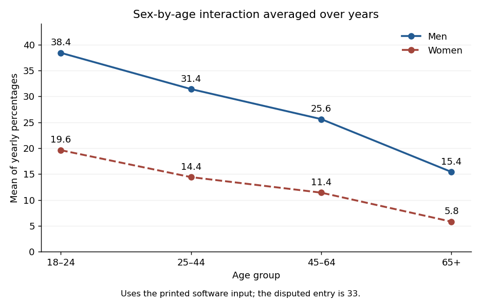

<h1 id="1/solution">Solution</h1>

↑ **Parent:** [1](../1.md)

The S-Plus input and the data table differ in one entry: the former uses $33$ for the first year in the second male age group, whereas the table has $22$. The displayed coefficients are reproduced by the software vector with $33$, so that is the input analysed here. Using $22$ instead would give a different fit, including an intercept of $36.175$ rather than $37.275$.

The factor grid has $5\times4\times2=40$ rows. Its first factor varies fastest, so the five years run within each age group, and the age groups run within each sex. All three predictors are [regression factors](../../../../../regression-factor.md): in particular the year coefficients are category contrasts, not a fitted linear slope in calendar time. Under reference-level coding, take the first year, youngest age group and men as the [reference levels in a regression factor](../../../../../reference-level-in-a-regression-factor.md). Write $s=1$ for women and $0$ for men, and $I_{yk},I_{aj}$ for the other year and age indicators. The [normal linear model](../../../../../normal-linear-model.md) is

$$
P=\alpha+\sum_{k=2}^5\gamma_kI_{yk}+\lambda s+\sum_{j=2}^4\eta_jI_{aj}+\sum_{j=2}^4\kappa_j sI_{aj}+\varepsilon,\qquad\varepsilon\sim N(0,\sigma^2).
$$

The star in the formula includes both main effects and their [statistical interaction](../../../../../interaction-statistics.md). There are twelve coefficients: an intercept, four year contrasts, one sex contrast, three age contrasts and three sex-by-age contrasts. Year effects are assumed common across all sex-age combinations; there is no year [interaction term](../../../../../interaction-term.md). Independent errors with common [variance](../../../../../variance-split.md) are additional assumptions of the reported exact tests.

The [least-squares estimator](../../../../../ordinary-least-squares-estimators.md) is $\widehat b=(X^TX)^{-1}X^TP$, where $X$ has rank twelve. Under the [normal linear model](../../../../../normal-linear-model.md),

$$
\widehat b\sim N_{12}(b,\sigma^2(X^TX)^{-1}),\qquad \frac{\mathrm{RSS}}{\sigma^2}\sim\chi^2_{28},
$$

and these quantities are independent. This standard normal-projection theorem gives $s^2=\mathrm{RSS}/28$ and estimated coefficient [standard errors](../../../../../standard-error.md) $s\sqrt{(X^TX)^{-1}_{jj}}$. A coefficient estimate divided by its [standard error](../../../../../standard-error.md) has a [Student t-distribution](../../../../../student-s-t-distribution.md) with 28 [degrees of freedom](../../../../../degree-of-freedom.md) under its zero-coefficient null. These are the printed t statistics and two-sided [p-values](../../../../../p-value.md); a printed zero is rounding, not a probability of exactly zero. The option suppresses the coefficient-correlation display.

The fitted intercept $37.275$ is the expected percentage for the reference sex, age and year. Relative to that year, the year changes are $0.375,0.500,1.750,3.000$ percentage points. The last two are individually significant at the conventional five-percent level; the first two are not. The sex coefficient $-18.8$ is the female-minus-male difference in the youngest group. The male age changes are $-7,-12.8,-23$ points. Adding the three [interaction term](../../../../../interaction-term.md) coefficients gives the female age changes $-5.2,-8.2,-13.8$. Thus the sex gap shrinks with age. An individual insignificant [interaction term](../../../../../interaction-term.md) coefficient does not justify deleting the whole interaction: the joint [partial F-test](../../../../../partial-f-test-for-nested-linear-models.md) for the three interaction terms gives $F=18.6822$ on $(3,28)$ [degrees of freedom](../../../../../degree-of-freedom.md), with $p\simeq7.46\times10^{-7}$.

The [regression residuals](../../../../../regression-residual.md) are observed minus fitted percentages; their printed five-number summary describes their spread. Direct calculation gives $\mathrm{RSS}=60.2$, so the [residual standard error](../../../../../residual-standard-error.md) is

$$
s=\sqrt{60.2/28}=1.46629\text{ percentage points}.
$$

The [coefficient of determination](../../../../../coefficient-of-determination.md) is $1-\mathrm{RSS}/\mathrm{TSS}=0.985827$. The overall [F-test](../../../../../f-test.md) compares all eleven non-intercept coefficients with zero:

$$
F=\frac{(\mathrm{TSS}-\mathrm{RSS})/11}{\mathrm{RSS}/28}=177.053.
$$

Under the null it has an [F-distribution](../../../../../f-distribution.md) on $(11,28)$ [degrees of freedom](../../../../../degree-of-freedom.md); its very small [p-value](../../../../../p-value.md) shows substantial explained variation. This does not independently validate the Gaussian error assumptions. Survey percentages can have different sampling [variances](../../../../../variance-split.md) and correlations, and the survey denominators and design are not supplied. The output's exact inferential interpretation is conditional on the stated [normal linear model](../../../../../normal-linear-model.md).

The final command makes an [interaction plot](../../../../../interaction-plot.md), not another regression fit. Its points are arithmetic averages over the five years for each sex-age combination. **It draws two decreasing, nonparallel lines**, with coordinates

$$
\boxed{\text{men: }(38.4,31.4,25.6,15.4),\qquad\text{women: }(19.6,14.4,11.4,5.8).}
$$

Their gaps are $18.8,17.0,14.2,9.6$ percentage points, illustrating the sex-by-age [statistical interaction](../../../../../interaction-statistics.md). The average uses the software vector's disputed entry, consistently with the displayed fit. These are means of percentages, not denominator-weighted pooled prevalence estimates.

**[Figure 1](#1/image-sex-by-age-interaction-plot-averaged-over-years-using-the-printed-software-input). Sex-by-age interaction plot averaged over years, using the printed software input**.

## ↑ Ancestors (10)

1. [1](../1.md)
2. [Paper 38](../../paper-38-split.md)
3. [Iii](../../split.md)
4. [2003](../../../split.md)
5. [Past exam of the mathematics course of the University of Cambridge](../../../../split.md)
6. [Mathematics course of the University of Cambridge](../../../../../mathematics-course-of-the-university-of-cambridge.md)
7. [Course of the University of Cambridge](../../../../../course-of-the-university-of-cambridge.md)
8. [University of Cambridge](../../../../../university-of-cambridge-split.md)
9. [List of universities](../../../../../list-of-universities.md)
10. [Codex Wiki](../../../../../split.md)
