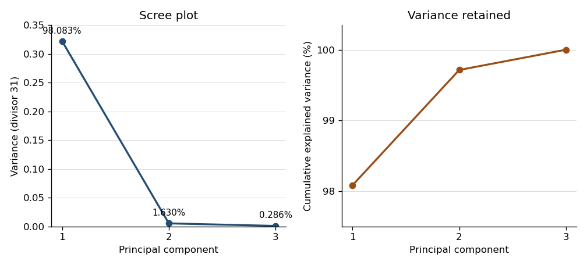

# Paper 42

↑ **Parent:** [Iii](../iii.md)

[https://www.maths.cam.ac.uk/postgrad/part-iii/files/pastpapers/2003/Paper42.pdf](https://www.maths.cam.ac.uk/postgrad/part-iii/files/pastpapers/2003/Paper42.pdf)

**Table of contents**

- [1](#1)
  - [i](#1/i)
    - [Solution](#1/i/solution)
  - [ii](#1/ii)
    - [Solution](#1/ii/solution)
  - [iii](#1/iii)
    - [Solution](#1/iii/solution)
- [2](#2)
  - [i](#2/i)
    - [Solution](#2/i/solution)
  - [ii](#2/ii)
    - [Solution](#2/ii/solution)
- [3](#3)
  - [i](#3/i)
    - [Solution](#3/i/solution)
  - [ii](#3/ii)
    - [Solution](#3/ii/solution)
- [4](#4)
  - [Solution](#4/solution)
- [5](#5)
  - [Solution](#5/solution)
- [6](#6)
  - [Solution](#6/solution)

## 1

↑ **Parent:** [Paper 42](paper-42.md)

<h3 id="1/i">i</h3>

↑ **Parent:** [1](#1)

<h4 id="1/i/solution">Solution</h4>

↑ **Parent:** [I](#1/i)

Use the divisor-$n$ [sample covariance matrix](../../../variance.md#sample-covariance-matrix), since this is the normalization that enters the [multivariate normal](../../../probability-and-statistics.md#multivariate-normal-distribution) [likelihood function](../../../statistical-modelling.md#likelihood-function):

$$
\bar x=\frac1n\sum_{j=1}^n x_j,\qquad
S=\frac1n\sum_{j=1}^n(x_j-\bar x)(x_j-\bar x)^T.
$$

For a [covariance matrix](../../../variance.md#covariance-matrix) that is a [positive-definite matrix](../../../linear-algebra.md#positive-definite-matrix) $V$, the product of the [multivariate normal densities](../../../probability-and-statistics.md#multivariate-normal-density) gives

$$
-2\ell(\mu,V)=np\log(2\pi)+n\log|V|+
\sum_{j=1}^n(x_j-\mu)^TV^{-1}(x_j-\mu).
$$

To separate the [sample mean](../../../variance.md#sample-mean) from the [sample covariance matrix](../../../variance.md#sample-covariance-matrix), expand $x_j-\mu=(x_j-\bar x)+(\bar x-\mu)$. The cross terms sum to zero because $\sum_j(x_j-\bar x)=0$. Also $u^TV^{-1}u=\operatorname{tr}(V^{-1}uu^T)$ by the [trace](../../../linear-algebra.md#matrix-trace) identity. Therefore

$$
\boxed{-2\ell(\mu,V)=np\log(2\pi)+n\log|V|+
 n\operatorname{tr}(V^{-1}S)+n(\bar x-\mu)^TV^{-1}(\bar x-\mu).}
$$

The printed expression suppresses the parameter-independent constant $np\log(2\pi)$; dropping this constant has no effect on [maximum likelihood estimation](../../../statistical-modelling.md#maximum-likelihood-estimation) or the [likelihood-ratio test](../../../statistical-modelling.md#likelihood-ratio-test).

<h3 id="1/ii">ii</h3>

↑ **Parent:** [1](#1)

<h4 id="1/ii/solution">Solution</h4>

↑ **Parent:** [Ii](#1/ii)

With the divisor-$n$ [sample covariance matrix](../../../variance.md#sample-covariance-matrix) defined above, the [maximum-likelihood estimators](../../../statistical-modelling.md#maximum-likelihood-estimator) are

$$
\boxed{\widehat\mu=\bar x,\qquad \widehat V=S.}
$$

Their joint [sampling distribution](../../../statistical-modelling.md#sampling-distribution) is specified by

$$
\boxed{\bar X\sim N_p(\mu,V/n),\qquad nS\sim W_p(n-1,V),
\qquad\bar X\ \text{and}\ S\ \text{are independent}.}
$$

Here $W_p(\nu,V)$ uses the [Wishart distribution](../../../probability-theory.md#wishart-distribution) convention $\mathbb E W=\nu V$. Thus the covariance [maximum-likelihood estimator](../../../statistical-modelling.md#maximum-likelihood-estimator) has [expected value](../../../probability-theory.md#expected-value) $(n-1)V/n$; the [unbiased estimator](../../../statistical-modelling.md#unbiased-estimator) of the [covariance matrix](../../../variance.md#covariance-matrix) is $nS/(n-1)$. These distributions follow from [orthogonal projections](../../../hilbert-space.md#orthogonal-projection) of the jointly [multivariate normal](../../../probability-and-statistics.md#multivariate-normal-distribution) observations onto the constant-observation direction and its [orthogonal complement](../../../hilbert-space.md#orthogonal-complement), though no proof is required here. The covariance maximum in the positive-definite parameter space requires $S$ nonsingular, which holds almost surely when $n>p$ and $V$ is positive definite. Otherwise the [rank of a centered sample covariance matrix](../../../variance.md#rank-of-a-centered-sample-covariance-matrix) shows why the usual unrestricted finite maximum does not exist.

<h3 id="1/iii">iii</h3>

↑ **Parent:** [1](#1)

<h4 id="1/iii/solution">Solution</h4>

↑ **Parent:** [Iii](#1/iii)

Under the unrestricted model, insert the [maximum-likelihood estimates](../../../statistical-modelling.md#maximum-likelihood-estimator) $(\bar x,S)$. Under the diagonal-covariance restriction, the [quadratic form](../../../linear-algebra.md#quadratic-form) is minimized over the [mean](../../../probability-theory.md#expected-value) at $\bar x$, and the remaining objective separates over the diagonal entries:

$$
-2\ell(\bar x,\operatorname{diag}(v_1,\ldots,v_p))
=\text{constant}+n\sum_{j=1}^p\left(\log v_j+\frac{S_{jj}}{v_j}\right).
$$

Differentiating in $v_j>0$ gives $\widehat v_j=S_{jj}$; the derivative changes from negative to positive there. Put $D=\operatorname{diag}(S_{11},\ldots,S_{pp})$. The fitted [trace](../../../linear-algebra.md#matrix-trace) term is $p$ under either model, since $\operatorname{tr}(D^{-1}S)=p=\operatorname{tr}(S^{-1}S)$. Consequently the [likelihood-ratio test statistic](../../../statistical-modelling.md#likelihood-ratio-test-statistic) is determined by

$$
\Lambda=\frac{\sup_{H_0}L}{\sup L}
=\left(\frac{|S|}{\prod_jS_{jj}}\right)^{n/2}
=|R|^{n/2},\qquad R=D^{-1/2}SD^{-1/2}.
$$

This is the [Gaussian diagonal-covariance likelihood-ratio test](../../../statistical-modelling.md#gaussian-diagonal-covariance-likelihood-ratio-test). **Reject for sufficiently small $\log|R|$**, equivalently for large $-n\log|R|$. Under the regular large-sample calibration, [Wilks theorem](../../../statistical-inference.md#wilks-theorem) gives $-n\log|R|\Rightarrow\chi^2_{p(p-1)/2}$, since diagonality removes that many free covariance parameters. The exact critical constant can instead be obtained from the null distribution at the actual sample size.

For $p=2$, write the [sample correlation coefficient](../../../variance.md#sample-correlation-coefficient) as $r$. Then $|R|=1-r^2$, so the [likelihood-ratio test](../../../statistical-modelling.md#likelihood-ratio-test) rejects for **large $|r|$**, not merely for large positive $r$. Under the null, the two variables have a [bivariate normal distribution](../../../probability-and-statistics.md#bivariate-normal-distribution) and are [independent](../../../random-variable.md#independent-random-variables), and the exact test is

$$
\boxed{\left|r\sqrt{\frac{n-2}{1-r^2}}\right|>
 t_{n-2,\,1-\alpha/2}.}
$$

Indeed, condition on the centered first-variable observation vector. Decompose the second centered [Gaussian vector](../../../probability-and-statistics.md#gaussian-random-vector) into its component along that direction and the $n-2$-dimensional [orthogonal complement](../../../hilbert-space.md#orthogonal-complement). Their squared lengths give independent $\chi^2_1$ and $\chi^2_{n-2}$ variables. Their ratio shows that $r\sqrt{(n-2)/(1-r^2)}$ has [Student's t-distribution](../../../continuous-probability-distribution.md#student-s-t-distribution) with $n-2$ [statistical degrees of freedom](../../../statistical-inference.md#statistical-degrees-of-freedom).

## 2

↑ **Parent:** [Paper 42](paper-42.md)

<h3 id="2/i">i</h3>

↑ **Parent:** [2](#2)

<h4 id="2/i/solution">Solution</h4>

↑ **Parent:** [I](#2/i)

Treat each row as a set $A_i$ of attributes with response one. The binary option computes the [Jaccard distance](../../../statistical-learning.md#jaccard-distance), rather than counting matches at joint absences. For a pair of rows, let $a$ count coordinates equal to one in both, $b$ count $(1,0)$, $c$ count $(0,1)$, and $d$ count $(0,0)$. Then

$$
\boxed{d_{ij}=1-\frac{a}{a+b+c}=\frac{b+c}{a+b+c}.}
$$

The denominator counts coordinates present in at least one row; joint absences do not contribute. If both rows have no presences, use distance zero. This differs from [normalized Hamming distance](../../../coding-theory.md#normalized-hamming-distance), which would divide $b+c$ by all ten coordinates.

For Philip and Chad, four attributes are present in both and eight in at least one, giving [Jaccard distance](../../../statistical-learning.md#jaccard-distance) $4/8=0.50$. Graham and Tim differ in one of eight coordinates present in their union, giving $1/8=0.125$, printed as $0.12$. Fred and Gbenga have identical profiles, hence distance zero despite being different students. The resulting [dissimilarity matrix](../../../statistical-learning.md#dissimilarity-matrix) is symmetric with zero diagonal; `dist2full` restores the other half and the diagonal from the stored pairwise entries. The display rounds entries for readability; the [agglomerative hierarchical clustering](../../../statistical-learning.md#agglomerative-hierarchical-clustering) uses the original unrounded distances.

<h3 id="2/ii">ii</h3>

↑ **Parent:** [2](#2)

<h4 id="2/ii/solution">Solution</h4>

↑ **Parent:** [Ii](#2/ii)

The output describes [complete-linkage clustering](../../../statistical-learning.md#complete-linkage-clustering): the distance between two current groups is the largest original [Jaccard distance](../../../statistical-learning.md#jaccard-distance) between a member of one and a member of the other. Starting with singleton groups, [agglomerative hierarchical clustering](../../../statistical-learning.md#agglomerative-hierarchical-clustering) merges a closest pair at each step. In the merge array, a negative index denotes the original row of that number, and a positive index denotes the group created at that earlier merge. A printed height is the dissimilarity at which the new group forms.

Reading those references recursively gives the following [dendrogram](../../../statistical-learning.md#dendrogram) construction, with exact heights recovered from the binary profiles:

- Fred and Gbenga join at $0$; Graham and Tim join at $1/8$; Chad and Nicolas join at $1/6$.
- Frederic joins Chad–Nicolas at $1/3$, and John then joins that group at the same height $1/3$. These tied heights produce successive branches on the same horizontal level.
- Philip and Mark join at $3/8$; Garfield joins Fred–Gbenga at $2/5$.
- Graham–Tim joins Philip–Mark at $4/9$; Chad–Nicolas–Frederic–John joins Garfield–Fred–Gbenga at $1/2$.
- Sauli joins Graham–Tim–Philip–Mark at $5/8$, and Juliet joins that group at $3/4$.
- The two remaining groups join at $7/8$.

**[Figure 1](#2/ii/image-complete-linkage-dendrogram-reconstructed-from-exact-binary-profile-distances). Complete-linkage dendrogram reconstructed from exact binary-profile distances**.

For example, a cut strictly between $1/2$ and $5/8$ gives four groups: Chad–Nicolas–Frederic–John–Garfield–Fred–Gbenga, Graham–Tim–Philip–Mark, Sauli, and Juliet. A cut strictly between $3/4$ and $7/8$ gives two larger groups. **The leaf order is not intrinsic; the merge memberships and heights are.** Reflecting branches leaves the [dendrogram](../../../statistical-learning.md#dendrogram) unchanged in meaning. The zero-height pair indicates identical recorded responses, while high joins indicate comparatively dissimilar profiles. These conclusions depend on the choice of [Jaccard distance](../../../statistical-learning.md#jaccard-distance), which ignores shared negative answers; the [dendrogram](../../../statistical-learning.md#dendrogram) itself does not establish substantive demographic classes.

## 3

↑ **Parent:** [Paper 42](paper-42.md)

<h3 id="3/i">i</h3>

↑ **Parent:** [3](#3)

<h4 id="3/i/solution">Solution</h4>

↑ **Parent:** [I](#3/i)

Take logarithms entry by entry before centering. For tree $i$, let $z_i=(\log G_i,\log H_i,\log V_i)^T$, and put $\bar z=31^{-1}\sum_i z_i$. The command `var(log(b))` computes the [sample covariance matrix](../../../variance.md#sample-covariance-matrix) with the [unbiased estimator](../../../statistical-modelling.md#unbiased-estimator) normalization

$$
\boxed{\widehat\Sigma=\frac1{30}\sum_{i=1}^{31}(z_i-\bar z)(z_i-\bar z)^T.}
$$

Thus entry $(j,k)$ is the sum of products of the centered log measurements divided by $30$, not the logarithm of the covariance between the original measurements. Its diagonal entries are the three log-variable [sample variances](../../../statistical-inference.md#sample-variance), and the off-diagonal entries are their [sample covariances](../../../variance.md#sample-covariance). The positive off-diagonal entries indicate positive association of the log measurements. Taking logarithms turns a multiplicative relation such as $V\approx cG^2H$ into the approximately linear relation $\log V\approx\log c+2\log G+\log H$, which motivates investigating [principal components](../../../statistical-learning.md#principal-component) of these transformed observations.

<h3 id="3/ii">ii</h3>

↑ **Parent:** [3](#3)

<h4 id="3/ii/solution">Solution</h4>

↑ **Parent:** [Ii](#3/ii)

The command centres the log measurements and performs [principal component analysis](../../../statistical-learning.md#principal-component-analysis) of their [covariance matrix](../../../variance.md#covariance-matrix). With `cor=F`, it does not first standardize the variables to variance one. For a unit [principal component loading](../../../statistical-learning.md#principal-component-loading) vector $q$, the score $q^T(z_i-\bar z)$ has [sample variance](../../../statistical-inference.md#sample-variance) $q^T\widehat\Sigma q$. By the [spectral theorem for real symmetric matrices](../../../linear-algebra.md#spectral-theorem-for-real-symmetric-matrices), expand $q$ in an [orthonormal eigenbasis](../../../linear-operator-theory.md#orthonormal-eigenbasis); that [variance](../../../variance.md) is a weighted average of the [eigenvalues](../../../linear-operator-theory.md#eigenvalue). Its maximum is the largest [eigenvalue](../../../linear-operator-theory.md#eigenvalue), reached at the corresponding [eigenvector](../../../linear-operator-theory.md#eigenvector). Repeating subject to [orthogonality](../../../linear-algebra.md#orthogonal-vectors) to previous directions gives the other [principal components](../../../statistical-learning.md#principal-component).

The software uses the divisor-$31$ [sample covariance matrix](../../../variance.md#sample-covariance-matrix) for its component standard deviations, whereas `var` used divisor $30$. Diagonalizing the displayed matrix gives approximately

$$
\lambda(\widehat\Sigma)=(0.3323932,\ 0.00552536,\ 0.000970632),
\qquad
\lambda(S_{31})=\frac{30}{31}\lambda(\widehat\Sigma).
$$

Taking square roots of the latter gives $(0.5671603,0.07312405,0.03064834)$, agreeing with the output to the rounding of the displayed [sample covariance matrix](../../../variance.md#sample-covariance-matrix). The normalization changes these numerical standard deviations but leaves the [eigenvectors](../../../linear-operator-theory.md#eigenvector) and proportions of [explained variance of a principal component](../../../statistical-learning.md#explained-variance-of-a-principal-component) unchanged.

The first [principal component](../../../statistical-learning.md#principal-component) explains **about $98.08\%$ of the total log-variable variance**, the second another $1.63\%$, and the last about $0.286\%$. Keeping two preserves about $99.714\%$. An original [scree plot](../../../statistical-learning.md#scree-plot) displays the sharp drop after the first component:

**[Figure 2](#3/ii/image-principal-component-variances-and-cumulative-explained-variance-for-the-log-tree-measurements). Principal-component variances and cumulative explained variance for the log-tree measurements**.

Consequently the centered cloud is very elongated along one direction: a one-dimensional approximation represents almost all of its squared variation. From the displayed [covariance matrix](../../../variance.md#covariance-matrix), a unit first [eigenvector](../../../linear-operator-theory.md#eigenvector), with its arbitrary sign chosen positive, is approximately

$$
q_1=(0.3980,\ 0.09514,\ 0.9124)^T.
$$

Its [principal component score](../../../statistical-learning.md#principal-component-score) is therefore $0.3980(\log G_i-\overline{\log G})+0.09514(\log H_i-\overline{\log H})+0.9124(\log V_i-\overline{\log V})$. All coefficients have the same sign, so this direction describes overall tree size, with log volume dominating the unstandardized variation. The summary alone supplies proportions, not the loading directions; the displayed [sample covariance matrix](../../../variance.md#sample-covariance-matrix) supplies the latter. This is a geometric approximation, not evidence of an exact deterministic relation or independent original variables.

One further use is [principal component analysis on a correlation matrix](../../../statistical-learning.md#principal-component-analysis-on-a-correlation-matrix), obtained with `cor=T`, which equalizes marginal variances and answers a different scaling-sensitive question. Another is [principal component regression](../../../statistical-learning.md#principal-component-regression): fit a response to selected [principal component scores](../../../statistical-learning.md#principal-component-score) rather than highly correlated original predictors, choosing the number using prediction assessment. The fitted transformation also projects new measurements into the same low-dimensional coordinates, provided the training centering and scaling are retained.

## 4

↑ **Parent:** [Paper 42](paper-42.md)

<h3 id="4/solution">Solution</h3>

↑ **Parent:** [4](#4)

Write the binary [incidence matrix of a set system](../../../extremal-set-theory.md#incidence-matrix-of-a-set-system) as $N$ to avoid confusing it with a sample size. Then

$$
(NN^T)_{ii}=\sum_jN_{ij}
$$

counts the number of blocks containing treatment $i$, and for $i\ne l$, $(NN^T)_{il}=\sum_jN_{ij}N_{lj}$ counts blocks containing both treatments. The displayed structure therefore makes every treatment replication equal to $r$ and every pair concurrence equal to $\lambda$.

Assume the usual nonempty [block design](../../../statistical-modelling.md#block-design), with $r>0$ and $k>0$. If $r=\lambda$, any block containing one treatment contains every other treatment: otherwise that treatment's replication would exceed its concurrence with the omitted one. Every block is consequently complete, so **$k=t$ and $r=b$**. With random allocation within blocks this is a [randomized complete block design](../../../statistical-modelling.md#randomized-complete-block-design). If $\lambda<r$, the design is a [balanced incomplete block design](../../../statistical-modelling.md#balanced-incomplete-block-design). Counting partners of a fixed treatment in its $r$ blocks gives

$$
r(k-1)=\lambda(t-1),\qquad tr=bk.
$$

For $t>1$, $\lambda/r<1$ gives $k-1<t-1$, hence $k<t$. Moreover $NN^T$ has [eigenvalue](../../../linear-operator-theory.md#eigenvalue) $r-\lambda>0$ on the $(t-1)$-dimensional zero-sum subspace and [eigenvalue](../../../linear-operator-theory.md#eigenvalue) $r+(t-1)\lambda>0$ on the constant direction. Thus $\operatorname{rank}(NN^T)=t$, while $\operatorname{rank}(NN^T)\leq\operatorname{rank}(N)\leq b$. This proves **$b\geq t$**, the [Fisher's inequality for block designs](../../../statistical-modelling.md#fisher-s-inequality-for-block-designs). The case $\lambda=0$ allows singleton blocks; their lack of connectedness prevents general treatment comparison after block adjustment, but does not invalidate the rank inequality.

First ignore the day information and use a [one-way normal linear model](../../../statistical-modelling.md#one-way-normal-linear-model) with five group means and independent errors of common [variance](../../../variance.md). There are $20$ observations. The [analysis of variance](../../../linear-regression.md#analysis-of-variance) has treatment, residual and corrected-total [statistical degrees of freedom](../../../statistical-inference.md#statistical-degrees-of-freedom) $4,15,19$, respectively. The [mean squares in ANOVA](../../../linear-regression.md#mean-square-in-anova) give

$$
\boxed{F_{\mathrm{unblocked}}=
\frac{42.4/4}{46.7/15}=3.4047.}
$$

Under equal treatment means this has the [F-distribution](../../../continuous-probability-distribution.md#f-distribution) with $(4,15)$ degrees. It exceeds the given $5\%$ upper critical value $3.06$, so **the unblocked analysis rejects equality at $5\%$**.

The actual day allocation omits a different treatment on each of the five days. Hence it is a [balanced incomplete block design](../../../statistical-modelling.md#balanced-incomplete-block-design) with

$$
\boxed{t=b=5,\qquad r=k=4,\qquad\lambda=3.}
$$

Every pair occurs on exactly the three days omitting neither member. In the additive [two-way analysis of variance](../../../linear-regression.md#two-way-analysis-of-variance), use an intercept, four independent treatment contrasts and four day contrasts. The design is connected, so the model rank is $9$ and its residual has $20-9=11$ [statistical degrees of freedom](../../../statistical-inference.md#statistical-degrees-of-freedom). Day effects and treatment effects are not orthogonal, because a different treatment is absent each day; the unadjusted treatment sum of squares cannot be used for the adjusted test.

Enter days first and then treatments. The supplied [sequential sums of squares](../../../linear-regression.md#sequential-sum-of-squares) give

$$
\mathrm{SS}_{E}=89.1-28.4-18.3=42.4,\qquad
\boxed{F_{\mathrm{adjusted}}=
\frac{18.3/4}{42.4/11}=1.1869.}
$$

The day, treatment-after-day, residual and corrected-total [statistical degrees of freedom](../../../statistical-inference.md#statistical-degrees-of-freedom) are $4,4,11,19$. Under the additive [normal linear model](../../../statistical-modelling.md#normal-linear-model) and the null of equal treatment effects, the adjusted numerator and residual squared lengths are independent [chi-squared](../../../probability-theory.md#chi-squared-distribution) quantities, so the ratio has the [F-distribution](../../../continuous-probability-distribution.md#f-distribution) with $(4,11)$ degrees. It is below even the given $10\%$ critical value $2.54$. **After accounting for days there is no significant treatment difference at either $10\%$ or $5\%$.** This inference assumes independent homoscedastic normal errors and an additive day effect; with one observation per observed treatment–day cell, unrestricted interactions cannot also be fitted.

## 5

↑ **Parent:** [Paper 42](paper-42.md)

<h3 id="5/solution">Solution</h3>

↑ **Parent:** [5](#5)

Code each two-level factor as a sign $x_j\in\{-1,1\}$. A [factorial contrast](../../../statistical-modelling.md#factorial-contrast) indexed by a factor subset $A$ has sign column $\chi_A(x)=\prod_{j\in A}x_j$, with the empty subset giving the intercept. Construct a regular [fractional factorial design](../../../statistical-modelling.md#fractional-factorial-design) by choosing $k$ independent words $G_1,\ldots,G_k$ and retaining the settings satisfying $\chi_{G_i}(x)=s_i$, where each $s_i\in\{-1,1\}$. In binary exponent notation these are $k$ independent linear equations over $\mathbb F_2$, leaving $m-k$ freely chosen coordinates and exactly $2^{m-k}$ settings. Dependence of the chosen words would fail to give the stated fraction size.

The words generated by multiplying the $G_i$ form the [defining contrast subgroup](../../../statistical-modelling.md#defining-contrast-subgroup) $\mathcal H$, of order $2^k$. Multiplication cancels a repeated factor, so word multiplication is [symmetric difference](../../../set.md#symmetric-difference) of subsets. On the fraction, $\chi_H=s_H$ is constant for every $H\in\mathcal H$, and hence

$$
\chi_{AH}=\chi_A\chi_H=s_H\chi_A.
$$

To see that these are all the aliases, average $\chi_A\chi_B=\chi_{AB}$ over the fraction. If $AB\notin\mathcal H$, this is a nonconstant character of its freely varying binary coordinates; pairing settings that reverse that character makes the average zero. If $AB\in\mathcal H$, the product is constant. Thus the [aliasing in a fractional factorial design](../../../statistical-modelling.md#aliasing-in-a-fractional-factorial-design) classes are exactly the cosets of $\mathcal H$. For a half fraction, $\mathcal H=\{I,G\}$ with $G\ne I$, and **every contrast column is aliased with exactly the other word $AG$**, with a plus or minus sign according to the chosen fraction. This includes the defining word paired with the intercept.

For the six-factor experiment, take the 32-run half fraction

$$
I=ABCDEF,\qquad x_Ax_Bx_Cx_Dx_Ex_F=1.
$$

Its [resolution of a fractional factorial design](../../../statistical-modelling.md#resolution-of-a-fractional-factorial-design) is VI. Every [main effect](../../../statistical-modelling.md#main-effect) is aliased with a five-factor interaction, and every [two-factor interaction](../../../statistical-model.md#two-factor-interaction) with a four-factor interaction. In particular, no two required low-order effects are aliased with one another. Under the stated negligible-higher-interaction assumption, all six [main effects](../../../statistical-modelling.md#main-effect) and the fourteen required [two-factor interactions](../../../statistical-model.md#two-factor-interaction) are estimable before introducing blocks.

To form four equal days, classify runs by the two signs

$$
 u=x_Ax_F,\qquad v=x_Ax_Bx_C.
$$

Their product is $x_Bx_Cx_F$. The three nonconstant block contrasts therefore coincide with the treatment-column alias classes

$$
AF\equiv BCDE,\qquad ABC\equiv DEF,\qquad BCF\equiv ADE.
$$

Only $AF$ among the [main effects](../../../statistical-modelling.md#main-effect) and [two-factor interactions](../../../statistical-model.md#two-factor-interaction) is lost to [block confounding in a factorial design](../../../statistical-modelling.md#block-confounding-in-a-factorial-design); the other two block directions involve only negligible three-factor interactions.

Here is an explicit construction of every run without an ambiguous generator convention. For each day sign pair $(u,v)\in\{-1,1\}^2$, choose $(s,t,w)\in\{-1,1\}^3$ freely and set

$$
\boxed{(A,B,C,D,E,F)=(s,\ t,\ vst,\ w,\ uv sw,\ us).}
$$

There are eight distinct settings per day and 32 in total. Direct multiplication gives $ABCDEF=1$, $AF=u$ and $ABC=v$. Conversely those three equations solve $C,E,F$ uniquely from $A,B,D$, so there are no missing or repeated settings. Assign the four sign pairs randomly to the four days, and randomize the eight runs within each day.

Distinct nonaliased [factorial contrasts](../../../statistical-modelling.md#factorial-contrast) are [orthogonal](../../../linear-algebra.md#orthogonal-vectors) over the fraction. None of the 20 required low-order contrast columns belongs to a block class, so all are also [orthogonal](../../../linear-algebra.md#orthogonal-vectors) to the three block-effect columns. Their joint [design matrix](../../../linear-regression.md#design-matrix), including an intercept, therefore has rank $1+3+6+14=24$. The [analysis of variance](../../../linear-regression.md#analysis-of-variance) partition is

$$
\boxed{\begin{array}{c|r}
\text{Source}&\text{Degrees of freedom}\\\hline
\text{Days}&3\\
\text{Main effects}&6\\
\text{Two-factor interactions except }AF&14\\
\text{Residual}&8\\\hline
\text{Corrected total}&31
\end{array}}
$$

The eight residual directions are the remaining unconfounded three-factor alias classes. They estimate error only under the negligible-higher-interaction assumption; they are not a separate replicated [pure error](../../../statistical-modelling.md#pure-error) stratum. This provides the requested comparisons within exactly four days of eight runs.

## 6

↑ **Parent:** [Paper 42](paper-42.md)

<h3 id="6/solution">Solution</h3>

↑ **Parent:** [6](#6)

For the initial [normal linear model](../../../statistical-modelling.md#normal-linear-model), the [design matrix](../../../linear-regression.md#design-matrix) has rows $(1,x_1,x_2,x_3)$. The eight factorial corners have balanced signs and [orthogonal](../../../linear-algebra.md#orthogonal-vectors) coordinate columns; the six centre points contribute only to the intercept. Consequently

$$
X^TX=\operatorname{diag}(14,8,8,8).
$$

Using the [least-squares normal equations](../../../linear-regression.md#normal-equations-for-linear-least-squares) gives the [least-squares estimator](../../../statistical-modelling.md#ordinary-least-squares-estimators)

$$
\boxed{\begin{aligned}
\widehat\beta_0&=\frac1{14}\sum_{i=1}^{14}y_i,\\
\widehat\beta_1&=\frac{-y_1-y_2-y_3-y_4+y_5+y_6+y_7+y_8}{8},\\
\widehat\beta_2&=\frac{-y_1-y_2+y_3+y_4-y_5-y_6+y_7+y_8}{8},\\
\widehat\beta_3&=\frac{-y_1+y_2-y_3+y_4-y_5+y_6-y_7+y_8}{8}.
\end{aligned}}
$$

It is a linear transformation of independent normal responses, so its [sampling distribution](../../../statistical-modelling.md#sampling-distribution) is

$$
\boxed{\widehat\beta\sim N_4\!\left(\beta,\sigma^2
\operatorname{diag}(1/14,1/8,1/8,1/8)\right).}
$$

The four estimated coefficients are [independent](../../../random-variable.md#independent-random-variables), since they are jointly normal with diagonal [covariance matrix](../../../variance.md#covariance-matrix).

Adding the axial settings produces a [central composite design](../../../statistical-modelling.md#central-composite-design): eight factorial corners, six axial points and six replicated centre points. The axial distance $1.682$ is the rounded value of $8^{1/4}=1.6817928\ldots$. With that exact distance it is a [rotatable design](../../../statistical-modelling.md#rotatable-design) for a full quadratic model. Indeed, sign symmetry annihilates odd moments, all coordinates have the same second moment, and the fourth moments satisfy

$$
\sum x_j^4=8+2\alpha^4,\qquad
\sum x_j^2x_l^2=8\quad(j\ne l).
$$

Rotational symmetry requires the first to be three times the second, giving $\alpha^4=8$. Using the printed rounded distance makes rotatability approximate, rather than mathematically exact.

The full [quadratic regression](../../../linear-regression.md#quadratic-regression) mean has ten coefficients:

$$
y=\beta_0+\sum_{j=1}^3\beta_jx_j+
\sum_{j=1}^3\beta_{jj}x_j^2+
\beta_{12}x_1x_2+\beta_{13}x_1x_3+\beta_{23}x_2x_3+\varepsilon.
$$

The expanded [design matrix](../../../linear-regression.md#design-matrix) has rank ten. To verify this rather than just count parameters, suppose such a quadratic vanishes at every setting. Its centre value sets its constant term to zero; subtracting the values at opposite axial points sets every linear coefficient to zero, and adding them then sets every squared-coordinate coefficient to zero. On the factorial corners, [orthogonality](../../../linear-algebra.md#orthogonal-vectors) of the three pair-product columns forces their coefficients to zero as well. Thus all ten columns are independent, leaving $20-10=10$ residual [statistical degrees of freedom](../../../statistical-inference.md#statistical-degrees-of-freedom).

There are $15$ distinct settings: eight corners, six axial points and the centre. The six centre replicates give the only [pure error](../../../statistical-modelling.md#pure-error), with $6-1=5$ degrees and sum of squares $859.33$. The saturated setting-mean model has $15$ parameters, so the [lack of fit](../../../statistical-modelling.md#lack-of-fit) beyond the quadratic model has $15-10=5$ degrees. For any setting $r$ with $n_r$ replicates, the identity

$$
\sum_j(y_{rj}-\widehat y_r)^2
=\sum_j(y_{rj}-\bar y_r)^2+n_r(\bar y_r-\widehat y_r)^2
$$

splits the [residual sum of squares](../../../linear-regression.md#residual-sum-of-squares) into [pure error](../../../statistical-modelling.md#pure-error) and [lack of fit](../../../statistical-modelling.md#lack-of-fit); the cross term vanishes because the deviations from the setting mean sum to zero. Summing gives

$$
\mathrm{SS}_{\mathrm{LOF}}=1860.98-859.33=1001.65.
$$

Under a correct quadratic mean with independent errors of constant normal [variance](../../../variance.md), the pure-error and lack-of-fit projections are [orthogonal](../../../linear-algebra.md#orthogonal-vectors), hence their sums of squares are independent with respective distributions $\sigma^2\chi^2_5$ and $\sigma^2\chi^2_5$. The [Lack-of-fit F-test](../../../statistical-modelling.md#lack-of-fit-f-test) therefore uses

$$
\boxed{F=\frac{1001.65/5}{859.33/5}=1.1656,\qquad F\sim F_{5,5}\text{ under the null}.}
$$

This is below the given $10\%$ and $5\%$ critical values $3.45$ and $5.05$. **There is no significant lack of fit at either level.** That is failure to reject this quadratic mean, not proof that it is exact or that a maximum has already been located. The pure-error denominator also assumes the error variance at the centre represents the common variance throughout the experiment.

## ↑ Ancestors (8)

1. [Iii](../iii.md)
2. [2003](../../2003.md)
3. [Past exam of the mathematics course of the University of Cambridge](../../../past-exam-of-the-mathematics-course-of-the-university-of-cambridge.md)
4. [Mathematics course of the University of Cambridge](../../../university-of-cambridge.md#mathematics-course-of-the-university-of-cambridge)
5. [Course of the University of Cambridge](../../../university-of-cambridge.md#course-of-the-university-of-cambridge)
6. [University of Cambridge](../../../university-of-cambridge.md)
7. [List of universities](../../../README.md#list-of-universities)
8. [Codex Wiki](../../../README.md)
