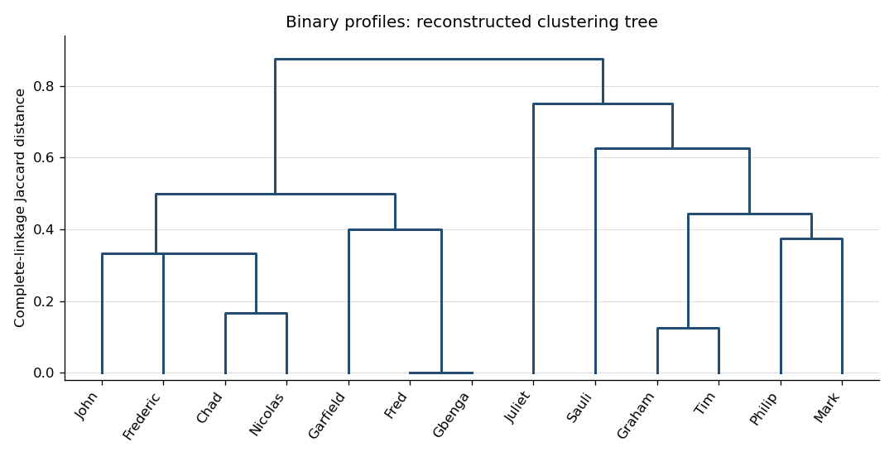

<h1 id="2/ii/solution">Solution</h1>

↑ **Parent:** [Ii](../ii.md)

The output describes [complete-linkage clustering](../../../../../../complete-linkage-clustering.md): the distance between two current groups is the largest original [Jaccard distance](../../../../../../jaccard-distance.md) between a member of one and a member of the other. Starting with singleton groups, [agglomerative hierarchical clustering](../../../../../../agglomerative-hierarchical-clustering.md) merges a closest pair at each step. In the merge array, a negative index denotes the original row of that number, and a positive index denotes the group created at that earlier merge. A printed height is the dissimilarity at which the new group forms.

Reading those references recursively gives the following [dendrogram](../../../../../../dendrogram.md) construction, with exact heights recovered from the binary profiles:

- Fred and Gbenga join at $0$; Graham and Tim join at $1/8$; Chad and Nicolas join at $1/6$.
- Frederic joins Chad–Nicolas at $1/3$, and John then joins that group at the same height $1/3$. These tied heights produce successive branches on the same horizontal level.
- Philip and Mark join at $3/8$; Garfield joins Fred–Gbenga at $2/5$.
- Graham–Tim joins Philip–Mark at $4/9$; Chad–Nicolas–Frederic–John joins Garfield–Fred–Gbenga at $1/2$.
- Sauli joins Graham–Tim–Philip–Mark at $5/8$, and Juliet joins that group at $3/4$.
- The two remaining groups join at $7/8$.

**[Figure 1](#2/ii/image-complete-linkage-dendrogram-reconstructed-from-exact-binary-profile-distances). Complete-linkage dendrogram reconstructed from exact binary-profile distances**.

For example, a cut strictly between $1/2$ and $5/8$ gives four groups: Chad–Nicolas–Frederic–John–Garfield–Fred–Gbenga, Graham–Tim–Philip–Mark, Sauli, and Juliet. A cut strictly between $3/4$ and $7/8$ gives two larger groups. **The leaf order is not intrinsic; the merge memberships and heights are.** Reflecting branches leaves the [dendrogram](../../../../../../dendrogram.md) unchanged in meaning. The zero-height pair indicates identical recorded responses, while high joins indicate comparatively dissimilar profiles. These conclusions depend on the choice of [Jaccard distance](../../../../../../jaccard-distance.md), which ignores shared negative answers; the [dendrogram](../../../../../../dendrogram.md) itself does not establish substantive demographic classes.

## ↑ Ancestors (11)

1. [Ii](../ii.md)
2. [2](../../2.md)
3. [Paper 42](../../../paper-42-split.md)
4. [Iii](../../../split.md)
5. [2003](../../../../split.md)
6. [Past exam of the mathematics course of the University of Cambridge](../../../../../split.md)
7. [Mathematics course of the University of Cambridge](../../../../../../mathematics-course-of-the-university-of-cambridge.md)
8. [Course of the University of Cambridge](../../../../../../course-of-the-university-of-cambridge.md)
9. [University of Cambridge](../../../../../../university-of-cambridge-split.md)
10. [List of universities](../../../../../../list-of-universities.md)
11. [Codex Wiki](../../../../../../split.md)
