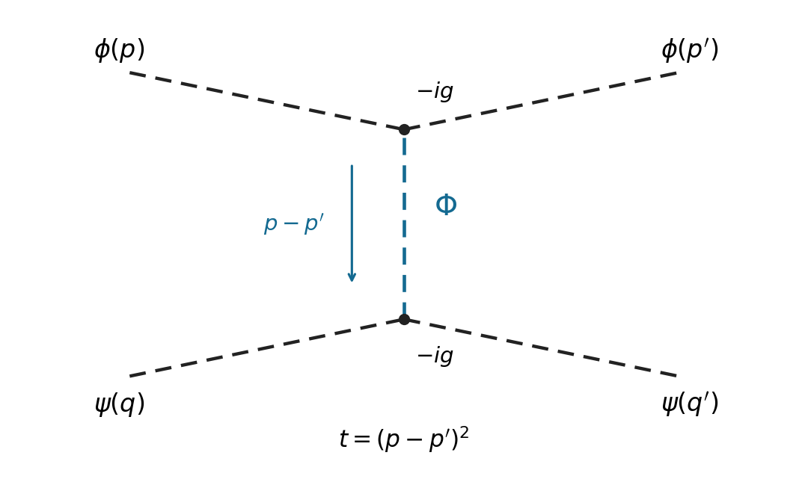

<h1 id="3/solution">Solution</h1>

↑ **Parent:** [3](../3.md)

All three fields have mass $m$. In the [interaction picture](../../../../../interaction-picture.md) the [quantum fields](../../../../../quantum-field.md) evolve with the free [Hamiltonian operator](../../../../../hamiltonian-quantum-mechanics.md), so their equations are

$$
\boxed{(\Box+m^2)\phi_I=(\Box+m^2)\psi_I=(\Box+m^2)\Phi_I=0}.
$$

The interactions evolve the states instead. For $\chi\in\{\phi,\psi,\Phi\}$ the appropriate [mode expansion of a free field](../../../../../mode-expansion-of-a-free-field.md) is

$$
\chi_I(x)=\int\frac{d^3p}{(2\pi)^3 2E_p}\,[a_\chi(\mathbf p)e^{-ip\cdot x}+a_\chi^\dagger(\mathbf p)e^{ip\cdot x}],\qquad E_p=\sqrt{\mathbf p^2+m^2}.
$$

Independent species have commuting [creation and annihilation operators](../../../../../creation-and-annihilation-operators.md). The full set of [canonical commutation relations](../../../../../canonical-commutation-relation.md) is

$$
[a_\chi(\mathbf p),a_\eta^\dagger(\mathbf q)]=\delta_{\chi\eta}(2\pi)^3 2E_p\delta^3(\mathbf p-\mathbf q),\qquad
[a_\chi,a_\eta]=[a_\chi^\dagger,a_\eta^\dagger]=0.
$$

These follow from the separate equal-time [canonical commutation relations](../../../../../canonical-commutation-relation.md) for the three [real scalar fields](../../../../../real-scalar-field.md). For comparison, in the [Heisenberg picture](../../../../../heisenberg-picture.md) the full [Euler-Lagrange field equations](../../../../../euler-lagrange-field-equation.md) contain interactions: $(\Box+m^2)\phi_H=-g\phi_H\Phi_H$, $(\Box+m^2)\psi_H=-g\psi_H\Phi_H$, and $(\Box+m^2)\Phi_H=-\frac g2(\phi_H^2+\psi_H^2)$. These are distinct from the free equations used in the [interaction picture](../../../../../interaction-picture.md).

There are no derivative couplings, so the [interaction Hamiltonian](../../../../../interaction-hamiltonian.md) is $H_I(t)=-\int d^3x\,\mathcal L_I(x)$. The [interaction picture](../../../../../interaction-picture.md) evolution operator obeys

$$
i\partial_tU_I(t,t_0)=H_I(t)U_I(t,t_0),\qquad U_I(t_0,t_0)=1.
$$

Iterating its integral equation gives the [Dyson series](../../../../../dyson-series.md)

$$
U_I(t,t_0)=1+\sum_{n\ge1}(-i)^n\int_{t_0}^{t}dt_1\int_{t_0}^{t_1}dt_2\cdots\int_{t_0}^{t_{n-1}}dt_n\,H_I(t_1)\cdots H_I(t_n)
=T\exp\left[-i\int_{t_0}^{t}H_I(t')\,dt'\right].
$$

The ordered integration region is equivalent to the unrestricted region with [time ordering](../../../../../time-ordering.md) and the factor $1/n!$. Taking the scattering limit $t_0\to-\infty$, $t\to\infty$, with the usual adiabatic prescription for perturbation theory, therefore yields the [S-matrix](../../../../../s-matrix.md)

$$
\boxed{S=T\exp\left[i\int d^4x\,\mathcal L_I(x)\right]}.
$$

All fields inside this expression are [interaction picture](../../../../../interaction-picture.md) fields.

Use [relativistic normalization of a one-particle state](../../../../../relativistic-normalization-of-a-one-particle-state.md) and take $|i\rangle=a_\phi^\dagger(\mathbf p)a_\psi^\dagger(\mathbf q)|0\rangle$, $|f\rangle=a_\phi^\dagger(\mathbf p')a_\psi^\dagger(\mathbf q')|0\rangle$. Define the connected [scattering amplitude](../../../../../scattering-amplitude.md) by $\langle f|S|i\rangle_{\mathrm{conn}}=i(2\pi)^4\delta^4(p'+q'-p-q)\mathcal M$. The identity contribution describes no scattering; the term linear in $g$ cannot connect these four external particles. At quadratic order, the connected term in the [Dyson series](../../../../../dyson-series.md) is

$$
S^{(2)}=-\frac{g^2}{8}\int d^4x\,d^4y\,T\left\{[\phi_I^2\Phi_I+\psi_I^2\Phi_I](x)[\phi_I^2\Phi_I+\psi_I^2\Phi_I](y)\right\}.
$$

By [Wick theorem](../../../../../wick-s-theorem.md), a connected [Wick contraction](../../../../../wick-contraction.md) must attach the two external $\phi$ legs to $\phi_I^2$ at one vertex, the two external $\psi$ legs to $\psi_I^2$ at the other, and contract the remaining two $\Phi_I$ fields. The two assignments of species to $x,y$ cancel the Dyson factor $1/2!$. At either vertex, the $2!$ assignments of its identical fields to the incoming and outgoing particle cancel the interaction factor $1/2$. Equivalently, the coefficient $-g^2/8$ is multiplied by $2\times2\times2$, giving $-g^2$. Therefore, writing $D_F(x-y)=\langle0|T\Phi_I(x)\Phi_I(y)|0\rangle$,

$$
\langle f|S^{(2)}|i\rangle_{\mathrm{conn}}
=-g^2\int d^4x\,d^4y\,e^{i(p'-p)\cdot x+i(q'-q)\cdot y}D_F(x-y).
$$

Insert the [Feynman propagator](../../../../../feynman-propagator.md) $D_F(x-y)=\int\frac{d^4r}{(2\pi)^4}\frac{i e^{-ir\cdot(x-y)}}{r^2-m^2+i0}$. The two vertex integrals impose $r=p'-p$ and $p'+q'=p+q$. With the [Mandelstam invariant](../../../../../mandelstam-variables.md) $t=(p-p')^2$, this gives

$$
\langle f|S^{(2)}|i\rangle_{\mathrm{conn}}
=(2\pi)^4\delta^4(p'+q'-p-q)\frac{-ig^2}{t-m^2+i0},\qquad
\boxed{\mathcal M=-\frac{g^2}{t-m^2+i0}}.
$$

This is [distinguishable scalar scattering by a shared mediator](../../../../../distinguishable-scalar-scattering-by-a-shared-mediator.md) with mediator mass $m$. In physical elastic kinematics $t\le0$, so the denominator has no pole for $m>0$. There is only the displayed $t$-channel [tree-level Feynman diagram](../../../../../tree-level-feynman-diagram.md): an $s$- or $u$-channel would require an absent mixed $\phi\psi\Phi$ vertex. Each vertex contributes $-ig$ and the exchanged $\Phi$ contributes $i/(t-m^2+i0)$, agreeing with the direct [Wick contraction](../../../../../wick-contraction.md) calculation.

**[Figure 1](#3/image-tree-level-elastic-scattering-of-distinct-scalar-particles-through-a-shared-scalar-mediator). Tree-level elastic scattering of distinct scalar particles through a shared scalar mediator**.

## ↑ Ancestors (10)

1. [3](../3.md)
2. [Paper 44](../../paper-44-split.md)
3. [Iii](../../split.md)
4. [2003](../../../split.md)
5. [Past exam of the mathematics course of the University of Cambridge](../../../../split.md)
6. [Mathematics course of the University of Cambridge](../../../../../mathematics-course-of-the-university-of-cambridge.md)
7. [Course of the University of Cambridge](../../../../../course-of-the-university-of-cambridge.md)
8. [University of Cambridge](../../../../../university-of-cambridge-split.md)
9. [List of universities](../../../../../list-of-universities.md)
10. [Codex Wiki](../../../../../split.md)
