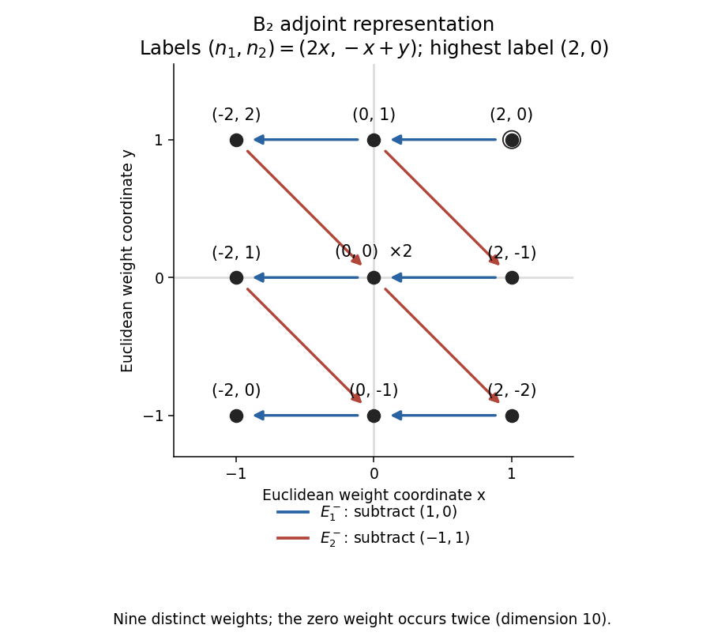

<h1 id="3/solution">Solution</h1>

↑ **Parent:** [3](../3.md)

Work first in a finite-dimensional [SU(2) representation](../../../../../representation-theory-of-su-2.md), with its invariant positive [inner product](../../../../../inner-product.md). In the complexified [Lie algebra](../../../../../lie-algebra-split.md), choose $H^\dagger=H$ and $(E^-)^\dagger=E^+$. Let $v_0$ be a [highest-weight vector](../../../../../highest-weight-vector.md) with $Hv_0=mv_0$ and $E^+v_0=0$, and put $v_r=(E^-)^rv_0$. The [commutator](../../../../../commutator.md) with $H$ gives

$$
Hv_r=(m-2r)v_r.
$$

Induction also gives

$$
E^+v_r=r(m-r+1)v_{r-1}.
$$

For $r=1$ this is $E^+E^-v_0=Hv_0=mv_0$. For the induction step, use $E^+E^-=E^-E^++H$ on $v_r$: the coefficient becomes $r(m-r+1)+m-2r=(r+1)(m-r)$. In particular

$$
E^+E^-v_r=(r+1)(m-r)v_r=\frac14(m+n)(m-n+2)v_r,\qquad n=m-2r,
$$

which proves the assumed formula rather than merely invoking it.

The norm identity $\|E^-v_r\|^2=(r+1)(m-r)\|v_r\|^2$ shows that, for nonnegative integer $m$, the ladder is nonzero for $0\le r\le m$ and stops with $E^-v_m=0$. Distinct eigenvalues make these vectors independent. Their span is stable under $H,E^\pm$, and in the irreducible module it is the full space. Thus

$$
\boxed{n=m,m-2,\ldots,-m,\qquad\dim V(m)=m+1,\qquad j=m/2.}
$$

For normalized states, $E^-|n\rangle=\tfrac12\sqrt{(m+n)(m-n+2)}\,|n-2\rangle$, with the last state killed. General finite-dimensional [SU(2) representations](../../../../../representation-theory-of-su-2.md) are [direct sums](../../../../../direct-sum.md) of these ladders.

The representation category matters here. The Lie-algebra relations alone allow an infinite [Verma module](../../../../../verma-module.md) even at integral highest weight: its nonzero vector $v_{m+1}$ is singular. The finite representation can instead be constructed algebraically by taking the basis $v_0,\ldots,v_m$ with the displayed actions and declaring $E^-v_m=0$; all three [Lie brackets](../../../../../lie-bracket.md) then hold, including at the endpoints. Thus the finite-dimensional assertion uses the integrable [SU(2)](../../../../../su-2-group.md) module, or this explicit finite quotient, rather than assuming that a singular vector must vanish in every highest-weight module.

For rank two, take a [Cartan subalgebra](../../../../../cartan-subalgebra.md) $\mathfrak h$ with commuting basis elements. A [root](../../../../../root-of-a-root-system.md) $\alpha$ is a nonzero linear functional on $\mathfrak h$ for which a [root space](../../../../../root-space.md) contains an element $E_\alpha$ satisfying

$$
[h,E_\alpha]=\alpha(h)E_\alpha\qquad(h\in\mathfrak h).
$$

Choose [simple roots](../../../../../simple-root.md) $\alpha_1,\alpha_2$ and their [coroots](../../../../../coroot.md) $H_i=\alpha_i^\vee$. In the PDF's index convention, the [Cartan matrix](../../../../../cartan-matrix.md) is

$$
K_{ij}=\alpha_i(H_j)=\frac{2(\alpha_i,\alpha_j)}{(\alpha_j,\alpha_j)}.
$$

Normalize $E_i^\pm=E_{\pm\alpha_i}$ so $[E_i^+,E_i^-]=H_i$. The difference of distinct simple roots is not a root, so the mixed positive-negative bracket is zero. This gives

$$
[H_i,H_j]=0,\qquad [E_i^+,E_j^-]=\delta_{ij}H_j,\qquad[H_i,E_j^\pm]=\pm K_{ji}E_j^\pm.
$$

The transpose in the last formula is essential and is printed correctly in the original PDF.

A [highest-weight vector](../../../../../highest-weight-vector.md) of labels $(\overline n_1,\overline n_2)$ is killed by both $E_i^+$ and is an eigenvector of the two $H_i$. Repeated words in $E_1^-,E_2^-$ generate its [highest-weight representation](../../../../../highest-weight-representation.md); each lowers the weight by the corresponding simple root. Restricting to the [sl2 subalgebra associated with a root](../../../../../sl2-subalgebra-associated-with-a-root.md) for either simple root gives the preceding integer ladder, so finite-dimensional highest labels must be nonnegative integers. The finite irreducible module is the highest-weight quotient imposing $(E_i^-)^{\overline n_i+1}v=0$ and the submodules generated by these relations, together with the [Serre relations](../../../../../serre-relations.md). Choosing independent nonzero lowering words gives a simultaneous [weight basis](../../../../../weight-basis.md); an extra multiplicity index is needed where a [weight space](../../../../../weight-space.md) has dimension greater than one.

For the specified [B2 root system](../../../../../b2-root-system.md), the simple-root squared lengths are $1,2$ and their inner product is $-1$, giving

$$
K=\begin{pmatrix}2&-1\\-2&2\end{pmatrix}.
$$

The positive root $\alpha_1+\alpha_2$ is generated by $[E_1^+,E_2^+]\ne0$, and $2\alpha_1+\alpha_2$ by $[E_1^+,[E_1^+,E_2^+]]\ne0$. No further positive sums occur, so $(\operatorname{ad}E_1^+)^3E_2^+=0$ and $(\operatorname{ad}E_2^+)^2E_1^+=0$. These are the relevant [Serre relations](../../../../../serre-relations.md). Applying the Cartan commutators to a weight vector proves

$$
\boxed{E_1^-:\ (n_1,n_2)\mapsto(n_1-2,n_2+1),\qquad E_2^-:\ (n_1,n_2)\mapsto(n_1+2,n_2-2),}
$$

whenever the image is nonzero.

To enumerate the requested representation without guessing when arrows stop, realize it concretely as the [Adjoint representation](../../../../../adjoint-representation-of-a-lie-algebra.md). For a Euclidean weight $(x,y)$, its labels are $(n_1,n_2)=(2x,-x+y)$. The highest root $2\alpha_1+\alpha_2=(1,1)$ has labels $(2,0)$, so it generates the irreducible adjoint module of this simple rank-two [Lie algebra](../../../../../lie-algebra-split.md). Its nonzero [weights](../../../../../weight-representation-theory.md) are exactly its eight roots, and its zero [weight space](../../../../../weight-space.md) is the two-dimensional [Cartan subalgebra](../../../../../cartan-subalgebra.md). This gives the [B2 adjoint representation weight diagram](../../../../../b2-adjoint-representation-weight-diagram.md) and the nine distinct states labels:

$$
\boxed{(2,0),\ (0,1),\ (-2,2),\ (2,-1),\ (0,0),\ (-2,1),\ (2,-2),\ (0,-1),\ (-2,0).}
$$

Their actual production by lowering can be seen from

$$
\begin{aligned}
(2,0)&\xrightarrow{1}(0,1),\\
(0,1)&\xrightarrow{1}(-2,2),\qquad (0,1)\xrightarrow{2}(2,-1),\\
(-2,2)&\xrightarrow{2}(0,0),\qquad (2,-1)\xrightarrow{1}(0,0),\\
(0,0)&\xrightarrow{1}(-2,1),\qquad(0,0)\xrightarrow{2}(2,-2),\\
(-2,1)&\xrightarrow{2}(0,-1),\qquad(2,-2)\xrightarrow{1}(0,-1),\\
(0,-1)&\xrightarrow{1}(-2,0).
\end{aligned}
$$

An arrow labelled $i$ denotes a nonzero action of $E_i^-$ between the indicated weight spaces. The two paths into zero produce independent Cartan vectors. Hence there are nine distinct pairs, as requested when degeneracy is disregarded, but **the full representation has dimension ten**, not nine.

**[Figure 1](#3/image-b2-adjoint-weights-labelled-by-the-pdf-cartan-convention-with-simple-root-lowering-arrows). B2 adjoint weights labelled by the PDF Cartan convention, with simple-root lowering arrows**.

## ↑ Ancestors (10)

1. [3](../3.md)
2. [Paper 45](../../paper-45-split.md)
3. [Iii](../../split.md)
4. [2003](../../../split.md)
5. [Past exam of the mathematics course of the University of Cambridge](../../../../split.md)
6. [Mathematics course of the University of Cambridge](../../../../../mathematics-course-of-the-university-of-cambridge.md)
7. [Course of the University of Cambridge](../../../../../course-of-the-university-of-cambridge.md)
8. [University of Cambridge](../../../../../university-of-cambridge-split.md)
9. [List of universities](../../../../../list-of-universities.md)
10. [Codex Wiki](../../../../../split.md)
