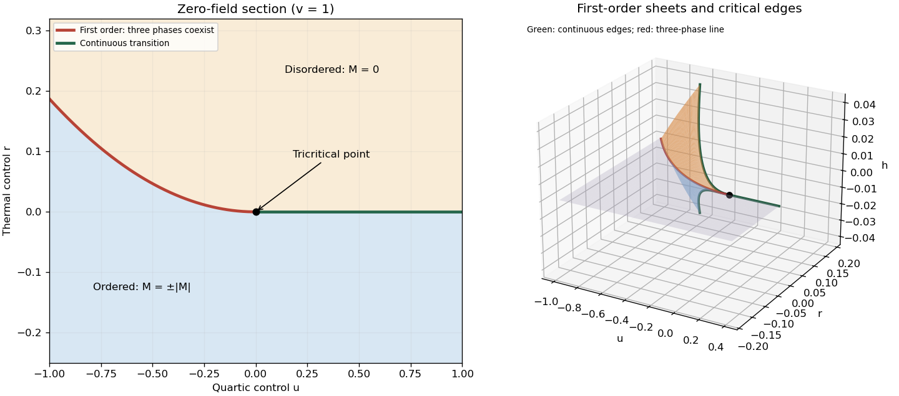

<h1 id="1/solution">Solution</h1>

↑ **Parent:** [1](../1.md)

A [phase diagram](../../../../../phase-diagram.md) divides a space of control parameters into equilibrium [thermodynamic phases](../../../../../thermodynamic-phase.md), marking [phase coexistence](../../../../../phase-coexistence.md) boundaries and [thermodynamic critical points](../../../../../thermodynamic-critical-point.md). Its dimension counts independently variable controls, not spatial dimensions. An explicit three-dimensional example uses the controls $(r,u,h)$ of a [sextic even Landau potential](../../../../../sextic-even-landau-potential.md):

$$
V(M)=\frac r2M^2+\frac u4M^4+\frac v6M^6-hM,\qquad v>0.
$$

Here $M$ is a scalar [order parameter](../../../../../order-parameter.md), $h$ its [conjugate field](../../../../../field-conjugate-to-an-order-parameter.md), and $r$ a thermal control. The [equilibrium magnetization](../../../../../equilibrium-magnetization.md) minimizes $V$ globally. At $h=0$, $u>0$, the boundary $r=0$ is a [continuous phase transition](../../../../../continuous-phase-transition.md). At $h=0$, $u<0$, the boundary $r=3u^2/(16v)$ is a [first-order phase transition](../../../../../first-order-phase-transition.md) between $M=0$ and $M=\pm\sqrt{-3u/(4v)}$. The two boundaries meet at the **[tricritical point](../../../../../tricritical-point.md) $r=u=h=0$**. A fixed strictly positive quartic coupling alone cannot produce this [tricritical point](../../../../../tricritical-point.md); the stabilizing sextic term is essential when the quartic coefficient is tuned through zero.

The full [phase diagram](../../../../../phase-diagram.md) also contains the $h=0$ [phase coexistence](../../../../../phase-coexistence.md) sheet between positive and negative ordered phases. Crossing it changes the sign of $M$ discontinuously. For $u<0$, the three-phase line $r=3u^2/(16v)$ is the junction of this sheet and two [tricritical wings](../../../../../tricritical-wing.md), on which two unequal same-sign [equilibrium magnetizations](../../../../../equilibrium-magnetization.md) coexist at nonzero $h$. The [tricritical wing critical edges](../../../../../tricritical-wing-critical-edge.md) are lines of ordinary [thermodynamic critical points](../../../../../thermodynamic-critical-point.md); they terminate the first-order sheets and meet at the [tricritical point](../../../../../tricritical-point.md). Away from these boundaries, varying $h$ produces a smooth crossover.

For an explicit construction of the [tricritical wings](../../../../../tricritical-wing.md), write their two coexisting [order parameters](../../../../../order-parameter.md) as $M_1=s-d$ and $M_2=s+d$, with $s>0$ and $0<d\leq s$. Equality of their [Landau free energies](../../../../../landau-free-energy.md) and first derivatives gives

$$
u=-v\left(\frac{10}{3}s^2+2d^2\right),\qquad
r=v\left(5s^4-\frac23s^2d^2+d^4\right),\qquad
h=\frac83vs^3(s^2-d^2).
$$

Indeed, for these controls the [tricritical wing coexistence factorization](../../../../../tricritical-wing-coexistence-factorization.md) is

$$
V(M)-V(M_1)=\frac v6[(M-s)^2-d^2]^2[M^2+4sM+5s^2-d^2].
$$

The last factor is $(M+2s)^2+s^2-d^2\geq0$, proving that both specified minima are global. The reflected wing has negative $h$ and negative $M$. Letting $d\to0$ gives the [tricritical wing critical edge](../../../../../tricritical-wing-critical-edge.md) $u=-10vs^2/3$, $r=5vs^4$, $h=8vs^5/3$; there $V''(s)=V'''(s)=0$ and $V''''(s)=40vs^2>0$. Letting $d=s$ recovers the three-phase line. This supplies the first-order sheets and their continuous boundary curves, rather than only a zero-field section.

**[Figure 1](#1/image-zero-field-section-and-three-dimensional-coexistence-wings-of-a-sextic-landau-phase-diagram). Zero-field section and three-dimensional coexistence wings of a sextic Landau phase diagram**.

## ↑ Ancestors (10)

1. [1](../1.md)
2. [Paper 46](../../paper-46-split.md)
3. [Iii](../../split.md)
4. [2003](../../../split.md)
5. [Past exam of the mathematics course of the University of Cambridge](../../../../split.md)
6. [Mathematics course of the University of Cambridge](../../../../../mathematics-course-of-the-university-of-cambridge.md)
7. [Course of the University of Cambridge](../../../../../course-of-the-university-of-cambridge.md)
8. [University of Cambridge](../../../../../university-of-cambridge-split.md)
9. [List of universities](../../../../../list-of-universities.md)
10. [Codex Wiki](../../../../../split.md)
