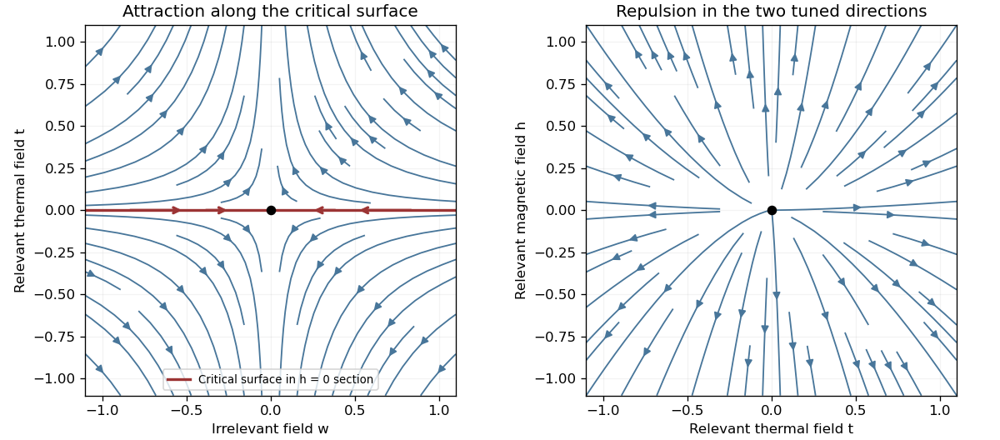

<h1 id="2/solution">Solution</h1>

↑ **Parent:** [2](../2.md)

Write $\beta_T=(k_BT)^{-1}$ to distinguish inverse temperature from an [order-parameter critical exponent](../../../../../order-parameter-critical-exponent.md). For the [Ising model](../../../../../ising-model.md), define the full [two-point correlation function](../../../../../two-point-correlation-function.md) $G(r)=\langle\sigma_0\sigma_r\rangle$ and its [connected correlation function](../../../../../connected-correlation-function.md) $G_c(r)=G(r)-M^2$ in a translation-invariant phase. Away from a [thermodynamic critical point](../../../../../thermodynamic-critical-point.md), the large-distance envelope decays exponentially, possibly multiplied by a power of distance:

$$
\xi^{-1}=-\lim_{|r|\to\infty}\frac{\log|G_c(r)|}{|r|}.
$$

This defines the [correlation length](../../../../../correlation-length.md) in physical distance units when the limit exists. At a [continuous phase transition](../../../../../continuous-phase-transition.md), $\xi\to\infty$ and the critical [connected correlation function](../../../../../connected-correlation-function.md) typically has algebraic decay $G_c(r)\sim |r|^{-(D-2+\eta)}$, where $\eta$ is the [anomalous dimension](../../../../../anomalous-dimension.md). Below the transition the full $G(r)$ tends to $M^2$, so the decay definition must use $G_c$.

Let $S=\sum_r\sigma_r$ and $F=-\beta_T^{-1}\log Z$ be the extensive [Helmholtz free energy](../../../../../helmholtz-free-energy.md). Holding the field-independent constant $C$ and other physical couplings fixed,

$$
M=-\frac1N\frac{\partial F}{\partial h},\qquad
\chi=-\frac1N\frac{\partial^2F}{\partial h^2}.
$$

Because the Hamiltonian contains $-hS$, $\partial_h\log Z=\beta_T\langle S\rangle$ and $\partial_h^2\log Z=\beta_T^2(\langle S^2\rangle-\langle S\rangle^2)$. Translation invariance then proves the [correlation-function susceptibility sum rule](../../../../../correlation-function-susceptibility-sum-rule.md):

$$
\boxed{\chi=\frac{\beta_T}{N}\operatorname{Var}S
=\frac{\beta_T}{N}\sum_{r,r'}\langle\sigma_r\sigma_{r'}\rangle_c
=\beta_T\sum_rG_c(r).}
$$

In the ordered zero-field phase these statements refer to a selected [pure thermodynamic phase](../../../../../pure-thermodynamic-phase.md); averaging equally over opposite [magnetizations](../../../../../magnetization.md) introduces the separate [spin-mixture contribution to zero-field susceptibility](../../../../../spin-mixture-contribution-to-zero-field-susceptibility.md).

A [normalized blocking kernel](../../../../../normalized-blocking-kernel.md) $K_b(\sigma',\sigma)\geq0$ satisfies $\sum_{\sigma'}K_b(\sigma',\sigma)=1$. For example, assign one block spin to each block of $b^D$ microscopic spins using majority sign, with equal probabilities for a tie. Define the blocked Hamiltonian, retaining the entire generated operator space, by

$$
\sum_\sigma K_b(\sigma',\sigma)e^{-\beta_TH(u,\sigma)}
=e^{-\beta_TH(R_bu,\sigma')-\beta_TNg_E(u)}.
$$

The field-independent contribution $Ng_E$ belongs to the identity operator. With $N'=Nb^{-D}$ and

$$
u'=R_bu,\qquad C'=b^D[C+g_E(u)],
$$

summing over $\sigma'$ proves **$Z(u,C,N)=Z(u',C',N')$** exactly. Iterating gives $N_p=Nb^{-pD}$ and the same [partition function](../../../../../canonical-partition-function.md) with $(u_p,C_p,N_p)$. Observables at large scales are reproduced by appropriately blocked observables and sources. Truncating the generated interactions makes this an approximation; dropping the additive constant already destroys the equality of [free energies](../../../../../thermodynamic-free-energy.md) even when normalized spin expectations remain correct.

The extensive [Helmholtz free energy](../../../../../helmholtz-free-energy.md) is unchanged: $F(u_0,C_0,N)=F(u_p,C_p,N_p)$. In contrast, its value per site changes because the number of sites changes. Define the reduced zero-constant [free-energy density](../../../../../free-energy-density.md) $f_0(u)=\beta_TF(u,0,N)/N$ in the [thermodynamic limit](../../../../../thermodynamic-limit.md). The preceding equality yields

$$
f_0(u)=b^{-D}f_0(R_bu)+g_0(u),\qquad g_0(u)=\beta_Tg_E(u),
$$

and iteration proves the [additive free-energy recursion under blocking](../../../../../additive-free-energy-recursion-under-blocking.md):

$$
\boxed{f_0(u_0)=b^{-pD}f_0(u_p)+\sum_{j=0}^{p-1}b^{-jD}g_0(u_j).}
$$

Equivalently $C_p=b^{pD}[C_0+\sum_{j=0}^{p-1}b^{-jD}g_E(u_j)]$. Thus the inhomogeneous source records the [identity-operator contribution to renormalization-group free energy](../../../../../identity-operator-contribution-to-renormalization-group-free-energy.md) from eliminated short-distance degrees of freedom.

To express this recursion for the singular part, write $f_0=a+f_s$, where $a$ is the regular analytic background. Then the same displayed recursion holds with $f_s$ and

$$
g_s(u)=g_0(u)+b^{-D}a(R_bu)-a(u).
$$

This is the [analytic subtraction of an inhomogeneous renormalization recursion](../../../../../analytic-subtraction-of-an-inhomogeneous-renormalization-recursion.md). A purely analytic source can often be absorbed into $a$, after which it does not control the leading singular powers. It is not legitimate simply to discard an analytic source in the full [free energy](../../../../../thermodynamic-free-energy.md), where it can dominate the regular background. Moreover an analytic monomial $c\,t^m h^n$ contributes

$$
c\,t^mh^n\sum_{j=0}^{p-1}b^{j(ml_t+nl_h-D)}.
$$

If $ml_t+nl_h=D$, the sum is $p$ and hence generates a logarithm when $p\sim-\log|t|/(l_t\log b)$: a [renormalization-group free-energy resonance](../../../../../renormalization-group-free-energy-resonance.md). Such a term cannot be discarded when describing that logarithmic singularity. Neglect of the inhomogeneous term in the leading power-law scaling therefore assumes that its regular part has been subtracted, that any remaining source only changes finite scaling amplitudes, and that there are no relevant resonances or marginal logarithms. Omitting an [irrelevant operator](../../../../../irrelevant-operator.md) further requires absence of a [dangerously irrelevant coupling](../../../../../dangerously-irrelevant-coupling.md), whose vanishing limit can make a scaling function singular.

A [renormalization-group fixed point](../../../../../renormalization-group-fixed-point.md) obeys $R_bu_*=u_*$. Linearization gives $\delta u'=A\delta u$; in [eigenvector](../../../../../eigenvector.md) coordinates $w_i'=b^{l_i}w_i$. Positive $l_i$ label [relevant operators](../../../../../relevant-operator.md), negative $l_i$ label [irrelevant operators](../../../../../irrelevant-operator.md), and zero $l_i$ labels a [marginal operator](../../../../../marginal-operator.md) requiring nonlinear analysis. The [critical surface](../../../../../critical-surface.md) is the stable manifold obtained by tuning all relevant scaling fields to zero. A [repulsive renormalization-group trajectory](../../../../../repulsive-renormalization-group-trajectory.md) leaves the fixed point along a relevant direction as the observation length increases. Locally a typical zero-field section has $dw/d\ell=-\omega w$, $dt/d\ell=l_tt$, $\ell=\log b$, so the critical surface $t=0$ attracts along $w$, while trajectories with either sign of $t$ depart from it. A magnetic scaling field adds another relevant direction.

**[Figure 2](#2/image-renormalization-group-saddle-flow-in-a-zero-field-section-and-two-relevant-directions-transverse-to-the-critical-surface). Renormalization-group saddle flow in a zero-field section and two relevant directions transverse to the critical surface**.

Under the stated homogeneous-scaling assumptions and after fixing irrelevant fields at their limiting values, two relevant scaling fields obey $t'=b^{l_t}t$, $h'=b^{l_h}h$. These fields are analytic coordinates near the [renormalization-group fixed point](../../../../../renormalization-group-fixed-point.md), proportional to the physical [reduced temperature](../../../../../reduced-temperature.md) and [conjugate field](../../../../../field-conjugate-to-an-order-parameter.md) to leading order. The singular [free-energy density](../../../../../free-energy-density.md) consequently obeys

$$
F_s(t,h)=b^{-D}F_s(b^{l_t}t,b^{l_h}h).
$$

Here $F_s$ denotes the singular free energy per original site or unit volume, with regular dimensional factors absorbed; the extensive singular part is $NF_s$. Iterate and choose $b^p=|t|^{-1/l_t}$ to obtain the [scaling hypothesis for critical phenomena](../../../../../scaling-hypothesis-for-critical-phenomena.md):

$$
\boxed{F_s(t,h)=|t|^{D/l_t}f_\pm\left(h/|t|^{l_h/l_t}\right).}
$$

The sign labels the two sides of the transition: $f_+$ describes $t>0$, the disordered side, while $f_-$ describes $t<0$, the ordered side. The two functions need not coincide; $f_-$ has the zero-field one-sided derivative appropriate to spontaneous [magnetization](../../../../../magnetization.md). The numbers $l_t,l_h$ are scaling eigenvalues in logarithmic form: the corresponding discrete RG multipliers are $b^{l_t},b^{l_h}$.

The [correlation length](../../../../../correlation-length.md) obeys $\xi(t,h)=b\,\xi(b^{l_t}t,b^{l_h}h)$. The same scale choice gives $\nu=1/l_t$. Differentiating $F_s$ once and twice with respect to the [conjugate field](../../../../../field-conjugate-to-an-order-parameter.md), and twice with respect to temperature, gives

$$
\beta=\frac{D-l_h}{l_t},\qquad
\gamma=\frac{2l_h-D}{l_t},\qquad
\alpha=2-\frac D{l_t}.
$$

At $t=0$, instead choose the scale $b^p=|h|^{-1/l_h}$. Then $F_s(0,h)\sim|h|^{D/l_h}$ and $M\sim\operatorname{sgn}(h)|h|^{D/l_h-1}$, so $\delta=l_h/(D-l_h)$. Thus differentiation and scale matching establish

$$
\boxed{\beta\delta=\frac{l_h}{l_t}=\beta+\gamma,\qquad \alpha=2-D\nu.}
$$

The first is the [Widom scaling relation](../../../../../widom-scaling-relation.md) and the second the [hyperscaling relation](../../../../../hyperscaling-relation.md). The [hyperscaling relation](../../../../../hyperscaling-relation.md) requires precisely the regular homogeneous scaling used here. Above the ordinary [upper critical dimension](../../../../../upper-critical-dimension.md), the quartic coupling is [dangerously irrelevant](../../../../../dangerously-irrelevant-coupling.md) in the ordered phase and this derivation cannot discard it: the [mean-field critical exponents](../../../../../mean-field-critical-exponent.md) $\nu=1/2$, $\alpha=0$ do not obey $\alpha=2-D\nu$ for $D>4$. At marginal dimensions logarithmic factors likewise require care beyond the displayed pure powers.

## ↑ Ancestors (10)

1. [2](../2.md)
2. [Paper 46](../../paper-46-split.md)
3. [Iii](../../split.md)
4. [2003](../../../split.md)
5. [Past exam of the mathematics course of the University of Cambridge](../../../../split.md)
6. [Mathematics course of the University of Cambridge](../../../../../mathematics-course-of-the-university-of-cambridge.md)
7. [Course of the University of Cambridge](../../../../../course-of-the-university-of-cambridge.md)
8. [University of Cambridge](../../../../../university-of-cambridge-split.md)
9. [List of universities](../../../../../list-of-universities.md)
10. [Codex Wiki](../../../../../split.md)
