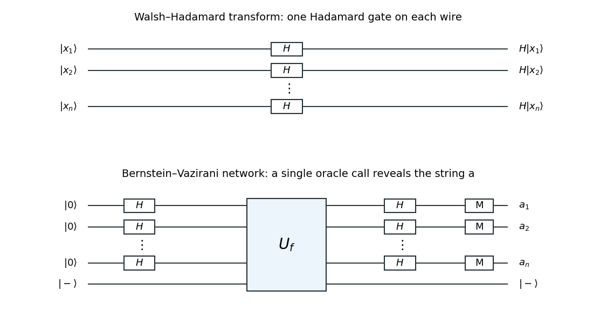

<h1 id="2/solution">Solution</h1>

↑ **Parent:** [2](../2.md)

The [Walsh-Hadamard transform](../../../../../walsh-hadamard-transform.md) is the [tensor product](../../../../../tensor-product.md) of one [Hadamard gate](../../../../../hadamard-gate.md) on each [qubit](../../../../../qubit.md). Indeed,

$$
H^{\otimes n}|x_1\cdots x_n\rangle
=\bigotimes_{j=1}^n\frac{|0\rangle+(-1)^{x_j}|1\rangle}{\sqrt2}
=2^{-n/2}\sum_{y\in\{0,1\}^n}(-1)^{\sum_jx_jy_j}|y\rangle.
$$

The network therefore consists of $n$ parallel [Hadamard gates](../../../../../hadamard-gate.md), with no interaction between wires. Applied to an all-zero [quantum register](../../../../../quantum-register.md), it produces the [uniform quantum superposition](../../../../../uniform-quantum-superposition.md) of all $2^n$ input strings. This lets a [Boolean quantum oracle](../../../../../boolean-quantum-oracle.md) act coherently on all those inputs; a subsequent operation can turn their relative phases into useful interference. It does not permit reading all oracle values from a single [measurement in quantum mechanics](../../../../../quantum-measurement-split.md).

**[Figure 1](#2/image-parallel-hadamard-gates-and-the-one-query-bernstein-vazirani-network). Parallel Hadamard gates and the one-query Bernstein-Vazirani network**.

For the supplied linear-phase input, the amplitude on output $y$ is

$$
2^{-n}\sum_{x\in\{0,1\}^n}(-1)^{a\cdot x+x\cdot y}
=\prod_{j=1}^n\frac{1+(-1)^{a_j\oplus y_j}}2
=\begin{cases}1,&y=a,\\0,&y\ne a.\end{cases}
$$

Each factor is obtained by summing over the independent bit $x_j$. This directly proves the relevant [orthogonality](../../../../../orthogonal-vectors.md) of the binary Fourier phases, and yields **the output state $|a\rangle$ exactly**.

For exact classical identification, query the [Boolean function](../../../../../boolean-function.md) at the $n$ standard unit vectors: $f(e_j)=a_j$. Hence $n$ oracle calls suffice. They are also necessary in the worst case, even with adaptive queries: every answer supplies one binary linear equation in the unknown string. With fewer than $n$ queries, their coefficient [matrix](../../../../../matrix.md) has [matrix rank](../../../../../matrix-rank.md) at most the number of queries, so its [null space](../../../../../kernel-of-a-linear-map.md) contains a nonzero string $h$. The strings $a$ and $a\oplus h$ give identical answers along that adaptive transcript and cannot both be identified correctly. Equivalently, a depth-$t$ binary decision tree has at most $2^t$ leaves and must distinguish $2^n$ possibilities. Thus **the exact classical query count is $n$**. This concerns exact recovery, rather than allowing an arbitrary error probability.

The quantum network in the lower panel starts its data [quantum register](../../../../../quantum-register.md) in $|0\rangle^{\otimes n}$ and its answer [ancilla qubit](../../../../../ancilla-qubit.md) in $|-\rangle$, which can be prepared as $H|1\rangle$. Apply [Hadamard gates](../../../../../hadamard-gate.md) to the data wires, make one [Boolean quantum oracle](../../../../../boolean-quantum-oracle.md) call, then apply [Hadamard gates](../../../../../hadamard-gate.md) again to all data wires. [Quantum phase kickback](../../../../../phase-kickback.md) produces

$$
|0^n\rangle|-\rangle
\longmapsto 2^{-n/2}\sum_x|x\rangle|-\rangle
\longmapsto 2^{-n/2}\sum_x(-1)^{a\cdot x}|x\rangle|-\rangle
\longmapsto |a\rangle|-\rangle.
$$

A [computational-basis measurement](../../../../../quantum-measurement-in-the-computational-basis.md) of the data wires gives all bits of $a$ with certainty. This is [Bernstein-Vazirani phase kickback](../../../../../bernstein-vazirani-phase-kickback.md): **one quantum query**, $2n$ data [Hadamard gates](../../../../../hadamard-gate.md), and one answer-state preparation suffice. The answer [ancilla qubit](../../../../../ancilla-qubit.md) stays separate from the data at the output.

## ↑ Ancestors (10)

1. [2](../2.md)
2. [Paper 47](../../paper-47-split.md)
3. [Iii](../../split.md)
4. [2003](../../../split.md)
5. [Past exam of the mathematics course of the University of Cambridge](../../../../split.md)
6. [Mathematics course of the University of Cambridge](../../../../../mathematics-course-of-the-university-of-cambridge.md)
7. [Course of the University of Cambridge](../../../../../course-of-the-university-of-cambridge.md)
8. [University of Cambridge](../../../../../university-of-cambridge-split.md)
9. [List of universities](../../../../../list-of-universities.md)
10. [Codex Wiki](../../../../../split.md)
